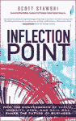

# 数据科学最好的 10 本书是什么？

> 原文：<https://medium.com/edureka/10-best-books-data-science-9161f8e82aca?source=collection_archive---------1----------------------->

Best Books for Data Science — Edureka

我们每个人对学习和获取知识都有不同的看法。有的喜欢看视频，有的喜欢听人说话，有的喜欢被引导，有的爱看书。如果你是一名读者，并且真的热爱机器学习和人工智能领域，那么你就在正确的地方获得了更多你所热爱的东西。

**(免费书籍的链接会在有免费书籍时提及)**

本文包含以下几个部分:

*   数据科学概述
*   从数据科学开始的书籍
*   帮助你掌握数据科学的书籍

所以，让我们开始你的旅程，帮助你找到学习数据科学的最佳书籍:)

# 数据科学概述

*那么，我们对数据科学的确切理解是什么？*

> **数据科学融合了各种工具、算法和机器学习原理，目标是从原始数据中发现隐藏的模式。**

这是正式的定义，但让我们再简化一下。数据科学基本上是从我们收集的大量数据中预测要采取的步骤。它需要各种工具来帮助您清理数据并将其可视化以供分析。你利用机器学习算法从数据中学习，理解数据想要传达的模式，并帮助预测肯定会帮助你改善业务战略的步骤和各种措施。

现在，您可能会将其与商业智能(BI)混淆，但请记住，BI 仅帮助您了解您对现有数据做了什么。你才是需要为未来的商业战略采取措施的人。数据科学通过预测未来必须做的事情让你变得更容易，而且算法输出也有可能比你得到的更好。只是一个机会:P

# 从数据科学开始的书籍

到目前为止，我们所有人都已经确立了这样一种观点，即数据科学是统计学、概率、机器学习、人工智能、编程知识、商业知识和常识的结晶。因此，如果你对这一领域完全陌生，请继续阅读这一部分，因为我将指定作为数据科学先决条件的所有书籍，否则你可以跳到下一部分的高级书籍。

## 由 Gareth James，Daniela Witten，Trevor Hastie 和 Robert Tibshirani 编写的统计学习介绍

这本书绝对是我向任何想在机器学习领域起步的人推荐的第一本书。它教你所有你深入需要的统计数据，也介绍了一些机器学习技术。另一个最好的部分是，它还在 R 编程中引入了这些统计技术，以便您可以掌握它。总的来说，这是我最喜欢的书，如果你想在这个领域开始的话。

## **概率介绍**作者 *J .劳里·斯内尔和查尔斯·米勒·格林斯特德*

我推荐的第二本书是《概率导论》,因为这本书是写给那些想进入这个领域的大学生的。它用非常好的现实生活中的例子回顾了概率的所有基础知识。作者有非常简单和直观的语言，这绝对是一个很好的学习和阅读体验。

## **Stuart Russell 和 Peter Norvig 的《人工智能:现代方法**

我的第三本书推荐是《人工智能》。机器学习是人工智能的一个子领域，它们有很多共同点。这本书是对前两本书的完美提升，因为它用一种真正简单的语言慢慢进入了机器学习领域。它谈到了它们之间的差异，以及你需要如何完美地理解问题，并相应地找到解决方案。一本真正的好书，帮助你区分问题的方法，并找到所需的路径。

## **由*约翰·保罗·穆勒和卢卡·马萨隆*为假人制作的机器学习**

我的第四条建议把它提升了一个层次，这就是我们严肃对待的地方。《傻瓜机器学习》着眼于机器学习的理论和基本概念，让读者习惯它的所有术语。它教你如何在实践中应用机器学习，并介绍有效应用它们所需的编程语言和工具。它介绍了使用 Python 和 R 编程语言进行编码，以及如何使用它们来教会您的计算机某些模式和分析结果。您可以了解机器学习的应用程序在现实世界中是如何使用的，这是进入机器学习世界的一个很好的开端。

## **塔里克·拉希德制作自己的神经网络**

我对初学者的第五个也是最后一个建议是，制作你自己的神经网络。当数据增长时，机器学习就会失败。因此，深度学习开始发挥作用。对于每个想研究深度学习以及它们如何优于典型的机器学习的人来说，这本书很美。它用实际的例子和问题教你如何用 Python 构建你的神经网络。文笔优美，有助于你非常容易地理解这个相当棘手的问题。

因此，这些是我为初学者和想要进入数据科学领域的人推荐的 5 个最佳选择。既然我们已经完成了对初学者的建议，让我们前进到更复杂的书籍，这将有助于你掌握数据科学。我们走吧！

# 帮助你掌握数据科学的书籍

一旦你阅读了初学者的书籍，或者已经熟悉了统计学、概率、机器学习、人工智能的概念，现在是时候进入大联盟了。仔细阅读这些建议，我相信它们会帮助你掌握这个广阔的领域。

## **虚拟数据科学**作者*莉莲·皮尔森*

我帮助开始掌握数据科学的第一个建议是《傻瓜数据科学》。这本书非常有趣和直观，同时也非常全面和精确。作者介绍了理解数据科学所需的所有必要概念和技术。这是一个工作簿，将帮助您磨练您在大数据分析、Hadoop、MapReduce、Spark、MPP 平台、NoSQL、机器学习和人工智能领域的技能。对于数据科学爱好者来说，简单而有效的商业最佳书籍之一。

## **拐点**由*斯考斯基*

我在这里的第二个建议不是技术书籍，但如果你想掌握数据科学，这绝对是必须的。那么这本书包含了什么呢？商业知识！这可能是最具未来思维的书籍，主要是因为它谈论了云计算、大数据、移动设备及其应用、物联网设备等技术出现后世界的演变，以及它们如何彻底改变了世界的商业。它教会你适应新技术，以及为什么它们能为你的商业理念带来最佳利润。在这个推荐列表中，这绝对是一个不需要动脑筋的问题，因为它消除了技术性的压力，并在读者的头脑中引入了商业意识和目标导向。

## **用数据讲故事**作者*科尔·努斯鲍默·克纳弗里克*

我的第三个建议是回到数据科学的技术部分，但以最好的方式！我们作为故事阅读的任何东西都会伴随我们更长时间，因为我们喜欢它，并在故事中找到快乐。作者完全理解人性，并在精彩的故事中教给我们数据可视化的概念。他考虑到读者的心态，用现实生活中的例子创作了一个故事，解释了什么是必要的，什么是不必要的，展示了如何清理数据的方法。然后以精确的图表和视觉效果结束，给人一种讲故事的感觉。你永远不会知道读几页书会让你涵盖许多重要的主题和技术。真是一本精彩的书。

## **模式识别和机器学习**作者 *Christopher M. Bishop*

我的第四个建议是模式识别和机器学习。对于每个想成为数据科学家的人来说，这是你需要的书。它涵盖了统计和概率的各种不断发展的主题，并通过寻找什么模式使数据更好或更坏，以及如何利用它们进行机器学习。从一般的例子到真实世界的数据收集和模式研究，它都教给你。这绝对是一本帮助你掌握数据科学的书，也是我一直以来最喜欢的书之一！

## **信号和噪音**作者*内特·西尔弗*

我给你们的第五个也是最好的建议是这本书。它最适合希望在实践和技术上掌握这一领域的数据科学家。这无疑是这一领域最好的书之一。这本畅销书展示了大数据分析的力量，以最明智的方式做出有价值的预测。作者向你展示了从摆在我们面前的数据中做出预测和结论的艺术和科学。带有预测输赢味道的真实世界案例研究肯定会改变你的想法，让你在各方面都成为赢家。它一定会教你如何做出明智的预测，让你的商业想法获得成功。肯定是我的最爱！

因此，我们基本上总结了所有给你们的建议。我希望这些书一定会帮助你磨练你的技能，从长远来看，让你成为更好的数据科学家。请记住，这是一个广阔的领域，需要大量的时间和耐心来掌握。我祝你一切顺利，下次再见，保重，学习愉快！:)

如果你想查看更多关于 Python、DevOps、Ethical Hacking 等市场最热门技术的文章，那么你可以参考 [Edureka 的官方网站。](https://www.edureka.co/blog/?utm_source=medium&utm_medium=content-link&utm_campaign=10-best-books-data-science)

请留意本系列中的其他文章，它们将解释数据科学的各个方面。

> *1。* [*数据科学教程*](/edureka/data-science-tutorial-484da1ff952b)
> 
> *2。* [*数据科学的数学与统计*](/edureka/math-and-statistics-for-data-science-1152e30cee73)
> 
> *3。*[*R 中的线性回归*](/edureka/linear-regression-in-r-da3e42f16dd3)
> 
> *4。* [*机器学习算法*](/edureka/machine-learning-algorithms-29eea8b69a54)
> 
> *5。*[*R 中的逻辑回归*](/edureka/logistic-regression-in-r-2d08ac51cd4f)
> 
> *6。* [*分类算法*](/edureka/classification-algorithms-ba27044f28f1)
> 
> *7。* [*随机森林中的 R*](/edureka/random-forest-classifier-92123fd2b5f9)
> 
> *8。* [*决策树中的 R*](/edureka/a-complete-guide-on-decision-tree-algorithm-3245e269ece)
> 
> 9。 [*机器学习入门*](/edureka/introduction-to-machine-learning-97973c43e776)
> 
> *10。* [*朴素贝叶斯在 R*](/edureka/naive-bayes-in-r-37ca73f3e85c)
> 
> *11。* [*统计与概率*](/edureka/statistics-and-probability-cf736d703703)
> 
> *12。* [*如何创建一个完美的决策树？*](/edureka/decision-trees-b00348e0ac89)
> 
> *13。* [*关于数据科学家角色的十大误区*](/edureka/data-scientists-myths-14acade1f6f7)
> 
> *14。* [*顶级数据科学项目*](/edureka/data-science-projects-b32f1328eed8)
> 
> *15。* [*数据分析师 vs 数据工程师 vs 数据科学家*](/edureka/data-analyst-vs-data-engineer-vs-data-scientist-27aacdcaffa5)
> 
> *16。* [*人工智能的种类*](/edureka/types-of-artificial-intelligence-4c40a35f784)
> 
> *17。*[*R vs Python*](/edureka/r-vs-python-48eb86b7b40f)
> 
> *18。* [*人工智能 vs 机器学习 vs 深度学习*](/edureka/ai-vs-machine-learning-vs-deep-learning-1725e8b30b2e)
> 
> *19。* [*机器学习项目*](/edureka/machine-learning-projects-cb0130d0606f)
> 
> *20。* [*数据分析师面试问答*](/edureka/data-analyst-interview-questions-867756f37e3d)
> 
> *21。* [*面向非程序员的数据科学和机器学习工具*](/edureka/data-science-and-machine-learning-for-non-programmers-c9366f4ac3fb)
> 
> *22。* [*十大机器学习框架*](/edureka/top-10-machine-learning-frameworks-72459e902ebb)
> 
> 23。 [*统计机器学习*](/edureka/statistics-for-machine-learning-c8bc158bb3c8)
> 
> *24。* [*随机森林中的 R*](/edureka/random-forest-classifier-92123fd2b5f9)
> 
> *25。* [*广度优先搜索算法*](/edureka/breadth-first-search-algorithm-17d2c72f0eaa)
> 
> 26。[*R 中的线性判别分析*](/edureka/linear-discriminant-analysis-88fa8ad59d0f)
> 
> *27。* [*机器学习的先决条件*](/edureka/prerequisites-for-machine-learning-68430f467427)
> 
> 28。 [*互动 WebApps 使用 R 闪亮*](/edureka/r-shiny-tutorial-47b050927bd2)
> 
> *29。* [*十大机器学习书籍*](/edureka/top-10-machine-learning-books-541f011d824e)
> 
> 30。 [*无监督学习*](/edureka/unsupervised-learning-40a82b0bac64)
> 
> *31。* [*监督学习*](/edureka/supervised-learning-5a72987484d0)
> 
> *32。* [*机器学习使用 R*](/edureka/machine-learning-with-r-c7d3edf1f7b)

*原载于 2019 年 11 月 22 日*[*https://www.edureka.co*](https://www.edureka.co/blog/10-best-books-data-science)*。*