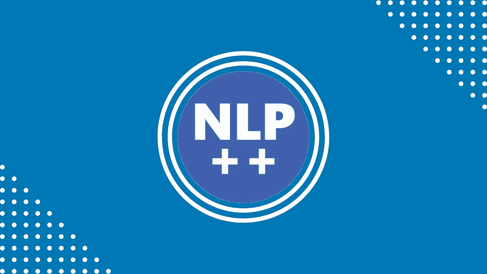
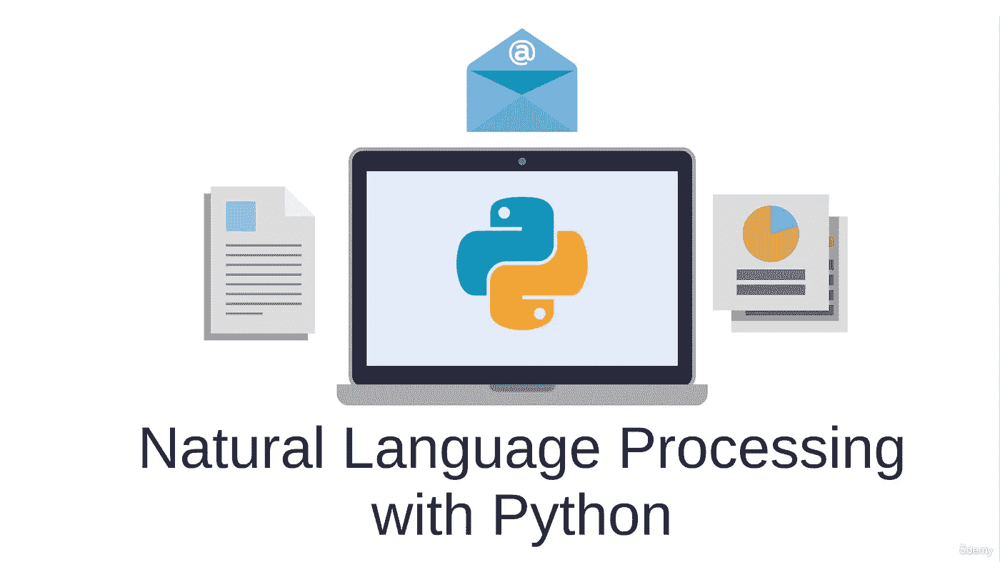
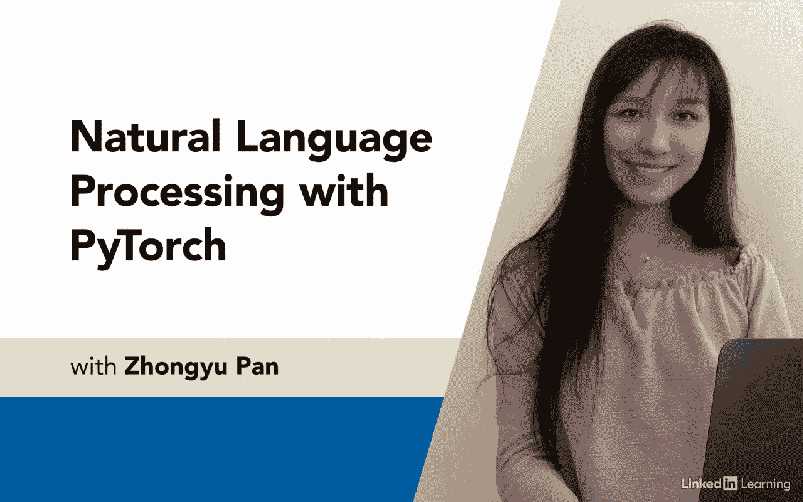
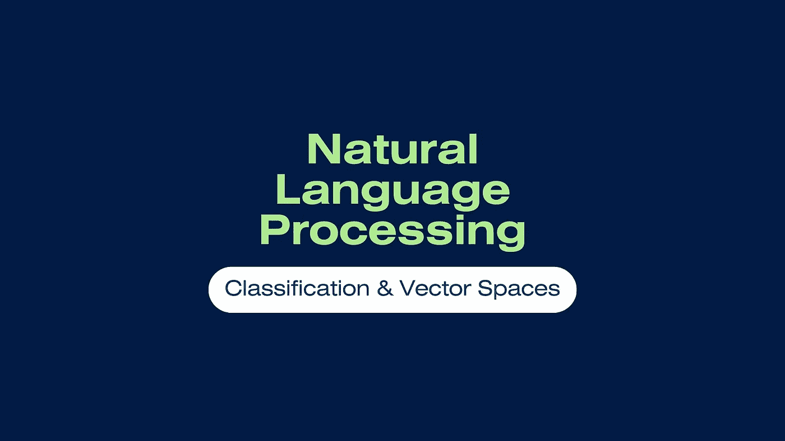
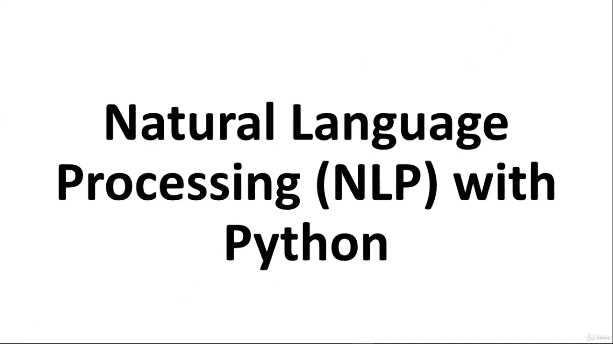
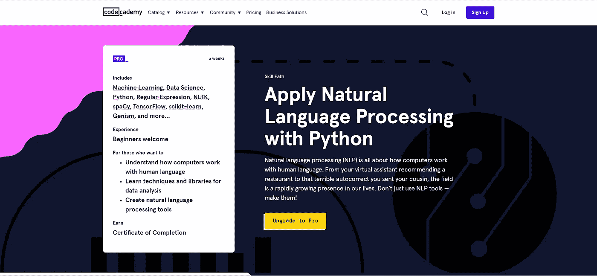

# 2022 年学习自然语言处理的 10 门最佳课程

> 原文：<https://medium.com/quick-code/10-best-courses-to-learn-natural-language-processing-in-2022-605b6b7708b1?source=collection_archive---------4----------------------->

什么是自然语言处理？为什么要学习自然语言处理？是外行经常提出的问题。自然语言处理是计算机科学的一个领域，它赋予机器理解人类语言的能力。

它是人工智能的一种应用，研究人类如何说话，以及计算机应该如何处理信息，以确定处理信息的最佳方式。换句话说，它帮助我们以一种容易理解的格式给机器指令。

因此，我创建了这个最佳自然语言处理课程列表，供初学者和专家了解 NLP。我从 Udemy、Coursera、Codecademy、edX、Pluralsight 等领先平台策划了这个榜单。

## 1. [NLP —用 Python 进行自然语言处理](https://click.linksynergy.com/deeplink?id=0F1O0otUXQc&mid=47901&u1=csMedium&murl=https%3A%2F%2Fwww.udemy.com%2Fcourse%2Fnlp-natural-language-processing-with-python%2F)—【Udemy】

Natural Language Processing with Python

本课程将教你如何使用 Python 成为世界级的 NLP 从业者。您将学习如何使用机器学习、Spacy、NLTK、SciKit-Learn、深度学习等进行自然语言处理。

在这个 **NLP** 课程中，您将学到以下内容:

*   学习使用 Python 处理文本文件。
*   了解如何使用 Python 处理 PDF 文件。
*   利用正则表达式在文本中进行模式搜索。
*   使用 Spacy 进行超快速标记化。
*   了解词干化和词汇化。
*   理解与空间匹配的词汇。
*   使用词性标注自动处理原始文本文件。
*   了解命名实体识别。
*   想象波斯语和 NER 语的空间。
*   使用 SciKit-Learn 进行文本分类。
*   使用潜在的狄利克雷分配进行主题建模。
*   了解非负矩阵分解。
*   使用 Word2Vec 算法。
*   使用 NLTK 进行情感分析。
*   使用深度学习来构建自己的聊天机器人。

首先，我们将学习如何使用 Python 处理文本文件和 pdf。接下来，我们将学习如何使用正则表达式在文本文件中搜索模式。

之后，我们将介绍自然语言处理的基础知识，使用 Python 的自然语言工具包和最先进的 Spacy 库进行超快速的标记化、解析、实体识别和词汇化。

接下来，我们将使用 Scikit-Learn 探索机器学习，例如确定正面与负面的电影评论以及垃圾邮件与合法电子邮件。

这是一门学习 Python 自然语言处理的极好课程，拥有超过 11.5 小时的精彩内容，课程评分为 4.6 分(满分为 5 分)。它包括一份结业证书。

## 2.TensorFlow 中的自然语言处理——【Coursera】

对于软件开发人员来说，理解如何使用构建可扩展的人工智能算法所需的工具至关重要。该课程教授使用 TensorFlow(一种开源机器学习框架)的最佳实践。

在这个 **NLP** 课程中，您将学到以下内容:

*   使用 TensorFlow 构建自然语言处理系统。
*   处理文本，包括标记化和将句子表示为向量。
*   在 TensorFlow 中应用 RNNs、GRUs 和 LSTMs。
*   在现有文本上训练 LSTMs，以创建原创诗歌等。

本课程使用 TensorFlow 构建自然语言处理系统。在本课程中，您将学习如何将文本标记化，并将句子表示为向量，以便神经网络可以处理它们。此外，您将学习如何在 TensorFlow 中实现 rnn、gru 和 LSTMs。最后，您将训练 LSTM 使用现有文本创作原创诗歌！

这是一门学习 TensorFlow 中自然语言处理的优秀课程，拥有超过 24 小时的精彩内容，课程评分为 4.6 分(满分为 5 分)。它包括一份结业证书。

## 3.[用 PyTorch 进行自然语言处理](https://linkedin-learning.pxf.io/c/1137078/646189/8005?u=https%3A%2F%2Fwww.linkedin.com%2Flearning%2Fnatural-language-processing-with-pytorch&subId1=csMedium)——【领英学习】

Python 是一种流行的深度学习工具，被 OpenAI 和微软等公司用于学习自然语言处理。本课程将向您介绍自然语言处理(NLP)的 PyTorch 基础知识。

本 **NLP** 课程将涵盖以下主题:

*   具有深度学习的 NLP 简介
*   PyTorch 基础
*   指导项目:使用 PyTorch 的 CNN 文本分类

在本课程中，您将学习如何将文本转化为可以输入深度学习模型的数据集。此外，它讨论了在文本分类项目中使用 RNNs 和 CNN。

Natural Language Processing with PyTorch

此外，本课程还解释了如何调整超参数和模型层以获得更可靠、更准确的结果，以及两种算法之间的差异。

这是一门用 PyTorch 学习 NLP 的极好课程，内容精彩，时长超过 41 分钟，课程评分为 4.2 分(满分为 5 分)。它包括一份结业证书。

## 4.[机器学习:Python 中的自然语言处理(V2)](https://click.linksynergy.com/deeplink?id=0F1O0otUXQc&mid=47901&u1=csMedium&murl=https%3A%2F%2Fwww.udemy.com%2Fcourse%2Fnatural-language-processing-in-python%2F)——【Udemy】

本课程分为四个部分。第一部分将讨论向量模型和文本预处理方法，你会发现为什么向量对数据科学和人工智能如此重要。它还向您介绍了神经嵌入原理，包括 word2vec 和 GloVe，GloVe 使用 CountVectorizer 和 TF-IDF 将文本转换为矢量。

在本 **NLP** 课程中，您将学到以下内容:

*   如何使用 CountVectorizer、TF-IDF、word2vec 和 GloVe 将文本转换为矢量。
*   如何实现一个文档检索系统/搜索引擎/相似度搜索/向量相似度？
*   概率模型、语言模型和马尔可夫模型(Transformers、BERT 和 GPT-3 的先决条件)。
*   如何使用遗传算法和语言建模实现密码解密算法？
*   如何实现垃圾邮件检测？
*   如何实现情感分析？
*   如何实现文章旋转器？
*   如何实现文本摘要？
*   如何实现潜在语义索引？
*   如何用线性判别分析、NMF 和奇异值分解实现主题建模？
*   机器学习(朴素贝叶斯、逻辑回归、主成分分析、奇异值分解、潜在狄利克雷分配)。
*   如何为 NLP 使用 Python、Scikit-Learn、TensorFlow 等。
*   文本预处理、标记化、停用词、词条化和词干化。
*   词性标注和命名实体识别(NER)。

在第 2 部分，我们将讨论概率模型和马尔可夫链。本课程涵盖了数据科学和机器学习中最基本的模型之一。这项技术已经被应用于各个领域，包括金融、生物信息学、强化学习和自然语言处理。

在第 3 部分，我们将讨论机器学习方法。本课程将涵盖经典的自然语言处理任务，如垃圾邮件检测、情感分析、潜在语义分析和主题建模。

这是一门学习 Python 自然语言处理的极好课程，拥有超过 22 小时引人入胜的内容，课程评分为 4.7 分(满分 5 分)。它包括一份结业证书。

## 5.[利用分类和向量空间的自然语言处理](https://coursera.pxf.io/c/1137078/1213622/14726?u=https%3A%2F%2Fwww.coursera.org%2Flearn%2Fclassification-vector-spaces-in-nlp&subId1=csMedium)——【Coursera】

本课程将教你如何使用逻辑回归和朴素贝叶斯对推文进行情感分析。在本课程中，您将使用向量空间模型来定义单词之间的关系，然后使用主成分分析来降低向量空间的维数并可视化这些关系。

在这个 **NLP** 课程中，你将学到以下内容:

*   用逻辑回归进行情感分析
*   基于朴素贝叶斯的情感分析
*   向量空间模型
*   机器翻译和文档搜索

此外，您将使用预先计算的单词嵌入和区分位置的散列，为英语到法语的翻译开发一个近似的 k-最近邻搜索算法。

这是一门学习 NLP 的极好课程，课程内容超过 34 小时，课程评分为 4.6 分(满分为 5 分)。它包括一份结业证书。

## 6.[动手自然语言处理](https://linkedin-learning.pxf.io/c/1137078/646189/8005?u=https%3A%2F%2Fwww.linkedin.com%2Flearning%2Fhands-on-natural-language-processing&subId1=csMedium)——【Linkedin Learning】

该课程旨在帮助开发人员更好地理解和使用文本数据。通过本课程，学生将在实践环境中应用主要的自然语言处理技术。你将学会如何复制你在工作中获得的知识。

本 **NLP** 课程将涵盖以下主题:

*   命名实体识别(NER)
*   主题建模
*   文本摘要
*   情感分析

在本课程中，学生将学习每个任务的流程、用例以及编码演示。本课程将涵盖命名实体识别、文本摘要、主题建模和情感分析等主题。

这是一门学习 NLP 的绝佳课程，内容精彩，时长超过 1 小时，课程评分为 4.4 分(满分为 5 分)。它包括一份结业证书。

## 7.[Python 中的自然语言处理(NLP)有 8 个项目](https://click.linksynergy.com/deeplink?id=0F1O0otUXQc&mid=47901&u1=csMedium&murl=https%3A%2F%2Fwww.udemy.com%2Fcourse%2Fcomplete-natural-language-processing-nlp-with-spacy-nltk%2F)——【Udemy】

Natural Language Processing with Python

这门关于自然语言处理的课程是基于项目的，是市场上最全面的课程之一。首先，你将获得整个课程的概述，以及自然语言处理是如何工作的。然后，我们将在 Google Colab 中设置我们的在线环境。

在本 **NLP** 课程中，您将学到以下内容:

*   自然语言处理。
*   用 Scikit-learn、NLTK 和 SpaCy 实现 NLP 相关的任务。
*   应用机器学习模型对文本数据进行分类。
*   文本分类(垃圾邮件检测，亚马逊商品评论分类)。
*   文本摘要(把 5000 字的文章变成 200 字)。
*   根据最近发布的推文计算情绪得分(Tweeter API)。
*   刷新你的深度学习概念(安，CNN & RNN)。
*   使用 Keras 构建您的单词嵌入(Word2vec)模型。
*   Google 预训练模型在单词嵌入中的应用。
*   基于 CNN 和 RNN 模型的神经网络垃圾短信检测。
*   使用张量流、Keras 和 LSTM 自动生成文本。
*   在 Python 中使用文本文件和 PDF(py PDF 2 模块)。
*   标记化、词干化和词条化。
*   用 NLTK 标记停用词和词性。
*   词汇，匹配，命名实体识别(NER)。
*   Numpy 和熊猫的数据分析。
*   用 Matplotlib 库实现数据可视化。

接下来，我们将研究基本的自然语言处理任务，比如标记化、词汇化、停用词去除、实体识别和词性标注。此外，我们将学习如何使用 Spacy 和 NLTK 库来完成它们。

最后，您可以更新关于 Numpy 和 Pandas 库、Matplotlib 库的数据可视化、文本文件处理和 PDF 文件处理的知识。

这是一门通过项目学习 Python 自然语言处理的优秀课程，内容精彩，时长超过 10.5 小时，课程评分为 4.3 分(满分为 5 分)。它包括一份结业证书。

## 8.使用 Python 中的 Cloudmersive API 执行 NLP 任务

本课程向您介绍 Cloudmersive 的 NLP API，包括语义分析、语言检测以及使用 API 调用进行语言间的翻译。此外，您将学习如何通过 API 请求分段，以及如何改写句子。

在这个 **NLP** 课程中，您将学到以下内容:

*   加深对自然语言处理及其应用的理解。
*   获得 Cloudmersive NLP API 及其端点的工作知识。
*   学习使用 NLP API 在语言之间进行检测和翻译。
*   学习使用 NLP API 分析语义和转换文本。
*   获得将 Cloudmersive NLP API 与 Django 应用程序集成的实践经验。

课程将以在 Django 应用程序中使用 Cloudmersive NLP API 进行自然语言处理的演示结束。

这是一门使用 Python 中的 Cloudmersive API 执行 NLP 任务的优秀课程，包含超过 1.5 小时的精彩内容。它包括一份结业证书。

## 9. [**自然语言处理入门**](https://www.pjatr.com/t/TUJGR0lLR0JHR0pMSUtCR0ZISk1N?sid=csMedium&url=https%3A%2F%2Fwww.codecademy.com%2Flearn%2Fnatural-language-processing)**——【代码学院】**

自然语言处理指的是计算机处理人类语言的方式。它是我们生活中发展最快的领域之一，从你的虚拟助理建议一家餐馆到你发给你表弟的可怕的自动更正。本课程的目标不仅仅是使用 NLP 工具，而是创建它们！

本 **NLP** 课程将涵盖以下主题:

*   欢迎来到自然语言处理技能之路
*   自然语言处理入门
*   文本预处理
*   语言分析
*   语言量化
*   文本生成
*   NLP 投资组合项目

在整个课程中，学生将使用语言解析策略来寻找意义和洞察文本。您将了解生成文本的不同方法。此外，您将了解 NLP 中常用的神经网络。

以超过 3 周的引人入胜的内容为特色，这是一个用 Python 应用自然语言处理的极好的技能途径。它包括一份结业证书。

## 10.谷歌云上的自然语言处理

了解 Google Cloud 如何帮助您解决 NLP 问题。本课程还涵盖了使用 Vertex AI 和 TensorFlow 开发神经网络和 NLP 项目的方法、技术和工具。

本 **NLP** 课程将涵盖以下主题:

*   Google Cloud 上的 NLP
*   带顶点人工智能的自然语言处理
*   文本表示
*   NLP 模型
*   高级 NLP 模型

这是一门在 Google Cloud 上学习 NLP 的优秀课程，内容精彩，时长超过 3.3 小时，课程评分为 4.5 分(满分为 5 分)。它包括一份结业证书。

感谢您阅读这篇关于最佳自然语言处理课程的文章。我希望这个课程能够帮助你选择正确的课程来学习 NLP。如果你想探索更多，你可以查看这些文章:

 [## 在线学习 7 门最佳 TensorFlow 课程[2022 年 11 月]

### 以下是我列出的从最好的在线平台学习 Tensorflow 的顶级课程。

medium.com](/quick-code/7-best-tensorflow-courses-to-learn-online-8917c92db86d)  [## 2022 年对 Python 开发者有用的 10 个 Python 工具

### Python 作为开发人员和数据社区中最受欢迎的语言之一已经不足为奇了…

medium.com](/quick-code/10-useful-python-tools-for-python-developers-in-2022-4c26de31b358)  [## 10 门免费 Django 课程，学习 Python 中的 Django

### 众所周知，Python 是当今最流行的编程语言之一，Django 使 web 开发…

medium.com](/quick-code/10-free-django-courses-for-beginners-to-learn-django-ce2d598957a)