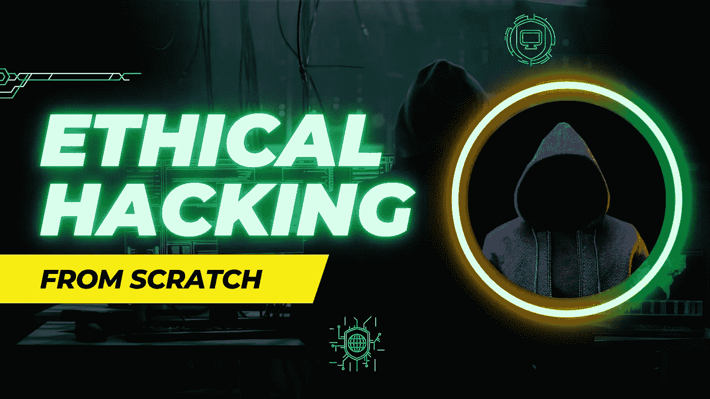
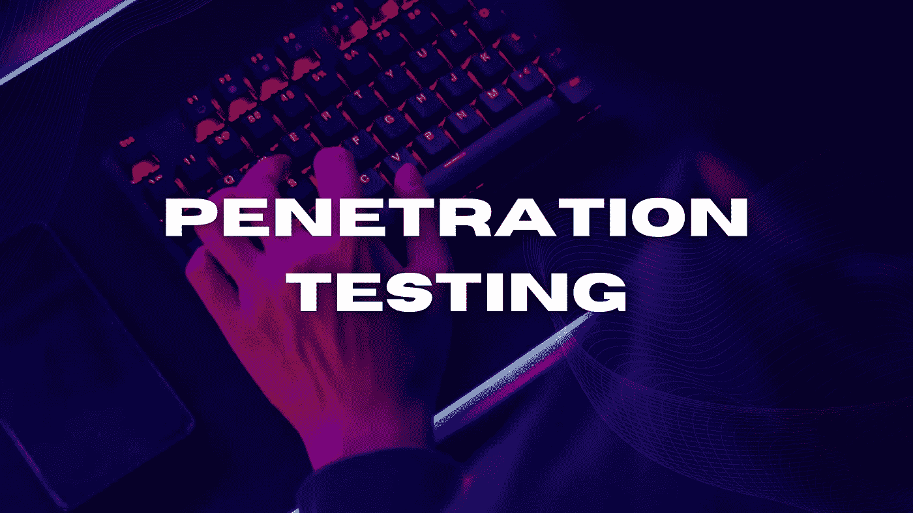
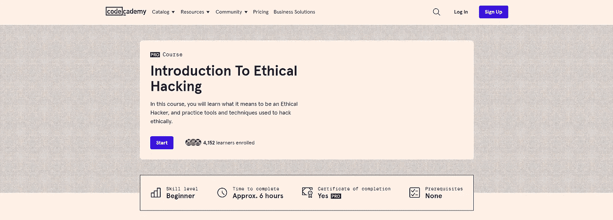
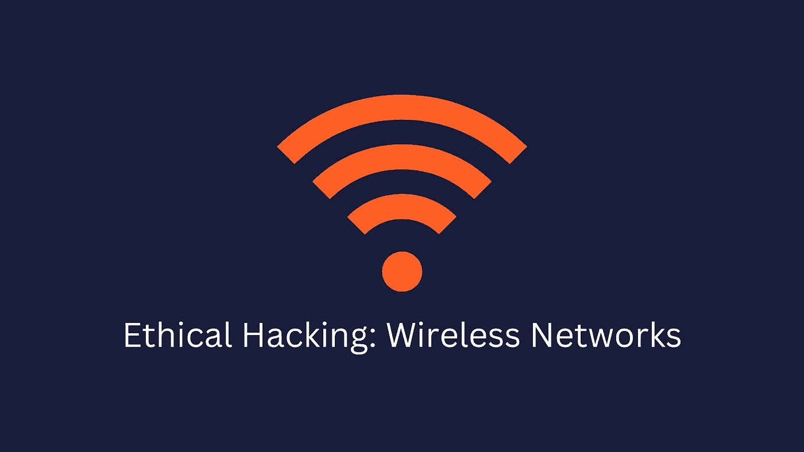
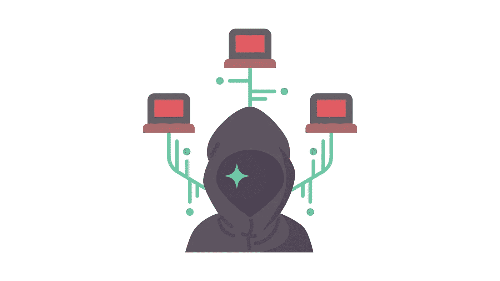

# 10 个最佳道德黑客在线课程[2022 年 11 月]

> 原文：<https://medium.com/quick-code/10-best-ethical-hacking-courses-online-a638f14817ab?source=collection_archive---------0----------------------->

Photo by [Nahel Abdul Hadi](https://unsplash.com/@nahelabdlhadi?utm_source=medium&utm_medium=referral) on [Unsplash](https://unsplash.com?utm_source=medium&utm_medium=referral)

众所周知，黑客有各种各样的肤色:白色、灰色、黑色，在网络安全方面，介于两者之间。善用技能的黑客被认为是白帽子。白帽黑客使用道德黑客来达到他们的目的。作为他们道德黑客实践的一部分，他们检查网络对外部攻击的脆弱性，以确定其脆弱性。因此，不言而喻，道德黑客是加强网络安全的 it 安全专业人员最重要的技能。

因此，我创建了这个顶级道德黑客课程列表，供初学者和专家了解道德黑客。我从 Udemy、Coursera、Codecademy、edX、Pluralsight 等顶级平台策划了这个榜单。

## 1.[从头开始学习道德黑客](https://click.linksynergy.com/deeplink?id=0F1O0otUXQc&mid=47901&u1=csMedium&murl=https%3A%2F%2Fwww.udemy.com%2Fcourse%2Flearn-ethical-hacking-from-scratch%2F)——【畅销书 Udemy 教程】

本课程假设没有黑客知识，所以到最后，你将知道如何像黑帽黑客一样攻击和保护系统。这门课虽然方便，但并没有忽视理论。

您将从道德黑客基础开始。然后，您将解构渗透测试字段，下载必要的软件(用于 Windows、Linux 和 Mac OS X)，并开始黑客攻击。此外，你将通过分析和利用不同的系统，包括网络、服务器、客户端、网站等，来了解一切。

在这个**道德黑客**课程中，您将学到以下内容:

*   学习道德黑客，它的领域和不同类型的黑客。
*   安装一个黑客实验室和需要的软件(在 Windows、OS X 和 Linux 上)。
*   破解和保护 Wi-Fi 和有线网络。
*   了解网站如何工作，以及如何发现和利用网络应用程序漏洞来攻击网站。
*   使用 30 多个黑客工具，如 Metasploit、Aircrack-ng、SQLmap 等。
*   发现漏洞并利用它们入侵服务器。
*   使用客户端和社会工程入侵安全系统。
*   保护系统免受所示的所有攻击。
*   安装和使用 Kali Linux——一个渗透测试操作系统。
*   学习 Linux 基础知识。
*   学习 Linux 命令&如何与终端交互。
*   学习网络黑客/渗透测试。
*   网络基础&设备如何在网络内部交互。
*   在不知道密钥的情况下攻击网络。
*   无需知道密码即可控制 Wi-Fi 连接。
*   创建一个有互联网连接的假 Wi-Fi 网络&监视客户。
*   收集有关网络和连接的客户端的详细信息，如其操作系统、端口等。
*   使用几种方法破解 WEP/WPA/WPA2 加密。
*   ARP 欺骗/ ARP 中毒。
*   发起各种中间人攻击。
*   访问网络上任何客户端访问的任何帐户。
*   嗅探网络流量&分析它以提取重要信息，如密码，cookies，网址，视频，图像等。
*   拦截网络流量并即时修改。
*   发现连接到同一网络的设备。
*   在连接到同一网络的客户端加载的页面中注入 Javascript。
*   将 DNS 请求重定向到任何目的地(DNS 欺骗)。
*   保护网络免受上述攻击。
*   编辑路由器设置以获得最大的安全性。
*   发现网络中的可疑活动。
*   加密流量以防止 MITM 攻击。
*   发现计算机系统上打开的端口、安装的服务和漏洞。
*   使用服务器端攻击来入侵服务器。

本课程包含 4 个主要主题:

*   网络黑客
*   获得访问权限
*   后期开发
*   网站/网络应用黑客

在整个课程中，有几个部分，每个部分侧重于一个特定的渗透测试/黑客领域。您将首先了解目标系统如何工作，以及它的弱点，然后利用这些弱点来入侵它。

在课程结束时，您将在大多数黑客和渗透测试领域拥有坚实的基础，以及检测、预防和保护系统和您自己的技能。

这是一门学习道德黑客的极好课程，有超过 16 小时的引人入胜的内容，课程评分为 4.6 分(满分 5 分)。它包括一份结业证书。

## 2.[道德黑客精要(EHE)](https://coursera.pxf.io/c/1137078/1213622/14726?u=https%3A%2F%2Fwww.coursera.org%2Flearn%2Fethical-hacking-essentials-ehe&subId1=csMedium)——【Coursera】

学生们将学习道德黑客和渗透测试基础知识，这将为他们在[网络安全](https://coursesity.com/blog/best-cybersecurity-courses/)领域的职业生涯做好准备。该课程将包括威胁和漏洞、密码破解、web 应用攻击、物联网和 oT 攻击、云计算、pentesting 基础知识等主题。

在这个**道德黑客**课程中，你将学到以下内容:

*   信息安全与道德黑客基础。
*   恶意软件类型、信息安全威胁和漏洞评估。
*   网络级攻击的对策，如嗅探、拒绝服务和会话劫持。
*   应用程序级攻击概述，包括 web 服务器利用、OWASP 十大攻击和 SQL 注入及其对策。

通过本课程，学习者获得了动手实践经验，为从事网络安全职业做好了准备。

以超过 32 小时的引人入胜的内容为特色，这是一门学习道德黑客的极好课程。它包括一份结业证书。

## 3.[渗透测试—发现漏洞](https://www.awin1.com/cread.php?awinmid=6798&awinaffid=466009&clickref=csMedium&ued=https%3A%2F%2Fwww.edx.org%2Fcourse%2Fpenetration-testing-discovering-vulnerabilities%3F)—【edX】

该课程以自定进度的方式介绍道德黑客技能。课程包括渗透测试主题。本课程涵盖的主题是渗透测试方法的介绍、渗透测试人员的识别和列举、扫描和漏洞列举。

本课程从渗透测试及其阶段的概述开始。第一阶段是范围界定。这个阶段包括学生确定测试的逻辑、期望、法律含义、目的和目标。

渗透测试的下一个阶段是侦察。侦察或开源情报(OSINT)收集是渗透测试中至关重要的第一步。渗透测试人员负责收集尽可能多的关于目标组织和可能被利用的目标的情报。

你将从这个**道德黑客**课程中学到什么:

*   渗透测试范围
*   尽可能多地收集关于目标的令人兴奋的信息
*   识别潜在的目标系统
*   识别测试系统的可能入口点
*   配置漏洞扫描器以识别弱点
*   分析漏洞扫描的结果

学生将获得扫描目标和漏洞的实践经验。本课程以威胁建模和漏洞识别结束。在威胁建模和漏洞识别阶段，测试人员识别目标并绘制攻击向量。

这是一门学习渗透测试的极好课程，包含超过 5 周的引人入胜的内容。它包括一份结业证书。

## 4.[道德黑客:道德黑客入门](https://linkedin-learning.pxf.io/c/1137078/646189/8005?u=https%3A%2F%2Fwww.linkedin.com%2Flearning%2Fethical-hacking-introduction-to-ethical-hacking&subId1=csMedium)——【领英学习】

这个介绍将帮助你开始保护你自己的网络或成为一个有道德的黑客。本课程将研究当今环境中最常见的攻击媒介和攻击背后的动机。此外，它还探讨了有助于实施安全目标的策略以及保护组织安全的各种方法。

本**道德黑客**课程的主题包括:

*   道德黑客概述
*   信息安全控制
*   数字世界中的数据保护
*   支持道德黑客

这是一门学习道德黑客的极好课程，内容引人入胜，时长超过 2 小时，课程评分为 4.6 分(满分 5 分)。它包括一份结业证书。

## 5.****——【代码学院】****

****

**Introduction to Ethical Hacking**

**在这个道德黑客入门课程中，你将学习一个道德黑客的责任。在本课程中学习如何合乎道德地进行黑客攻击，以合乎道德的方式实践黑客攻击，并通过实践这些技术和工具发现如何成为一名高效的黑客。**

**本**道德黑客**课程的主题包括:**

*   **让我们讲道德**
*   **道德黑客入门**
*   **逃避和计算**
*   **不道德的黑客行为**

****技能**你将获得:**

*   **道德黑客**
*   **分析和利用网站上的漏洞**
*   **使用 Nmap 扫描网络**
*   **用 PCAP 捕获网络数据包**

**这是一门学习道德黑客的极好课程，有超过 6 小时的引人入胜的内容。它包括一份结业证书(专业会员)。**

## **6.[完整的道德黑客训练营 2023:零到精通](https://click.linksynergy.com/deeplink?id=0F1O0otUXQc&mid=47901&u1=csMedium&murl=https%3A%2F%2Fwww.udemy.com%2Fcourse%2Fcomplete-ethical-hacking-bootcamp-zero-to-mastery%2F)——【Udemy】**

**无论您是一个寻求成为道德黑客的初学者，还是一个寻求通过提高在线安全性来防止网站被黑客攻击的程序员，在本课程中，您都将从头开始学习关于道德黑客和渗透测试的一切。如果你想编写自己的渗透测试和黑客工具，你也可以从头开始学习 Python 编程。**

**在这个道德黑客训练营中，您将学到以下内容:**

*   **从头开始学习 Python 来编写自己的道德黑客工具。**
*   **为道德黑客创建特洛伊木马、病毒和键盘记录程序。**
*   **了解如何通过高级扫描绕过防火墙和入侵检测系统。**
*   **了解如何破解无线接入点密码。**
*   **Bug Bounty:发现可能造成威胁的所有类型的 Web 应用程序 Bug。**
*   **了解如何访问任何类型的机器:Windows/Linux/macOS。**
*   **利用中间人攻击在局域网上嗅探密码。**
*   **SQL 注入、XSS、命令注入和其他技术。**
*   **学习如何欺骗人们打开你的程序(即社会工程)。**
*   **了解高级 Metasploit 框架用法。**
*   **学习 Linux 和 Linux 终端的基础知识。**
*   **掌握信息收集和足迹。**
*   **了解如何执行漏洞分析。**
*   **对整个网络执行高级扫描。**
*   **执行取消身份验证攻击，断开所有人与无线接入点的连接。**
*   **从头开始学习网站应用渗透测试。**
*   **了解高级 Nmap 用法。**
*   **编写您自己的高级后门程序，可以在您的渗透测试中使用。**
*   **在目标机器上创建持久性。**
*   **执行最新的 Windows 7 + 10 漏洞利用和攻击。**
*   **了解如何以各种方式访问路由器。**
*   **学习网络和不同的网络协议。**

**在为道德黑客设置您的计算机后，您将通过设置您的黑客实验室来开始课程，以确保您的计算机在整个课程中保持安全。然后，一旦您的计算机被设置为进行道德黑客攻击，课程将开始讨论以下主题:**

*   **黑客实验室**
*   **Python 101 —从头开始学习 Python 3 编程。(可选)**
*   **侦察**
*   **扫描**
*   **弱点分析**
*   **剥削和获得准入**
*   **后期开发**
*   **网站渗透测试**
*   **中间的人**
*   **WiFi 破解**
*   **社会工程**

**该课程拥有超过 28.5 小时的精彩内容，课程评分为 4.7 分(满分为 5 分)，是学习道德黑客的绝佳训练营。它包括一份结业证书。**

## **7.[渗透测试、事件响应和取证](https://coursera.pxf.io/c/1137078/1213622/14726?u=https%3A%2F%2Fwww.coursera.org%2Flearn%2Fibm-penetration-testing-incident-response-forensics&subId1=csMedium)—【Coursera】**

**本课程将帮助您学习如何为渗透测试收集数据，如何进行渗透测试，以及渗透测试可以使用哪些工具。此外，您将了解如何处理事件，应该收集哪些文档，以及事件响应策略的构成。最后，您将了解取证过程中的关键步骤以及要收集的关键数据。**

**本渗透测试课程的主题包括:**

*   **渗透测试**
*   **事故响应**
*   **数字取证**
*   **脚本简介**

**这是一门学习道德黑客的极好课程，拥有超过 17 小时的引人入胜的内容，课程评分为 4.6 分(满分 5 分)。它包括一份结业证书。**

## **8.[道德黑客:无线网络](https://linkedin-learning.pxf.io/c/1137078/646189/8005?u=https%3A%2F%2Fwww.linkedin.com%2Flearning%2Fethical-hacking-wireless-networks&subId1=csMedium)——【领英学习】**

****

**Ethical Hacking Wireless Networks**

**在本课程中，学生将学习如何配置基本安全性，以及黑客如何使用蓝牙设备访问网络并提取密码。此外，它还介绍了几种复杂的漏洞扫描工具，包括 Acrylic、Ekahau 和 Wireshark，以帮助用户选择合适的天线进行测试。**

**本道德黑客课程的主题包括:**

*   **无线网络**
*   **流氓接入点**
*   **蓝牙**
*   **附加工具**
*   **物联网**

**完成本课程后，您应该能够加强无线连接，并对使用本地网络的安全性充满信心。**

**本课程包含超过 1.5 小时的精彩内容，课程评分为 4.6 分(满分为 5 分)，是学习道德黑客和防止无线网络遭受攻击的绝佳课程。它包括一份结业证书。**

## **9.[黑掉 TPM 面试](https://www.educative.io/courses/hacking-the-tpm-interview?affiliate_id=5088579051061248)——【教育性】**

**本课程将教你如何回答技术项目经理面试中最常见的问题。它是由曾在多家 FAANG 公司工作过的 TPM 撰写的，因此你将了解如何在这种类型的面试中取得成功的内幕。**

*   **什么是技术项目管理？**
*   **面试准备(又称技能发展)**
*   **实用的建议**
*   **职业转型**

**此外，您还将收到关于如何成为一名 TPM 的实用建议。完成本课程后，你将有能力在面试中取得成功，并在工作中表现出色。**

**这是一门为 TPM 面试做准备的绝佳课程，包含超过 5 小时的精彩内容。它包括一份结业证书。**

## **10.[道德黑客:侦察/足迹](https://pluralsight.pxf.io/c/1137078/424552/7490?u=https%3A%2F%2Fwww.pluralsight.com%2Fcourses%2Freconnaissance-footprinting-ethical-hacking-ceh-cert&subId1=csMedium)**

****

**Ethical Hacking: Reconnaissance/Footprinting**

**本课程通过教你侦察和足迹技巧，为你参加认证道德黑客考试做准备。它解释了攻击者如何描述您的公司。在第一部分，我们将讨论侦察/足迹及其重要性。**

**本道德黑客课程的主题包括:**

*   **描述侦察/足迹**
*   **针对目标使用搜索引擎**
*   **通过网络服务获取英特尔信息。**
*   **利用社交媒体。**
*   **从网站获取情报。**
*   **从电子邮件中获取情报。**
*   **为英特尔检查 Whois 和 DNS。**
*   **从网络侦察/足迹中发现英特尔。**
*   **运用社会工程策略。**
*   **检查攻击者的工具和对策。**

**接下来，你将探索搜索引擎和网络服务如何帮助你了解你的目标及其资源。最后但并非最不重要的一点是，您将学会使用行业中的一些顶级工具来收集和记录您的发现。**

**这是一门学习道德黑客的极好课程，有超过 16 小时的引人入胜的内容，课程评分为 4.6 分(满分 5 分)。它包括一份结业证书。**

**感谢您阅读这篇关于最佳道德黑客课程的文章。我希望这个课程能帮助你选择正确的课程来学习道德黑客。如果你想探索更多，你可以查看这些文章:**

** [## 12 个必备的谷歌和 Meta Coursera 认证

### 谷歌和 Meta 认证备受雇主追捧。他们向雇主发出信号，表明一个专业人士拥有…

medium.com](/quick-code/12-must-have-google-meta-coursera-certifications-6afe403baa5b)  [## 学习 Spring 框架的 10 门最佳 Spring 课程

### 通过最好的 spring 课程学习用于 web 应用程序开发的 Spring 框架。

medium.com](/quick-code/10-best-spring-courses-to-learn-spring-framework-6edfb92d40bc)  [## 初学者学习 React 的 10 个最佳 React 课程

### 在最知名的 Javascript 库中，React 是最受欢迎的一个。它是一个开源的前端…

medium.com](/quick-code/10-best-react-courses-to-learn-reactjs-online-36dd0e3d3b68)  [## 面向初学者的 10 门免费 Java 课程[2022 年 8 月]——在线学习 Java

### 这里有一些免费的 java 课程，可以帮助你开始成为 Java 开发人员的旅程。

medium.com](/quick-code/10-free-java-courses-for-beginners-2022-aug-learn-java-online-e8bd09f923eb)**