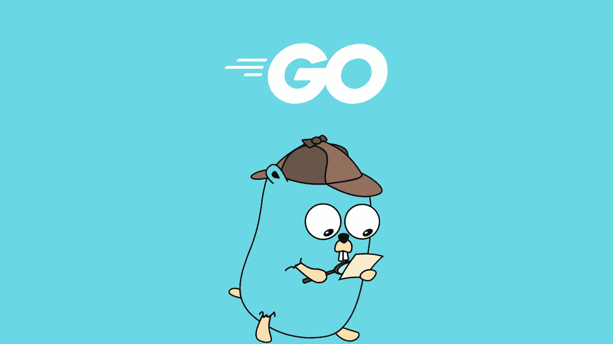
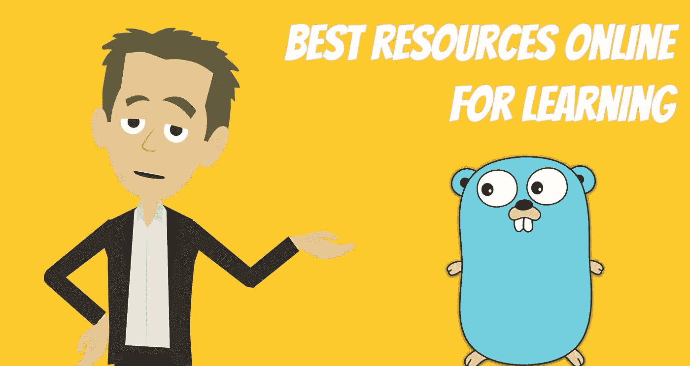
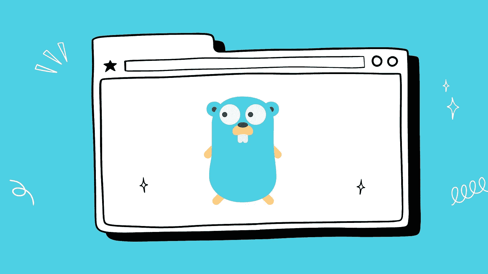
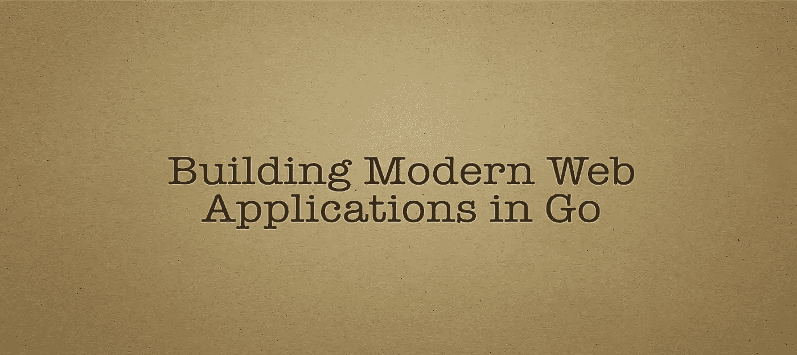
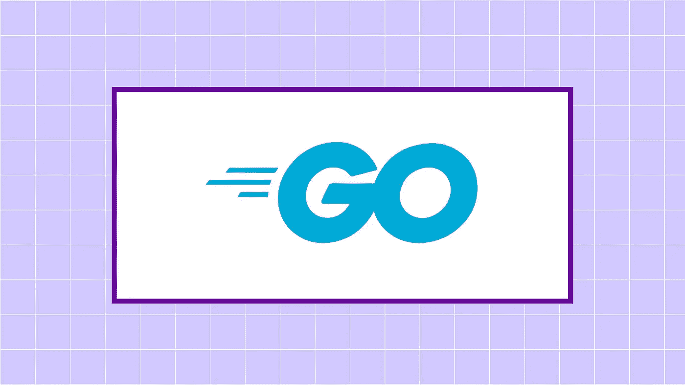
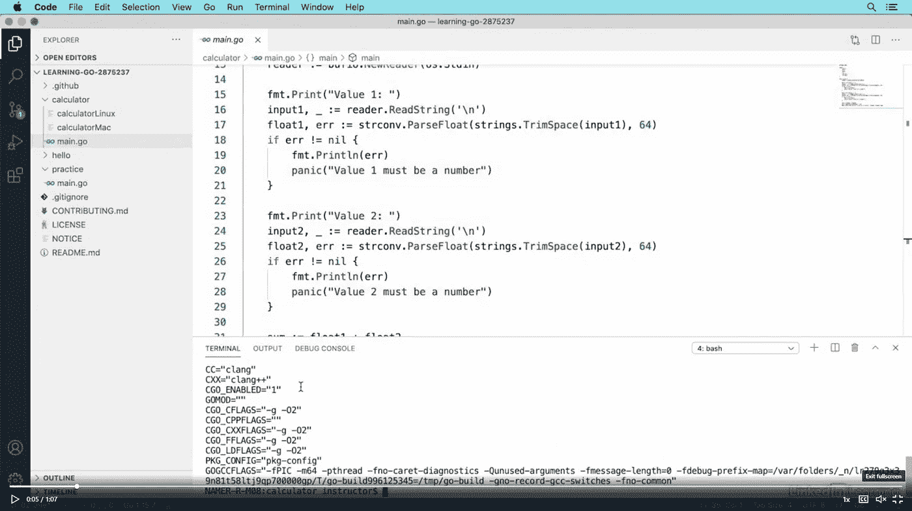
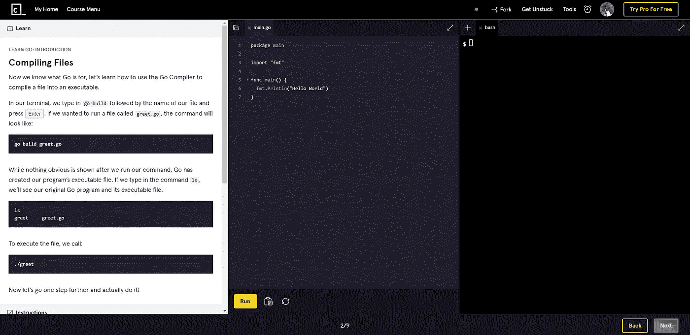
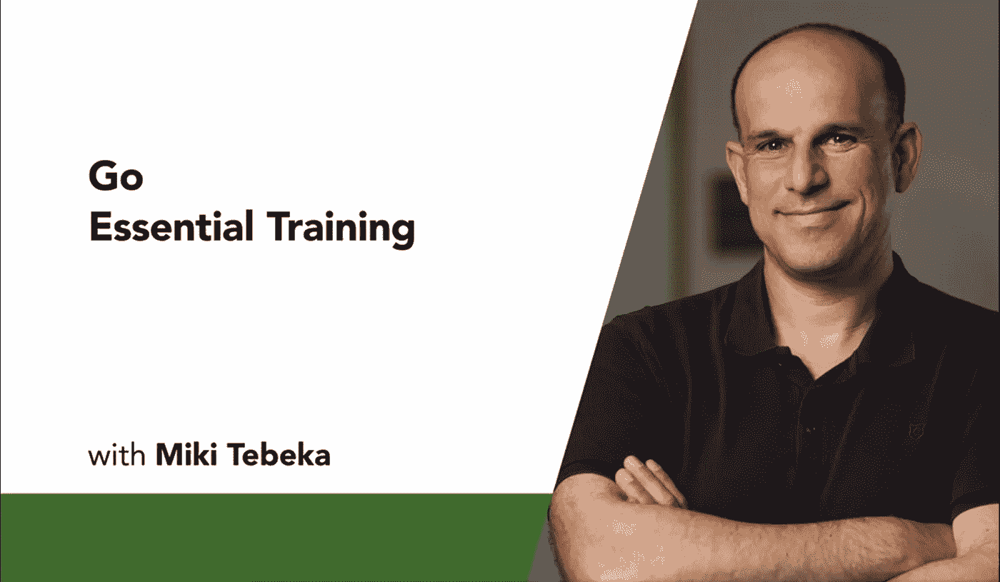
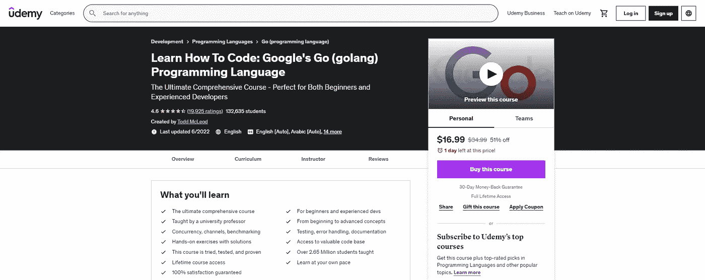
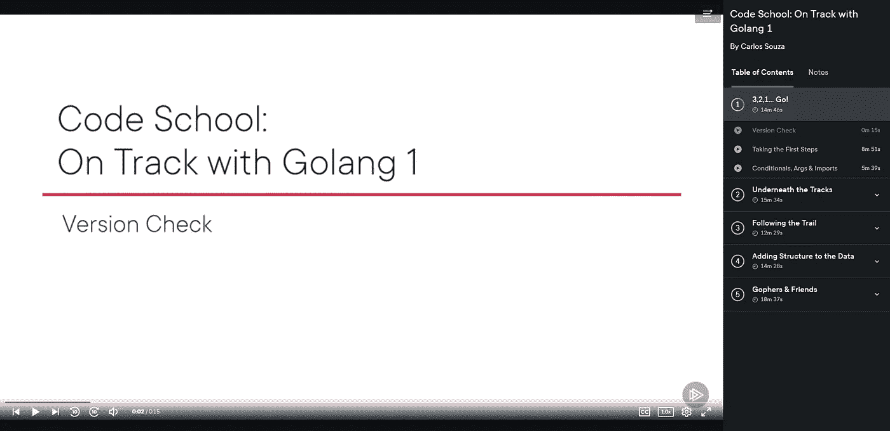

# 学习围棋编程的 10 个最佳 Golang 教程

> 原文：<https://medium.com/quick-code/10-best-golang-tutorials-to-learn-go-programming-46fbd4b81d2c?source=collection_archive---------0----------------------->

Best Golang Tutorials

各位开发者好！您对最佳 Golang 球场的搜索到此结束。下面这篇文章将向你展示一些适合初学者的最好的 Golang 课程。所以，如果你想投资最优质的教程去 [**学围棋**](https://coursesity.com/best-tutorials-learn/golang) ，这篇文章就是为你准备的！但在此之前，如果你不想投资付费课程，我已经策划了这份 [**免费 Golang 课程**](/quick-code/5-free-golang-courses-to-learn-go-programming-5dd95c4baddb) 的名单，你可以看看。现在，让我们回到戈朗。

自从谷歌在 2009 年推出围棋以来，得益于谷歌、网飞、优步等公司的帮助，围棋获得了发展。，这些公司已经使用这种语言扩展了他们的产品，实现了高性能商业怪兽的性能。许多开发人员喜欢这种编程语言的特性，比如结构化类型和垃圾收集。

# 学习围棋编程的最佳 Golang 课程

## 1. [Go:完整的开发者指南](https://click.linksynergy.com/deeplink?id=0F1O0otUXQc&mid=47901&u1=csMedium&murl=https%3A%2F%2Fwww.udemy.com%2Fcourse%2Fgo-the-complete-developers-guide%2F)——【最佳 Udemy 课程】

Go: The Complete Developer’s Guide

通过参加本课程，尽快启动并运行 Go。它将从讨论基础开始，然后继续讨论更高级的特性。通过这个 Udemy 课程，你将学会使用 Go 的并发模型和接口类型系统来充分发挥它们的潜力。

在本 Golang 课程中，您将:

*   了解 Go 的高级功能。
*   使用 Go 例程和通道创建大规模并发程序。
*   用几十个附带的测验问题来测试你的知识。
*   使用界面大大简化复杂的程序。
*   识别常用数据结构之间的差异。
*   使用类型使您的代码经得起未来的考验，并降低重构的难度。

本课程将帮助你理解 Golang 的基本语法和控制结构。此外，您将掌握类型的用途，尤其是如果您是动态类型语言的老手，如 **Javascript** 和 **Ruby** 。

是 Udemy 上学习围棋编程最好的 Golang 课程之一，课程评分 4.6 分满分 5.0 分，时长 8 小时 53 分钟。

## 2.[围棋入门](https://coursera.pxf.io/c/1137078/1213622/14726?u=https%3A%2F%2Fwww.coursera.org%2Flearn%2Fgolang-getting-started%3F&subId1=csMedium)——【Coursera】

Getting Started with GO

这门 Golang 课程将向您介绍世界上最受欢迎的开源编程语言之一——Go，它最初由 Google 开发，并由社区不断增强。

本 Golang 课程的主题包括:

*   Go 基础
*   基本数据类型
*   复合数据类型
*   协议和格式

该课程涵盖了围棋的基础知识，面向之前有过 **C** 、 **Python** 或 **Java** 经验的编程专业人士。涵盖的主题有数据类型、协议、格式、RFC 和 JSON 编码。此外，你将有机会编写围棋程序，并从他人那里获得反馈。一旦你完成这门课程，你将能够构建简单的围棋程序，为更高级的学习做准备。

这是 Coursera 上排名最高的围棋编程课程，在 5 门课程中获得 4.6 分，持续时间为 11 小时。旁听这门课程是免费的，但是你需要为额外的好处付费。

## 3.使用 Go 构建现代 Web 应用程序

Building Modern Web Applications in GO

与传统的编程语言不同，Go 是类型安全的、编译过的，而且速度极快。除了速度惊人之外，它还是构建安全、可伸缩、快速 web 应用程序的理想选择。该课程适合所有初学者和有一些 web 开发经验的开发人员，他们希望用 Go 扩展他们的工具包。

在本 Golang 课程中，您将:

*   如何用 Go 语言写程序？
*   如何正确组织你的 Go 应用？
*   如何在 Go 中编写测试？
*   如何在 Go 中连接到数据库？
*   如何在 Go 中管理会话？
*   如何在 Go 中创建和使用中间件？
*   如何在 Go 中实现安全的用户认证？
*   如何使用 HTML5 创建 HTML 页面？
*   如何不依赖 jQuery 之类的东西写 Javascript？
*   如何用 Google 的 Go 编程语言构建现代、安全的 web 应用程序？

本课程将帮助您了解 Go 语言，随后是对开发 web 应用程序的简要介绍。作为本课程的一部分，您还将了解 HTML5、JavaScript、JavaScript 模块，以及如何使用级联样式表使我们的应用程序看起来像我们想要的样子。

是 Udemy 上学习围棋编程最好的 Golang 课程之一，课程评分 4.7 分满分 5.0 分，时长 29 小时 32 分钟。

## 4.[围棋中的并发](https://coursera.pxf.io/c/1137078/1213622/14726?u=https%3A%2F%2Fwww.coursera.org%2Flearn%2Fgolang-concurrency&subId1=csMedium)——【Coursera】

Concurrency in GO

这门 Golang 课程将帮助你学习如何在 Go 中实现并发编程。此外，它将帮助学习者探索通道和 goroutines 在实现并发性中的作用。此外，您将通过开发几个程序作为示例，在课程活动中练习 Go 的并发编程能力。

本 Golang 课程的主题包括:

*   为什么要使用并发？
*   并发基础
*   GO 中的线程
*   同步通信

这是 Coursera 上排名最高的围棋编程课程，在 5 门课程中获得 4.7 分，时长 9 小时。旁听这门课程是免费的，但是你需要为额外的好处付费。

## 5.[学习围棋](https://linkedin-learning.pxf.io/c/1137078/646189/8005?u=https%3A%2F%2Fwww.linkedin.com%2Flearning%2Flearning-go-8399317&subId1=csMedium)——【Linkedin】

Learning GO

在本课程中，开发人员将学习 Golang 的核心元素和语法，帮助他们开始使用该语言。在介绍的工具和技能中，有一个叫 Go Playground 的在线工具，它把围棋开发从桌面上拿了下来。

本 Golang 课程的主题包括:

*   管理简单变量值
*   管理复杂类型和集合
*   管理程序流
*   创建可重用的代码
*   使用文件和 Web

此外，它还涵盖了基本的编程任务，如管理值、使用数学运算符以及将值存储为复杂类型。此外，您将创建可重用的 Go 代码，读写文件，并发出基本的 web 请求。

是领英上学习围棋编程最好的 Golang 课程之一，课程评分 4.7 分满分 5.0 分，时长 2 小时 22 分钟。

## 6.[学围棋](https://www.pjatr.com/t/TUJGR0lLR0JHR0pMSUtCR0ZISk1N?sid=csMedium&url=https%3A%2F%2Fwww.codecademy.com%2Flearn%2Flearn-go)——【代码学院】

Learn GO

Codecademy 的免费 Golang 课程将教你如何使用 Go (Golang)，这是一种由谷歌支持的开源编程语言。您将学习如何使用变量在 Go 中创建和存储值，如何使用 Go 的 fmt 包打印和扫描数据，在 Go 中实现条件和函数，等等。

在本 Golang 课程中，我们将涵盖:

*   设置 Go 环境并创建 Go 文件。
*   数据类型和变量
*   条件语句
*   在 Go 中使用函数

这是 Codecademy 上的顶级围棋编程课程，持续时间为 10 小时。请记住，除非您拥有 Codecademy 的专业会员资格，否则您不会获得结业证书。

## 7.[围棋基础训练](https://linkedin-learning.pxf.io/c/1137078/646189/8005?u=https%3A%2F%2Fwww.linkedin.com%2Flearning%2Fgo-essential-training-16567666&subId1=csMedium)——【Linkedin】

GO Essential Training

本课程从语法基础开始，帮助开发人员提高使用 Go 的效率。除了学习像数字和字符串这样的 Go 基本类型，你还将学习条件和循环，使用结构和方法的面向对象编程，以及错误处理。

本 Golang 课程的主题包括:

*   Go 基础
*   功能
*   面向对象

作为本课程的一部分，您还将探索并发特性，如 goroutines 和通道，以及如何通过网络特性连接 API 和数据库。通过将您所学的一切整合到一个由 Go 支持的优雅解决方案中，您的最终项目将展示如何构建一个高度并发的服务器。

是 Linkedin 上学习围棋编程最好的 Golang 课程之一，课程评分 4.7 分满分 5.0 分，时长 1 小时 45 分钟。

## 8.学习如何编码:谷歌的 Go 编程语言

Learn How To Code: Google’s Go Programming Language

Udemy 的这门终极 Golang 课程将帮助初学者和专家学习 Go 编程。课程中有许多例子、实践练习、实践练习的解决方案以及令人惊叹的代码库。

在本 Golang 课程中，您将学习:

*   并发性、渠道、基准测试
*   测试、错误处理、文档
*   访问有价值的代码库
*   带解决方案的动手练习

在本课程中，初学者和有经验的开发者将学习如何安全有效地使用 Go。此外，无论您的能力水平如何，本课程都有很好的内容和资源来学习您需要的一切。

是 Udemy 上学习围棋编程的顶级 Golang 课程，课程评分 4.6 分满分 5.0 分，时长 45 小时 22 分钟。

## 9.[代码学校:与 Golang 1](https://pluralsight.pxf.io/c/1137078/424552/7490?u=https%3A%2F%2Fwww.pluralsight.com%2Fcourses%2Fcode-school-on-track-with-golang&subId1=csMedium)——【plural sight】

Code School: On Track with Golang 1

通过本课程，您将了解是什么使 Go 成为一种优秀的并发编程语言，以及如何使用 Go 来利用现代计算机体系结构的强大功能。

本 Golang 课程的主题包括:

*   铁轨下面
*   追踪线索
*   向数据添加结构
*   地鼠和朋友

这是 Pluralsight 上的顶级 Golang 课程，时长 1 小时 15 分钟。

## 10.[学习围棋编程——Golang 初学者教程](https://www.youtube.com/watch?v=YS4e4q9oBaU&t=2697s)——【freeCodeCamp】

这篇来自 FreeCodeCamp 的 Golang 教程将帮助你在这个面向初学者的循序渐进的教程中学习 Go 编程语言。他们还在传记中提供了时间戳，允许你继续学习你想学的主题，如变量、原语、常量、数组和切片等。此外，讲师以引人入胜、清晰简洁的方式解释概念。

本 Golang 课程的主题包括:

*   设置开发环境
*   变量
*   基元
*   常数
*   数组和切片
*   映射和结构
*   If 和 Switch 语句
*   环
*   推迟、恐慌和恢复
*   两颗北极指极星
*   功能
*   接口
*   戈鲁廷斯
*   频道

感谢您阅读这篇关于学习 Go 编程的最佳 Golang 课程的文章！如果你觉得这篇文章有帮助，请在评论中告诉我。

这里有更多的主题供您阅读:

 [## 学习围棋编程的 5 门免费 Golang 课程

### 各位程序员和开发者好！您对免费 Golang 课程的搜索到此结束。在这篇文章中，我将分享…

medium.com](/quick-code/5-free-golang-courses-to-learn-go-programming-5dd95c4baddb)  [## 面向初学者的 10 门免费 Java 课程[2022 年 8 月]——在线学习 Java

### 这里有一些免费的 java 课程，可以帮助你开始成为 Java 开发人员的旅程。

medium.com](/quick-code/10-free-java-courses-for-beginners-2022-aug-learn-java-online-e8bd09f923eb)  [## 目前最受欢迎的 5 种编程语言

### 有很多可用的编程语言，在这么多语言中选择一种你觉得舒服的语言…

medium.com](/quick-code/5-most-popular-programming-languages-in-demand-right-now-20e233b2ff1a) 

***披露:*** *如果您通过本页面的链接购买课程，我们可能会获得一小笔附属佣金。谢谢你。*