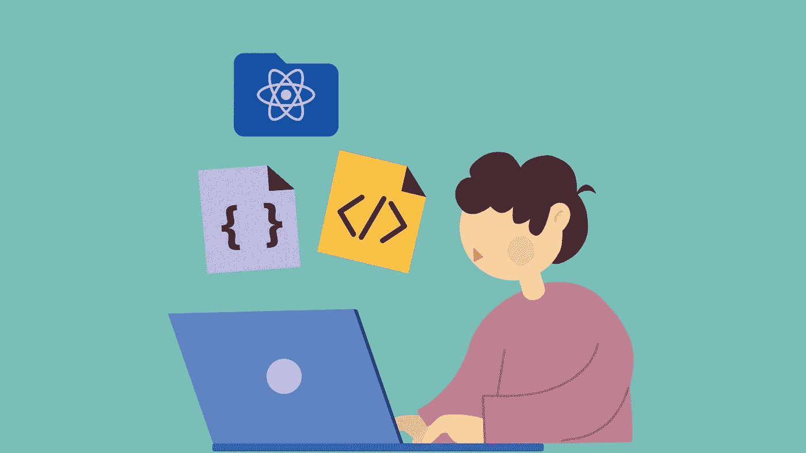

# 初学者学习 React 的 10 个最佳 React 课程

> 原文：<https://medium.com/quick-code/10-best-react-courses-to-learn-reactjs-online-36dd0e3d3b68?source=collection_archive---------0----------------------->

Best ReactJS Courses

在最知名的 Javascript 库中，React 是最受欢迎的一个。它是一个开源的前端库，可以让您为 web 和移动应用程序创建快速的交互式 ui。开发人员使用 React.js 进行 web 开发，因为它最终优化了设计界面和代码语言。很容易获得、实现、创建和维护专业外观的 web(和移动)应用程序，因为它是一种基于组件的方法，具有明确定义的生命周期，并且只使用普通的 JavaScript。

因此，我编制了这个最佳 React 课程列表，初学者可以用来了解这个不可思议的 Javascript 库。或者，如果你想投资免费课程，我也为初学者整理了一份[免费 React.js 课程](/quick-code/top-10-free-courses-to-learn-react-cc6a40b9835)清单。现在，让我们回到主题。

## 1. [React —完整指南(包括钩子、React 路由器、Redux)](https://click.linksynergy.com/deeplink?id=0F1O0otUXQc&mid=47901&u1=csMedium&murl=https%3A%2F%2Fwww.udemy.com%2Fcourse%2Freact-the-complete-guide-incl-redux%2F)—【Udemy】

React.js 是最流行的 JavaScript 库，用于创建现代的反应式 web 界面。因此，本课程将向您传授 React 最新版本的所有核心现代功能。它涵盖了以面向实践的方式教授 React.js 的所有最新模式和最佳实践。

在本反应课程中，您将:

*   构建强大、快速、用户友好且反应迅速的 web 应用程序。
*   了解所有关于 React 挂钩和 React 组件的信息。
*   轻松利用 JavaScript 的强大功能，提供出色的用户体验。
*   寻找高薪工作或在网络开发最受欢迎的领域之一做自由职业者。

本课程将为您提供成为一名熟练的 React.js 开发人员所需的关键基础知识、高级概念和相关主题。这对任何没有 React 先验知识或已经有一些基础知识的人来说是完美的:你将获得大量有用的知识。

这是 Udemy 上的顶级 React 课程，5 门课程中有 4.6 门，时长 48 小时。完成本课程后，您将收到一份结业证书。

## 2.[用 React 进行前端 Web 开发](https://coursera.pxf.io/c/1137078/1213622/14726?u=https%3A%2F%2Fwww.coursera.org%2Flearn%2Ffront-end-react&subId1=csMedium)——【Coursera】

本课程将探讨基于 JavaScript 的前端应用开发，重点是 React(16.3 版)。我们将使用 JavaScript ES6 来创建 React 应用程序。此外，您将通过使用 Reactstrap 学习如何使用 Bootstrap 4 构建响应式 ui。

React 课程的主题包括:

*   React 简介
*   React 路由器和单页应用程序
*   React 表单、流架构和 Redux 简介
*   更多冗余和客户端-服务器通信

在本课程中，您将了解 React 组件的各个方面。了解 React 路由器以及在构建单页应用程序时如何使用它们。此外，您将学习如何设计受控表单，并了解 Flux 架构和 Redux。使用 React-Redux，您将开发基于 Redux 的应用程序。

接下来，您将学习使用 Fetch 和服务器端 REST APIs 进行客户端-服务器通信。本课程以演示 React 动画如何工作以及如何测试它们结束。对于这门课程，学生必须具备扎实的 Bootstrap 4 和 JavaScript 知识，尤其是 ES5。

这是 Coursera 上评级最高的 React 课程，在 5 门课程中获得 4.7 分，持续时间为 36 小时。旁听这门课程是免费的，但是你需要为额外的好处付费。

## 3. [React.js 基础培训](https://linkedin-learning.pxf.io/c/1137078/646189/8005?u=https%3A%2F%2Fwww.linkedin.com%2Flearning%2Freact-js-essential-training-14836121&subId1=csMedium)——【Linkedin】

React.js 在 JavaScript 库中是独一无二的。它使用可重用的组件而不是模板，这使得它即使在数据随时间变化的情况下也能呈现视图。因此，开发人员和用户对 React 应用程序更加满意，因为它们更具可伸缩性和可管理性。因此，本课程将训练你的反应能力。

React 课程的主题包括:

*   什么是反应？
*   React 元素简介
*   反应组分
*   组件树中的反应状态
*   在 React 中处理表单
*   异步反应
*   反应路由器
*   反应测试和部署

本课程将教您如何使用 React 使用最现代的语法和最佳实践来创建组件。接下来，您将了解如何为 React 设置 Chrome 工具，创建新组件，使用 React 中的内置挂钩，以及使用 Create React App 运行测试。完成本课程后，您将了解 React.js 的基础知识，从而更有效地构建基于浏览器的应用程序。

在 Linkedin 上学习 ReactJS 是最好的 React 课程之一，课程评分 4.7 分(满分 5.0)，时长 2 小时。

## 4.[学习高级反应](https://www.pjatr.com/t/TUJGR0lLR0JHR0pMSUtCR0ZISk1N?sid=csMedium&url=https%3A%2F%2Fwww.codecademy.com%2Flearn%2Flearn-advanced-react)——【代码学院】

作为一名前端或全栈开发人员，在提升 React 技能时，您可能会遇到在这个高级课程中学到的技术。因此，本课程侧重于高级 React 主题。

在本 React 课程中，您将:

*   创建错误边界，保护应用程序的某些区域免受运行时错误的影响。
*   利用上下文 API 在整个组件树中优雅地共享数据，并最小化 prop drilling。
*   创建自定义挂钩，最大限度地减少重复并提高代码的可读性。
*   分析 React 应用程序的性能，并应用技术来优化它们。

在本课程中，你将创建作品集项目来展示你的技能。你将创建像空白思想、背景混音带和逃学这样的项目。此外，您将熟悉 React Dev 调试工具和定制挂钩。

这是 Codecademy 上的顶级 React 课程，持续时间为 8 小时。请记住，除非您拥有 Codecademy 的专业会员资格，否则您不会获得结业证书。

## 5.[现代反应与还原](https://click.linksynergy.com/deeplink?id=0F1O0otUXQc&mid=47901&u1=csMedium&murl=https%3A%2F%2Fwww.udemy.com%2Fcourse%2Freact-redux%2F)——【Udemy】

学习反应和还原是一项有价值的技能。通过本课程，您将了解 Redux 和 React 如何以一种经过时间考验的方式工作，这将帮助您获得一份软件工程师的新工作或开发您一直想要的应用程序。

在本 React 课程中，您将:

*   使用最新的 web 技术创建动态 web 应用程序。
*   获得获得软件工程工作所需的编程技能。
*   通过许多大型项目、练习和测验来练习你的技能。
*   掌握 React 和 Redux 背后的基本概念。
*   了解 Redux 的工作原理及其基本原理。
*   发现构建可重用组件的力量。
*   熟练掌握支持 React 的工具链，包括 NPM、Webpack、Babel 和 ES6/ES2015 Javascript 语法。

本课程循序渐进地介绍每个主题，确保您有坚实的基础。它包括大量的讨论，帮助您理解如何以及何时使用 Redux 和 React 的每个特性。

这是 Udemy 上评级最高的 React 课程，在 5 门课程中获得 4.6 分，时长 52 小时。完成本课程后，您将收到一份结业证书。

## 6.[反应基础](https://coursera.pxf.io/c/1137078/1213622/14726?u=https%3A%2F%2Fwww.coursera.org%2Flearn%2Freact-basics&subId1=csMedium)——【Coursera】

本课程将向您介绍 React 库的基本概念，并教您如何构建一个简单、快速且可扩展的应用程序。除了发展新技能、提高生产力和有效利用数据之外，本课程还有可能提升你的职业前景。

在本 React 课程中，您将:

*   使用 React 构建可扩展和可维护的网站和应用程序。
*   使用 props 在组件之间传递数据。
*   设计交互式动态网页。
*   使用表单允许用户与应用程序交互。
*   创建 React 应用程序。
*   使用可重用组件来呈现数据随时间变化的视图。

有兴趣为移动开发事业做准备的人可以报名参加这个课程。这门课程不需要以前的编程经验，只需要基本的互联网导航技能和学习如何编码的愿望。

这是 Coursera 上排名最高的 React 课程，持续时间为 27 小时。旁听这门课程是免费的，但是你需要为额外的好处付费。

## 7.[用 React 构建现代项目](https://linkedin-learning.pxf.io/c/1137078/646189/8005?u=https%3A%2F%2Fwww.linkedin.com%2Flearning%2Fbuilding-modern-projects-with-react&subId1=csMedium)——【Linkedin】

探索 React 生态系统中一些最强大的工具，这些工具可以简化开发，减轻状态、副作用、结构和样式的处理。课程从介绍 React 开始，解释了 redux 和 thunks、选择器、样式化组件和测试。

React 课程的主题包括:

*   创建您的基本项目
*   添加 Redux
*   处理副作用
*   选择器
*   样式组件
*   测试

在 Linkedin 上学习 ReactJS 是最好的 React 课程之一，课程评分为 4.7 分(满分为 5.0)，时长为 3 小时 41 分钟。

## 8.[用 React](https://www.pjatr.com/t/TUJGR0lLR0JHR0pMSUtCR0ZISk1N?sid=csMedium&url=https%3A%2F%2Fwww.codecademy.com%2Flearn%2Fpaths%2Fbuild-web-apps-with-react)——【代码学院】创建前端 app

对前端技能要求很高，HTML 和 CSS 广为人知。成为 JavaScript 专家，让自己与众不同。了解如何使用 React 创建交互式应用程序，React 是一个越来越重要的流行库。

React 课程的主题包括:

*   JavaScript 和构建应用程序简介
*   JavaScript 函数、数组和循环
*   JavaScript 迭代器、对象和类
*   现代 JavaScript:模块和浏览器兼容性
*   React 简介
*   反应:组件交互
*   反应:组件状态
*   AJAX 请求和 API 交互
*   反应顶点

您将创建的一些项目包括 Wanderlust、与 Yelp API 交互以及使用 Spotify 创建播放列表应用程序。

这是 Codecademy 上的顶级 React 课程，为期 8 周。请记住，除非您拥有 Codecademy 的专业会员资格，否则您不会获得结业证书。

## 9.[用 Jest 和 React 测试库测试 React 应用](https://www.educative.io/courses/testing-react-apps-jest-react-testing-library?affiliate_id=5088579051061248)——【教育性】

本课程将教你如何使用 Jest 和 React 测试库编写自动化测试，它们是 React 应用程序事实上的测试工具。通过这些测试，您可以放心地发布新版本的应用程序。作为测试的结果，您将能够增加您的发布频率，让您更快地向您的客户交付新的特性。

React 课程的主题包括:

*   Jest 入门
*   使用匹配器
*   React 测试库入门
*   反应测试库查询
*   点火事件
*   嘲弄的
*   测试不同类型的组件
*   附录

因此，您将学习如何在代码被重构或改进时编写抗中断的测试，从而减少维护费用。在本课程中，您将学习如何模拟用户与应用程序的交互。此外，它将教你如何健壮地测试应用程序的异步部分。

这是一门顶级的 React 教育课程，时长 16 小时。此外，完成本课程后，您将获得一份证书。

## 10.[反应 17:入门](https://pluralsight.pxf.io/c/1137078/424552/7490?u=https%3A%2F%2Fwww.pluralsight.com%2Fcourses%2Freact-js-getting-started&subId1=csMedium)——【复数视线】

本课程介绍 React 背后的基本概念，并展示如何使用它们来创建实际的 web 应用程序。本教程将向您展示如何创建有状态的函数和类组件，读取和更新状态元素，以及如何在组件树中单向流动数据。

之后，您将探索 React 使用的现代 JavaScript 特性，比如箭头函数、析构 rest 和 spread 操作符、类和 async/await。接下来，我们将介绍一些核心的 React 函数，比如接受用户输入、读取 API 数据以及管理定时器等副作用。

最后，您将学习如何创建本地 JavaScript 开发环境。完成本课程后，您将从头开始简单的 React 应用程序，并了解 React 项目。

React 课程的主题包括:

*   基础知识
*   现代 JavaScript 速成班
*   GitHub Cards 应用
*   明星赛游戏
*   设置开发环境

这是 Pluralsight 上的顶级 React 课程，持续时间为 4 小时。此外，完成本课程后，您将获得一份证书。

感谢您阅读这篇关于最佳反应课程的文章！如果你觉得这篇文章有帮助，请在评论中告诉我。这里还有一些对你有用的帖子:

 [## 学习围棋编程的 10 个最佳 Golang 教程

### 各位开发者好！您对最佳 Golang 球场的搜索到此结束。下面的文章将向你展示一些…

medium.com](/quick-code/10-best-golang-tutorials-to-learn-go-programming-46fbd4b81d2c)  [## 7 门面向初学者的免费打字课程

### 以下是我在 Udemy、Codecademy、Pluralsight 等网站上的免费打字稿课程的首选。

medium.com](/quick-code/7-free-typescript-courses-for-beginners-da0423ab5943)  [## 5 门免费在线课程，供初学者学习 Vue JS

### 众所周知，谈到 JavaScript 框架，有两个名字一直排在最前面——node . js 和 React…

medium.com](/quick-code/5-free-online-courses-for-beginners-to-learn-vue-js-86103aaeb2b) 

***披露:*** *如果您通过本页面的链接购买课程，我们可能会获得一小笔附属佣金。谢谢你。*