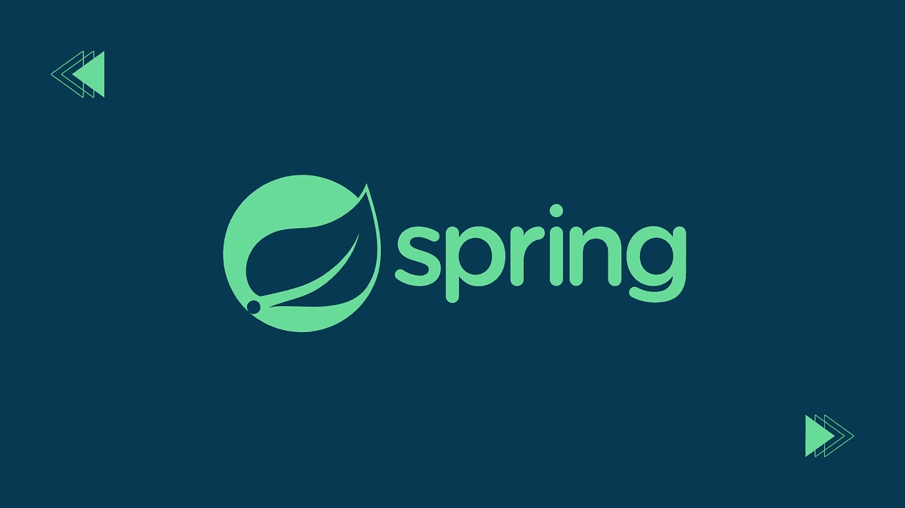
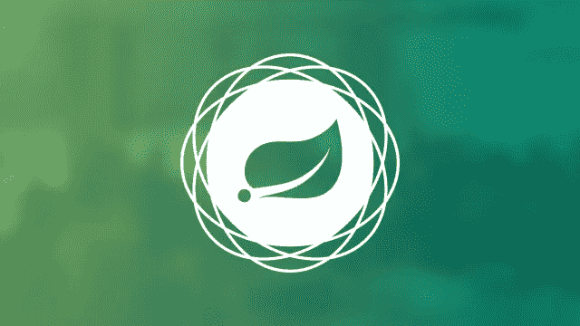
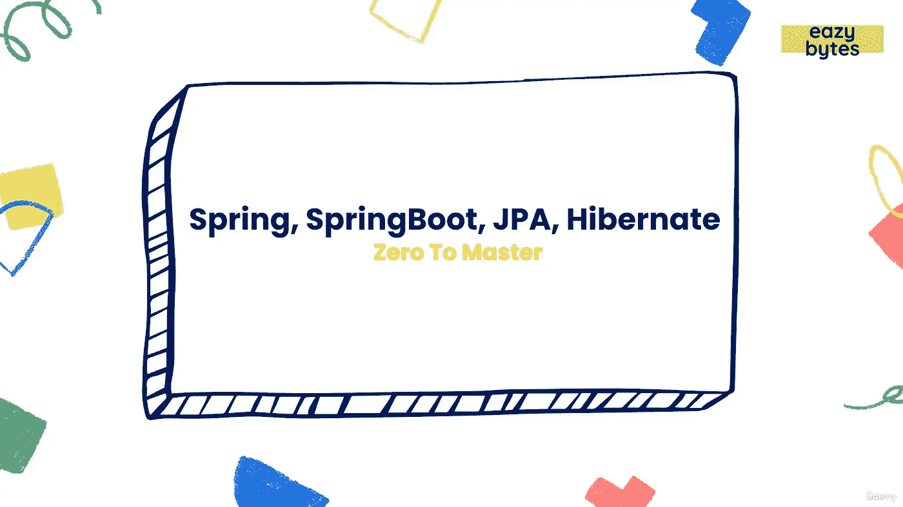
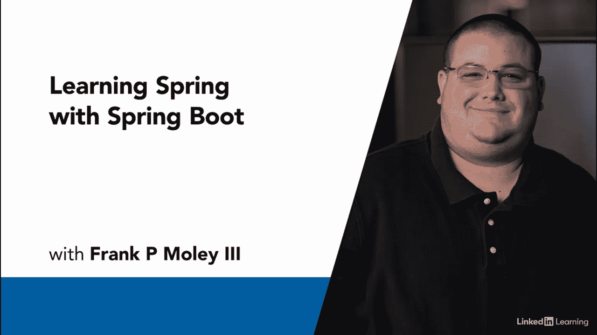
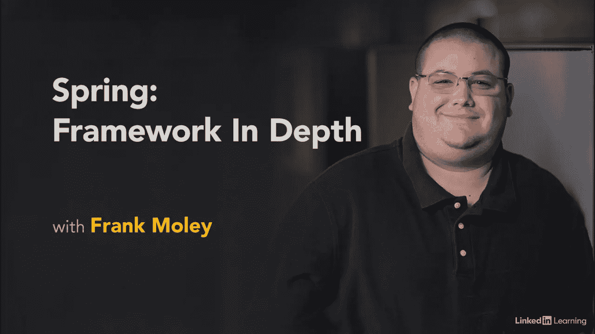

# 学习 Spring 框架的 10 门最佳 Spring 课程

> 原文：<https://medium.com/quick-code/10-best-spring-courses-to-learn-spring-framework-6edfb92d40bc?source=collection_archive---------0----------------------->

## 通过最好的 spring 课程学习用于 web 应用程序开发的 Spring 框架。

Best Spring Courses

Spring 是一个企业 Java 框架，它使得 Java EE 开发更加简单，效率更高。它通过利用控制反转和依赖注入来促进良好的编码实践并加速软件开发。Spring framework 是任何希望开发可靠的 web APIs、扩展 Java 知识和构建市场现成技能的人的选择。

尽管没有强加任何特定的编程模型，Spring Framework 在 Java 社区中已经变得非常流行。它包括几个提供一系列服务的模块，但是如果你不掌握它，你将无法构建 web 应用程序。

之前，我分享了一些最好的免费课程来[学习 Spring Boot](/quick-code/5-free-spring-boot-courses-for-java-programmers-369981c93c4a) 。今天我将分享一些 Java 开发人员学习 Spring 框架的最佳在线课程，供初学者和中间用户使用。

## 1.[春天&初学冬眠(包括 Spring Boot)](https://click.linksynergy.com/deeplink?id=0F1O0otUXQc&mid=47901&u1=csMedium&murl=https%3A%2F%2Fwww.udemy.com%2Fcourse%2Fspring-hibernate-tutorial%2F)——【Udemy】

Learn Java Spring Framework

通过本课程快速学习春天和冬眠。本教程揭示了这项技术，并教您如何从头开始构建一个真正的 Spring 和 Hibernate 应用程序。

在春季课程中，您将:

*   从头开始用 Spring MVC、Spring REST、Spring Boot 和 Hibernate CRUD 开发一个实时项目。
*   了解 Spring 5 的主要特性:核心、注释、Java 配置、AOP、Spring MVC、Hibernate 和 Maven。
*   了解 Spring Boot 2，春季安全，春季休息，春季数据 JPA，春季数据休息，百里香叶。

本课程涵盖了 Spring 5 和 Hibernate 5 的最新版本。作为一个实时项目的例子，本课程涵盖了 Spring Boot 和春季数据 JPA。您将从头开始构建一个 Spring MVC + Hibernate CRUD web 应用程序！

本课程将涵盖 Spring Core、AOP、Spring MVC、Spring Security、Spring REST、Spring Boot、Spring Data JPA、Spring Data REST、Thymeleaf 和 Hibernate，所有这些都与 MySQL 数据库相结合。在本课程结束时，您将已经使用 Hibernate 创建了 Spring MVC CRUD 实时项目的完整源代码。

此外，这个课程包括关于 Maven、Spring Security、Spring REST 和 Spring Boot 的迷你课程。使用这些迷你课程，你将很快掌握 Maven、Spring Security、Spring REST 和 Spring Boot 的窍门。

这是 Udemy 上最畅销的春季课程，5 门课程中有 4.6 门，时长 41 小时。完成本课程后，您将收到一份结业证书。

## **2。** [**用 Spring Boot 和春云**](https://coursera.pxf.io/c/1137078/1213622/14726?u=https%3A%2F%2Fwww.coursera.org%2Flearn%2Fgoogle-cloud-java-spring&subId1=csMedium)**——【Coursera】**

由于其弹性扩展和按需资源，微服务架构非常适合公共云。因此，本课程教授如何使用 Spring Boot 和 Spring Cloud 在 Google Cloud 上开发 Java 应用程序。

在本课程中，您将:

*   了解如何在 Google Cloud 上使用 Spring Boot 和 Spring Cloud 构建 Java 应用程序。
*   通过发布/订阅和 Spring 集成来发送和接收消息。
*   使用 Cloud SQL 作为 Java 应用程序的托管关系数据库，并了解如何迁移到 Cloud Spanner。
*   了解如何使用 Google Cloud 的操作套件跟踪和调试 Spring 应用程序。

在本课程中，您将使用 Spring Cloud Config 管理您的应用程序的配置。此外，您将了解如何迁移到 Cloud Spanner，即 Google Cloud 的全球分布式高度一致的数据库服务，以及如何使用 Cloud SQL 作为 Java 应用程序的托管关系数据库。

这是 Coursera 上排名最高的春季课程，5 门课程中有 4.3 分，持续时间为 13 小时。旁听这门课程是免费的，但是你需要为额外的好处付费。

## 3.[主 Spring 框架，Spring Boot，REST，JPA，Hibernate](https://click.linksynergy.com/deeplink?id=0F1O0otUXQc&mid=47901&u1=csMedium&murl=https%3A%2F%2Fwww.udemy.com%2Fcourse%2Fspring-springboot-jpa-hibernate-zero-to-master%2F)——【Udemy】

顾名思义，本课程将帮助你掌握 Spring 框架、Spring Boot、AOP、Spring MVC、百里香叶、Spring 安全、Spring JDBC、Spring 数据 JPA、REST 等。

在本课程中，您将学习:

*   什么是 Spring & Spring 生态系统中的不同项目？
*   Spring 的核心概念，如控制反转(IoC)、依赖注入(DI)和面向方面编程(AOP)
*   使用 SpringBoot 构建和消费 REST 服务。
*   如何使用 Spring MVC 构建 web 应用？
*   如何使用 Spring Boot 构建 web 应用程序？
*   使用 Spring Security 保护 Web 应用程序。
*   使用 Spring JDBC、Spring Data JPA 和 Hibernate 的数据库操作。
*   弹簧数据休息，Spring Boot 驱动器。
*   Spring Boot 简介。
*   Spring Boot 应用程序中的日志记录和属性配置。

Learn Spring Boot

本课程将帮助您了解如何使用 Spring 框架、Spring rest 服务、Spring MVC、Spring Boot、百里叶、Spring JDBC、Spring Data JPA 等构建 web 应用、Rest 服务和其他应用。完成本课程后，学生将理解以下主题:

1.  什么是 Spring 框架？
2.  Spring Vs. Java EE
3.  Spring 的演变和 Spring 的发布时间表
4.  Spring 内部的不同项目
5.  Spring 的核心概念，如控制反转(IoC)、依赖注入(DI)和面向方面编程(AOP)
6.  在 Spring 框架中创建 Beans 的不同方法
7.  Spring 框架内的 Bean 作用域
8.  弹簧豆的自动布线
9.  MVC 模式介绍和 web 应用概述
10.  Spring MVC 内部架构&如何使用 Spring MVC 和百里香叶创建 web 应用程序
11.  Spring MVC 验证
12.  如何使用百里香叶和 Spring 构建动态 web 应用程序
13.  百里叶与 Spring、Spring MVC、Spring Security 的集成
14.  Spring Boot 深度潜水，自动配置
15.  Spring Boot 开发工具
16.  Spring Boot H2 数据库
17.  使用 Spring 安全性保护 web 应用程序
18.  身份验证、授权、基于角色的访问
19.  跨站点请求伪造(CSRF)和跨来源资源共享(CORS)
20.  使用 Spring JDBC 的数据库创建、读取、更新和删除操作。
21.  ORM 框架介绍&使用 Spring Data JPA/Hibernate 进行数据库创建、读取、更新和删除操作。
22.  JPA 中的派生查询方法。
23.  JPA/Hibernate 中的一对一、一对多、多对多映射。
24.  Spring 数据里面的排序，分页，JPQL。
25.  春天里的建筑休息服务。
26.  使用 OpenFeign，Web 客户端，RestTemplate 消费 Rest 服务。
27.  Spring Data Rest & HAL Explorer。
28.  Spring 应用程序内部的日志记录。
29.  Spring 应用程序中的属性配置。
30.  Spring Boot 应用程序内部的配置文件。
31.  使用概要创建有条件的 Bean。
32.  使用 SpringBoot Actuator 监控 Spring Boot 应用程序& Spring Boot 管理。

这是 Udemy 上最畅销的春季课程，5 门课程中有 4.6 门，时长 35 小时。完成本课程后，您将收到一份结业证书。

## 4.春天 MVC，Spring Boot 和休息控制器——【Coursera】

希望使用流行的 Spring MVC 和 Spring Boot 框架开发基于 Java 的 Web 应用程序和 Restful 微服务的学生将从本课程中受益。

本课程涉及使用不同的 URL 模板开发服务，包括使用和返回 json 或 XML 格式的数据，以及创建定制的 HTTP 头。为了说明分布式架构中服务的可重用性，Java 和 Angular JS 客户端将请求这些服务。

本课程包括:

*   Spring MVC、SpringBoot 和 RestControllers
*   请求参数
*   控制器

本课程还将介绍基于模型视图控制器(MVC)的 web 应用程序。几个实验将说明本动手课程中的关键概念。完成本课程后，您将学习 Spring 框架、Rest 服务、[、Java 编程](https://coursesity.com/best-tutorials-learn/java)和 Spring Boot。

这是 Coursera 上排名最高的春季课程，在 5 门课程中获得 4.2 分，持续时间为 12 小时。旁听这门课程是免费的，但是你需要为额外的好处付费。

## 5.[和 Spring Boot 一起学习春天](https://linkedin-learning.pxf.io/c/1137078/646189/8005?u=https%3A%2F%2Fwww.linkedin.com%2Flearning%2Flearning-spring-with-spring-boot-13886371&subId1=csMedium)——【Linkedin】

Spring 是开发 Java 应用程序最流行的框架。在本课程中，您将学习如何使用 Spring Boot 这个固执己见的平台来利用 Spring 平台。

本课程包括:

*   Spring Boot 入门
*   春天的数据访问
*   服务等级
*   带有 Spring 的网页
*   公开 RESTful 端点

本课程将帮助您学习如何使用 Spring Boot 快速有效地创建一个实用的企业风格的 web 应用程序。通过解释如何开发应用程序，您将熟悉基本的 Spring 框架。此外，它还深入介绍了一些可以用来创建 Java 应用程序的基本 Spring 项目。

这是 Linkedin 上最受欢迎的春季课程之一，课程评分为 4.5 分(满分为 5.0)，持续时间为 2 小时 13 分钟。

Learn Spring Framework with Spring Boot

## 6.[用 Spring 和 Java 创建 REST API](https://www.pjatr.com/t/TUJGR0lLR0JHR0pMSUtCR0ZISk1N?sid=csMedium&url=https%3A%2F%2Fwww.codecademy.com%2Flearn%2Fpaths%2Fcreate-rest-apis-with-spring-and-java)——【代码学院】

打开 Java，准备投入 web 开发吧！使用 Spring 框架，您将学习 Java 编程语言和 web 概念，包括 HTTP、REST 和 CRUD。使用 Spring，您可以创建控制器和数据库，而无需安装任何额外的库。

在本课程中，您将:

*   构建后端 web 应用程序。
*   使用 Java 进行 Web 开发。
*   创建一个 Web API。

这是 Codecademy 顶级的春季课程，为期 10 周。请记住，您需要 Codecademy 的专业会员资格才能参加本课程。

## 7.[春天:深度框架](https://linkedin-learning.pxf.io/c/1137078/646189/8005?u=https%3A%2F%2Fwww.linkedin.com%2Flearning%2Fspring-framework-in-depth-2&subId1=csMedium)——【Linkedin】

在这个中级课程中，软件架构师 Frank Moley 将提供 Spring 的概述。在本课程中，您将学习如何配置 ApplicationContext(用于访问组件、加载文件、发布事件等的接口)和 bean(Spring IOC 容器中的对象)。

Learn Spring Framework

本课程包括:

*   春季概览
*   配置应用程序上下文
*   组件扫描
*   豆子的生命周期
*   面向方面编程

他深入探讨了 Spring 的生命周期，并展示了一个现代的 Java 配置工作流，因此您可以扩展框架并更有效地解决问题。您还将学习如何使用面向方面编程向您的应用程序添加可重用的行为。

这是 Frank Moley 在 Linkedin 上的顶级春季课程，课程评分为 4.6 分(满分为 5.0 分)，持续时间为 2 小时。

## 8.[学春](https://www.pjatr.com/t/TUJGR0lLR0JHR0pMSUtCR0ZISk1N?sid=csMedium&url=https%3A%2F%2Fwww.codecademy.com%2Flearn%2Flearn-spring)——【Codecademy】

本课程将帮助你学习如何用基于注解的方法构建 RESTful APIs 来实现 Spring 和 Spring Boot。首先，您将了解框架，探索文件结构，并创建您的 Spring 应用程序。你可以用浏览器和 curl 来测试它。

在下一步中，您将学习如何使用控制器处理、路由和响应请求。之后，您将了解 Spring beans、应用程序的上下文以及依赖注入如何与 Spring Boot 协同工作。

最后，您将学习如何使用 H2 和 JPA 定义、存储和编辑数据库中的信息。

这是 Codecademy 上的顶级春季课程，持续时间为 6 小时。请记住，您需要 Codecademy 的专业会员资格才能参加本课程。

## 9. [Spring Framework 2:创建你的第一个 Spring Boot 应用](https://pluralsight.pxf.io/c/1137078/424552/7490?u=https%3A%2F%2Fwww.pluralsight.com%2Fcourses%2Fcreating-first-spring-boot-application&subId1=csMedium)

Spring Boot 框架使得开发可伸缩的 Java 应用程序变得更加容易。本课程将通过编写一个示例应用程序的基础知识来教你 Spring Boot 的两个核心概念。

在本课的第一部分，您将学习 Spring Boot 如何在没有容器或 XML 文件的情况下运行。无论您的计算环境如何，包括云平台，您的 Java 应用程序都将作为纯 Java 应用程序运行。

在下一部分，您将了解 Spring Boot 首发。您可以轻松地将这些启动器与许多 Spring 技术、第三方库和框架集成在一起。此外，starters 允许开发人员通过自动配置来集成数据源和 REST 服务等概念。

一旦您安装了 Spring Boot，配置了它，并在实际应用程序中使用了它的许多特性，您就可以开始探索框架的全部功能了。完成本课程后，您将了解 Spring Boot 以及它如何融入 Spring 核心框架。

这是 Pluralsight 上的顶级春季课程，持续时间为 2 小时。此外，完成本课程后，您将获得一份证书。

## 10. [Spring Boot 初学者教程(Java 框架)](https://www.youtube.com/watch?v=vtPkZShrvXQ&t=1s)——【freeCodeCamp】

Spring Boot Tutorial for Beginners

用 Spring Boot 开发 Java 应用程序是一种很棒的体验。它使得创建独立的、生产级的 Spring 应用程序变得容易。
这个课程来自 Amigoscode 的 freeCodeCamp，帮助初学者学习 Spring Boot。

> 感谢您阅读这篇关于最佳反应课程的文章！如果你觉得这篇文章有帮助，请在评论中告诉我。这里还有一些对你有用的帖子:

 [## 面向初学者的 10 门免费 Java 课程[2022 年 8 月]——在线学习 Java

### 这里有一些免费的 java 课程，可以帮助你开始成为 Java 开发人员的旅程。

medium.com](/quick-code/10-free-java-courses-for-beginners-2022-aug-learn-java-online-e8bd09f923eb)  [## 初学者学习 React 的 10 个最佳 React 课程

### 在最知名的 Javascript 库中，React 是最受欢迎的一个。它是一个开源的前端…

medium.com](/quick-code/10-best-react-courses-to-learn-reactjs-online-36dd0e3d3b68)  [## 学习围棋编程的 10 个最佳 Golang 教程

### 各位开发者好！您对最佳 Golang 球场的搜索到此结束。下面的文章将向你展示一些…

medium.com](/quick-code/10-best-golang-tutorials-to-learn-go-programming-46fbd4b81d2c) 

***披露:*** *如果您通过本页面的链接购买课程，我们可能会获得一小笔会员佣金。谢谢你。*