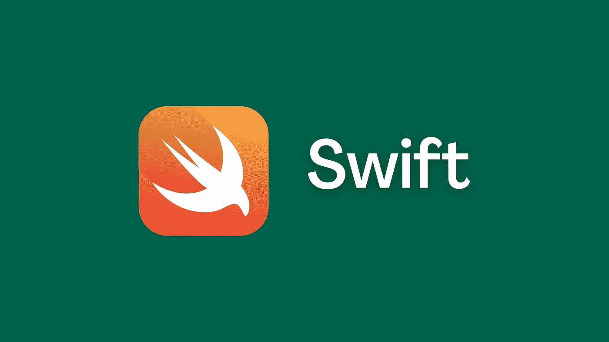
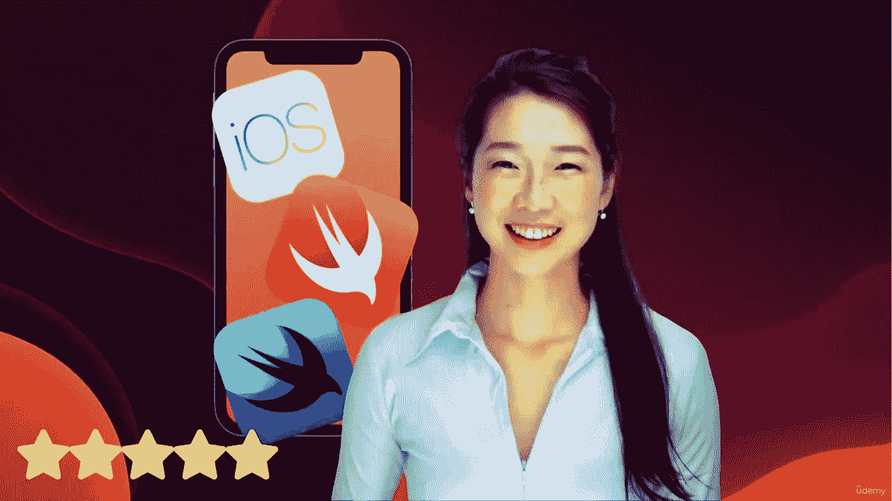

# 10 个最佳 Swift 初学者教程—在线学习 Swift

> 原文：<https://medium.com/quick-code/10-best-swift-tutorials-for-beginners-learn-swift-online-2f3c701b3067?source=collection_archive---------5----------------------->

## 学习 Swift 成为高级移动开发者，为初学者提供最好的 Swift 教程

Best Swift Courses

Swift 是一种兼容 macOS 和 iOS 的编程语言。苹果公司声称 Swift 比 Objective-C 更快、更稳定、更容易维护。因此，有许多理由学习或提高您的 Swift 编程技能。因此，我创建了这个由行业专家设计的学习 Swift 编程语言的最佳 Swift 课程列表。

此外，如果你完全是应用程序开发的新手，你可以在 2023 年浏览这本完整的《Swift 编程初学者指南》。

## 1.[iOS&Swift——完整的 iOS 应用开发训练营](https://click.linksynergy.com/deeplink?id=0F1O0otUXQc&mid=47901&u1=csMedium&murl=https%3A%2F%2Fwww.udemy.com%2Fcourse%2Fios-13-app-development-bootcamp%2F)——【Udemy】

iOS and Swift App Development Bootcamp

无论你是初学者还是有经验的程序员，这个完整的应用程序开发训练营将教你如何使用 Swift 5.1 编码和创建 iOS 13 应用程序。该课程通过有趣的视频教程一步一步地教你开发 iOS 应用程序所需的一切。

在本课程中，您将:

*   创建一个由 15 个应用组成的组合，申请一家科技公司的初级开发人员职位。
*   学习 Xcode，UIKit 和 SwiftUI，ARKit，CoreML，CoreData。
*   边做边学，每一课都融入到现实世界的应用项目中。
*   开始你自己的基于应用的生意。
*   作为一名自由的 iOS 开发者，成为一名数字流浪者。
*   使用苹果新的 ARKit 创建增强现实应用的大师。
*   使用苹果新的 CoreML 创建使用机器学习的应用程序。
*   掌握应用程序设计，这样你就知道如何线框化、模型化和原型化你的应用程序想法。

在本课程中，您将学习如何制作适用于 iOS、iPad 和 macOS 的应用程序，制作增强现实应用程序的 ARKit，以及使用机器学习制作智能应用程序的 CoreML & CreateML。创建像 Pokemon Go 和哈利波特的魔法报纸这样的 3D 增强现实应用程序。

是 Udemy 上学习 iOS app 开发最好的 Swift 课程之一，课程评分 4.8 分满分 5.0 分，时长 60 小时 25 分钟。

## 2.[Swift 的编程基础](https://coursera.pxf.io/c/1137078/1213622/14726?u=https%3A%2F%2Fwww.coursera.org%2Flearn%2Fprogramming-fundamentals-swift&subId1=csMedium)——【Coursera】

想要学习 Swift 编程基本原理的初学者应该学习这门课程。此外，在探索编程和数据结构的基本概念时，您将发现是什么使 Swift 如此多样化。

在本课程中，您将学习:

*   一般编程原则。
*   使用常量、变量、数据类型和数据结构。
*   使用函数和闭包。

通过动手实践，你将在现实生活中应用这些概念。因此，您将扩展您的常量和变量知识，探索如何在多种数据类型中有效地使用它们。此外，您将探索使用元组、数组和字典来排序和存储信息。最后，您将了解函数和闭包如何帮助您重用代码并使其更具表现力。

这是 Coursera 上排名最高的 Swift 课程，在 5 门课程中获得 4.7 分，持续时间为 23 小时。旁听这门课程是免费的，但是你需要为额外的好处付费。

## 3.[打造你的第一款 iOS 应用](https://www.awin1.com/cread.php?awinmid=6798&awinaffid=466009&clickref=csMedium&ued=https%3A%2F%2Fwww.edx.org%2Fcourse%2Fbuild-your-very-first-ios-app%3F)—【edX】

本课程将帮助您了解如何开始应用程序开发。它将教你构建第一个 iOS 应用程序所需的工具、技术和概念。在本课程中，您将学习如何使用苹果开发者工具和 Swift 编程语言构建应用程序。

在本课程中，您将:

*   理解并使用 Swift 编程语言；
*   使用并解释苹果开发者工具:包括 Xcode、界面生成器和文档浏览器。
*   自信地与 iOS 开发人员交流，了解编码和应用程序开发的基础知识。
*   设计、开发和构建您自己的简单 iOS 应用程序。

这是 edX 上的顶级 Swift 课程，为期 8 周。旁听这门课程是免费的，但是你需要为额外的好处付费。

## 4. [Swift 5 基础培训](https://linkedin-learning.pxf.io/c/1137078/646189/8005?u=https%3A%2F%2Fwww.linkedin.com%2Flearning%2Fswift-5-essential-training&subId1=csMedium)——【领英学习】

Swift 编程语言是苹果系统的标准语言，涵盖 iOS、macOS、watchOS 和 tvOS。对于新的和有经验的程序员来说，它特别有表现力、快速、安全和有趣。该课程为您提供 Swift 5 的实践经验，并为您开发应用和游戏做好准备。

本课程包括:

*   入门指南
*   了解您的数据
*   使用集合
*   应用控制流程
*   函数的广阔世界
*   类、结构等等
*   使用枚举、协议和错误进行升级

它概述了 Swift 的发展，然后带您了解每个组件。除了涵盖常见数据类型、条件逻辑、方法、函数、类和结构之外，它还解释了精通 Swift 需要了解的内容。

是 Linkedin 上学习 app 开发最好的 Swift 课程之一，课程评分 4.7 分满分 5.0 分，时长 4 小时。

## 5.[用于移动应用开发的 Swift 编程](https://www.educative.io/courses/swift-programming-mobile-app?affiliate_id=5088579051061248) —【教育性】

本课程涵盖基本数据类型、常量和变量、数组、字典、面向对象编程、逻辑和控制流、文件管理和错误处理。

在本课程中，您将:

*   成为一名熟练的 Swift 程序员。
*   了解 Swift 编程语言的起源。
*   学习在 Swift 中编写代码的基础知识。
*   获得编写结构良好的面向对象代码的经验。

本课程结束时，您将对 Swift 编程有一个坚实的理解，并准备好学习 SwiftUI，另一种基于 Apple 的应用程序开发技术。

这是一门关于教育的顶级 Swift 移动应用程序开发课程，时长 6 小时。此外，完成本课程后，您将获得一份证书。

## 6.[Swift ui master class 2023——iOS 应用开发&Swift](https://click.linksynergy.com/deeplink?id=0F1O0otUXQc&mid=47901&u1=csMedium&murl=https%3A%2F%2Fwww.udemy.com%2Fcourse%2Fswiftui-masterclass-course-ios-development-with-swift%2F)——【Udemy】

本课程将帮助您熟悉 SwiftUI，并学习如何构建一流的 iOS、Apple Watch 和 macOS 应用程序。在本课程中，您将在这个完整的 iOS 应用程序开发课程中学习如何使用苹果的 SwiftUI 用户界面框架开发高级 iOS 应用程序。

在本课程中，您将:

*   学习使用苹果新的 Combine 框架和处理异步事件。
*   基本的移动应用程序设计和原型制作技能。
*   了解如何在工作中实施 Swift Package manager。
*   掌握苹果最伟大最新的用户界面框架——swift ui。
*   了解如何将核心数据与 CloudKit 集成。
*   开发具有华丽布局和设计的 iOS iPhone 和 iPad 应用程序。
*   了解如何将 iOS 和 macOS 应用程序发布到 App Store。
*   创建一流的真实应用组合，申请 iOS 开发人员职位。

在本课程中，学生将通过基于项目的方法学习编程概念。参加本课程将提高您的应用程序设计和开发技能，同时允许您创建几个实际应用程序。

是 Udemy 上学习 iOS App 开发最好的 Swift 课程之一，课程评分 4.5 分满分 5.0 分，时长 30 小时 47 分钟。

## 7.[iOS 移动应用开发简介](https://coursera.pxf.io/c/1137078/1213622/14726?u=https%3A%2F%2Fwww.coursera.org%2Flearn%2Fintroduction-to-ios-mobile-application-development&subId1=csMedium)——【Coursera】

在本课程中，您将通过探索操作系统和开发平台，了解有关 iOS 开发的更多信息。学习如何创建和准备本地环境。此外，您将熟悉 Swift playground 并编写 Swift 代码。

在本课程中，您将学习:

*   iOS 移动应用程序开发
*   UI 开发
*   项目开发
*   Swift 语法

此外，您将学习 Swift 应用和软件、iOS 软件和开发环境、移动操作系统、XCode、Objective-C、UI 框架、Testflight、UI storyboard、MVC 和 API 等工具。

这是 Coursera 上排名最高的 Swift 课程，在 5 门课程中获得 4.8 分，持续时间为 12 小时。旁听这门课程是免费的，但是你需要为额外的好处付费。

## 8. [Swift 代码挑战](https://linkedin-learning.pxf.io/c/1137078/646189/8005?u=https%3A%2F%2Fwww.linkedin.com%2Flearning%2Fswift-code-challenges&subId1=csMedium)——【Linkedin Learning】

您是一名对评估自己技能感兴趣的 Swift 开发人员吗？本课程将通过 12 项挑战帮助您学习 Swift 代码挑战的基础知识，从基本技能测试开始，逐步过渡到更复杂的测试。本课程包含实践练习，将帮助您提高编码技能。

是 Linkedin 上最好的 Swift 课程之一，课程评分 4.9 分(满分 5.0)，时长 56 分钟。

## 9.[迅速深入](https://pluralsight.pxf.io/c/1137078/424552/7490?u=https%3A%2F%2Fwww.pluralsight.com%2Fcourses%2Fswift-in-depth&subId1=csMedium)——【多见】

该课程以相当大的技术深度介绍了苹果的 Swift 编程语言，侧重于该语言中不熟悉或新的部分。与 Objective-C 相比，Swift 是苹果的首选编程语言。对于苹果平台用户来说，学习它是必须的。

本课程包括:

*   方法、前提条件和资源
*   运算符、类型和集合
*   结构、类、元组和枚举
*   控制流、模式和错误处理
*   函数和闭包
*   类第 1 部分:子类化、属性和初始化器
*   类第 2 部分:访问、强制转换、Any、泛型和扩展
*   内存管理
*   协议
*   定制 Swift:案例研究方法

在职程序员在学习这门课程之前应该有 OO 语言的经验。尽管名字如此，这些都是语言课程，而不是 iOS 或 OSX 编程课程，所以你不需要了解苹果生态系统的任何东西。

这是一个中级 Swift 课程，在 Pluralsight 上，持续时间为 5 个小时。

## 10.[解码 Swift 中的编码采访:真实世界的例子](https://www.educative.io/courses/decode-the-coding-interview-swift?affiliate_id=5088579051061248)——【教育性】

要想成功，仅仅在编码面试中解决问题是不够的。学习如何分解一个新问题并部署正确的工具是开发解决方案的最佳方式。

*   通过解决现实世界中的问题，获得准备编码面试的实践机会。
*   通过解决 FAANG 等公司常见的编码问题来准备面试。
*   对常见的编码面试问题进行深入分析。
*   学会将现实世界的问题映射到实际的面试问题。

本课程通过解决现实世界中的问题来为编码面试做准备。当你解决现实世界的问题时，你不仅会有更多的准备乐趣(比如在 Zoom call 中给与会者分页)，而且你会更好地记住你所学到的东西。当你完成每个项目时，我们将向你展示如何将你刚刚学到的技巧应用到新的面试问题中，这样你的知识才能适应新的面试问题。

这是一门顶级的 Swift 教育课程，持续时间为 16 小时。此外，完成本课程后，您将获得一份证书。

> 感谢您阅读本文。我们策划了更多主题的顶级教程，您可能想看看:

 [## 7 门免费在线颤振课程，学习 App 开发

### 这是我从 Udemy，Educative，Alison 等顶级平台为初学者提供的免费课程列表。

medium.com](/quick-code/7-free-online-flutter-courses-to-learn-app-development-a7cf7e6b7ca4)  [## 5 个免费 Dart 编程课程，供初学者学习 Dart

### 通过 Udemy、Educative、YouTube 等顶级平台的 Dart 编程课程学习 Dart。

medium.com](/quick-code/5-free-dart-programming-courses-for-beginners-to-learn-dart-d4d49c7f7a93)  [## 学习围棋编程的 10 个最佳 Golang 教程

### 各位开发者好！您对最佳 Golang 球场的搜索到此结束。下面的文章将向你展示一些…

medium.com](/quick-code/10-best-golang-tutorials-to-learn-go-programming-46fbd4b81d2c) 

***披露:*** *如果您通过本页面的链接购买课程，我们可能会获得一小笔附属佣金。谢谢你。*