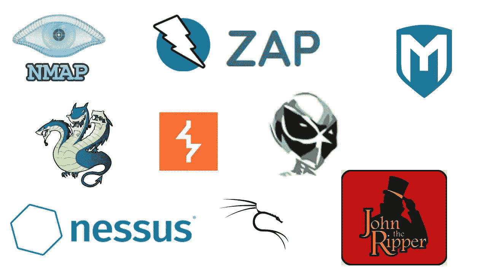
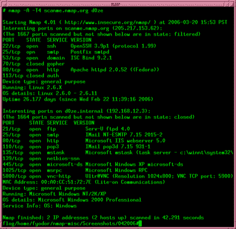
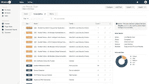
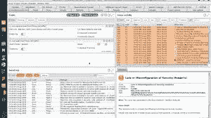
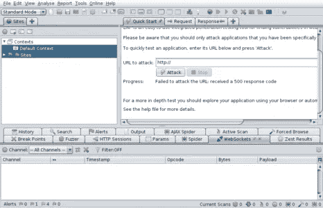
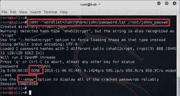
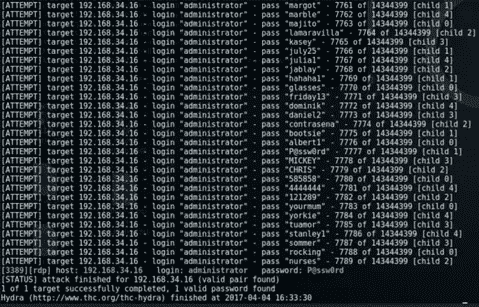
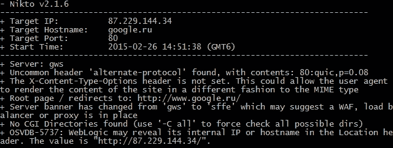

# 可以渗透到你的网络中的 10 个经典工具

> 原文：<https://medium.com/version-1/10-classic-tools-that-can-penetrate-your-network-eb6382362b70?source=collection_archive---------2----------------------->

渗透测试是保护您的技术资产的关键部分。它们模拟恶意行为者在试图访问您的系统时会执行的操作。这种测试可以识别需要采取行动来防止攻击的漏洞。测试应该经常进行，并且在您的网络或应用程序发生重大变化后进行。这篇文章将讨论一些经典的工具，可以用来渗透你的网络。

Photo by [Philipp Katzenberger](https://unsplash.com/@fantasyflip?utm_source=medium&utm_medium=referral) on [Unsplash](https://unsplash.com?utm_source=medium&utm_medium=referral)

> 当对网络或应用程序执行任何形式的渗透或漏洞测试时，必须获得应用程序和网络所有者的批准，以及应用程序或网络所在的任何云提供商的批准。

# 1.Nmap

Nmap (网络映射器)是一款流行的网络映射工具，能够扫描网络。向 Nmap 提供 IP 地址或 IP 范围后，Nmap 可以扫描网络、服务和端口。扫描的输出可以返回

*   指定 IP 范围内的主机详细信息
*   在端口上运行的服务
*   打开、关闭或正在过滤的端口
*   操作系统版本

# 2.Metasploit

[Metasploit](https://www.metasploit.com/) 是 Rapid7 维护的一个框架，可以用来扫描漏洞。它包含一个大型数据库，其中包含可以利用系统的工具。一旦掌握了目标的详细信息，就可以使用 Metaspolit 来访问它并执行权限提升或为将来的访问创建后门等活动。

# 3.Kali Linux

[Kali Linux](https://www.kali.org/) 是一个免费的开源 Linux 发行版，预配置了 600 多种渗透测试工具，包括本文中列出的许多工具。这些工具可以在任何 Linux 发行版上配置，但是 Kali 提供了安装和预配置的便利性。

# 4.涅索斯

Nessus 是一个漏洞评估工具，它有一个基于网络的图形化界面。Nessus 中可以集成大量包含最新漏洞信息的插件。Nessus 可以在完成漏洞扫描后生成有用的报告。

# 5.打嗝组曲

PortSwigger 的 [Burp 套件](https://portswigger.net/burp)用于应用安全测试。它可用于测试解决方案端点。Burp Suite 可以执行多种类型的测试，并可用于代理发送到端点的流量。它可用于拦截和操作应用程序请求。这允许您查看请求的内容，或者对其进行更改以生成通常不可用的响应。

# 6.活力

OWASP 的 [ZAP](https://www.zaproxy.org/) (Zed 攻击代理)是一款 web 应用安全工具。它类似于 Burp Suite，因为它可以用作代理来捕获和修改发送到 web 应用程序的流量。有一个 ZAP 市场，贡献者可以在上面分享插件。

# 7.开膛手约翰

Openwall 的[开膛手约翰](https://www.openwall.com/john/)是一个密码破解工具。它可用于通过使用以下任一方法发现或恢复密码

*   **字典攻击—** 使用一列预定义的单词或密码列表
*   **彩虹表—** 使用预定义的密码哈希列表
*   **蛮力—** 能够通过一次改变几个字符来迭代和尝试密码

# 8.水螅

[Hydra](https://github.com/vanhauser-thc/thc-hydra) 是另一个类似开膛手约翰的登录破解工具。它的一些特性包括支持多种协议的使用。它是“并行的”,这意味着它能够同时执行多个不同的登录尝试。

# 9.尼克托

[Nikto](https://cirt.net/Nikto2) 是另一个 web 应用程序扫描工具，可以扫描 web 服务器的漏洞和过时的软件。它针对一个目标 web 应用程序执行了超过 6000 次测试。

# 10.社会工程

可以说，工具箱中最有用的工具是通过社会工程收集信息。社会工程是一种欺骗人们泄露机密信息的行为，这种行为会导致系统受损。有许多社会工程技术，例如:

*   **网络钓鱼** —发送给人们的电子邮件包含下载恶意软件或收集信息的链接
*   **社交媒体** —从一个人的社交媒体足迹中收集信息
*   **伪装**——伪装成同事或客户，以获取信任并获取信息

[**社交工程师工具包**](https://www.trustedsec.com/tools/the-social-engineer-toolkit-set/)**【SET】**是一个开源工具包，可以通过设置钓鱼攻击、设置虚假电话号码等方式帮助社交工程师进行尝试。

有数千种这样的工具可以用来帮助测试网络和应用程序的漏洞。上面列出的大多数工具都可以在互联网上免费获得。任何对渗透测试或网络安全感兴趣的人都可以下载并试验这些工具，以获得更深入的理解。在试验这些工具时，获得授权是很重要的。建议在像 [VulnHub](https://www.vulnhub.com/) 或 [Hack The Box](https://www.hackthebox.eu/) 这样的网站上试试你的技能，这些网站提供完全隔离的环境，可以安全地进行测试。

**关于作者**

*Sat Gainda 是* [***版本 1***](https://www.version1.com/) ***，*** *的云解决方案架构师，致力于利用创新云系统的企业级项目。敬请关注中版 1，了解更多来自 Sat 的* [*云贴子*](https://www.version1.com/introduction-to-serverless/) *。*