# 10 个常见的机器学习错误以及如何避免它们

> 原文：<https://medium.com/capital-one-tech/10-common-machine-learning-mistakes-and-how-to-avoid-them-720a5aeb81be?source=collection_archive---------3----------------------->

## 数据、建模和过程问题可能会阻碍你的机器学习努力——但它们不必如此

我在机器学习领域工作了几十年，参与的项目从摩根士丹利的[算法交易](http://www.langreiter.com/space/Erik+T.+Mueller)，到 IBM 的[沃森](https://doi.org/10.1016/j.artint.2012.06.009)，后者赢得了人工智能促进协会的[费根鲍姆奖](https://aaai.org/Awards/feigenbaum.php)，到 Capital One 的 [Eno](https://www.capitalone.com/applications/eno/) ，它是我们的自然语言助手，可以回答你的问题，全天候为你和你的钱提供帮助。在做这些和其他项目的时候，我观察到了一些常见的陷阱。为了帮助你在你的机器学习项目中取得成功，我认为讨论这些机器学习陷阱以及如何避免它们是很好的。我将讨论机器学习中经常犯的十个错误，根据手头问题的类型大致分为三个部分:

*   **数据问题** #1 —不查看数据
    #2 —不查找数据泄漏
*   **建模问题** #3 —开发测试集
    #4 —不查看模型
    #5 —不与简单的基线模型进行比较
*   **流程问题** #6 —未鉴定用例
    #7 —不了解用户
    #8 —为了技术而开发技术
    #9 —未使用现有解决方案
    #10 —未执行故障分析

先说数据问题。

# 机器学习中的数据问题

数据问题很重要，因为机器学习模型是经过训练、测试并应用于数据的。机器学习中涉及数据的问题主要有两个:不看数据和*不找数据泄露。*

## 常见的机器学习错误#1:不看数据

如果你不仔细看数据，你可能会错过有用的见解。[英国统计学家弗朗西斯·安斯科姆](https://en.wikipedia.org/wiki/Frank_Anscombe)因[安斯科姆的四重奏](https://en.wikipedia.org/wiki/Anscombe%27s_quartet)而闻名，这是四个数据集的例子，它们具有几乎相同的描述性统计数据——均值、方差、相关性、回归线、R 平方——但具有非常不同的分布，并且在绘制时表现非常不同。

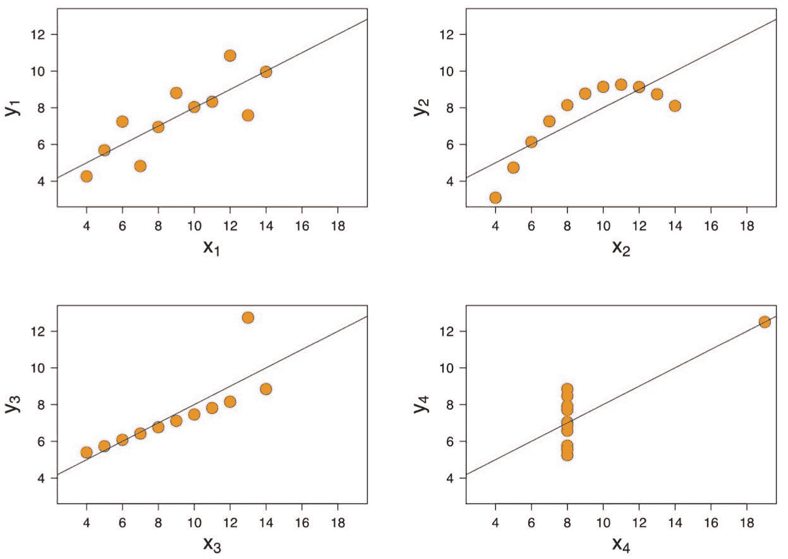

*Example of Anscombe’s quartet. Source:* [*https://en.wikipedia.org/wiki/Anscombe%27s_quartet*](https://en.wikipedia.org/wiki/Anscombe%27s_quartet)

如果您以不恰当的方式选择数据，也很容易欺骗自己。例如，如果您选择因变量的值，您可能会得到自变量和因变量之间真实关系的误导估计。

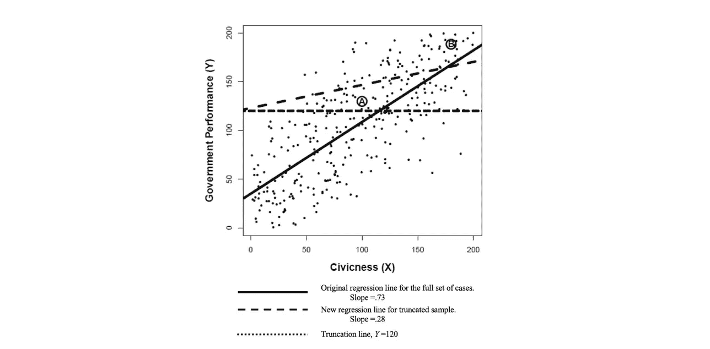

*Source:* [*https://rowman.com/WebDocs/Chapters1-4.pdf*](https://rowman.com/WebDocs/Chapters1-4.pdf)

在上面由 David Collier、James Mahoney 和 Jason Seawright 撰写的“[claim over:Warnings about Selection Bias](https://rowman.com/WebDocs/Chapters1-4.pdf)”案例的(模拟)数据集中，您可以看到，仅使用政府表现良好的案例(因变量 Y 大于 120 的案例)执行线性回归，与使用所有案例执行线性回归相比，会产生明显不同的回归线。

一个特别恼人的问题是，注释工件有时会混入数据中。这发生在计算语言学的[自然语言推理(NLI)](https://nlp.stanford.edu/projects/snli/) 挑战中，也称为[识别文本蕴涵(RTE)](https://aclweb.org/aclwiki/Textual_Entailment_Resource_Pool) 。2004 年启动的 NLI 任务包括将前提和假设作为输入，产生蕴涵、中性或矛盾作为输出。许多年后，在 2018 年，华盛顿大学/卡耐基梅隆大学/艾伦人工智能研究所/纽约大学的研究人员注意到，NLI 数据集包含一些工件，这些工件允许通过只查看假设而不是前提来执行 NLI 任务。

NLI 任务的数据是通过从一个前提开始，然后让人类大众构建被分类为蕴涵、中立和矛盾的假设而生成的。例如，给定前提*“一个卖竹签的女人在装卸码头上与两个男人谈话，*”假设*“在装卸码头上至少有三个人*”被构造为被分类为蕴涵。

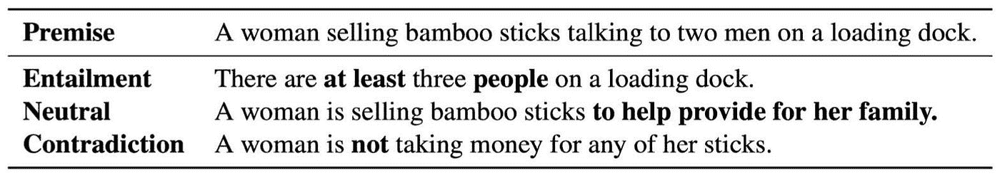

*Annotation Artifacts in Natural Language Inference Data. Source:* [*https://arxiv.org/abs/1803.02324*](https://arxiv.org/abs/1803.02324)

不幸的是，某些词和短语——用粗体显示的那些——是该假说属于某一类的警示标志。假设中的“不”字，原来是一个线索，正确的类是矛盾，与前提无关。下表显示，仅通过查看假设就可以获得明显优于基线的性能，而无需访问任何前提。

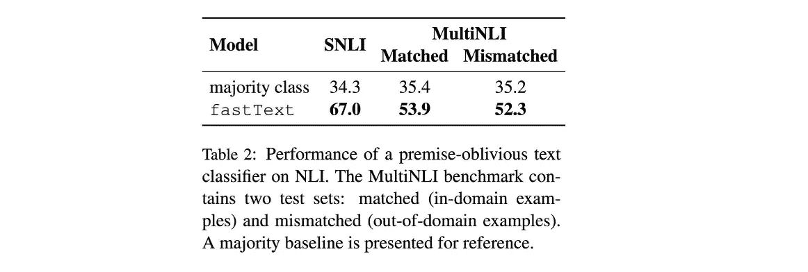

*Annotation Artifacts in Natural Language Inference Data. Source:* [*https://arxiv.org/abs/1803.02324*](https://arxiv.org/abs/1803.02324)

**解答—如何查看数据**

*   使用[探索性数据分析(EDA)技术](http://www.stat.cmu.edu/~hseltman/309/Book/chapter4.pdf)，包括非图形技术(如均值、方差、最小值、最大值和相关矩阵)和图形技术(如散点图、直方图、热图和降维)。
*   仔细查找数据错误、缺失数据、值始终相同的字段、重复实例、不平衡数据、采样偏差、因变量选择以及容易作弊的数据。
*   验证字段包含您期望它们包含的数据。检查数据是否代表模型将在生产中看到的数据。对于分类问题，确保每个分割中的每个类都有足够的实例。
*   与数据创建者和所有者交谈，以更好地理解数据。带上一份关于数据的问题清单。

## 常见的机器学习错误#2:不寻找数据泄漏

[当训练数据集包含预测时不可用的信息或线索时，就会发生数据泄漏](https://en.wikipedia.org/wiki/Leakage_(machine_learning))。在下方的 [Kaggle 竞赛条目中可以看到一个数据泄漏的例子，在发现并消除三种类型的泄漏后，曲线下面积(AUC)从 0.9973 变为 0.59(AUC 越高越好)。](https://www.kaggle.com/c/the-icml-2013-whale-challenge-right-whale-redux/discussion/4865)

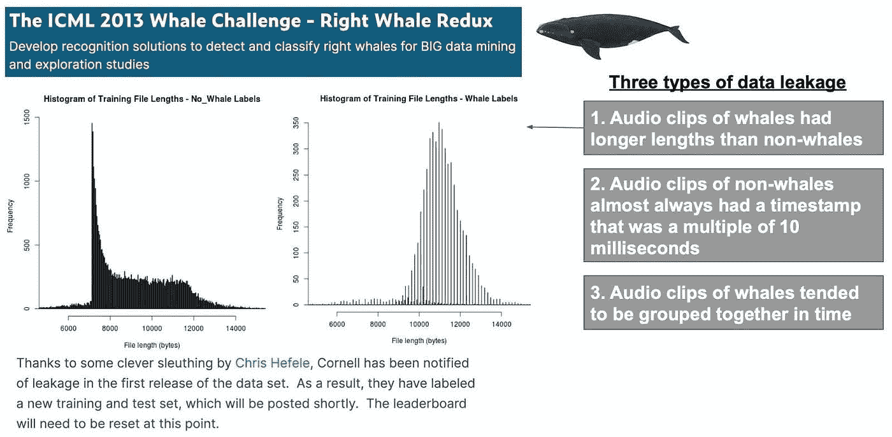

The ICML 2013 Whale Challenge — Right Whale Redux. *Source:* [*https://www.kaggle.com/c/the-icml-2013-whale-challenge-right-whale-redux/discussion/4865*](https://www.kaggle.com/c/the-icml-2013-whale-challenge-right-whale-redux/discussion/4865)

**解决方案—如何避免数据泄露**

*   在我看来，作为一般的经验法则，如果您的结果非常好——比方说各种指标都超过 90%左右——您可能要怀疑数据泄漏。
*   在最开始的时候，将你的数据分成你在项目中需要的集合:训练、验证、开发、测试、隐藏、折叠等等。在做探索性数据分析之前先拆分你的数据，在数据准备之前先拆分，包括值的归一化、缺失值的插补、剔除异常值、降维、特征选择。留出几个盲数据集用于最终评估。一旦使用盲数据集，它就不再是盲的了。
*   使用 [*k-* 折叠交叉验证](https://en.wikipedia.org/wiki/Cross-validation_(statistics)#k-fold_cross-validation)时，在每个折叠内分别进行数据准备。
*   查看特征重要性的度量，以识别可能泄漏的特征，例如特征与因变量的相关性(信息量)、回归特征权重、R 平方和[置换特征重要性](https://www.stat.berkeley.edu/~breiman/randomforest2001.pdf)(改变特征值后性能下降)。
*   查找数据中的重复项，并查找出现在多个拆分中的相同实例。
*   仔细查看每个数据元素的属性。
*   确定数据元素变得可用的顺序。仅使用过去的信息进行预测。避免前瞻。不要使用未来的信息。
*   从独立变量集中移除泄漏特征。与数据提供商合作，改进数据文档并减少数据泄漏。

# 机器学习中的建模问题

使用数据选择和训练模型是机器学习的核心。在机器学习中建模有三个主要问题:开发测试集，不看你的模型，不将你的模型与简单的基线模型进行比较。

## 常见的机器学习错误#3:开发测试集

如果你试图提高单个测试集(ka ggle“Public”)的性能，你可能会欺骗自己，认为你的结果比在新的盲集(ka ggle“Private”)上的结果更好。在下面两张来自[过度拟合的危险:a ka ggle postmody](http://gregpark.io/blog/Kaggle-Psychopathy-Postmortem/)的图表中，你可以看到多次提交的竞争对手能够在公共排行榜上获得较低的排名(更好的表现)。但是，在对新的盲数据进行评估后，这些竞争者在私人排行榜上获得了更高的排名(更低的表现)。提交次数适中(约 10 次)的参赛者能够在私人排行榜上获得最低排名。

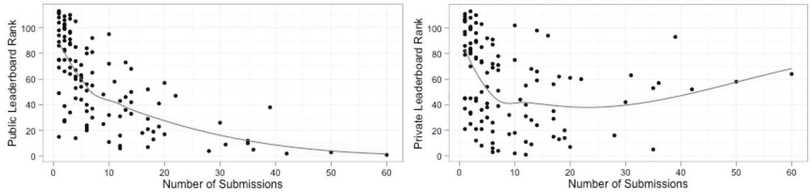

The dangers of overfitting: a Kaggle postmortem Source: [http://gregpark.io/blog/Kaggle-Psychopathy-Postmortem/](http://gregpark.io/blog/Kaggle-Psychopathy-Postmortem/)

请记住，您在测试集(ka ggle“Public”)上的结果可能与在盲集(ka ggle“Private”)上的结果有很大不同，如下例所示。

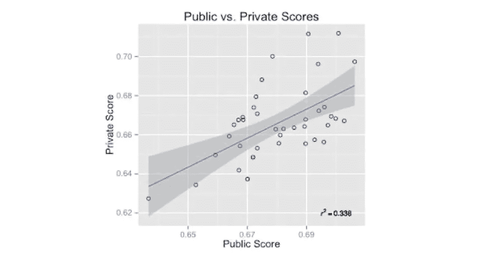

[Five Lessons from Kaggle’s Event Recommendation Engine Challenge](http://www.rouli.net/2013/02/five-lessons-from-kaggles-event.html). *Source:* [*http://www.rouli.net/2013/02/five-lessons-from-kaggles-event.html*](http://www.rouli.net/2013/02/five-lessons-from-kaggles-event.html)

**解决方案—如何避免开发到测试集**

*   确保你有足够的数据。一开始就留出多个测试集。在开始时留出几个盲集用于最终评估。
*   避免过多地使用测试集。每次你在测试集上查看你的结果，你获得的关于它的知识可能会泄露到模型中。
*   定期推出新的测试集。重复使用测试集太多次会导致过度拟合。
*   认识到测试集的结果是初步的。它们可能不会反映生产中会发生什么。
*   使用最新的[超参数优化方法](https://en.wikipedia.org/wiki/Hyperparameter_optimization)。
*   对于真正的测试，在生产中测试！使用 [A/B 测试](https://en.wikipedia.org/wiki/A/B_testing)或相关方法。

## 常见的机器学习错误#4:不看模型

你知道你的模特在做什么吗？如果你不看它，你可能不会。

[注意力热图](https://arxiv.org/abs/1509.06664)和其他[神经网络可视化技术](https://arxiv.org/abs/1311.2901)帮助你理解模型表现。在下面的例子中，模型(b)表现得更好，因为它比模型(a)更好地关注了评论的重要部分。

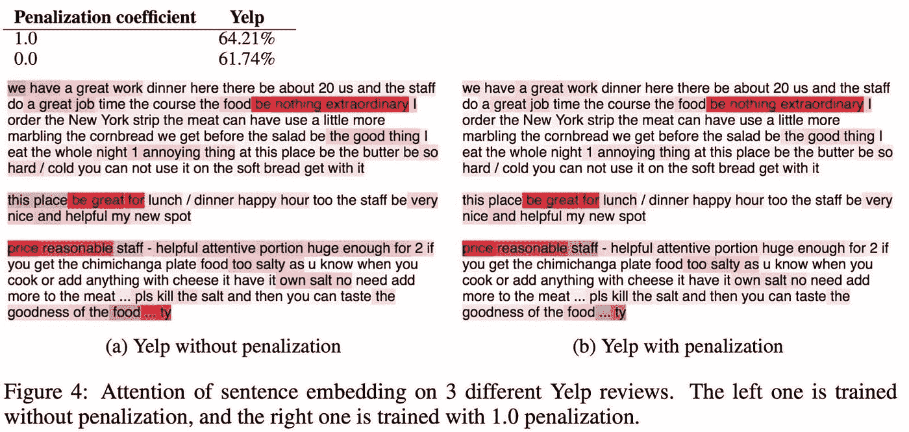

A Structured Self-attentive Sentence Embedding *Source:* [*https://arxiv.org/abs/1703.03130*](https://arxiv.org/abs/1703.03130)

**解决方案——如何看待你的模型**

*   考虑使用可视化技术，如热图、高亮显示、聚类、[t-分布式随机邻居嵌入(t-SNE)](https://distill.pub/2016/misread-tsne/) 、[均匀流形近似和投影(UMAP)](https://arxiv.org/abs/1802.03426) 以及[嵌入投影器](https://projector.tensorflow.org/)。
*   对于回归模型，看权重。
*   对于决策树，看分裂。
*   对于神经网络，使用神经网络可视化技术，如[激活图谱](https://distill.pub/2019/activation-atlas/)、[特征可视化](https://distill.pub/2017/feature-visualization/)和[大旅游](https://distill.pub/2020/grand-tour/)。
*   使用[可解释的人工智能](https://www.darpa.mil/attachments/XAIProgramUpdate.pdf)工具。例如，其暗度对应于注意力权重的线可以帮助您理解变压器模型。在这里，我们可以看到 BERT 正确地将动词与它们的直接宾语联系起来:

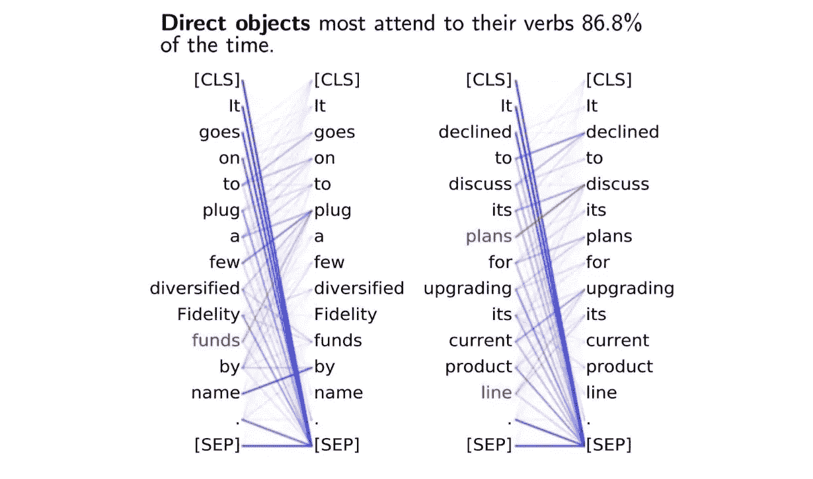

*Emergent linguistic structure in artificial neural networks trained by self-supervision Source:* [*https://doi.org/10.1073/pnas.1907367117*](https://doi.org/10.1073/pnas.1907367117)

*   执行故障分析。看看模型失败的案例。
*   交互式运行模型。尝试新的输入并观察输出。尝试不寻常的输入。尝试打破模式。
*   使用各种度量标准评估您的模型。查看数据子集的指标(例如，在意图级别)。
*   调查为什么某些功能有帮助或没有帮助。这可能会让你发现更多的问题。

## 常见的机器学习错误#5:不与简单的基线模型进行比较

想要从复杂的模型开始是很自然的。但有时单个神经元([也称为逻辑回归](https://www.nature.com/articles/s41586-019-1582-8))的表现与具有六个隐藏层的深度神经网络一样好。下图来自[神经网络在地震预测中的应用(1994–2019):对其局限性的元分析洞察](https://arxiv.org/abs/1910.01178)，我们看到四个神经网络用于预测地震余震位置。具有六个隐藏层的网络(DeVries 18 DNN)的性能与较小的网络(简化的 DNN、ANN 和逻辑回归)相匹配。

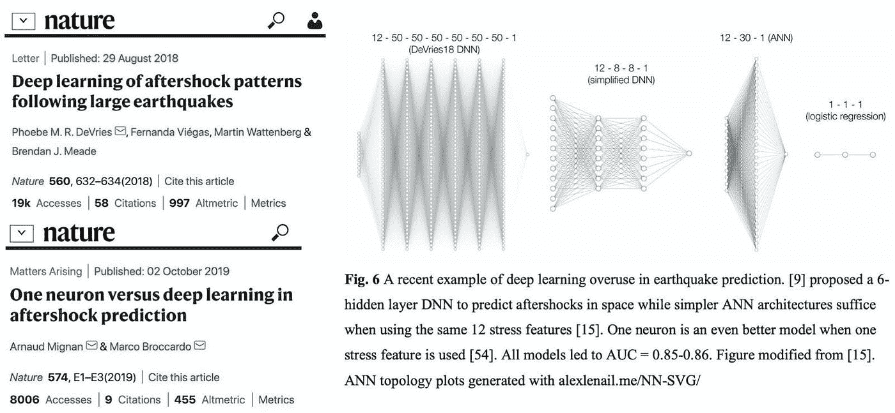

*Deep learning of aftershock patterns following large earthquakes. Sources:* [*https://www.nature.com/articles/s41586-018-0438-y*](https://www.nature.com/articles/s41586-018-0438-y)[*https://www.nature.com/articles/s41586-019-1582-8*](https://www.nature.com/articles/s41586-019-1582-8) *and* [*https://arxiv.org/abs/1910.01178*](https://arxiv.org/abs/1910.01178)

**解决方案—如何与简单的基线模型进行比较**

*   不要从复杂的模型开始。首先尝试一个简单的基线模型。对于分类问题，计算多数类基线。然后尝试更复杂的模型。
*   执行消融研究，以确定您的架构的每个部分的贡献，以及架构的哪些部分是实际需要的。

# 机器学习中的过程问题

最后，有几个问题不太技术性，但与您遵循的流程更相关。有五个过程问题:没有验证用例，没有理解用户，为了技术而开发技术，没有使用现有的解决方案，没有执行失败分析。

## 常见的机器学习错误#6:没有限定用例

在开始一个机器学习项目之前，确定该项目是否值得做并考虑其后果是很重要的。

在这个 2014 年的例子中，一个用于收集和分析学生表现数据的 1 亿美元[项目被关闭](https://blogs.edweek.org/edweek/DigitalEducation/2014/04/inbloom_to_shut_down_amid_growing_data_privacy_concerns.html)。该项目旨在帮助教育工作者改善学生的学习。不幸的是，由于公众担心潜在的数据滥用，它被关闭了。

*inBloom to Shut Down Amid Growing Data-Privacy Concerns Source:* [*https://bits.blogs.nytimes.com/2014/04/21/inbloom-student-data-repository-to-close/*](https://bits.blogs.nytimes.com/2014/04/21/inbloom-student-data-repository-to-close/)[*https://www.edweek.org/technology/inbloom-to-shut-down-amid-growing-data-privacy-concerns/2014/04*](https://www.edweek.org/technology/inbloom-to-shut-down-amid-growing-data-privacy-concerns/2014/04)

**解决方案—如何鉴定机器学习用例**

在一个项目的开始，确保你通过解决一些问题来限定用例。

*   有什么问题？问题定义清楚了吗？
*   问题出现的频率如何？
*   建议的解决方案是什么？为什么有望成功？
*   之前针对该问题做了哪些工作？
*   是否有明确的成功标准？能否自动评估成功指标，还是需要人工注释？
*   您是否有任何初步的结果，例如来自概念验证(POC)模型的结果？他们看起来怎么样？
*   是否有必要的数据？您通常需要历史数据来训练模型，需要实时数据来运行生产中的模型。
*   获取和/或创建数据的成本是多少？
*   项目的风险是什么？考虑数据隐私、偏见和公平、透明度和用户接受度等问题。
*   这个项目的经济效益如何？
*   项目的前期和维护成本是多少？
*   最小可行产品(MVP)是什么？
*   想象一下它是有效的。然后呢？

## 常见的机器学习错误#7:不理解用户

你的用户(客户和/或企业)真正需要什么？

这里有一个系统的例子，它并不像用户最初希望的那样成功。在[于 20 世纪 90 年代末](https://www.ncbi.nlm.nih.gov/pmc/articles/PMC2232183/pdf/procamiasymp00005-0181.pdf)、[部署药物相互作用警报系统后，只有 44%的退伍军人事务处方医生对其准确性感到满意](https://www.ncbi.nlm.nih.gov/pmc/articles/PMC2215077/)。13%的人甚至称这些警告*“浪费时间”*另一方面，警报系统有助于检测和预防重大问题，无论这些问题是否让用户感到烦恼。

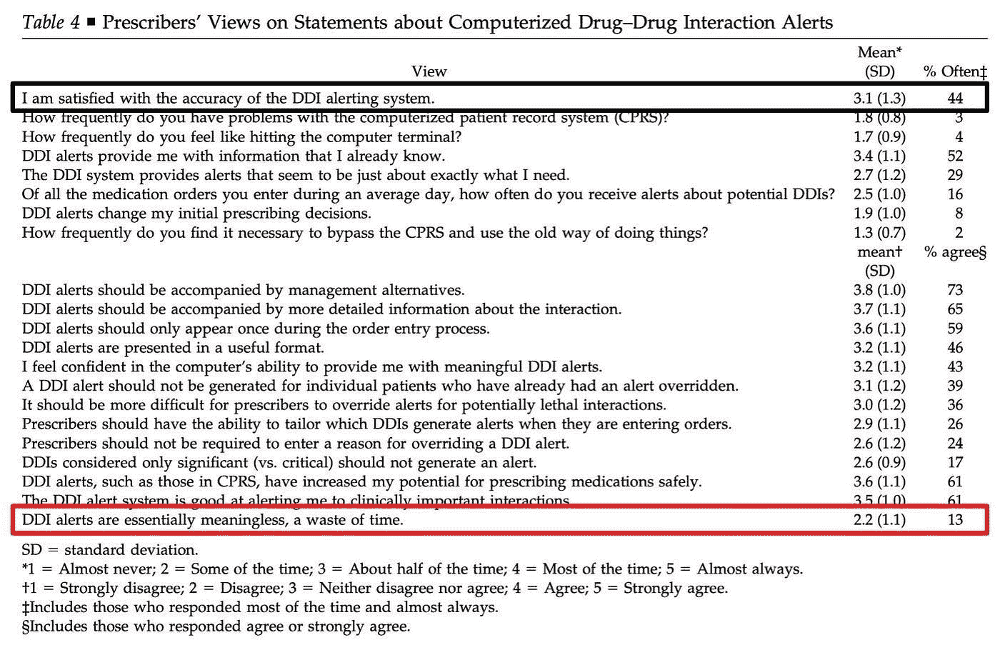

*Practitioners’ Views on Computerized Drug–Drug Interaction Alerts in the VA System. Source:* [*https://www.ncbi.nlm.nih.gov/pmc/articles/PMC2215077/*](https://www.ncbi.nlm.nih.gov/pmc/articles/PMC2215077/)

这是另一个同样来自医疗保健的例子，在[中，哪些医疗服务提供者否决了大约 50%的药物相关临床决策支持](https://www.ncbi.nlm.nih.gov/pmc/articles/PMC3994856/) (CDS)警报:

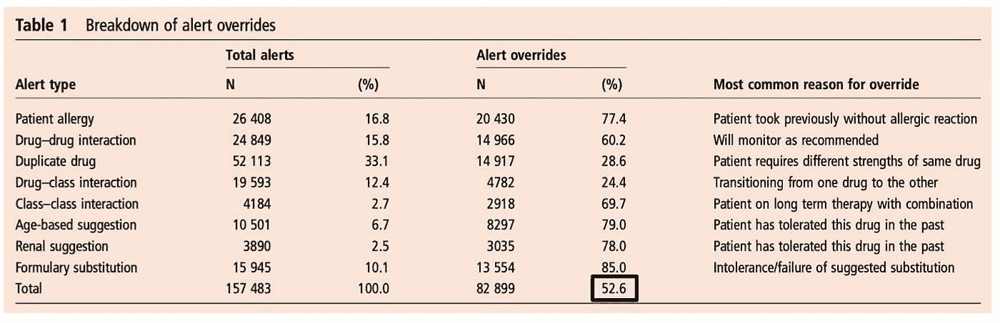

*Overrides of medication-related clinical decision support alerts in outpatients. Source:* [*https://www.ncbi.nlm.nih.gov/pmc/articles/PMC3994856/*](https://www.ncbi.nlm.nih.gov/pmc/articles/PMC3994856/)

**解决方案——如何理解用户**

你可以通过研究用户如何工作以及他们需要什么来改进你的系统。机器学习如此，传统软件也是如此。

在医疗保健领域，早期的医疗决策支持系统开始于 20 世纪 70 年代[，](https://dl.acm.org/doi/abs/10.1145/41526.41543)，[未能被采用](https://www.ncbi.nlm.nih.gov/pmc/articles/PMC1839633/)，很大程度上是因为[这些系统没有很好地整合到临床医生的工作流程中](https://www.ncbi.nlm.nih.gov/pmc/articles/PMC7005290/)。通过仔细听取临床医生的意见，开发人员已经改进了这些系统。在 2016 年的这个例子中，SimulConsult 系统[生成图表](https://api.simulconsult.com/prognosis/index.html)，显示疾病的体征、症状和发现如何随着时间的推移而展开，这与传统诊断系统形成对比，传统诊断系统仅[提供诊断列表](https://journals.plos.org/plosone/article?id=10.1371/journal.pone.0148991)。

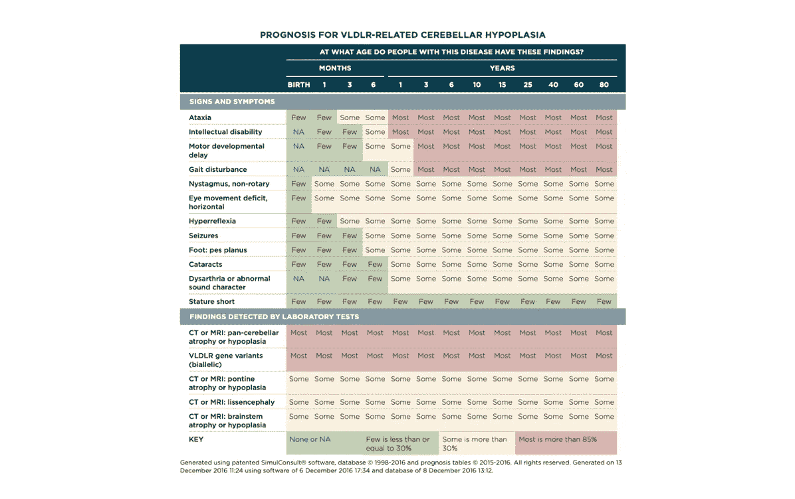

*Experience with Integrating Diagnostic Decision Support Software with Electronic Health Records: Benefits versus Risks of Information Sharing Source:* [*https://www.ncbi.nlm.nih.gov/pmc/articles/PMC5994959/*](https://www.ncbi.nlm.nih.gov/pmc/articles/PMC5994959/)

*   为用户解决现实问题。
*   让用户参与开发过程。
*   问用户很多问题。这对你有帮助吗？你想要吗？它可能会失败在哪里？什么最有帮助？还有什么更有帮助的吗？
*   与用户讨论 POC 或产品。
*   使用[以用户为中心的设计技术](http://citeseerx.ist.psu.edu/viewdoc/download?doi=10.1.1.94.381&rep=rep1&type=pdf),如访谈、焦点小组、调查、自然观察、情境探究、跟踪、角色扮演、绿野仙踪实验和可用性测试。
*   做好迭代的准备。
*   当开发一个系统时，考虑用户体验的所有方面，例如系统是否有用、可用、合意、有价值、可发现、可访问和可信。

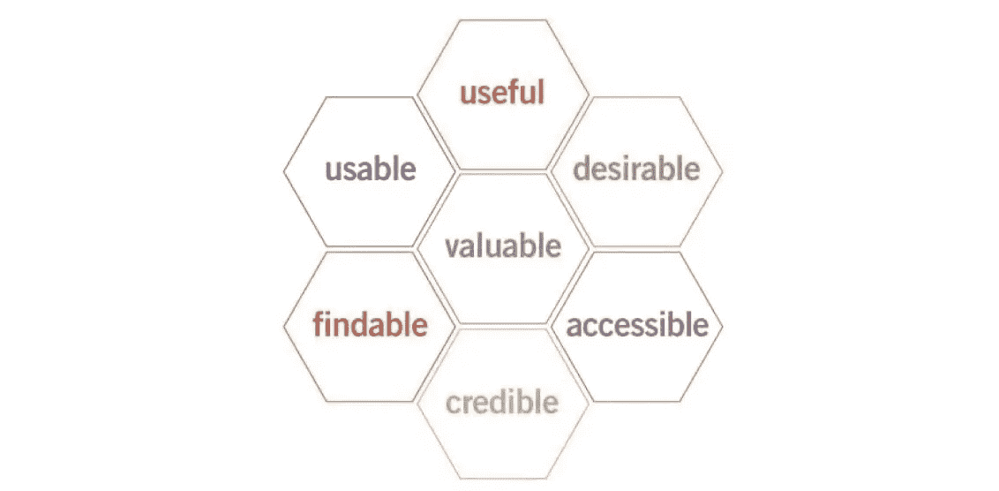

User Experience Design. *Source:* [*http://semanticstudios.c*om/user_experience_design/](http://semanticstudios.com/user_experience_design/)

## 常见的机器学习错误#8:为了技术而开发技术

你是为了技术而开发技术吗？2016 年，麻省理工学院的 Kalyan Veeramachaneni 描述了机器学习专家如何经常无法解决他们工作的商业价值。

在最近一次挤满机器学习爱好者的小组讨论会上，我对大约 150 名观众进行了民意调查，问他们“你们中有多少人建立了机器学习模型？”大约三分之一的人举起了手。接下来，我问:“你们中有多少人部署和/或使用了这个模型来产生价值，并对它进行了评估？”没有人举手。

*为什么你没有从你的数据科学中获得价值来源:*[https://HBR . org/2016/12/Why-You-Not-get-Value-from-You-Data-Science](https://hbr.org/2016/12/why-youre-not-getting-value-from-your-data-science)

**解决方案——如何避免为了技术而开发技术**

*   在项目开始时评估业务相关性。
*   经常与利益相关者沟通和协作。
*   估计收入、客户满意度收益和成本。这个项目值得做吗？不要因为很酷就去开发某样东西。好吧，如果你真的确定的话，也许可以！

## 常见的机器学习错误 9:不使用现有的解决方案

你知道所有的机器学习解决方案吗？至少值得探索一下主要技术公司的产品，如[谷歌的人工智能平台](https://cloud.google.com/ai-platform/)、[AWS 机器学习服务](https://aws.amazon.com/machine-learning/)、[脸书的人工智能工具](https://ai.facebook.com/tools/)、[微软的人工智能平台](https://www.microsoft.com/en-us/ai/ai-platform)和[苹果的机器学习产品](https://developer.apple.com/machine-learning/)。对于机器学习(AutoML)的自动化应用，有许多工具可供选择，如 Capital One 研究[走向自动化机器学习:AutoML 方法和工具的评估和比较中列出的工具。](https://arxiv.org/abs/1908.05557)

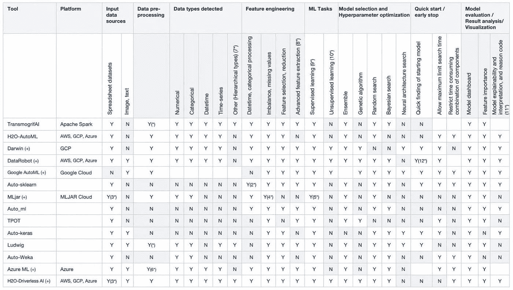

*Towards Automated Machine Learning: Evaluation and Comparison of AutoML Approaches and Tools Source:* [*https://arxiv.org/abs/1908.05557*](https://arxiv.org/abs/1908.05557)

**解决方案——如何找到并使用现有解决方案**

*   时刻注意外面有什么。
*   搜索过去的工作。
*   使用[谷歌学术](https://scholar.google.com/)和[语义学者](https://www.semanticscholar.org/)搜索学术论文。
*   问人。
*   定期进行新的搜索。艺术的状态是不断变化的。许多研究论文发表在[arXiv.org 电子印刷档案馆](https://arxiv.org/)，你可以订阅 [arXiv 电子邮件提醒服务](https://arxiv.org/help/subscribe)。
*   做出慎重的制造与购买决策。您的系统可能是现有解决方案和新解决方案的组合。

## 常见的机器学习错误#10:不执行故障分析

如果你不进行故障分析——分析系统不同类别故障的频率——你可能会付出很大努力却收效甚微。

请看这张从[到知识系统](https://www.aaai.org/Papers/KR/2004/KR04-053.pdf)的定量的、独立于平台的分析的饼图，它显示了在 Cycorp 回答化学问题的系统上执行的故障分析的结果。该分析是在一份 100 道题的化学考试中进行的，该考试的最高分可能是 1008 分。该系统失败的最重要原因是缺乏化学知识(B-MOD-1)，导致考试损失 408.5 分。这表明应该优先增加系统的化学知识。相比之下，知识表示语言(B-MOD-3)的局限性仅导致 20 分的损失。(图表中 B-MOD-1 和其他的颜色交换错误。)

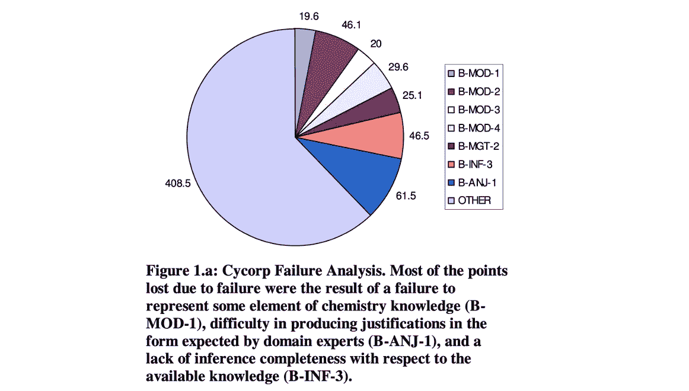

Towards a Quantitative, Platform-Independent Analysis of Knowledge Systems. Source: [https://www.aaai.org/Papers/KR/2004/KR04-053.pdf](https://www.aaai.org/Papers/KR/2004/KR04-053.pdf)

**解决方案——如何进行故障分析并最大限度地改进**

*   分析故障。将故障分类为问题类别，并计算每个问题类别的频率。
*   对于每个问题类别，如果您成功解决了该类别，请评估系统级指标的改进。
*   对于每个问题类别，估计解决该类别的工作量
*   先解决低挂的水果。
*   最大化改进，最小化工作量。
*   一般来说，在着手解决一个问题之前，估计一下它出现的频率。
*   不要解决不经常出现的问题，除非出于监管、政策或风险的原因，或者当你已经解决了所有经常出现的问题，现在处于长尾状态。

# 机器学习的过程

最后，这里有一个机器学习的总结过程，其中包含了许多要点。

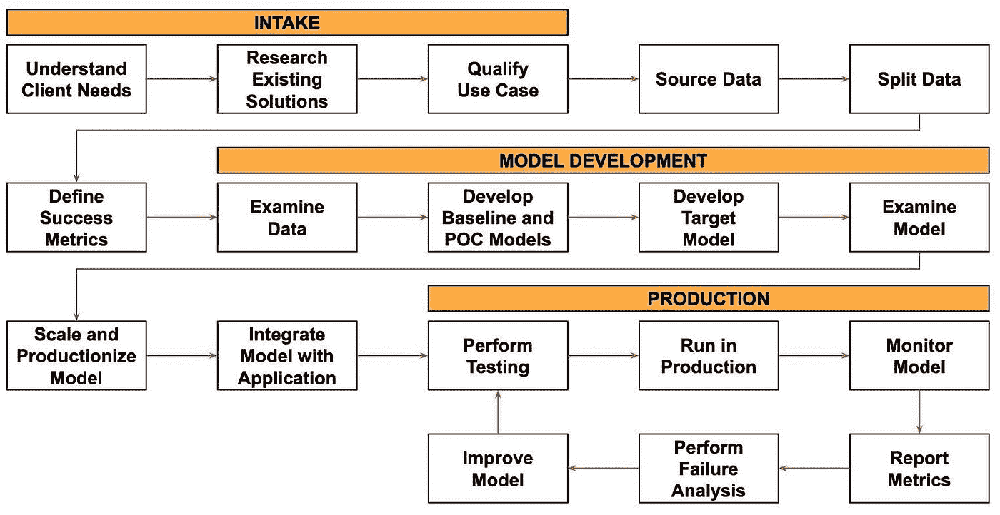

我们从摄入过程开始。我们与客户交谈，了解他们的需求。我们研究用例的现有工作和任何以前的解决方案。我们经历了验证用例的过程，以确保机器学习项目是值得做的，并将实现客户认为它将实现的好处。

我们获取并分割数据，并定义成功标准。

然后，我们继续进行模型开发。我们查看数据并开发基线和概念验证模型。一旦我们有了这些，我们就开始开发目标模型。一旦我们有了一个或多个经过训练的目标模型，我们就会仔细检查它们是否有问题。

我们选择一个模型，针对生产应用进行优化和扩展，并将其集成到应用中。

最后，我们到达生产阶段。我们对模型进行单元测试，并使用模型测试端到端的应用程序。我们在生产中部署和运行模型。我们监控模型的性能，并向开发人员和企业报告成功指标。我们定期进行故障分析，以确定改进的机会。我们改进模型并将新版本部署到生产中，改进循环重复进行。

*披露声明:2021 资本一。观点是作者个人的观点。除非本帖中另有说明，否则 Capital One 不隶属于所提及的任何公司，也不被这些公司认可。使用或展示的所有商标和其他知识产权是其各自所有者的财产。*

*最初发表于*[T5【https://www.capitalone.com】](https://www.capitalone.com/tech/machine-learning/10-common-machine-learning-mistakes/)*。*