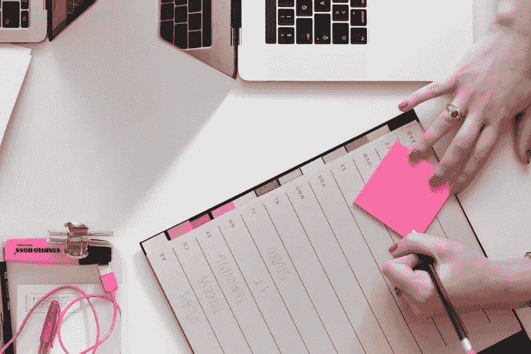

# 10 个帮助你提高工作效率的日常习惯

> 原文：<https://medium.com/duomly-blockchain-online-courses/10-daily-habits-which-will-help-you-increase-productivity-c9f1424794f6?source=collection_archive---------1----------------------->

[Duomly — programming online courses](https://www.duomly.com)

本文最初发表于:
[https://www . blog . duomly . com/how-to-improve-your-productivity/](https://www.blog.duomly.com/how-to-improve-your-productivity/)

作为一名程序员，工作有时很复杂，我们长时间坐在电脑前，有时会感到疲劳或效率低下。此外，我们努力保持工作和生活的平衡，因为编程似乎也是许多程序员的爱好，所以我们花时间寻找我们需要完成的任务的解决方案，有时会忘记休息一下。

休息对我们的身体和大脑非常重要，这就是为什么我在生活中实施了一些习惯，帮助我保持良好的身体状况，也让我的头脑清醒。当我遵循我的日常工作时，我有一种电池充满的感觉，这有助于我在任何我需要做的创造性或技术性工作中高效和成功。

下面，我想和大家分享一下那些习惯，因为我觉得可能对别人也有帮助。我还制作了这篇文章的视频版本，请随意观看并留下您的反馈。

[Duomly — Programming Online Courses](https://www.duomly.com)

## 1.睡 8 小时，早上起床

我知道每个人都喜欢睡觉，但是对你的睡眠时间做一些安排是一个很好的主意。一天中最有效率的时间是早上，所以不利用它会很糟糕。我总是尽量不晚于早上 7 点醒来，因为这让我可以在一个小时内离开家，而且我有一整天的时间可以利用，这在 12 点醒来时是不会发生的。

此外，我注意我的睡眠时间，我尽量不超过 7-8 小时，8 小时是完美的时间，但 7 小时仍然是可以接受的。睡了这么多觉后，我真的感到精神焕发，精力充沛，准备好迎接新的一天。

我用来知道我应该什么时候睡觉的诀窍是每天晚上我的手机上有一个提醒我什么时候该睡觉的信号。

## 2.早餐是基础

我们的身体是一个伟大的机制，但我们必须关心它，给它提供燃料，使它正常工作。早餐是我们一天中第一次喂饱我们的身体，所以我们应该认真对待它，因为我敢打赌，你们中的任何一个人在饿的时候都会感觉很舒服。

在我离开家之前，我尽最大努力吃早餐，我总是试图选择健康但有营养的食物，如水果粥或蔬菜炒鸡蛋，因为我知道这不会让我在接下来的几个小时里感到饥饿，并让我专注于比在办公室寻找零食更重要的事情。

计划你的食物并在家准备也很重要，因为在上班的路上抓汉堡对你的身体来说可能不是最好的选择。

## 3.培养

早上是我保养身体的好时候，这就是为什么我几乎每天早上都去健身房做一个小时的训练。它导致快乐荷尔蒙的释放，让我在接下来的一天里精力更加充沛。这是以好心情开始一天的好方法，但我也让我的身体每天都运动一下，然后在一天的剩余时间里坐在电脑前。

你不需要去健身房，你也可以做一些慢跑，如果你能在户外锻炼，它会给你类似的感觉和新鲜空气。

## 4.喝水(加柠檬)

水对我们的身体非常重要，脱水对我们来说很危险。很多人忘记每天喝推荐量的水，这可能会导致头痛甚至更严重的问题。

为了让它变得更容易，我以一杯加柠檬的温水开始我的一天，在一天的晚些时候，我试着在每顿饭前喝一杯水。早上一杯加柠檬的温水可能会给你的健康带来巨大的影响，健康的身体肯定会让你在工作中取得更好的成绩。

除此之外，我试着在我的桌子上放一杯水，以便在我感到口渴的任何时候都能喝到。

如果你不记得喝水，你可以使用一个应用程序，它会在你去拿杯水的时候给你发送通知。那个年代技术真的很棒。

## 5.沉思

照顾身体很重要，但我们的思想也是我们必须注意的。坐下来冥想一秒钟真的很好。

它可以让你平静下来，理清思绪，因为这样你就可以开始你所有的日常活动，用不同的眼光看待很多事情。这也有助于保持高效，专注于你需要关心的重要事情。

如果你不知道如何开始冥想，你可以使用一个可用的移动应用程序，在那里你会听到平静的声音告诉你该做什么。此外，你可以学习一些技巧，可以用来获得不同的结果，例如，提高生产力或在任何不愉快的情况下冷静下来。

## 6.休息一会儿

无论你是程序员还是设计师，或者你做任何其他需要整天坐在电脑前的工作，记住休息是非常重要的。我意识到，在坐了大约一个小时并专注于某件事情后，我无法清晰地思考，我也没有我想要的那么有效率。

每小时休息 5 分钟会带来很好的效果，因为短暂的休息后，我可以带着新的精力回到电脑前工作。你可以利用这 5 分钟喝杯水，冥想或者散散步。

## 7.每天检查两次电子邮件

通知让我发疯，破坏了我的注意力。每次我看到我有一封新的电子邮件，我都必须检查它，因为它可能是重要的事情，但是一秒钟，如果它是重要的，可能有人会找到更好的沟通方式，对吧。

这就是为什么现在我每天只检查两次邮件，早上和晚上，白天我的邮件客户端是关闭的。现在每当我收到一封很棒的邮件时，我都不会那么心烦意乱了。所以，现在检查所有的邮件最多花我半个小时，之前我甚至可以花 10 分钟回复每封邮件，然后回到我之前在做的事情。我节省了很多宝贵的时间。

## 8.睡前阅读

我过去常常在睡觉前用手机阅读任何新闻或社交媒体，但当我意识到手机屏幕让我不那么困，而且我实际上浪费了一些时间，所以我已经把它改为阅读书籍。

这样我就能每天睡觉前读一些有用的东西，这给了我真正的价值，我也能比以前更早入睡。此外，我可以在一个月内读完一本书，而不用马上花额外的时间。我认为这个习惯特别有用，因为我们经常抱怨没有时间看书，但仔细看看我们生活中的时间管理，我们肯定可以每天抽出半小时拿本书看几页。

## 9.音乐

使用耳机和工作播放列表真的提高了我的效率。

首先，当我使用耳机时，其他人不会打扰我，因为他们需要以某种方式吸引我的注意力来开始和我说话。所以，如果没有什么重要的事情困扰我，我就不太容易被别人找到。

第二件事是，选择一个好的播放列表总是帮助我切断周围的世界，让我专注于我目前正在做的事情，这有助于我更快地完成任务。

## 10.无屏幕日

至少每两周或一个月一次，我试着过一天没有屏幕的日子，我的意思是真的没有屏幕，没有手机，电脑和电视。

它帮助我给我的眼睛一些时间，并且我意识到我以一种完全不同的方式度过我的时间，更多地与朋友和家人交往。

无屏幕日的另一个好处是，我回来工作时精神饱满，休息得很好，精力充沛地去创造和解决编程问题。

## 结论

在这篇文章中，我将与你分享我在日常生活中做的一些事情，以提高我的工作质量和工作与生活的平衡。此外，它有助于我在工作中取得更大的成功，并防止我们的工作失败。

我希望你会发现这些建议很有用，如果你能分享你的习惯，我会很高兴，这是以类似的方式工作的。

感谢您的阅读，
来自 Duomly 的安娜

[Duomly — Programming Online Courses](https://www.duomly.com)