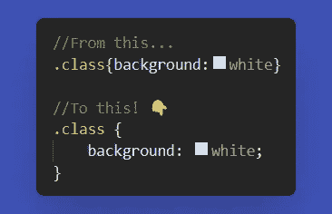
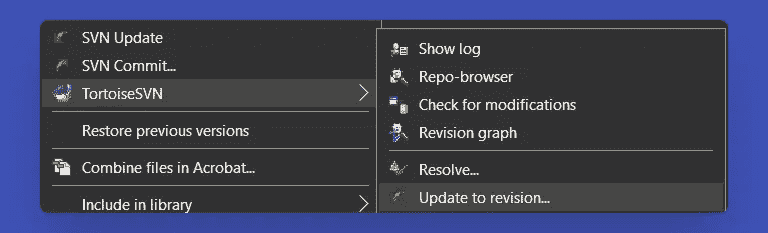
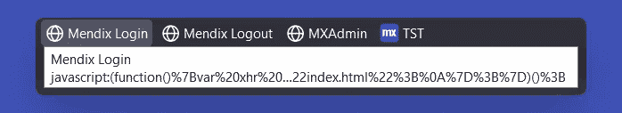
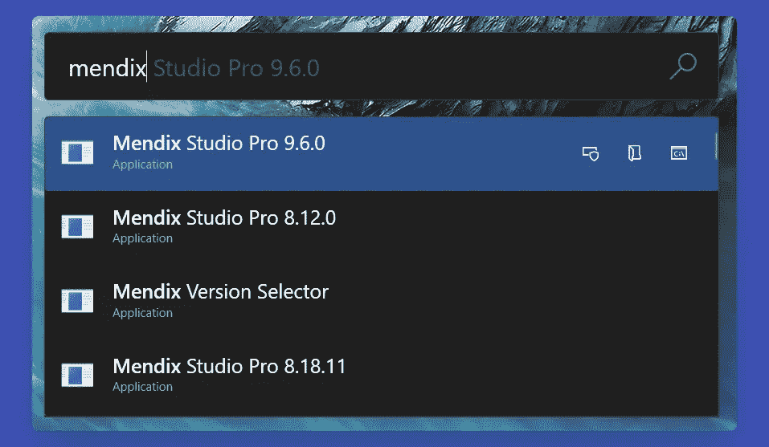
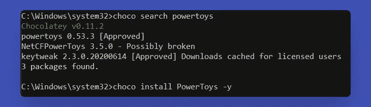
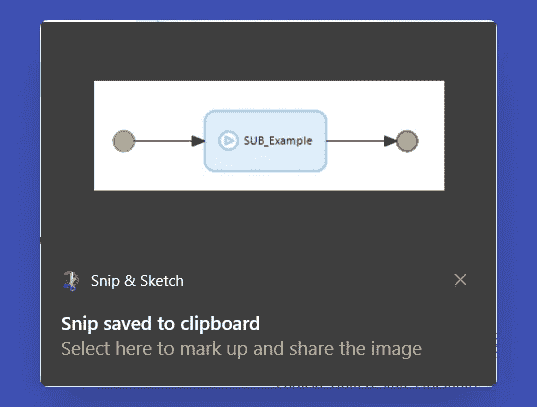
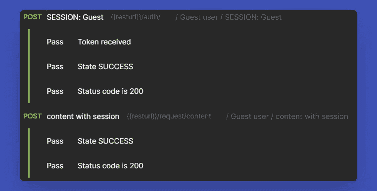
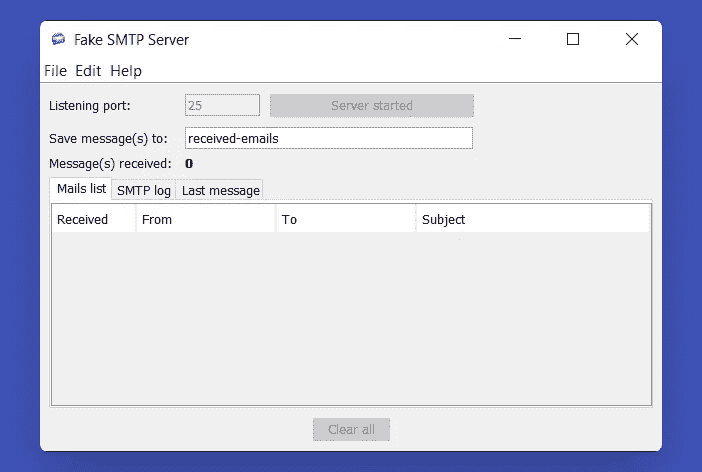
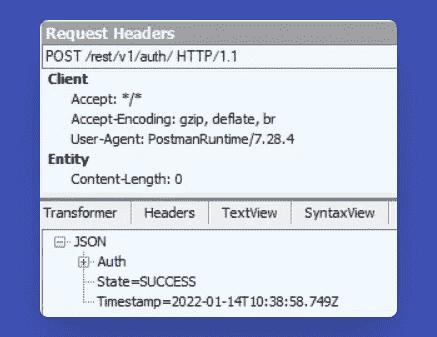

# Mendix 应用程序开发的 10 个基本工具

> 原文：<https://medium.com/mendix/10-essential-tools-for-mendix-app-development-3c94e9afd692?source=collection_archive---------0----------------------->

## Mendix 开发人员不可或缺的工具

10 Essential Tools for Mendix App Development

无论你以什么为生，确保你有合适的工具来工作对任何职业人士来说都是至关重要的。Mendix Studio Pro 是一款用于构建应用程序的优秀软件，但还有许多其他工具可以帮助您比以往更高效地构建应用程序。在本文中，我回顾了我对 Mendix 开发中日常使用的必备工具的建议。

# 1.使用更漂亮的自动文件格式

如果您有编写自定义样式的经验，您可能熟悉 CSS 缩进格式。您知道有一些简单的方法可以自动完成这项工作吗？每当我保存一个文件时，我都会使用 Visual Studio 代码扩展[漂亮的](https://marketplace.visualstudio.com/items?itemName=esbenp.prettier-vscode)来自动格式化我的 SCSS。

Instant automatic indentation using Prettier.

> 您甚至可以使用一个更漂亮的[配置文件](https://prettier.io/docs/en/configuration.html)，为每个项目定制格式规则！这样，您可以确保团队中的每个人都使用相同的格式。

# 2.通过安装 TortoiseSVN 来扩展 Mendix 版本控制

Mendix 使用 Subversion (SVN)进行版本管理。你需要的大部分东西都包含在 Studio Pro 的版本控制菜单项下，但是你可以下载 [TortoiseSVN](https://tortoisesvn.net/) 来获得一些额外的功能。

使用 TortoiseSVN，您可以:

*   例如，更新到特定的修订版，以比较提交之间的更改。
*   重命名和归档分支。
*   解决 Studio Pro 之外发生的合并问题。
*   无需打开 Studio Pro 即可更新和提交。
*   向忽略列表中添加项，防止编译文件的合并冲突。

> 请务必检查您的 Studio Pro 版本需要哪个 TortoiseSVN 版本。

*Revert back to a specific revision using TortoiseSVN.*

# 3.用书签工具增强你的浏览器

Mendix 提供了一个 JavaScript API，您可以利用它。大多数现代浏览器都提供将 JavaScript 片段保存在书签中的选项，称为 [bookmarklets](https://en.wikipedia.org/wiki/Bookmarklet) 。

给一个 JavaScript 函数加书签允许你在浏览器中直接点击鼠标来调用它。可能性是无穷无尽的:登录、打开页面、执行微流……你可以将你在应用开发过程中经常使用的任何功能加入书签。

## *点击工具栏上的书签，立即退出任何 Mendix 应用程序*

`javascript:(function()%7Bmx.logout()%3B%7D)()%3B`

> 我使用这个[书签生成器](https://caiorss.github.io/bookmarklet-maker/)从我的 JavaScript 片段中生成书签。

*Bookmark JavaScript snippets to quickly use JavaScript functions in your Mendix app.*

# 4.使用 PowerToys 提高 Windows 的效率

如果你以前用过 MacBook，我敢肯定你换成 Windows 后会怀念 Spotlight 功能。您知道微软在 PowerToys 中提供了这一功能，甚至更多吗？例如，它在文件浏览器中增加了预览`.svg`和`.md`文件的功能，一个右击图像大小调整器，和一个漂亮的颜色选择器。每天使用 Windows 的人的必备工具！

*The PowerToys Run window, one of the many useful features included in the package.*

# 5.使用 Chocolatey 自动完成安装过程

同样，如果你过去用过 MacBook，你可能听说过家酿。有一个 Windows 的等价物叫做 Chocolatey。Chocolatey 是一个用于 Windows 的软件包管理器，允许您从命令提示符下搜索和安装软件。

为了说明，让我给你举个例子。我相信你对安装新软件的传统方法很熟悉。事情是这样的:

*   打开浏览器
*   搜索软件
*   加载网站
*   导航到下载页面
*   找到正确的版本
*   下载安装程序
*   打开安装程序
*   完成安装向导
*   完成的

使用 Chocolatey，您可以:

*   打开命令提示符
*   输入`choco install PowerToys -y`
*   完成的

> 听起来不错？那是因为它是！现在让我们通过**在论坛上投票支持我的** [**创意**](https://forum.mendix.com/link/ideas/2645) 来让 Mendix Studio Pro 在 Chocolatey 中可用。

*What installing software looks like using Chocolatey.*

# 6.使用内置的 Windows 截图工具来捕捉部分屏幕

有什么问题你想想象一下吗？使用截图工具捕捉屏幕截图中的部分内容。这样，您就可以将截图集中在您想要共享的项目上，而不是共享整个屏幕。只需按下`⊞ Win + Shift + S`并拖动鼠标，选择您想要捕捉的屏幕部分。

*Quick and easy partial screen capture using the Snipping Tool.*

# 7.用 Postman 改进您的集成测试

Mendix 的优势之一是它能够与许多其他系统集成。集成是许多 Mendix 应用程序的关键部分。然而，从 Mendix 内部排除连接故障通常是一件麻烦的事情，因为设置它需要进行配置。您可以使用 Postman 来执行往返于 Mendix 的 web 服务调用。

Postman 还提供了一个集合运行器，您可以在其中以特定的顺序配置许多 web 服务请求。您可以在单元测试之上使用它来实现测试自动化:

*Run requests in sequence from Postman to test your entire app’s integration suite.*

> 我正在写一篇关于 Postman 的**自动化 Mendixcloud 部署的博文。在 [LinkedIn](https://www.linkedin.com/in/mariusvanderknaap/) 上关注我，成为第一个听说这件事的人！**

# 8.使用 FakeSMTP 运行本地邮件服务器

将外部电子邮件服务器配置为在本地工作可能是一件麻烦的事情。您可能没有 internet 连接，配置设置发生了变化，或者您不想每次在本地切换数据库时都必须重新配置电子邮件服务器。对于这些场景， [FakeSMTP](http://nilhcem.com/FakeSMTP/) 是一个完美的解决方案。这个轻量级的 Java 包将运行一个本地电子邮件服务器，您可以在几秒钟内连接到该服务器。因为它是用 Java 编写的，所以你也可以在任何操作系统上使用它！

*Run a local mail server with FakeSMTP.*

# 9.使用 Fiddler 分析传入和传出流量

如果您想更深入地了解进出的数据，Fiddler 是一个必备工具。您可以通过 Fiddler 路由所有互联网流量，以详细分析您的计算机和外部服务器之间正在进行哪些请求。确保在您的 Mendix 项目设置中将 Fiddler 端口配置为代理，以便所有流量都可以通过它正确路由！

Investigate incoming and outgoing traffic with Fiddler.

# 10.松弛的

你知道 Slack 上有一个完整的 Mendix 社区吗？这个活跃的社区可以帮你解决问题。**在这里** **找到 Mendix Slack 社区** [**！**](https://mendixcommunity.slack.com/)

你在 Mendix Studio Pro 上面用什么软件？请在评论中告诉我！💬

## 阅读更多

 [## 版本控制

### 本文档给出了定义并解释了版本控制流程

docs.mendix.com](https://docs.mendix.com/refguide/version-control/)  [## 家龟

### 如果您使用的是 Visual Studio，您可以将 TortoiseSVN 命令集成到各种上下文菜单中。当然也有…

tortoisesvn.net](https://tortoisesvn.net/)  [## 简介|邮差学习中心

### 简介:Postman 文档，API 开发的协作平台。更快地创建更好的 API。

learning.postman.com](https://learning.postman.com/docs/getting-started/introduction/)  [## chocolatey-Windows 的软件包管理器

### Chocolatey 是用于 Windows 的软件管理自动化，它将安装程序、可执行文件、压缩文件和脚本打包成…

chocolatey.org](https://chocolatey.org/) 

*来自发布者-*

如果你喜欢这篇文章，你可以在我们的 [*中页*](https://medium.com/mendix) *找到更多喜欢的。对于精彩的视频和直播会话，您可以前往*[*MxLive*](https://www.mendix.com/live/)*或我们的社区*[*Youtube PAG*](https://www.youtube.com/c/MendixCommunity/community)*e .*

*希望入门的创客，可以注册一个* [*免费账号*](https://signup.mendix.com/link/signup/?source=direct) *，通过我们的* [*学苑*](https://academy.mendix.com/link/home) *即时获取学习。*

有兴趣更多地参与我们的社区吗？加入我们的 [*Slack 社区频道*](https://join.slack.com/t/mendixcommunity/shared_invite/zt-hwhwkcxu-~59ywyjqHlUHXmrw5heqpQ) *。*