# 10 个最受欢迎的 Mendix bug——从一年的低代码开发中吸取的教训

> 原文：<https://medium.com/mendix/10-favourite-mendix-bugs-lessons-learned-from-a-year-of-low-code-development-auraq-9d3a6bb5e5d3?source=collection_archive---------5----------------------->

# 愈合更快

为了获得 MBA 学位，我必须通过 GMAT 考试，其中包括英语论文。作文的评分机制有些模糊，但有一点很清楚，拼写错误会被扣掉很多分。基本上，在文章中犯三个以上的拼写错误，你就出局了。英语不是我的母语，在没有微软 Word 的情况下试图做到这一点是令人羞愧的…

为了提高我的拼写能力，我使用了高中时代的一种技巧。一位老师告诉我，要取得有意义的进步，用他的话说，我必须“愈合得更快”。他的意思是，这是一个简单而非常有效的规则:

> 犯了错误，记下来，记住，不要再犯

这非常有效。经过几轮迭代，我已经列出了 100 个常见的拼写错误。事实证明，它们代表了我犯过的 90%的错误。我很快意识到我一直在一遍又一遍地犯同样的错误。虽然很快记住整个英语似乎是不可能的，但令人惊讶的是，在几周的练习中，每篇文章出现三个错误是可以做到的。

# 我最喜欢的 10 种 Mendix bugs

在一年多的 Mendix 开发之后，我决定是时候检查几十项测试反馈了，以便准备一份我最常犯的错误列表，以及我永远不会再犯的错误列表。其中一些可能对你有用，但重点是鼓励你列出自己的清单，以便“更快康复”。

## 1.安全性

这几乎是团队中的一个笑话——如果有人带着问题来找我们，我们通常会问的第一个问题是“你检查过安全系统了吗？”不可避免的，这就是问题所在。这是我的清单:

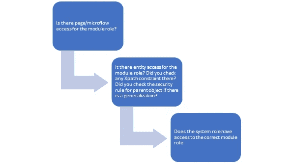

*   对于可重用的模块，保持它的通用性；比如说；管理员、用户、只读。
*   对于特定于应用程序的模块，尽可能保持其通用性(管理、只读等)。)如果不能，只需添加与系统角色完全相同的角色(即客户、供应商等)。)

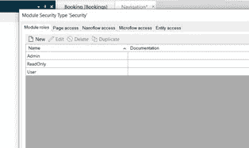

为了保持整洁，我建议在需要知道的基础上授予实体访问权限。从所有属性的不读、不写开始，根据业务需求逐步增加读写数据的权限。尽管这很诱人，但尽量不要按下“读，写”按钮来授予通用访问权限。

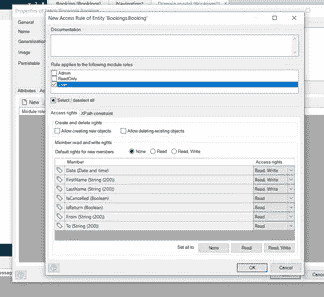

## 2.日期和时间

日期和时间是虫子的另一个沃土。我的大多数错误都来自于在不同时区工作的客户。

想象一下:用户 John 在旧金山的办公室里使用 Mendix 应用程序进行预订。屏幕上显示的预订日期是 2020 年 9 月 7 日。实际上，系统存储的内容如下:

*   当地时间:2020 年 7 月 9 日 18 时 47 分
*   世界协调时:2020 年 7 月 10 日 01 时 47 分

现在，当我在伦敦的屏幕上看到同样的日期时，我看到的是 2020 年 10 月 7 日。这是因为旧金山比世界协调时晚 7 小时，而伦敦比世界协调时早 1 小时。在这种情况下，我们不关心时间，只关心日期:

在属性上，选择 Localize: No(这意味着我和 John 都将与用 UTC 表示的时间进行交互)。

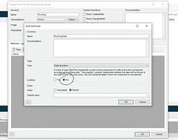

*   在每个日期和时间函数上，确保使用 UTC。例如，如果我想创建 7 天后的返程，我需要使用**addDaysUTC($ booking/booking date，7)** ，而不是使用**addDays($ booking/booking date，7)** 。这确保了新日期基于 UTC 值+7，而不是本地值。
*   发送电子邮件、生成文档、通过 API 发送数据时要小心。始终确保您根据使用案例有意识地决定选择 UTC 或本地时间。

## 3.空检索

这很简单。我正在检索数据并使用它进行计算，却得到了以下错误:

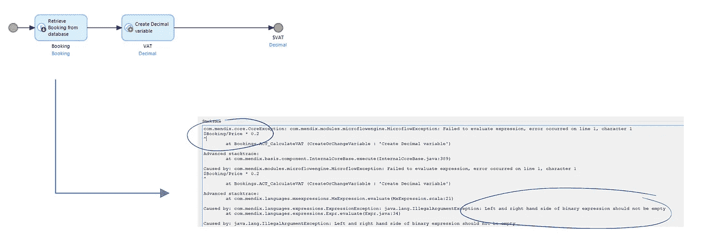

发生这种情况是因为无论什么原因都无法检索到对象。这里很容易发现，因为微流非常简单，但有时失败的检索会影响三个子微流，并且可能需要一段时间来追溯步骤并找到数据丢失的原因。简单的解决方案是每次检索后总是检查值，如下所示:

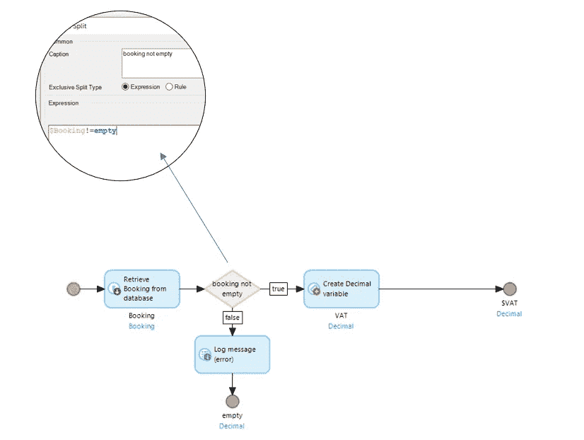

## 4.除以零

另一个简单的。错误发生在计算过程中，除数恰好为空。为了避免这种情况，我通常简单地编写额外的内联逻辑，如下所示:

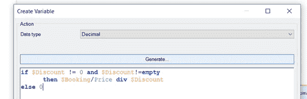

当然，那是在你乐意在那种情况下返回 0 的情况下。在某些情况下，您可能需要使用独占拆分以不同的方式处理异常，例如向用户显示有效的错误消息。

## 5.验证规则

避免许多空返回和被 0 除以及其他无数问题的一种方法是确保您的验证规则是无懈可击的。这意味着坚持让你的产品所有者花时间为验收标准中的每个故事创建验证规则。通常，他们需要考虑三件事:

*   该属性是必需的吗？
*   什么是绝对属性范围(最小和最大)？
*   这个属性和任何其他属性之间有约束吗？例如，开始日期不能晚于结束日期等。

一旦有了这些，我们需要为每个表单提交创建一个验证子微流，并将其包含在保存微流中:

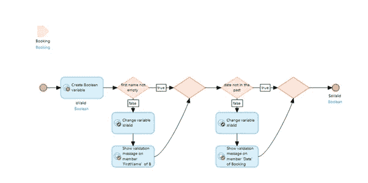

## 6.表演

性能是一个很大的话题，但是我已经确定了至少一个导致问题的常见模式。我曾经学过在一个循环中限制对数据库的调用。因此:

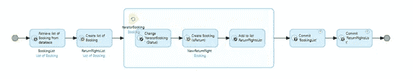

然而，我也学到了一个艰难的方法，那就是检查循环中的子微流。虽然这显然是同一个问题，但我发现很容易忘记不要在嵌套在循环中的任何 sub_microflow 中调用数据库。对于多层嵌套来说尤其如此。

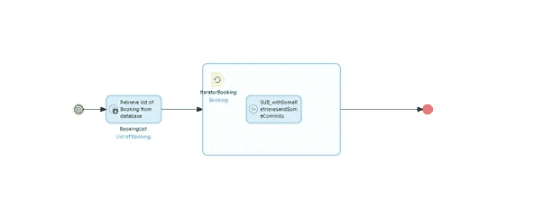

为了避免这种情况，我在开始时使用的一个技巧是找到一些方法用不同的颜色标记呼叫。这样就不可能忘记数据库调用发生的位置。

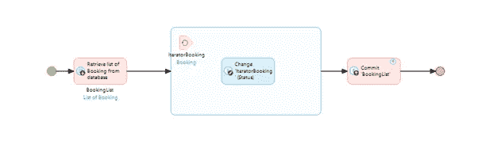

## 7.导航和保存

最近，我构建了许多工作流类型的流程，例如，让用户经历问卷调查的几个步骤。我发现我需要特别注意导航行为。通常，从一个步骤到下一个步骤是有逻辑的。

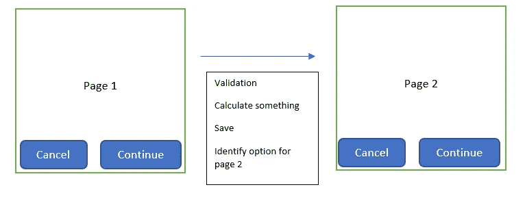

用户可能会请求能够向后导航，甚至通过直接单击导航面包屑菜单直接导航到旅程中的某个页面。

例如，假设用户想从旅程的第 1 页直接跳到第 4 页。如果他们更改了第 1 页上的任何内容，我们需要确保再次运行第 1 页的验证，重新进行任何计算，并确保我们保存它。

我通常建立的是一个过程，用户可以直接返回到任何先前的页面，但不能前进超过一页。这确保了数据流受到我们构建的路径的约束，包括所有必要的验证。

## 8.删除行为

这是我一开始就忘了很多次的事情；为我的所有关联建立删除行为。删除行为决定了当相关父对象被删除时，子对象会发生什么:

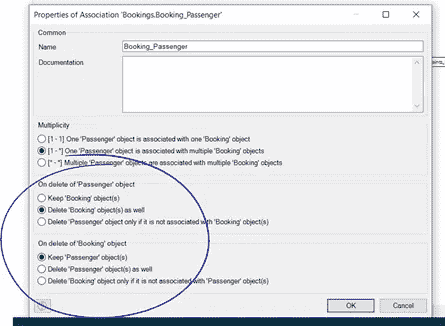

如果删除行为消失了，我们很快就会得到大量不再与任何对象相关联的无用数据。然后，我们发现我们的用户与截断的数据交互(例如，没有乘客的预订)，这可能会产生各种错误。

您可以快速看到域模型中的所有删除行为，因为它们以红色突出显示:

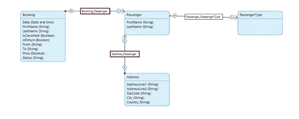

## 9.配置跟踪

很大一部分错误是由于遗漏了一个配置步骤。我所说的配置是指部署后发生的每一步，比如更新电子邮件模板，或者在生产中刷新反射模块。

忘记配置步骤确实会发生。自从上次部署以来，当你已经为 2 或 3 个 sprint 开发了一个应用程序，每个 sprint 包括 20 个，有时 30 个故事，很容易忘记在那里的某个地方，需求 46 要求你建立一个小的迁移逻辑，它绝对需要在部署发生时运行。

我认为记录这些的唯一方法是维护日志。如果您使用的是 Sprintr 门户，那么当您完成部署活动时，您可以为每个故事添加标记。你也可以简单地在吉拉或者你的团队正在使用的任何其他项目管理平台上维护一个单独的日志。重要的是，团队中的每个人都可以访问该日志，并且所有开发人员在提交时都承诺记录任何部署活动依赖关系。

对于更复杂的项目或更复杂的版本，您将需要构建一个部署指南。这主要是因为部署活动可能必须按照严格的顺序执行。我的建议是在计划中至少留出半天时间来巩固部署指南。当部署本身已经开始，并且应用程序离线时，几乎没有时间考虑配置步骤。部署指南将解决这个问题。

## 10.隐藏样式

搞乱 UI 的方法不止一种。最常见的一个问题是无法识别样式设置的位置。

Mendix 附带了 Atlas UI，这是一个构建在 Sass 之上的 UI 框架。在这些预构建的类之上，许多客户要求我们创建定制的 CSS 类来匹配他们的品牌和期望的 UI。这是完全可行的，但是如果几个开发人员在一个项目上工作，并且没有一个计划或结构，处理起来会很快变得复杂。当我应用新类时，一个典型的 bug 出现了，但是它被浏览器忽略了，并且没有在屏幕上显示出来。然后开始痛苦地在浏览器开发工具中寻找样式被覆盖的地方。

以下是我建议的避免这种情况的规则:

*   使用“显示样式”来快速查看应用了样式的位置。这将显示，除了 Atlas UI 自带的现成样式之外，哪些小部件已经应用了任何特定的样式。

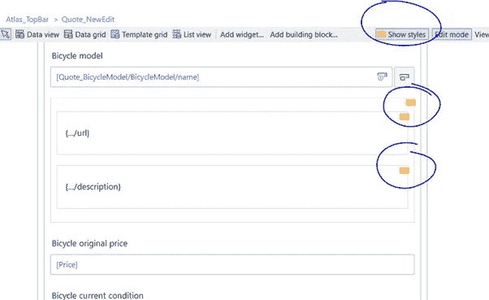

*   避免内嵌样式。任何小部件的属性都提供了添加类或内联样式的能力。与内联样式相比，类有两个好处。首先，它们是可重复使用的。这节省了时间和重复的代码，使得在一个地方改变风格变得更加容易。第二，他们更容易跟踪。定制类可以被很好地组织和编目在一个位置，而内联样式被隐藏在各处。

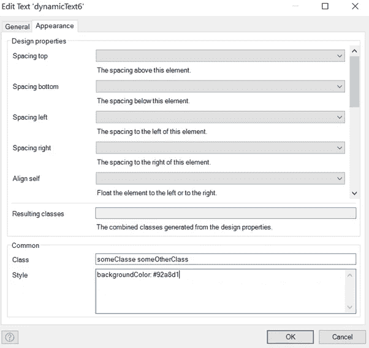

*   在创建任何自定义类之前，利用现有的 Atlas UI 类。你可以在这里找到最重要的[https://atlas.mendix.com/p/helpers/7881299347899271](https://atlas.mendix.com/p/helpers/7881299347899271)
*   创建自定义课程时，请正确组织它们。任何自定义 Sass 类都将添加到项目目录中:{ root folder } \ theme \ styles \ web \ Sass \ app \ custom . scss

不要将所有自定义类放在同一个文件中，而是创建不同的文件来组织它们，并将它们导入 custom.scss 文件中。最后的 custom.scss 文件应该只有导入语句，而没有实际的样式。各种文件本身可以组织成文件夹。这个系统由你决定，只要它是合乎逻辑的，并得到团队其他成员的同意。这样做的目的是让项目的新开发人员很容易找到哪个文件夹、子文件夹和文件可能包含任何特定组件的样式。根据我的经验，在团队中指定一个开发人员来负责 UI 和维护定制类要比让每个人都处理同一个文件容易得多。

# 结论

我不确定我会不会看到一个完全没有 bug 的项目，不管它有多简单。然而，如果你通过这个练习找到你犯的最常见的错误，你将有机会发现新的、更有趣的错误！

*原载于 2020 年 11 月 13 日*[*【https://www.auraq.com】*](https://www.auraq.com/10-favourite-mendix-bugs-lessons-learned-from-a-year-of-low-code-development)*。*