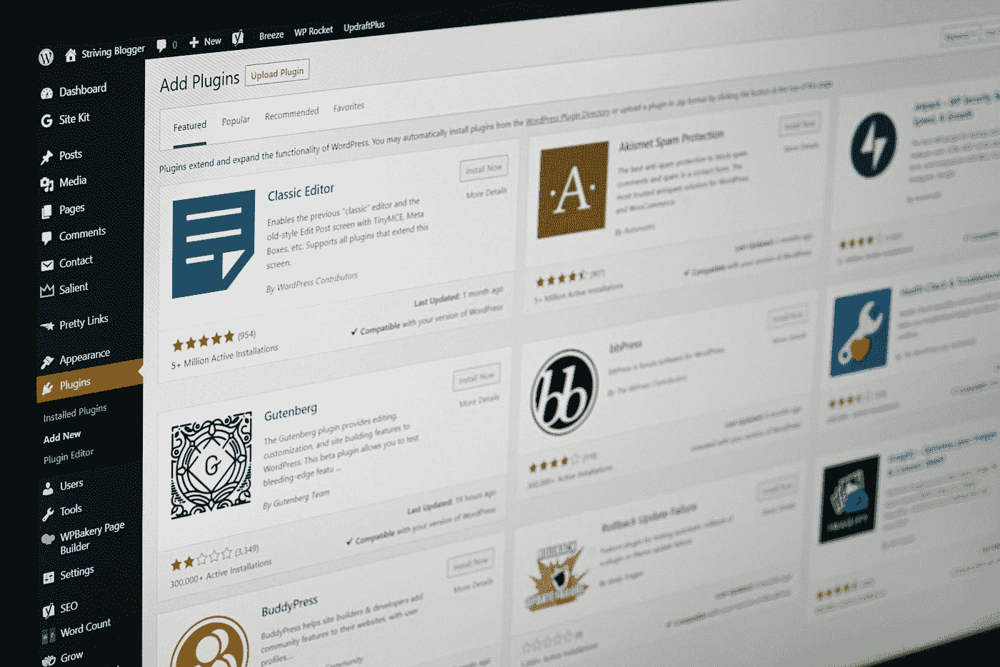

# 10 门免费 Django 课程，学习 Python 中的 Django

> 原文：<https://medium.com/quick-code/10-free-django-courses-for-beginners-to-learn-django-ce2d598957a?source=collection_archive---------0----------------------->

Photo by [Faisal](https://unsplash.com/@faisaldada?utm_source=medium&utm_medium=referral) on [Unsplash](https://unsplash.com?utm_source=medium&utm_medium=referral)

众所周知，Python 是当今最流行的编程语言之一，Django 让 Python 开发人员的 web 开发变得更加容易。除了对初学者友好和非常强大之外，Python 编程语言还有一个健壮的框架和库生态系统，比如 Django，它提供了额外的特性。由于其实用的设计和用户友好性，Django 很快获得了关注。与 web 应用程序框架类似，它是构建网站时需要的组件的集合。

姜戈是什么？Django 是一个基于 Python 的免费开源框架，它加速了用 Python 编程语言构建的 web 应用程序的开发。使用 Django web 框架，您可以在不使用 SQL 的情况下用 Python 构建应用程序的整个数据模型。考虑到它的独特性，Django 是 Python 开发者的唯一工具。

与 web 开发工具相比，web 应用程序开发人员可以使用 Django web 框架专注于构建独特的应用程序。此外，Django 具有利用广泛的基于社区的支持系统的优势，这允许它利用高度可定制性和随时可用的第三方插件。Django REST 框架是创建 Web APIs 的一个强大而灵活的工具包。

# 学习姜戈的免费姜戈课程

现在，让我们继续学习用 Python 学习 Django 的免费 Django 课程。请记住，这些免费的 Django 课程将来可能会再次变成付费课程，所以请将它们放在您的列表中，以避免以后为它们付费。

## 1.Django 入门指南【最佳免费 Django 课程— Udemy】

免费创建您自己的民意测验应用程序，一步一步地学习 Django 的所有基础知识。

Photo by [AltumCode](https://unsplash.com/@altumcode?utm_source=medium&utm_medium=referral) on [Unsplash](https://unsplash.com?utm_source=medium&utm_medium=referral)

如果你不知道的话，Django 是用于构建 Django 和 Pinterest 等应用程序的编程语言。因此，本课程将帮助您学习所有 Django 基础知识，并创建 Instagram 和 Pinterest 等应用程序。

在这门 Django 课程中，您将:

*   创建自己的 Django 应用程序。
*   在引人注目的基础设施上创建 web 应用程序。
*   通过 bootstrap 创建响应站点。
*   在 Django 中设置应用程序和模型。
*   创建自定义 URL 和视图。
*   利用模板的使用。
*   添加静态文件(CSS/JS)。

该课程将涵盖 Django 的所有内容，从创建和填充数据库到目录和应用程序。通过本课程，您将了解如何在应用中使用 URL 和模板，以及如何将 CSS 和 Bootstrap 集成到应用中。

这是 Udemy 上的顶级免费 Django 课程，5 门课程中有 4.5 门，时长 1 小时 46 分钟。此外，请记住，由于这是一门免费的 Udemy 课程，所以完成后您不会获得证书。

## 2.在 Django 中构建 Web 应用程序

本课程将帮助你学习 Django 如何通过模型对象与数据库通信。此外，我们将了解 Django 模型如何实现对象关系映射(ORM)来访问数据库。另一方面，我们也将回顾 Python 的面向对象(OO)模式。

在这门 Django 课程中，您将:

*   在 Django 中描述和构建数据模型
*   应用 Django 模型查询和 Django 模板语言的模板标签/代码(DTL)。
*   在 HTML 中构建表单
*   定义类、实例、方法

本课程将涵盖 SQL 基础知识和数据库建模原则，包括一对多和多对多关系及其在 Django 和 SQL 中的使用。此外，您将学习如何使用 Django 控制台和脚本与您的应用程序对象交互。

这是 Coursera 上排名第一的免费 Django 课程，在 5 门课程中获得 4.7 分，时长 13 小时。还有，在 Coursera，完成后会拿到证书。

## 3. [Django 特性和库](https://www.awin1.com/cread.php?awinmid=6798&awinaffid=466009&clickref=csMedium&ued=https%3A%2F%2Fwww.edx.org%2Fcourse%2Fdjango-features-and-libraries)【edX】

通过使用 Django 中的 cookies、会话和认证过程，创建基于 Django 的 web 应用程序。

本课程将教你如何构建终端用户友好的 Django web 应用程序。此外，您将了解 Django 中的 cookies、会话和认证。在开发 Django 应用程序时，您将学习如何添加导航和改进用户界面。

在这门 Django 课程中，您将:

*   定义 Django 会话以及如何使用 cookies 来支持会话。
*   使用 Django 中内置的登录功能，并在视图中管理登录用户。
*   定义一对多模型，并演示如何在数据库中表示链接。
*   在通用编辑视图中创建、编辑和删除表单流。

本课程将通过创建一个简单的应用程序来支持一个分类广告网站，带你了解与网站开发相关的许多问题和技术。此外，您将看到如何将应用程序从开发阶段转移到生产阶段。

这是 edX 上的顶级免费 Django 课程，持续时间为 6 周(每周 2-4 小时)。此外，请记住，由于这是一门免费的 edX 课程，所以完成后您不会获得证书。

## 4.[与 Django 一起建立个人档案](https://linkedin-learning.pxf.io/c/1137078/646189/8005?u=https%3A%2F%2Fwww.linkedin.com%2Flearning%2Fbuilding-a-personal-portfolio-with-django&subId1=csMedium)【Linkedin Learning——免费试用】

Photo by [Ben Kolde](https://unsplash.com/@benkolde?utm_source=medium&utm_medium=referral) on [Unsplash](https://unsplash.com?utm_source=medium&utm_medium=referral)

使用 Django(一个基于 Python 的开源 web 框架)可以快速创建您的网站创意。在本课程中，您将学习如何使用 Django 进行 web 开发来从头开始构建一个网站。

Django 课程的主题包括:

*   投资组合项目概述
*   创建 Django 应用程序
*   Django 和数据库
*   设计您的 Django 项目
*   Django 中的对象详细信息

此外，Django 课程将教你如何创建一个数据库，为你的网站设计布局，以及添加和修改网址。例如，使用 Django，您可以将项目连接到 Postgres，添加静态文件，提交 URL。

这是 Linkedin 上排名第一的免费 Django 课程，在 5 门课程中获得 4.4 分，持续时间为 2 小时。完成后，您将不会获得证书。

## 5.[高级 Django:Django Rest 框架介绍](https://coursera.pxf.io/c/1137078/1213622/14726?u=https%3A%2F%2Fwww.coursera.org%2Flearn%2Fcodio-advanced-django-intro-drf&subId1=csMedium)【Coursera—Django 课程】

在本课程中，您将了解 Django REST 框架和在 API 环境中处理 JSON，以及序列化视图表和认证/权限等基础知识。熟悉 Python 和 Django 的学习者最适合本课程。

在这门 Django 课程中，您将:

*   用 Django Rest 框架构建一个 API。
*   使用 Postman 探索 API。
*   添加序列化程序、视图集、路由器、身份验证和权限的功能。

这门课程不依赖于视频，而是完全亲自动手，自定进度。在作业中，学生将找到带有图像和可运行代码示例的简要解释，以及进一步探索的建议。

在整个课程中，您将收到来自各种评估项目的即时反馈，从快速理解检查(多项选择、填空和解读代码块)到缓慢构建功能，最终形成大型编码项目。

这是 Coursera 上排名第一的免费 Django 课程，在 5 门课程中获得 4.5 分，时长 9 小时。还有，在 Coursera，完成后会拿到证书。

## 6.[使用 SQL 和数据库开发 Django 应用程序](https://www.awin1.com/cread.php?awinmid=6798&awinaffid=466009&clickref=csMedium&ued=https%3A%2F%2Fwww.edx.org%2Fcourse%2Fdjango-application-development-with-sql-and-databases)【edX】

获得在云上开发和部署全栈 Django web 应用程序的实践经验。

本课程将向您介绍快速而简单的 Django 框架，开发人员使用它来简化他们的工作。此外，您将了解 Django 模型、视图和模板如何在网站上显示数据，以及如何使用 Django 强大的管理站点功能来管理网站内容。

在这门 Django 课程中，您将

描述数据库以及如何对数据建模。

编写 SQL 查询，在数据库中插入、选择、更新和删除数据。

理解对象关系模型(ORM)。

将 Bootstrap 集成到您的 Django 模板中，并构建交互式网页。

利用 Django 开发数据库驱动的应用程序。

在云上创建和部署您的 Django 应用。

在你的期末项目中，你将在云上开发一个全栈 Django web 应用程序并部署它。此外，您将了解 Bootstrap，这是一个开源的 web 前端框架。

这是 edX 上的顶级免费 Django 课程，持续时间为 2 周(每周 6-8 小时)。此外，请记住，由于这是一门免费的 edX 课程，所以完成后您不会获得证书。

## 7.面向 WordPress 开发者的 Django

学习如何用 python 编码，以及如何在绘制 WordPress 的平行线时使用 Django。

Photo by [Justin Morgan](https://unsplash.com/@justin_morgan?utm_source=medium&utm_medium=referral) on [Unsplash](https://unsplash.com?utm_source=medium&utm_medium=referral)

本课程旨在向 WordPress 用户或中级 web 开发者介绍 Django。此外，它还会教你关于 Python 的所有知识，以及如何使用 Django 构建一个电子商务网站。

在这门 Django 课程中，您将:

*   理解 python 作为一种编程语言是如何工作的。
*   用 python 和 PHP 创建一个基本的类和对象。
*   使用 python 创建待办事项应用程序。
*   理解 Django 框架的架构。
*   创建一个 Django 服务器。
*   使用核心 python 和 Django 创建一个基本的博客。
*   使用 Django 强大的包和扩展管理系统创建一个 CMS。
*   使用 Oscar Commerce 创建电子商务商店。
*   创建一个电子商务商店使用夹层和墨盒。
*   使用 Saleor 创建一个电子商务商店。

这门 Django 课程将介绍 PHP 和 Python 之间的区别和相似之处，以及设置 Python 工作环境的分步说明。还包括如何用 Python 创建一个基本的 TODO 应用程序，用 Django 创建一个博客，用 Django 创建一个内容管理系统，等等。

这是 Udemy 上的顶级免费 Django 课程，5 门课程中有 4.4 门，时长 6 小时 30 分钟。此外，请记住，由于这是一门免费课程，您不会获得结业证书。

## 8. [Django 基础培训](https://linkedin-learning.pxf.io/c/1137078/646189/8005?u=https%3A%2F%2Fwww.linkedin.com%2Flearning%2Fdjango-essential-training&subId1=csMedium)【Linkedin Learning—免费试用】

学习著名的 Python 框架 Django 的基础知识。

Django 是一个强大而健壮的框架，有许多可移动的部分。开始一个新项目很容易，但是有很多东西要学。因此，在本课程中，我们将学习框架、HTTP 请求以及 Django 如何响应它们。

Django 课程的主题包括:

*   开始你的 Django 项目
*   Django 内置用户管理
*   Django 如何与数据库交互
*   构建动态网页
*   在 Django 构建强大的前端
*   Django 表单:验证应该不难
*   使用现有数据
*   使用 Django 存储和显示特定于用户的数据
*   登录、注销和注册都很简单

通过本课程，您将学习如何构建一个允许用户创建、编辑和列出图书的工作系统。要学的东西很多，比如在 Django 中创建用户和数据、ORM、创建动态模板、基于类的文件、静态视图等等。

这是 Linkedin 上排名第一的免费 Django 课程，在 5 门课程中获得 4.7 分，时长 2 小时。此外，请记住，由于这是一门免费课程，您不会获得结业证书。

## 9. [Django 在数字海洋上的部署变得简单](https://www.bitdegree.org/course/django-deployment?ref=coursesity.com) [BitDegree]

使用 Django 部署教程在 DigitalOcean 上快速部署 Django 项目。

了解如何在 DigitalOcean 上快速部署 Django 项目。本课程将提供 Django 开发的快速介绍和 Django 部署基础知识。你将有机会向一位拥有丰富 Django 工作经验的导师学习。

在这门 Django 课程中，您将:

*   在数字海洋上安装和设置 Django。
*   用 Django 项目安装和设置 PostgresSQL & MySQL。
*   了解如何在 DigitalOcean 上创建和设置 Debian 服务器。

数字海洋入门不需要任何经验；你所需要的只是一种学习它的愿望和这样做的愿望。本课程将帮助您实现这一目标。最后，您将成功地将 Django 项目部署到 DigitalOcean。

这是 BitDegree 上的顶级免费 Django 课程，5 门课程中有 4.3 分，时长 1 小时。另外，请记住，完成后你将获得 NFT 证书。

## 10. [Python Django 速成班](https://www.youtube.com/watch?v=D6esTdOLXh4?ref=coursesity.com)

这个来自 Traversy Media 的 Python Django 速成班，会详细讲 Django 框架。作为我们讨论的一部分，我们将使用 MySQL 从头构建一个应用程序，并讨论该框架的优势。本教程将向您介绍 MTV(模型-模板-视图)设计模式，帮助您建立虚拟环境，浏览核心 Django 文件并构建应用程序。还要记住，这个速成班用的是 Python 1.x。

感谢您阅读本文。我希望这个课程策划能帮助你选择正确的课程来学习姜戈。如果你想探索更多，你可以查看我们的免费 Django 课程列表。

这里还有一些你会感兴趣的话题！

 [## 面向初学者的 10 门免费 Java 课程[2022 年 8 月]——在线学习 Java

### 这里有一些免费的 java 课程，可以帮助你开始成为 Java 开发人员的旅程。

medium.com](/quick-code/10-free-java-courses-for-beginners-2022-aug-learn-java-online-e8bd09f923eb)  [## 让新开发人员最大化工作效率的 7 个惊人技巧

### 成为一名优秀的开发人员不是一件容易的事情。你必须保持一些良好的习惯才能让自己更上一层楼。但是…

medium.com](/quick-code/7-amazing-tips-to-maximize-productivity-for-new-developers-916bcce3eeb1)  [## 目前最受欢迎的 5 种编程语言

### 有很多可用的编程语言，在这么多语言中选择一种你觉得舒服的语言…

medium.com](/quick-code/5-most-popular-programming-languages-in-demand-right-now-20e233b2ff1a)