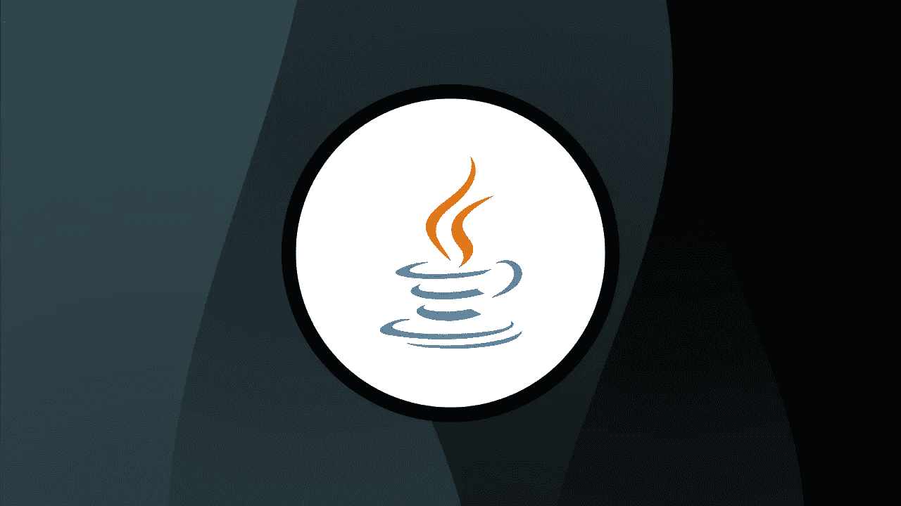

# 学习 Java 编程的 10 门免费 Java 课程

> 原文：<https://medium.com/quick-code/10-free-java-courses-for-beginners-2022-aug-learn-java-online-e8bd09f923eb?source=collection_archive---------1----------------------->

## 这里有一些免费的 java 课程，可以帮助你开始成为一名 Java 开发人员。

Free Java Courses

你正在读这篇文章的事实表明你已经决定学习 Java 了。但是首先，在开始学习免费的 java 课程之前，让我们先来谈谈 Java。1995 年，Sun Microsystems 发布了 Java，这是一种面向对象和面向并发的编程语言和平台，类似于 C++，具有精简和增强的功能。今天，包括自然语言处理在内的科学应用程序通常都是用 Java 编写的。因为它安全、可移植、可维护，并且拥有比 C++更好的高级并发工具，所以它已经成为首选语言。与 C++相比，Java 更容易使用，并加强了面向对象的编程模型，这与 C++的外观和感觉很接近。此外，与结合了结构、泛型和面向对象编程的 C++相比，Java 几乎完全专注于面向对象编程。

有了 Java，开发人员在编写和执行代码时不必担心底层的计算架构。与其他编程语言不同，Java 在其虚拟机沙箱中运行，因此您不必关心平台和平台的计算架构。虚拟机沙箱允许应用程序在任何平台上运行，但这也意味着需要 Java 运行时环境，这需要更多的资源。

许多设备都使用 Java 来开发 Java 应用程序，包括笔记本电脑、移动设备、游戏控制台、健康设备、笔记本电脑、数据中心、游戏控制台、科学超级计算机、手机等等。它不仅是开发边缘设备和物联网应用程序最受欢迎的语言之一，也是 android 应用程序最受欢迎的编程语言。现在让我们回到主题，开始学习 Java。

# 免费 Java 课程，供初学者学习 Java

在本文中，我将分享一些最好的免费 Java 课程，供初学者入门 Java。请记住，这些免费的 Java 课程将来可能会再次变成付费课程，所以请将它们放在您的列表中，以避免以后为它们付费。

## 1.[完全初学者 Java 教程](https://click.linksynergy.com/deeplink?id=0F1O0otUXQc&mid=47901&u1=csMedium&murl=https%3A%2F%2Fwww.udemy.com%2Fcourse%2Fjava-tutorial%2F)【Udemy】

学习使用 Java 编程语言编程。

这门课程将帮助你学习 Java 编程语言。这门课没有必备的编程知识，只有学习 Java 的愿望。你将清楚、简明地学习所有的 Java 主题，并得到有意义的解释。

本 Java 课程的主题包括:

*   编程核心 Java
*   Java 集合框架
*   附录
*   试验
*   Java 8 等等。

该课程是 Udemy 上最受欢迎的免费 Java 课程之一。在本课程中，您将了解核心 Java 编程语言和 Java 集合框架。此外，您将了解附录、测试、源代码等。

这是 Udemy 上排名最高的免费 Java 课程，在 5 门课程中获得 4.5 分，时长 6 小时 29 分钟。此外，请记住，由于这是一门免费的 Udemy 课程，所以完成后您不会获得证书。

## 2.[Java 和面向对象编程介绍](https://coursera.pxf.io/c/1137078/1213622/14726?u=https%3A%2F%2Fwww.coursera.org%2Flearn%2Fjava-object-oriented-programming&subId1=csMedium)【Coursera】

Photo by [Emile Perron](https://unsplash.com/@emilep?utm_source=medium&utm_medium=referral) on [Unsplash](https://unsplash.com?utm_source=medium&utm_medium=referral)

本课程介绍 Java 语法以及它与 Python 等其他语言的不同之处。它还概述了面向对象编程和 Java 语言。在本课程中，学生将学习如何编写 Java 类和方法，并使用测试驱动开发和单元测试来测试他们的代码。数组、数组列表和重载方法是本课程的主题。

在本 Java 课程中，您将:

*   了解面向对象编程的核心概念和 Java 的特性。
*   使用 Eclipse 编写和运行 Java 代码。
*   使用 Java 集合、多态和重载方法开发程序，以实现核心的面向对象编程概念。
*   使用 Java 的单元测试框架，通过应用测试驱动开发的原则来测试代码。

在第一个模块中，我们将讲述 Java 和面向对象编程。具体来说，它讨论了 Java 语法与 Python 等语言的不同之处。此外，这个模块教你如何定义你的自定义类和方法，以及 Java 类的结构和内部工作方式。

第二个模块将教你如何测试你的代码。最佳实践是编写一组单元测试，并根据您的程序随时运行它们。本模块讲述了如何在 Java 中进行单元测试，以及为什么我们应该这样做。此外，我们将探索 Java 数组和 ArrayLists，前者是项目的集合，后者比数组灵活得多。在 Python 中，这些就像列表一样工作。在本课程中，我们将继续参考 Java 更大的集合框架，其中包括数组列表。

第三个模块将介绍 Java 类中的静态变量。此外，我们将讨论静态方法。它还将涵盖这个模块中的多态性，这意味着重载和重写。这里我们将讨论重载，即在同一个类中有多个同名的方法。

这是 Coursera 上排名最高的免费 Java 课程，在 5 门课程中获得 4.3 分，时长 6 小时 29 分钟。因为这是一门免费的 Coursera 课程，所以完成后你还会得到一个证书。

## 3. [Java 编程基础](https://www.awin1.com/cread.php?awinmid=6798&awinaffid=466009&clickref=csMedium&ued=https%3A%2F%2Fwww.edx.org%2Fcourse%2Fjava-programming-fundamentals)【edX】

获得 Java 语言的入门级编程技能，并准备好处理任何编程工作中需要的任何任务。

今天，Java 是最流行的编程语言之一。本课程的学生将获得 Java 技能和知识的基本理解。在本课程中，你将学习如何在面向对象范式(OPP)的背景下，使用循环函数、条件语句和递归算法来解决编程问题。

在本 Java 课程中，您将:

*   理解 OOP 范例的基本机制:类、接口、继承、多态等。
*   用条件和循环创建程序。
*   设计和实现递归算法。
*   编写、编译和运行基本的 Java 应用程序。
*   使用网络接口来交流不同的程序。

这门 Java 课程将从 Java 基础知识的介绍开始，然后转到内存区域、Java 垃圾收集类型、包、访问控制、多态性等。此外，您将了解 Java 库、数据结构、泛型、坚实的原则、文件和 I/O 等。

这是 edX 上的顶级免费 Java 课程，时长 40 小时。请记住，由于这是一门免费的 edX 课程，您在完成后不会获得证书。

*   ***课程评分:****23263 总报名人数*
*   ***时长:*** *40 小时*
*   ***证书:*** *竣工证书*

## 4.[学习 Java](https://linkedin-learning.pxf.io/c/1137078/646189/8005?u=https%3A%2F%2Fwww.linkedin.com%2Flearning%2Flearning-java-4&subId1=csMedium) 【领英学习】

这门 Java 课程将让你开始学习 Java 基础知识、控制流、调试、函数、类等。本质上，它将帮助您学习如何编写 Java 代码和创建基本的 Java 应用程序。

本 Java 课程的主题包括:

*   Java 入门
*   建立坚实的基础
*   控制流
*   用 Java 调试
*   Java 中的函数
*   Java 中的类

本课程涵盖四个主要主题:数据类型、字符串、函数和循环。在本课程中，您将学习如何控制代码的流程和逻辑，以及如何调试项目以确保其顺利运行。在整个课程中，你将有机会通过真实世界的例子和挑战来实践你的新技能。除了寻求快速学习 Java 的开发人员之外，这门课程对于第一次尝试这种语言的初级程序员来说是完美的。

这是 Linkedin 上排名第一的免费 Java 课程，在 5 门课程中获得 4.7 分，时长 2 小时 39 分钟。完成后将获得 Linkedin 学习证书。

## 5.[学习中级 Java](https://www.pjatr.com/t/TUJGR0lLR0JHR0pMSUtCR0ZISk1N?sid=csMedium&url=https%3A%2F%2Fwww.codecademy.com%2Flearn%2Flearn-intermediate-java)【Codecademy】

将您的 Java 基础知识向前推进一步，学习中级 Java。

掌握 Java 基础知识？中级 Java 可以让你的技能更上一层楼。您从本课程中获得的知识将帮助您编写更简洁、更高效、更易于管理的 Java 代码。除了挖掘 Java 的基础知识，本课程还将挖掘一些关键概念，这些概念将增强你对编程语言的理解。

本 Java 课程的主题包括:

*   欢迎学习中级 Java
*   输入和输出
*   序列化
*   泛型和集合
*   嵌套类
*   穿线
*   正则表达式
*   JUnit 测试

本课程深入介绍了 Java 最流行的一些特性，通过理解这种语言的独特特性，帮助您成为 Java 专家。完成本课程后，您将了解如何在 Java 程序中使用输入和输出，Java 集合如何在幕后工作，如何使用集合框架，如何使用线程编写更复杂的程序，等等。

这是 Codecademy 上的顶级免费 Java 课程，时长 10 小时。除非您拥有专业会员资格，否则完成后不会获得证书。

## 6. [Java 数据库连接:JDBC 和 MySQL](https://click.linksynergy.com/deeplink?id=0F1O0otUXQc&mid=47901&u1=csMedium&murl=https%3A%2F%2Fwww.udemy.com%2Fcourse%2Fhow-to-connect-java-jdbc-to-mysql%2F)

了解如何使用 Java JDBC 连接到 MySQL 数据库。

Photo by [Sunder Muthukumaran](https://unsplash.com/@sunder_2k25?utm_source=medium&utm_medium=referral) on [Unsplash](https://unsplash.com?utm_source=medium&utm_medium=referral)

在本 Java 课程中，您将:

本课程从介绍 JDBC API 开始，然后讲述使用合适的 MySQL 驱动程序配置开发环境。之后，您将学习如何提交 SQL 查询并处理其结果。此外，您将学习如何执行 SQL 插入、更新和删除。本课程最后概述了 JDBC API。

在本 Java 课程中，您将:

*   用 Java 连接到 MySQL 数据库。
*   提交 SQL 语句来插入、更新和删除数据。
*   用预处理语句处理 SQL 参数。
*   调用存储过程并处理各种参数类型(IN、INOUT 等)。
*   读写 BLOB 和 CLOB 数据文件。
*   用属性文件配置数据库连接信息。

接下来，本课程将介绍一些高级主题，如用于处理 SQL 参数的预准备语句。本课程还包括如何使用不同的参数类型(in、INOUT、OUT 和 ResultSet)调用存储过程。接下来，您将学习如何处理大型数据类型，如 BLOBs 和 CLOBs。最后但同样重要的是，本课程以从数据库读取配置信息这一节结束。

这是 Udemy 上排名最高的免费 Java 课程，在 5 门课程中获得 4.4 分，时长 1 小时 27 分钟。由于这是一门免费的 Udemy 课程，所以完成后您不会获得证书。

## 7.[从零开始学习 Java】【教育性】](https://www.educative.io/courses/learn-java-from-scratch?affiliate_id=5088579051061248)

通过这个交互式课程免费学习 Java，并了解世界上最流行的编程语言之一。

本 Java 课程的主题包括:

*   Java 入门！
*   变量和用户输入
*   简单数学和逻辑
*   字符串和字符串处理
*   条件语句
*   环
*   方法
*   数组
*   类和继承
*   无商标消费品
*   数组列表

本课程将教你几个基本的 Java 概念，如条件语句、循环语句、数学、逻辑和继承，然后再学习更高级的概念，如泛型、数组列表等等。最后，您将学会成为中级 Java 开发人员所需的基本技能，准备好处理您的一些项目。

这是一门顶级的免费 Java 教育课程，时长 12 小时。由于这是一门免费的教育课程，完成后你还将获得一张证书。

## 8.[软件开发:引入 Java](https://click.linksynergy.com/deeplink?id=0F1O0otUXQc&mid=44015&u1=csMedium&murl=https%3A%2F%2Fwww.futurelearn.com%2Fcourses%2Fsoftware-development-python-java-introducing-java-sc)

学习 Java 的基础和用法，帮助你成为一名成功的软件开发人员。

软件开发人员必须能够使用编程语言(如 Java 和 Python)有效地设计、构建软件并排除软件故障。因此，在本课程中，您将在现有知识的基础上学习 Java 在开发环境框架中的功能，以及 Java 应用程序和相关主题的介绍。

本 Java 课程涵盖的主题:

*   Java 是什么？
*   运算符和数组

完成本课程后，您将对 Java 有所了解，从而能够使用多种编程语言。此外，您还将学习它如何工作的基础知识，以及它使用的变量、数据类型和操作符、数组和控制语句。

此外，本课程并不是完全免费的，但您可以在 4 周内使用本课程。但是，如果你想永久拥有它，你可以获得未来学习月会员资格。(₹750/Month).这是 Futurelearn 上的顶级免费 Java 课程，持续时间为 11 小时。

## 9.Java:算法

在这门课中，我们将学习所有关于算法的知识！让我们先来看看递归——方法调用自身意味着什么？在我们理解了这个棘手的概念之后，我们将会看到一些可以用递归来解决的问题。

Photo by [Desola Lanre-Ologun](https://unsplash.com/@heylagostechie?utm_source=medium&utm_medium=referral) on [Unsplash](https://unsplash.com?utm_source=medium&utm_medium=referral)

下一步，我们将考虑如何评估算法的有效性。提出解决问题的方法有几种——你如何知道它是否可行？甚至“更好”这个词也意味着一个解决方案优于另一个。

本 Java 课程涵盖的主题:

*   递归
*   算法复杂性
*   搜索和排序

最后，我们将研究一些最常见的排序和搜索算法。如果你想的话，你会怎样对一系列数字进行排序呢？在字典里找一个单词怎么样？对于其中的每一个问题，我们都会写一些算法。

这是 Codecademy 上的顶级免费 Java 课程，时长 7 小时。除非您拥有专业会员资格，否则完成后不会获得证书。

## 10.[代码小时:用 Java 构建你的机器人世界](https://www.educative.io/courses/hour-of-code-build-your-robot-world-in-java?affiliate_id=5088579051061248)

学习了所有的 Java 基础和中级 Java 之后，是时候做些有趣的事情了。通过引导模拟机器人通过迷宫来学习编码的基本原理。

本 Java 课程涵盖的主题:

*   机器人和代码
*   建造迷宫:变量和对象
*   漫游者:随机数
*   Loopy 漫游者:循环
*   奖励挑战:机器人生态系统

作为本课程的一部分，您将能够在驾驶机器人通过旨在提高您的编码技能的迷宫时学习编码的基础知识。完成本教程后，您将能够使用变量、定义 Java 命令、生成随机数、使用公式和循环来指示计算机重复动作。

这是一门顶级的免费 Java 教育课程，时长 1 小时。完成后你会得到一个证书。

感谢您阅读本文。我希望这个课程能帮助你选择正确的课程来学习 Java。如果你想探索更多，你可以查看我们的[免费 Java 课程](https://coursesity.com/free-tutorials-learn/java)精选列表。

这里还有一些我们认为你会感兴趣的话题！

 [## 让新开发人员最大化工作效率的 7 个惊人技巧

### 成为一名优秀的开发人员不是一件容易的事情。你必须保持一些良好的习惯才能让自己更上一层楼。但是…

medium.com](/quick-code/7-amazing-tips-to-maximize-productivity-for-new-developers-916bcce3eeb1)  [## 目前最受欢迎的 5 种编程语言

### 有很多可用的编程语言，在这么多语言中选择一种你觉得舒服的语言…

medium.com](/quick-code/5-most-popular-programming-languages-in-demand-right-now-20e233b2ff1a)  [## 2022 年对 Python 开发者有用的 10 个 Python 工具

### Python 作为开发人员和数据社区中最受欢迎的语言之一已经不足为奇了…

medium.com](/quick-code/10-useful-python-tools-for-python-developers-in-2022-4c26de31b358)