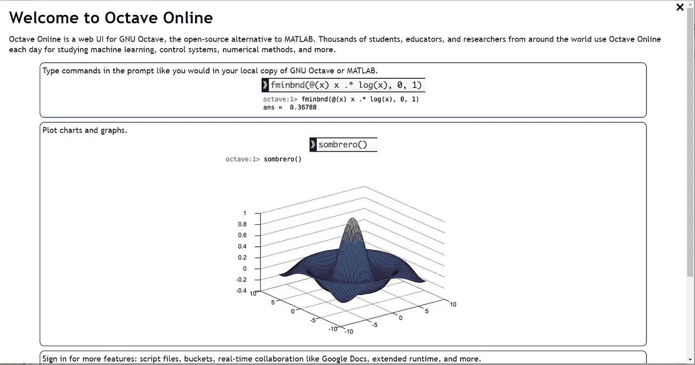
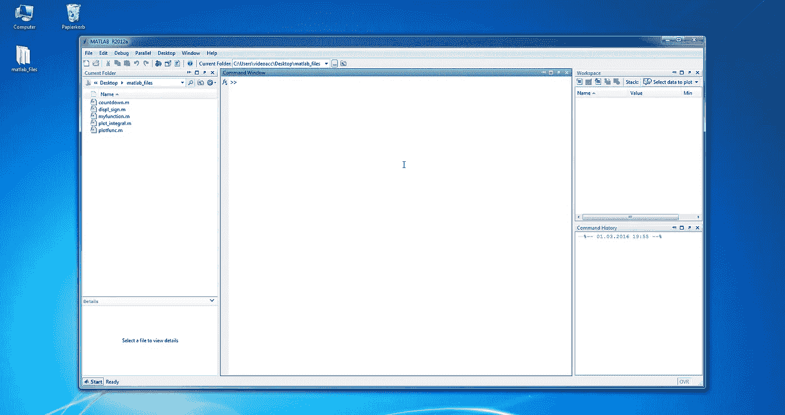
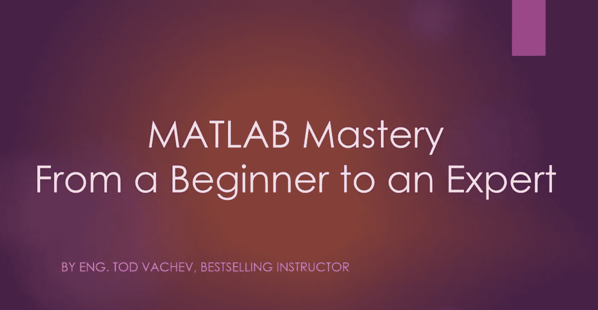

# 面向初学者的 10 门免费 MATLAB 课程和教程

> 原文：<https://medium.com/quick-code/10-free-matlab-courses-tutorials-for-beginners-dbe6116b661e?source=collection_archive---------0----------------------->

Learn MATLAB

为了掌握矩阵和阵列数学，工程师和科学家需要一种编程语言，让他们直接表达自己的想法。这就是 MATLAB 的用武之地！MATLAB 或 Matrix Laboratory 是 MathWorks 开发的一种高级编程语言，用于矩阵操作、数据可视化和复杂的数学计算等数值计算任务。

学习 [MATLAB](https://coursesity.com/blog/best-matlab-tutorials/) 会提高你的编程技能，让你对 MATLAB 应用有所了解。除了[数据科学](https://coursesity.com/blog/best-data-science-bootcamps/)，数据分析，计算机科学，Python，和 [Java](/quick-code/10-free-java-courses-for-beginners-2022-aug-learn-java-online-e8bd09f923eb) ，学习 MATLAB 可以打开许多其他职业机会的大门。在这里，您将找到顶级平台的免费 MATLAB 课程列表，这些课程将帮助您了解科学计算和 MATLAB 编程，并帮助您快速解决 MATLAB 问题。

如果您已经熟悉 C、C++或 Java 等高级语言，MATLAB 是一个很好的学习工具。了解 MATLAB、 [R](https://coursesity.com/best-tutorials-learn/r) 和 [Python](https://coursesity.com/free-tutorials-learn/python) 这些语言对于科学编程是有好处的。

## **1。** [**学习 MATLAB 使用八度音程**](https://click.linksynergy.com/deeplink?id=0F1O0otUXQc&mid=47901&u1=csMedium&murl=https%3A%2F%2Fwww.udemy.com%2Fcourse%2Flearn-matlab-using-octave-online%2F)**——【Udemy】**

Learn MATLAB using Octave

本课程将向您介绍 Octave-online，帮助您掌握 MATLAB 编程。这款免费的跨平台软件可以解释大多数 MATLAB 代码(以及各种其他编程语言)进行数值处理。因此，许多人使用它，即使他们不能访问 MATLAB 来学习和使用它。

在本课程中，您将学习:

*   能够使用在线仿真器学习 MATLAB。
*   使用 Octave-在线

请记住，这不是一门编程课程。在本课程中，您将使用在线工具学习 MATLAB 编程。本教程不会教你如何用 MATLAB 编程；它会教你如何使用免费工具来学习语言。

这是 Udemy 上排名第一的免费 MATLAB 课程，在 5 门课程中获得 4.7 分，时长 38 分钟。此外，请记住，由于这是一门免费的 Udemy 课程，所以完成后您不会获得证书。

## 2.[MATLAB 编程入门](https://coursera.pxf.io/c/1137078/1213622/14726?u=https%3A%2F%2Fwww.coursera.org%2Flearn%2Fmatlab&subId1=csMedium)——【Coursera】

在这门课程中，以前很少或没有计算机编程经验的学生将学习计算机编程的基础知识。因此，工程师和其他专业人员可以通过使用称为 MATLAB 的编程系统和语言来节省时间、提高效率并提供高质量的结果。

在本课程中，您将学习:

*   基本的计算机编程概念，如变量、控制结构、函数等。
*   关于不同的数据类型以及如何在 MATLAB 中处理它们。
*   MATLAB 为处理矩阵提供了强大的支持。
*   关于文件输入/输出。

然而，这不是一个 MATLAB 教程。该课程向学生介绍了使用 MATLAB 的基本编程概念。完成本课程后，学生将掌握计算机科学、编程和 MATLAB 概念的扎实知识。参加该课程的学生将获得免费的 MATLAB 在线许可证。

这是 Coursera 上排名第一的免费 MATLAB 课程，在 5 门课程中获得 4.8 分，时长 35 小时。另外，请记住，由于这是一门免费的 Coursera 课程，所以你不会在完成后获得证书。旁听这个课程是免费的，但是付费会给你更多的好处。

## 3. [MATLAB 必备](https://www.awin1.com/cread.php?awinmid=6798&awinaffid=466009&clickref=csMedium&ued=https%3A%2F%2Fwww.edx.org%2Fcourse%2Fmatlab-essentials%3F)——【edX】

这门课程给你很多机会练习你新学到的技能。学生将完成自动评分的作业、练习小测验、互动阅读和完成专题。完成本课程后，您将分析自己的数据集，创建单词云，绘制地理数据，并制作动画来打动您的同事。

在本课程中，您将学习:

*   从电子表格和文本文件中访问各种格式的数据。
*   为二维、三维、地理、文本和时序数据创建专业质量的可视化效果。
*   执行典型的分析任务，如组统计或处理数据。
*   创建动画来可视化随时间的变化。
*   与同事分享工作以实现协作。

此外，本课程还提供了您准备 MathWorks 认证 MATLAB 助理考试所需的技能。专业认证可以帮助你获得有价值的可转移技能，在就业市场上脱颖而出，并加快你的职业发展。

这是 edX 上的顶级免费 MATLAB 课程，持续时间为 4 周(每周 4-7 小时)。此外，请记住，由于这是一门免费的 edX 课程，所以完成后您不会获得证书。旁听这个课程是免费的，但是付费会给你更多的好处。

## 4.[学习 MATLAB](https://linkedin-learning.pxf.io/c/1137078/646189/8005?u=https%3A%2F%2Fwww.linkedin.com%2Flearning%2Flearning-matlab-2%2Fwelcome&subId1=csMedium)——【Linkedin 学习】

Steven Moser 教授的 MATLAB 课程将帮助您利用 MATLAB 工具并创建程序来模拟您的数据和假设。在开始本课程之前，您将学习如何创建简单的变量和单元格数组，以及如何使用与大多数其他编程语言显著不同的核心 MATLAB 语法。之后，您将学习如何使用脚本、创建函数、处理矩阵以及调试程序。

本课程的主题包括:

*   一般概念
*   核心 MATLAB 语法
*   MATLAB 编程
*   数据表示
*   Simulink 简介

在本课程中，您将学习如何在 2D 和 3D 中创建图表、添加注释以及合并图像来说明您的发现。最后一章介绍 Simulink，一个用于绘制框图的 MATLAB 工具。

这是 LinkedIn 上排名第一的免费 MATLAB 课程，5 门课程中的 4.7 分，时长 1 小时 13 分钟。完成后，您将获得 LinkedIn 证书。

## 5.[30 分钟后的 MATLAB](https://click.linksynergy.com/deeplink?id=0F1O0otUXQc&mid=47901&u1=csMedium&murl=https%3A%2F%2Fwww.udemy.com%2Fcourse%2Fmatlab-in-30min-for-beginners%2F)——【Udemy】

MATLAB Tutorial

这门课程将在 30 分钟内教会你 Matlab 编程。该课程旨在为希望编写程序和例程并解决数值问题的工程专业学生提供快速而全面的 Matlab 介绍。

在本课程中，您将学习:

*   Matlab 编程
*   算术和关系运算符
*   矩阵和向量运算
*   控制结构和循环
*   编写和使用函数
*   绘制和分析数据
*   求解线性系统

这是 Udemy 上排名第一的免费 MATLAB 课程，在 5 门课程中获得 4.5 分，时长 37 分钟。此外，请记住，由于这是一门免费的 Udemy 课程，所以完成后您不会获得证书。

## 6.[用 MATLAB 掌握编程](https://coursera.pxf.io/c/1137078/1213622/14726?u=https%3A%2F%2Fwww.coursera.org%2Flearn%2Fadvanced-matlab-programming&subId1=csMedium)——【Coursera】

在本课程中，我们将涵盖编程中的高级概念，包括递归、向量化、函数句柄、算法效率等。虽然 MATLAB 提供了许多对工程和科学计算很重要的特性，但它也提供了许多支持面向对象编程、用户界面设计和实时脚本的特性。

在本课程中，您将:

*   学习与函数相关的高级概念，如递归和函数句柄。
*   学习如何编写高效的程序。
*   学习面向对象编程的基础。
*   学习编写实时脚本和创建专业的图形用户界面。

完成本课程后，您将熟悉更高级的编程概念，能够编写更高效的代码，并能够创建面向对象的 MATLAB 应用程序。

这是 Coursera 上排名第一的免费 MATLAB 课程，在 5 门课程中获得 4.8 分，时长 56 小时。另外，请记住，由于这是一门免费的 Coursera 课程，所以你不会在完成后获得证书。旁听这个课程是免费的，但是付费会给你更多的好处。

## 7.[初学者的 MATLAB 基础——向顶级专家学习](https://click.linksynergy.com/deeplink?id=0F1O0otUXQc&mid=47901&u1=csMedium&murl=https%3A%2F%2Fwww.udemy.com%2Fcourse%2Fmatlab-basics-for-beginners-learn-from-top-experts%2F)——【Udemy】

MATLAB for Beginners

该课程是在 Hristo Zhivomirov 的密切指导下开发的，他是 MATLAB 全球 50 大贡献者之一。它的结构使得那些刚接触 MATLAB 的人和有一些经验的人都能从中受益；这两个群体都有大量的信息。学完这门课，你将成为一名 MATLAB 高手。

在本课程中，您将:

*   获得 MATLAB 的工作知识。
*   根据您的喜好定制 MATLAB。
*   用 MATLAB 进行各种算术运算。
*   对向量的理解。
*   矩阵的理解。
*   基本的数据可视化。
*   基本条件语句— If/Else。
*   基本循环。
*   基本功能。

这是 Udemy 上排名第一的免费 MATLAB 课程，在 5 门课程中获得 4.2 分，时长 2 小时 10 分钟。此外，请记住，由于这是一门免费的 Udemy 课程，所以完成后您不会获得证书。

## 8.[介绍用 MATLAB 进行数据、信号和图像分析](https://coursera.pxf.io/c/1137078/1213622/14726?u=https%3A%2F%2Fwww.coursera.org%2Flearn%2Fmatlab-image-processing&subId1=csMedium)——【Coursera】

MATLAB 是一种非常通用的数据、信号和图像分析编程语言。在本课程中，您将学习如何使用 MATLAB 分析数据、信号和图像。

在本课程中，您将:

*   理解信号、图像和数据在 MATLAB 中是如何表示和操作的
*   获得数据可视化方法的经验，包括 MATLAB 中的高维数据集。
*   在 MATLAB 中应用机器学习方法进行数据分类和预测。
*   学习 MATLAB 中基本的信号频率分析和图像处理方法。

完成本课程后，学员将学习如何使用 MATLAB 中的机器学习方法进行数据分类和预测，执行图像处理和分析方法，如图像滤波和图像分割，执行常见的信号分析任务等。

这是 Coursera 上排名第一的免费 MATLAB 课程，在 5 门课程中获得 4.7 分，时长 23 小时。另外，请记住，由于这是一门免费的 Coursera 课程，所以你不会在完成后获得证书。旁听这个课程是免费的，但是付费会给你更多的好处。

## 9. [MATLAB 和 Octave for 初学者](https://www.awin1.com/cread.php?awinmid=6798&awinaffid=466009&clickref=csMedium&ued=https%3A%2F%2Fwww.edx.org%2Fcourse%2Fmatlab-and-octave-for-beginners%3F)—【edX】

通过本课程，您将学习 MATLAB 和 Octave，并获得操作矩阵数据、可视化数据和计算数学函数的经验。

在本课程中，您将学习:

*   使用 MATLAB 和 Octave 编写脚本和函数。
*   使用向量和矩阵。
*   来处理数据文件。
*   绘制图形并以 pdf 和 jpg 格式保存。
*   编写交互式程序。

这门自定进度的实践课程向学生介绍编写函数、计算向量和矩阵以及以图形方式显示结果。此外，您将探索使用脚本和函数来组织工作以提高生产率的方法。

## 10.[完整的 MATLAB 课程:从初级到高级](https://www.youtube.com/watch?v=T_ekAD7U-wU)

来自 [Joseph Delgadillo](https://www.youtube.com/c/JosephDelgadillo) 的 MATLAB 课程将帮助你掌握 MATLAB 的基础知识以及其他主题，如基本语法、命令窗口、工作目录等。在本课程中，您将学习内置函数和常数，以及如何编写自己的函数。

感谢阅读这篇关于免费 MATLAB 课程和教程的文章。如果你喜欢这篇文章，请在评论中告诉我。你学习 MATLAB 的经验是什么？在评论里告诉我！

这里有一些更有用的帖子供你查看:

 [## 5 个免费 Dart 编程课程，供初学者学习 Dart

### 通过 Udemy、Educative、YouTube 等顶级平台的 Dart 编程课程学习 Dart。

medium.com](/quick-code/5-free-dart-programming-courses-for-beginners-to-learn-dart-d4d49c7f7a93)  [## 开发者必备的 11 个 Chrome 扩展

### 下面是我为开发者列出的 11 个谷歌 Chrome 扩展，让他们可以轻松工作。

medium.com](/quick-code/11-must-have-chrome-extensions-for-developers-c438b0c8ba2d)  [## 学习 React Native 的五大免费在线课程

### 下面列出了 Udemy、Coursera、edX 等领先提供商提供的顶级免费 React 本地课程！

medium.com](/quick-code/top-5-free-online-courses-to-learn-react-native-7a643df06dd7)