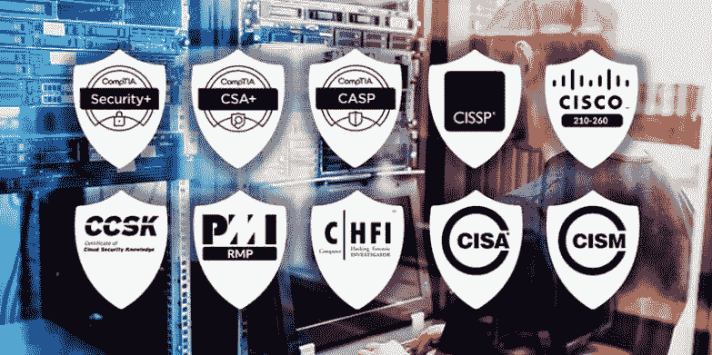

# 2020 年 IT 专业人员应追求的 10 大热门网络安全认证

> 原文：<https://medium.com/quick-code/10-hot-cyber-security-certifications-for-it-professionals-to-pursue-in-2020-d29cc94b151f?source=collection_archive---------1----------------------->

根据 Global Knowledge 进行的一项全球 IT 技能和工资研究，拥有安全认证的 IT 员工的平均工资往往比没有安全认证的员工高得多，大约高出 15%。

网络安全风险投资公司预测，到 2021 年，将有 350 万个网络安全职位空缺，高于 2020 年的 100 万个空缺。

现在每个 IT 岗位也是网络安全岗位。每个 IT 工作者、每个技术工作者都需要参与保护和捍卫应用程序、数据、设备、基础架构和人员。

那么，哪些网络安全认证最有价值呢？那得看你问谁了，看你怎么看。虽然一些证书比其他证书支付的更多(查看调查)，但其中一些证书之间的差异可以忽略不计——它们都是有价值的。更多信息请访问 [**网络安全在线培训**](https://onlineitguru.com/cyber-security-training.html) **。**

**10 大热门网络安全认证**

以下是《网络犯罪》杂志编辑整理的 2019 年 IT 工作者 10 大热门安全认证:

*   **认证道德黑客(CEH)** —认证道德黑客是一名熟练的专业人员，他了解并知道如何寻找目标系统中的弱点和漏洞，并使用与恶意黑客相同的知识和工具，但以合法合理的方式评估目标系统的安全状况。要成为职业黑客，请参加 [**职业黑客在线培训**](https://onlineitguru.com/ethical-hacking-course.html)
*   **风险和信息系统控制(CRISC)认证** — CRISC 是唯一一个让 IT 专业人员能够应对 IT 和企业风险管理的独特挑战，并使他们成为企业战略合作伙伴的认证。
*   **认证信息隐私专家/美国(CIPP/美国)** —以 ANSI/ISO 认证为后盾，CIPP/美国证书提供更高的收入潜力和更多的晋升机会，因为它表明您对美国隐私法律法规有很强的理解。
*   **注册信息安全经理(CISM)** — CISM 意味着更高的收入潜力和职业发展。最近的独立研究一致将 CISM 列为薪酬最高、最受 IT 认证追捧的国家之一。
*   **注册信息系统审计师(CISA)** —通过获得 CISA 来提升您的职业生涯，作为审计、控制、监控和评估信息技术和业务系统人员的成就标准而享誉全球。
*   **认证信息系统安全专家(CISSP)** —通过 CISSP 认证加速您的网络安全职业生涯。获得 CISSP 奖证明您具备有效设计、实施和管理一流网络安全项目的能力。

 [## 2020 年十大网络安全趋势值得关注

### 2019 年，网络安全问题在新闻中占据了一席之地，无论是对科技行业还是…

cybersecuritycourses.blogspot.com](https://cybersecuritycourses.blogspot.com/2019/12/top-10-cyber-security-trends-to-look.html) 

*   **思科认证网络安全协会(CCNA)** —通过 CCNA 安全认证，网络专业人员可以展示开发安全基础设施、识别网络威胁和漏洞以及缓解安全威胁所需的技能。
*   **思科认证网络专业安全(CCNP)** —该认证与思科网络安全工程师的工作职责一致，负责路由器、交换机、网络设备和装置的安全，以及为其网络环境选择、部署、支持防火墙、VPN 和 IDS/IPS 解决方案并排除故障。
*   **CompTIA Security+**—CompTIA Security+是 IT 专业人员应该获得的第一个安全认证。它建立了任何网络安全角色所需的核心知识，并为中级网络安全工作提供了跳板。
*   **计算机黑客取证调查员(C|HFI)** —计算机调查技术正被全球的警察、政府和企业实体所使用，其中许多人求助于欧盟委员会的计算机黑客取证调查员 CHFI 认证计划。

“如果你知道网络安全，那么你就有了一份终身工作，”罗伯特·赫贾维克说，他是美国广播公司鲨鱼池的鲨鱼，也是价值 3 亿美元的网络安全公司赫贾维克集团的首席执行官。

> 通过网络安全认证，将您的职业生涯推向新的成功高度。报名参加 [**网络安全培训**](https://onlineitguru.com/cyber-security-training.html) **的现场免费演示。**

对于不知道从哪里开始的新手，我们推荐 CompTIA Security+计划。获得认证后，你就可以称自己为网络安全专家了。

为了了解未来的职业选择,《网络犯罪》杂志公布了 50 个网络安全标题，每个求职者都应该知道。

如果你已经在这个领域工作过，那么你可能想看看薪酬超过 20 万美元的前 5 大安全工作。