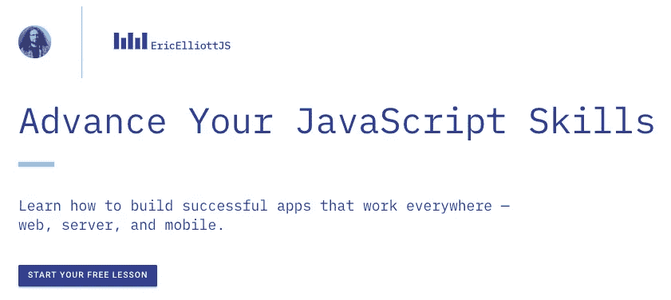

# 每个 JavaScript 开发人员都应该知道的 10 个面试问题

> 原文：<https://medium.com/javascript-scene/10-interview-questions-every-javascript-developer-should-know-6fa6bdf5ad95?source=collection_archive---------0----------------------->

## 又名:掌握 JavaScript 的关键

# 更新时间:2020 年

在我写这篇文章的这些年里，发生了很多变化。当我写这篇文章时，许多开发人员从 Java 和 C++等语言转向 JavaScript，对对象在 JavaScript 中的工作方式缺乏任何了解，并试图应用过时的模式，如深层继承层次结构。

部分由于有影响力的软件开发人员和框架作者的警告(特别是 React 的作者，他们明智地听取了警告并鼓励更好的替代方案，如高阶组件和习惯 React 的 React 挂钩)，JavaScript 中过度使用类继承的趋势已经基本消失。没有人会想念它。

在最近的工作面试中，我是这样做的:

**要求候选人使用任何流行的框架构建一个点击计数器**(2020 年首选 React)。这个简单得可笑的应用程序只有一个工作:记录用户在当前会话中点击按钮的次数。没有存储。没有网络 I/O。只计算点击次数。它故意简单得可笑:我们不想难倒开发人员——我们只是想验证他们知道如何编码。我更喜欢通过远程 Zoom 会议在结对编程会议中这样做——没有必要让候选人飞到某个办公室只是为了看他们编程。

**向考生提问** [**一系列关于通用编程概念的问题**](/javascript-scene/master-the-javascript-interview-what-is-a-closure-b2f0d2152b36) ，比如[闭包](/javascript-scene/master-the-javascript-interview-what-is-a-closure-b2f0d2152b36)和[承诺](/javascript-scene/master-the-javascript-interview-what-is-a-promise-27fc71e77261)。这些问题包括与软技能相关的常见问题——代码只是你需要了解的潜在雇员的一部分。你还需要知道候选人是容易相处还是难以相处。喜欢一起工作的开发人员将会有更多的乐趣和更高的生产力。

**郑重声明:**在 JavaScript 中，函数式编程基本上赢得了类继承。像 React、Redux、RxJS、Lodash 和 Ramda 这样的库和框架在基于继承的库和框架上占主导地位。他们都更喜欢函数式编程，而不是基于类的单一代码。

管理人员: DevAnywhere.io 可以帮助你雇佣、加入和领导你的开发团队。我们能为您做些什么？

以下是原文，供历史参考:

# 原始文章从这里开始

在大多数公司，管理层必须信任开发人员进行技术面试，以评估候选人的技能。如果你作为候选人表现出色，你最终会需要面试。以下是方法。

# 它从人开始

在[“如何建立一个高速开发团队”](/javascript-scene/how-to-build-a-high-velocity-development-team-4b2360d34021)中，我提出了几个值得重复的观点:

> “没有什么比优秀的团队更能预测业务成果。如果你想战胜困难，你首先需要在这里投资。”

正如马库斯·莱莫尼斯所说，关注 3 P:

> “人员、流程、产品”

你的早期雇员应该是非常强大的高级候选人。能够雇佣和指导其他开发人员，并帮助你最终想要雇佣的中级和初级开发人员的人。

阅读[“为什么在科技行业招聘如此困难”](/javascript-scene/why-hiring-is-so-hard-in-tech-c462c3230017)了解对候选人评估的一般注意事项。

> 评估候选人
> 的最佳方式是一对编程练习。

将程序与候选人配对。让候选人开车。多看多听，少说话。一个好的项目可能是从 Twitter API 中提取推文，并在时间轴上显示它们。

也就是说，没有一个单独的练习能告诉你你需要知道的一切。面试也是一个非常有用的工具，但是不要浪费时间去问语法或者语言方面的问题。你需要看到全局。询问架构和范例——对整个项目有重大影响的重大决策。

语法和功能很容易谷歌。对于软件工程智慧或 JavaScript 开发人员通过经验获得的常见范例和习惯用法，谷歌搜索要困难得多。

JavaScript 是特殊的，它在几乎每个大型应用程序中都扮演着重要的角色。JavaScript 与其他语言的显著区别是什么？

这里有一些问题可以帮助你探索真正重要的东西:

## 1.你能说出两个对 JavaScript 应用开发者很重要的编程范例吗？

JavaScript 是一种多范例语言，支持**命令式/过程式**编程以及 **OOP** (面向对象编程)和**函数式编程**。JavaScript 通过**原型继承**支持 OOP。

**好消息:**

*   原型继承(也就是:原型，OLOO)。
*   函数式编程(还有:闭包、一级函数、lambdas)。

**危险信号:**

*   不知道什么是范式，没有提到原型 oo 或函数式编程。

**了解更多:**

*   [JavaScript 第 1 部分的两大支柱](/javascript-scene/the-two-pillars-of-javascript-ee6f3281e7f3) —原型 OO。
*   JavaScript 第二部分的两大支柱 —函数式编程。

## 2.什么是函数式编程？

函数式编程通过组合数学函数产生程序，避免共享状态和可变数据。Lisp(指定于 1958 年)是最早支持函数式编程的语言之一，并且深受 lambda 演算的启发。Lisp 和许多 Lisp 家族语言至今仍在普遍使用。

函数式编程是 JavaScript 中的一个基本概念(JavaScript 的两大支柱之一)。ES5 中的 JavaScript 增加了几个常用的功能工具。

**很高兴听到:**

*   纯函数/函数纯度。
*   避免副作用。
*   简单的函数构成。
*   函数式语言的例子:Lisp，ML，Haskell，Erlang，Clojure，Elm，F Sharp，OCaml 等等…
*   提到支持 FP 的特性:一级函数、高阶函数、作为自变量/值的函数。

**红旗:**

*   没有提到纯功能/避免副作用。
*   无法提供函数式编程语言的例子。
*   无法识别启用 FP 的 JavaScript 功能。

**了解更多:**

*   [JavaScript 的两大支柱第 2 部分](/javascript-scene/the-two-pillars-of-javascript-pt-2-functional-programming-a63aa53a41a4)。
*   [永恒不变之道](/javascript-scene/the-dao-of-immutability-9f91a70c88cd)。
*   [排版软件](/javascript-scene/composing-software-an-introduction-27b72500d6ea)。
*   哈斯克尔音乐学院。

## 3.经典继承和原型继承有什么区别？

**类继承:**实例从类继承(就像蓝图——类的描述),并创建子类关系:层次类分类法。实例通常通过带有 *`new`* 关键字的构造函数来实例化。类继承可能使用也可能不使用 ES6 中的 *`class`* 关键字。

**原型继承:**实例直接从其他对象继承。实例通常通过工厂函数或 *`Object.create()'来实例化。实例可以由许多不同的对象组成，允许容易的选择性继承。*

> 在 JavaScript 中，原型继承比类继承更简单也更灵活。

**好听:**

*   类:创建紧密耦合或层次/分类法。
*   原型:提到串联继承、原型委托、功能继承、对象组合。

**危险信号:**

*   相对于类继承，没有对原型继承和组合的偏好。

**了解详情:**

*   [JavaScript 第 1 部分的两大支柱](/javascript-scene/the-two-pillars-of-javascript-ee6f3281e7f3) —原型 OO。
*   关于 JavaScript 继承的常见误解。

## 4.函数式编程 vs 面向对象编程的优缺点是什么？

**OOP 优点:**很容易理解对象的基本概念，也很容易解释方法调用的意义。OOP 倾向于使用命令式风格而不是声明式风格，声明式风格读起来就像是计算机要遵循的一组直接的指令。

OOP 缺点: OOP 通常依赖于共享状态。对象和行为通常被固定在同一个实体上，该实体可能被任意数量的具有不确定顺序的函数随机访问，这可能导致不期望的行为，例如竞争条件。

**FP 优点:**使用函数范式，程序员避免了任何共享状态或副作用，这消除了多个函数竞争相同资源所导致的错误。与 OOP 相比，有了诸如可用的单点自由风格(也称为隐性编程)等特性，函数往往会被彻底简化，并且容易重组为更普遍的可重用代码。

FP 也倾向于声明式和指示式风格，这种风格不详细说明操作的一步一步的指令，而是专注于**做什么**做什么，让底层函数负责**如何做**。这为重构和性能优化留下了巨大的空间，甚至允许您用更有效的算法替换整个算法，而只需很少的代码更改。(例如，memoize，或者使用惰性求值来代替急切求值。)

利用纯函数的计算也很容易跨多个处理器或跨分布式计算集群扩展，而不用担心线程资源冲突、竞争条件等

**FP 的缺点:**对 FP 特性的过度利用，比如无点式风格和大型组合，可能会降低可读性，因为最终的代码通常更抽象、更简洁、更不具体。

比起函数式编程，更多的人熟悉 *OO* 和命令式编程，所以即使是函数式编程中常见的习惯用法也会让新团队成员感到困惑。

FP 比 OOP 有一个更陡峭的学习曲线，因为 OOP 的广泛流行使得 OOP 的语言和学习材料变得更加会话化，而 FP 的语言倾向于更加学术和正式。FP 概念经常被写到使用 lambda 演算、代数和范畴理论中的习惯用法和符号，所有这些都需要在这些领域中的先验知识基础才能被理解。

**很高兴听到:**

*   提到共享状态的问题，不同的事物竞争相同的资源，等等…
*   意识到 FP 能够从根本上简化许多应用程序。
*   意识到学习曲线的差异。
*   阐明副作用以及它们如何影响程序的可维护性。
*   意识到一个高功能的代码库可能有一个陡峭的学习曲线。
*   意识到一个高度面向对象的代码库与一个等价的面向对象的代码库相比，可能非常难以改变并且非常脆弱。
*   意识到不变性会产生一个非常容易访问和延展的程序状态历史，允许轻松添加诸如无限撤销/重做、倒带/重放、时间旅行调试等功能。在任一范例中都可以实现不变性，但是共享有状态对象的激增使得 OOP 中的实现变得复杂。

**红旗:**

*   无法列出这种或那种风格的缺点——任何经历过这两种风格的人都应该遇到过一些限制。

**了解更多:**

*   [JavaScript 第 1 部分的两大支柱](/javascript-scene/the-two-pillars-of-javascript-ee6f3281e7f3) —原型 OO。
*   JavaScript 的两大支柱第 2 部分 —函数式编程。

## 5.古典传承什么时候是合适的选择？

答案是永远不会，或者说几乎永远不会。肯定不会超过一级。多级类层次结构是一种反模式。我发布这个挑战已经很多年了，我所听到的唯一答案属于几个常见的误解之一。更常见的是，挑战遭遇沉默。

> “如果某项功能有时有用
> 有时危险
> ，如果有更好的选项
> ，那么**总是使用更好的选项**。”
> ~道格拉斯·克洛克福特

**好听:**

*   很少，几乎从来没有，或者从来没有。
*   从一个框架基类如`React.Component`开始，单个级别有时是可以的。
*   "优先选择对象组合而不是类继承."

**了解更多:**

*   JavaScript 第 1 部分的两大支柱 —原型 OO。
*   [JS 对象——继承了一个烂摊子](http://davidwalsh.name/javascript-objects)。

## 6.什么时候原型继承是合适的选择？

有不止一种类型的原型继承:

*   **委托**(即原型链)。
*   **串联**(即 mixins， *`Object.assign()`* )。
*   **功能**(不要与功能编程混淆。用于创建私有状态/封装的闭包的函数)。

每种类型的原型继承都有它自己的用例集，但是它们在支持**组合的能力上是同样有用的，创建**的**有一个**或**用途——一个**或**可以做**的关系，与用类继承创建的**是一个**关系相反。

很高兴听到这个消息:

*   在模块或函数式编程不能提供明显解决方案的情况下。
*   当您需要从多个来源合成对象时。
*   任何时候你需要遗产。

**危险信号:**

*   不知道何时使用原型。
*   不知道 mixins 或 *`Object.assign()`。*

**了解更多:**

*   [“JavaScript 应用程序编程”:原型部分](http://chimera.labs.oreilly.com/books/1234000000262/ch03.html#chcsrdou100015eilvj6l9inj)。

## 7.“重对象组合轻类继承”是什么意思？

这是引用自[“设计模式:可重用面向对象软件的元素”](http://www.amazon.com/Design-Patterns-Elements-Reusable-Object-Oriented/dp/0201633612)。这意味着代码重用应该通过将更小的功能单元组装成新的对象来实现，而不是从类继承和创建对象分类法。

换句话说，使用 **can-do、has-a、**或 **uses-a** 关系而不是 **is-a** 关系。

**好听:**

*   避免等级制度。
*   避免脆弱的基类问题。
*   避免紧密耦合。
*   避免僵化的分类法(强制的 is-a 关系最终对于新的用例是错误的)。
*   避免大猩猩香蕉问题(“你想要的是一根香蕉，你得到的是一只拿着香蕉的大猩猩，以及整个丛林”)。
*   让代码更加灵活。

**红旗:**

*   没有提到上面的任何问题。
*   未能阐明组合和类继承之间的区别，或组合的优势。

**了解更多:**

 [## 介绍邮票规格

### 移过去，` class `:可组合的工厂函数在这里

medium.com](/p/77f8911c2fee) 

## 8.什么是双向数据绑定和单向数据流，它们有什么不同？

双向数据绑定意味着 UI 字段被动态绑定到模型数据，这样当 UI 字段改变时，模型数据也随之改变，反之亦然。

单向数据流意味着模型是事实的唯一来源。UI 中的更改会触发消息，向模型发出用户意图的信号(或“存储”在 React 中)。只有模型有权更改应用程序的状态。其效果是数据总是单向流动，这更容易理解。

单向数据流是确定性的，而双向绑定可能会导致难以跟踪和理解的副作用。

**很高兴听到:**

*   React 是单向数据流的新典范，所以提到 React 是一个很好的信号。Cycle.js 是单向数据流的另一个流行实现。
*   Angular 是一个使用双向绑定的流行框架。

**红旗:**

*   不知道其中任何一个是什么意思。无法清楚地说明区别。

**了解更多:**

## 9.整体架构和微服务架构的优缺点是什么？

整体架构意味着你的应用程序是作为一个内聚的代码单元编写的，其组件被设计为一起工作，共享相同的内存空间和资源。

微服务架构意味着您的应用程序由许多较小的独立应用程序组成，这些应用程序能够在自己的内存空间中运行，并且可以在潜在的许多单独的机器上相互独立地扩展。

**单体优点:**单体架构的主要优点是，大多数应用程序通常都有大量跨领域的问题，如日志记录、速率限制以及审计跟踪和 DOS 保护等安全功能。

当所有东西都在同一个应用程序中运行时，很容易将组件与那些横切关注点联系起来。

由于共享内存访问比进程间通信(IPC)更快，因此也有性能优势。

**整体缺点:**随着应用程序的发展，整体应用程序服务往往会紧密耦合和纠缠在一起，这使得很难出于独立扩展或代码可维护性等目的而隔离服务。

整体架构也更难理解，因为当你看一个特定的服务或控制器时，可能会有不明显的依赖性、副作用和魔力。

**微服务优势:**微服务架构通常组织得更好，因为每个微服务都有一个非常具体的工作，并且不涉及其他组件的工作。分离的服务也更容易重组和重新配置，以服务于不同的应用程序(例如，服务于 web 客户端和公共 API)。

根据它们的组织方式，它们还可能具有性能优势，因为可以隔离热服务并独立于应用程序的其余部分对它们进行扩展。

**微服务缺点:**当您构建一个新的微服务架构时，您可能会发现许多在设计时没有预料到的交叉问题。一个单一的应用程序可以建立共享的神奇助手或中间件来处理这种跨领域的问题，而不需要太多的努力。

在微服务架构中，您要么需要为每个横切关注点承担单独模块的开销，要么将横切关注点封装在另一个服务层中，所有流量都通过该服务层进行路由。

最终，即使是单一体系结构也倾向于通过外部服务层路由流量，以解决跨领域的问题，但是使用单一体系结构，有可能将这项工作的成本推迟到项目更加成熟的时候。

微服务经常部署在它们自己的虚拟机或容器上，导致虚拟机争论工作激增。这些任务通常通过集装箱船队管理工具实现自动化。

**好听:**

*   对微服务持积极态度，尽管初始成本高于 monolthic 应用。意识到从长远来看，微服务的性能和可扩展性更好。
*   微服务与单一应用的实践。构建应用程序，使服务在代码级别上相互独立，但在开始时容易捆绑在一起成为一个整体应用程序。微服务开销成本可以推迟到更实际的时候再支付。

**危险信号:**

*   不了解整体架构和微服务架构之间的差异。
*   对微服务的额外开销不了解或不切实际。
*   没有意识到微服务的 IPC 和网络通信带来的额外性能开销。
*   对微服务的弊端过于消极。无法清晰地表达分离整体应用程序的方式，以便在时机到来时可以轻松地将其拆分为微服务。
*   低估了独立可扩展微服务的优势。

## 10.什么是异步编程，为什么它在 JavaScript 中很重要？

同步编程意味着，除了条件和函数调用之外，代码从上到下顺序执行，阻塞长时间运行的任务，如网络请求和磁盘 I/O。

异步编程意味着引擎在事件循环中运行。当需要一个阻塞操作时，请求被启动，代码继续运行而不会阻塞结果。当响应就绪时，触发一个中断，这将导致运行一个事件处理程序，控制流将继续。这样，单个程序线程可以处理许多并发操作。

用户界面本质上是异步的，大部分时间都在等待用户输入来中断事件循环和触发事件处理程序。

默认情况下，Node 是异步的，这意味着服务器的工作方式基本相同，在循环中等待网络请求，并在处理第一个请求的同时接受更多的传入请求。

这在 JavaScript 中很重要，因为它非常适合用户界面代码，并且对服务器性能非常有益。

**很高兴听到:**

*   理解阻塞的含义及其对性能的影响。
*   理解事件处理，以及为什么它对 UI 代码很重要。

**红旗:**

*   不熟悉术语异步或同步。
*   无法阐明性能含义或异步代码和 UI 代码之间的关系。

# 结论

坚持高层次的话题。如果他们能够回答这些问题，这通常意味着他们有足够的编程经验在几周内学会语言的奇怪之处&语法，即使他们没有很多 JavaScript 经验。

不要因为简单易学的东西(包括经典的 CS-101 算法，或任何类型的难题)就取消候选人的资格。

你真正需要知道的是，“这个候选人知道如何把一份申请放在一起吗？”

口语面试到此为止。

在真正的面试中，我更加强调编码挑战和 ***观察候选人编码。*** 那些话题在我的[“掌握 JavaScript 面试”](/javascript-scene/master-the-javascript-interview-what-is-a-closure-b2f0d2152b36)系列中有深入的探讨。

[Start your free lesson on EricElliottJS.com](https://ericelliottjs.com/premium-content/lesson-pure-functions)

***埃里克·艾略特*** *是一位科技产品和平台顾问，《 [*【作曲软件】*](https://slack-redir.net/link?url=https%3A%2F%2Fleanpub.com%2Fcomposingsoftware)*[*【EricElliottJS.com】*](https://slack-redir.net/link?url=http%3A%2F%2FEricElliottJS.com)*[*devanywhere . io*](https://slack-redir.net/link?url=http%3A%2F%2FDevAnywhere.io)*的联合创始人，以及 dev 团队导师。他曾为 Adobe Systems、* ***、Zumba Fitness、*** ***【华尔街日报、*******【ESPN、*******【BBC】****等顶级录音艺人和包括* ***Usher、【Metallica】********

*他和世界上最美丽的女人享受着与世隔绝的生活方式。*