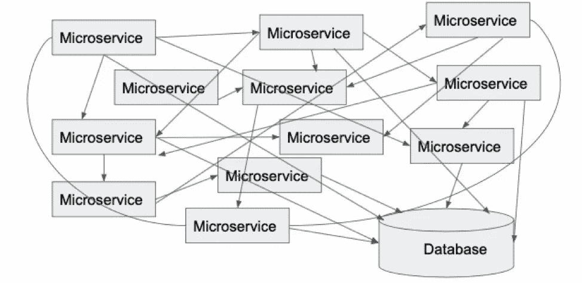
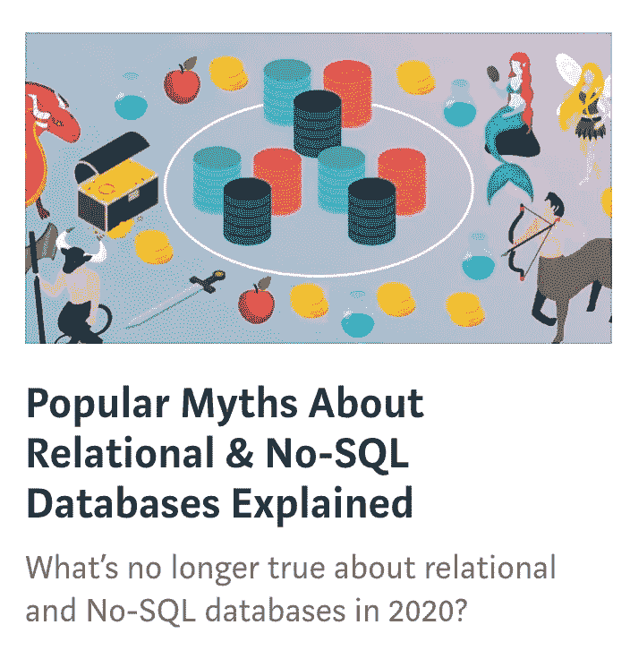

# 最佳架构设计的 10 项微服务最佳实践

> 原文：<https://medium.com/capital-one-tech/10-microservices-best-practices-for-the-optimal-architecture-design-capital-one-de16abf2a232?source=collection_archive---------0----------------------->

微服务从根本上改变了服务器端引擎的架构方式。微服务反映了分布式系统模型，在这种模型中，一组应用程序组件协同工作来满足业务需求，而不是一个巨大的单一代码库来承载应用程序的所有业务逻辑。通过遵循十个基本的微服务最佳实践，您可以实现一个高效的微服务生态系统，消除不必要的架构复杂性。

# 微服务架构的优势

当从整体式应用程序迁移到微服务架构的过程顺利进行时，将会实现以下优势:

1.  你应该能够用自己选择的语言开发一个微服务，按照自己的节奏独立发布，独立伸缩。
2.  由于一个组织中的不同团队可以独立拥有某些微服务，上市时间应该更快，因为有更多重用的并行开发。
3.  您可以获得更好的故障隔离，因为一个特定微服务中的错误可以被包含，所以生态系统的其余部分不会受到影响。

然而，如果在构建微服务时没有遵循适当的原则，您可能会以这样一个纠缠不清的意大利面条结束。

这变得很难维护，因为它需要与多个团队进行大量的协调来进行更改、发布或实现容错。

充分利用微服务是一门科学，涉及到一些学科。下面的微服务最佳实践和设计原则将帮助您构建松散耦合、分布式和优化的微服务，以提供最佳价值。

# 10 项微服务最佳实践

## 1.单一责任原则

就像代码一样，一个类应该只有一个更改的理由，微服务应该以类似的方式建模。为多个业务环境构建易变的臃肿服务是一种糟糕的做法。

例如:假设你正在为订购一份比萨饼构建微服务。您可以考虑基于每个组件支持的功能构建以下组件，如 InventoryService、OrderService、PaymentsService、UserProfileService、DeliveryNotificationService 等。InventoryService 将只有获取或更新比萨饼类型或浇头清单的 API，同样，其他 API 将提供它们的功能。

## 2.为您的微服务提供单独的数据存储

如果您使用的是所有微服务共享的单一数据库，那么它就违背了拥有微服务的目的。该数据库的任何更改或停机都会影响使用该数据库的所有微服务。为您的微服务需求选择合适的数据库，根据数据库维护的数据定制基础架构和存储，并让它成为您的微服务的专属。理想情况下，任何其他需要访问该数据的微服务只能通过具有写访问权限的微服务所公开的 API 来访问。

## 3.使用异步通信实现松散耦合

为了避免构建紧密耦合组件的网格，可以考虑在微服务之间使用异步通信。

**a.** 异步调用你的依赖项，如下例。

*示例:假设您有一个调用服务 B 的服务 A，一旦服务 B 返回响应，服务 A 就向调用者返回成功。如果调用者对服务 B 的输出不感兴趣，那么服务 A 可以异步调用服务 B，并立即向调用者发出成功响应。*

**b.** 更好的选择是使用事件在微服务之间进行通信。您的微服务将向消息总线发布一个事件，指示状态变化或故障，无论哪个微服务对该事件感兴趣，都会获取并处理它。

*示例:在上面的披萨订单系统中，一旦捕获到订单，就向客户发送通知，或者在订单完成和交付时发送状态消息，这些都可以使用异步通信来实现。通知服务可以侦听订单已提交的事件，并处理给客户的通知。*

## 4.通过使用断路器实现容错来快速故障

如果您的微服务依赖于另一个系统来提供响应，而该系统需要很长时间来响应，那么您的总体响应 SLA 将会受到影响。为了避免这种情况并快速响应，您可以遵循的一个简单的微服务最佳实践是使用断路器来超时外部调用并返回默认响应或错误。断路器模式在下面的参考资料中解释。这将隔离您的服务所依赖的故障服务，而不会导致级联故障，从而保持您的微服务处于良好状态。你可以选择使用像网飞开发的 [Hystrix](https://github.com/Netflix/Hystrix) 这样的大众产品。这比使用 HTTP CONNECT_TIMEOUT 和 READ_TIMEOUT 设置要好，因为它不会在已配置的线程之外增加额外的线程。

## 5.通过 API 网关代理您的微服务请求

与系统中的每个微服务执行 API 认证、请求/响应日志记录和节流功能不同，让 API 网关提前为您执行这些功能将会增加很多价值。调用您的微服务的客户端将连接到 API 网关，而不是直接调用您的服务。通过这种方式，您将避免从您的微服务进行所有这些额外的调用，并且您的服务的内部 URL 将被隐藏，从而使您能够灵活地将流量从 API 网关重定向到您的服务的新版本。当第三方访问您的服务时，这一点甚至更有必要，因为您可以在 API 网关的未授权请求到达您的微服务之前对其进行节流并拒绝它们。您也可以选择使用一个单独的 API 网关来接受来自外部网络的流量。

## 6.确保您的 API 更改是向后兼容的

您可以安全地将更改引入到 API 中，并快速发布它们，只要它们不会破坏现有的调用者。一个可能的选择是通知您的调用者，让他们通过进行集成测试来为您的更改提供一个签名。然而，这是昂贵的，因为所有的依赖关系都需要在一个环境中排队，并且它会因为大量的协调而减慢您的速度。一个更好的选择是对你的 API 采用契约测试。您的 API 的消费者根据他们对您的 API 的预期响应来提供合同。作为一个提供者，你可以将那些合同测试集成为你的构建的一部分，这些将会防止破坏性的改变。消费者可以根据您作为消费者构建的一部分发布的存根进行测试。这样，您可以通过独立测试您的合同变更更快地投入生产。

## 7.版本化您的微服务以应对重大变化

进行向后兼容的更改并不总是可能的。当您进行重大更改时，公开新版本的端点，同时继续支持旧版本。消费者可以在方便的时候选择使用新版本。然而，拥有太多版本的 API 会给维护代码的人带来噩梦。因此，通过与您的客户端合作或在内部将流量重新路由到新版本，有一个规范的方法来废弃旧版本。

## 8.让专用基础设施托管您的微服务

你可以让设计最好的微服务通过所有检查，但是如果托管平台设计不好，它的表现仍然会很差。将您的微服务基础架构与其他组件隔离开来，以获得故障隔离和最佳性能。隔离您的微服务所依赖的组件的基础设施也很重要。

*示例:在上面的披萨订单示例中，假设库存微服务使用库存数据库。不仅库存服务需要专用的主机，库存数据库也需要专用的主机。*

## 9.创建一个单独的发布系列

您的微服务需要有自己独立的发布工具，它不依赖于您组织内的其他组件。这样你就不会踩到对方的脚趾，也不会浪费时间去协调多个团队。

## 10.创造组织效率

虽然微服务给了你独立开发和发布的自由，但是对于横切关注点，需要遵循特定的标准，这样每个团队就不会花时间为它们创建独特的解决方案。这在微服务这样的分布式架构中非常重要，在这种架构中，您需要能够将所有的拼图连接起来，以看到一个整体的画面。因此，企业解决方案对于 API 安全、日志聚合、监控、API 文档、秘密管理、配置管理、分布式跟踪等是必要的。

# ***

通过遵循这些微服务最佳实践，您应该最终拥有一个松散耦合、分布式和独立的微服务系统，在其中您可以获得本文开头列出的微服务架构的真正好处。

# 参考

**API 网关模式**
[微服务模式:API 网关模式](https://microservices.io/patterns/apigateway.html)
[*让我们假设你正在建立一个使用微服务架构模式的网上商店，你是…* 微服务. io](https://microservices.io/patterns/apigateway.html)

**断路器**
[bliki:断路器](https://martinfowler.com/bliki/CircuitBreaker.html)
[*软件系统远程调用运行在不同进程中的软件是很常见的，很可能是在不同的…*martinfowler.com](https://martinfowler.com/bliki/CircuitBreaker.html)

*原载于【https://www.capitalone.com】**。***

# *相关:*

**

**披露声明:2020 资本一。观点是作者个人的观点。除非本帖中另有说明，否则 Capital One 不隶属于所提及的任何公司，也不被这些公司认可。使用或展示的所有商标和其他知识产权是其各自所有者的财产。**