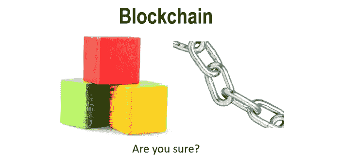
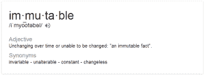
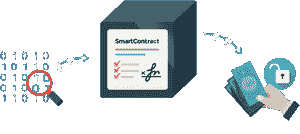
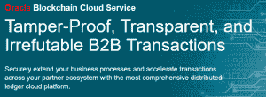
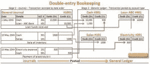
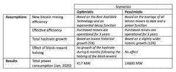
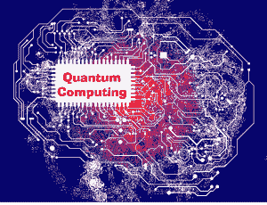
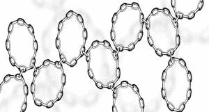

# 现在不实施区块链的 10 个理由

> 原文：<https://medium.com/oracledevs/10-reasons-not-to-implement-blockchain-now-9a284d9392a5?source=collection_archive---------0----------------------->

一个安全的分布式分类帐，具有智能合约功能，不需要银行作为中介！也是具有完全可追溯性的单一事实来源。绝对是我们想要的！区块链技术有望让这一切成为可能。区块链是通过比特币、以太坊这样的加密货币出名的。该技术也可以被认为是取代 B2B 功能。有了新技术，在开始实施之前先看看利弊并不是一个坏主意。区块链是区块上的新生事物，还没有太多的经验表明他将如何与他人合作并走向成熟。在这个博客中，我总结了我对区块链的一些担忧，我希望这些担忧能在适当的时候得到解决。

关于集成领域的新技术/新兴技术，我很乐意研究它们能够提供的潜在价值。例如，我是 Kafka 的大力支持者，Kafka 是一个高度可扩展的流媒体平台和托管微服务的 Docker。然而，我参加了几次会议，并在网上做了一些关于区块链的研究，我对此表示怀疑。我绝对不会自称是这方面的专家，所以如果我错了，请纠正我！还有，这是我个人的看法。这可能会偏离我的雇主和客户的观点。

这里讨论的大多数问题适用于公共区块链。私营区块链当然更加灵活，因为它们可以由公司自己管理。例如，您可以更轻松地将私有区块链迁移到新的区块链技术，或者解决智能合同失效的问题。不过，这些确实需要管理工具、脚本和足够多的开发人员/操作人员围绕你的私人区块链。我不认为这是一个可以部署和运行的解决方案。

# 1 不可变是真的不可变！

一个纯粹的公共区块链(不考虑侧链和链外代码)是一个不可变的链。每个块在其加密中都使用前一个块的哈希值。您不能改变已经在链上的块。这确保你放在链子上的东西不会突然出现或消失。有溯源。因此，你不可能意外地在分布式账本上创造金钱(除非你创建了不可变的智能契约来提供这种功能)。安全性和不变性是很好的东西，但是它们需要你以我们还不习惯的方式工作。例如，您不能取消已确认的交易。你必须做一个新的交易来抵消你想取消的前一个交易的影响。如果您有一个未确认的交易，您可以通过创建一个具有相同输入和更高交易费用的新交易来“取消”它(至少在公共区块链上)。例如，参见[这里的](https://bitcoin.stackexchange.com/questions/23090/how-do-i-cancel-my-blockchain-transaction-still-unconfirmed)。此外，如果你把一个智能合同放在一个公共链上，它有一个别人可以滥用的代码缺陷，你基本上就完蛋了。如果问题足够大，公共区块链可以分叉(如果‘社区’同意)。例如[刀劈以太](https://www.coindesk.com/understanding-dao-hack-journalists/)。在具有私有区块链的企业环境中，您可以分叉链，并在链上的问题得到纠正后重放事务。然而，这需要为每个足够严重的问题执行，并且可能是耗时的操作。在这种情况下，如果你有一个交易的“影子管理”(在你的私人区块链中)会有所帮助。但是，您必须考虑到，根据分叉后发生的变化，事务可能会有不同的结果。这里可能需要小心。

# 2 个智能合同

智能合约！这真的很酷，你还可以把合同放在链子上。契约的执行可以由链上具有许可的节点来验证，并且契约是不可变的。这是一个很酷的功能！

然而，在实施智能合同时存在一些挑战。很多事情变得可能，这种自由有时会产生不必要的副作用。

# 隐猫

你可以在 Etherium 上查找 [CryptoKitties](https://www.cryptokitties.co/) ，一个使用智能合约实现的游戏。[它们会堵塞公共区块链，导致交易时间过长。这已经不是区块链第一次出现拥堵了(比如这里的)。这清楚地表明存在可伸缩性问题，尤其是公共区块链。当使用私有区块链时，如果事务数量增加，这些可伸缩性问题最终也可能发生(当然，您可以在私有区块链上防止 CryptoKitties)。比特币/签证的比较](https://www.coindesk.com/loveable-digital-kittens-clogging-ethereums-blockchain/)是一个经常被引用的例子，尽管对这种比较的有效性有很多讨论。

# 不可变的软件。永远的 HelloWorld！

智能合约是用代码实现的，代码包含错误，而这些错误，取决于实现，有时无法修复，因为链上的代码是不可变的。特别是因为区块链是一项新技术，许多人会将错误代码放到公共区块链上，这些代码将永远留在那里。如果你在区块链上创建 [DAO](https://en.wikipedia.org/wiki/The_DAO_(organization)) (分散的自治组织)，这将变得更加具有挑战性，因为代码库更大。参见 Etherium DAO hack。

因为代码是不可变的，所以它将永远留在链上。每个 hello world 的选拔赛，每个人的每个 CryptoKitten 都会留在那里。随着链上代码量的增加，下载链并成为一个节点将变得更加困难，这是毫无疑问的。

# 商务人士创建智能合同？

一份智能合同可能会让一个商业人士或律师有能力设计/创造它们。如果他们能创造出永远存在于区块链的确定性无错合约，那当然是可能的。这是一个问题，尽管这有多现实。这似乎是一个类似的想法，业务人员可以在业务规则引擎中创建业务规则(“公民开发人员”)。根据我的经验，技术人员需要以受控的、经过测试的方式来做这件事。

# 3 没有中介，没有担保

在你和(公众)区块链之间没有银行。这可能是一件好事，因为银行是吃钱的。然而，举例来说，在区块链失去人气、价值急剧下降或被黑客攻击的情况下(与银行破产相比，例如 [Icesave](https://en.wikipedia.org/wiki/Icesave_dispute) )，你将不会有任何担保，例如[和欧盟的存款担保计划](https://ec.europa.eu/info/business-economy-euro/banking-and-finance/financial-supervision-and-risk-management/managing-risks-banks-and-financial-institutions/deposit-guarantee-schemes_en)。你的钱可能没了。

# 4 更新区块链的代码

更新运行中的区块链的核心代码是由于它的分布式本质，相当具有挑战性。这往往会导致分叉。例如，可以看到像[比特币现金](https://www.bitcoincash.org/)和[比特币黄金](https://arstechnica.com/tech-policy/2017/11/bitcoin-gold-the-latest-bitcoin-fork-explained/)这样的比特币叉子和像[拜占庭](https://www.coindesk.com/ethereums-byzantium-hard-fork-is-running-smoothly-developers-say/)这样的以太叉子。forks 的问题在于，它让整个加密货币领域变得拥挤。这就像过去的欧洲，每个国家都有自己的硬币。如果你想在某个国家消费(使用每个人都想避免的中介)，或者有一叠硬币，你就必须兑换硬币。分支，尤其是硬分支带来了安全挑战，例如[重放攻击](https://coinsutra.com/what-are-replay-attacks/)(可以在不同链上有效的事务)。您可能希望更新代码的一些原因是因为交易缓慢、安全性成为未来的问题(量子计算)或需要新功能(例如，与智能合同相关)。

# 5 区块链和隐私立法(GDPR)

# 安全性

安全性是区块链技术的优势之一，通过设计和默认的 GDPR 要求来帮助实现安全性。不过，还有一些其他的事情需要考虑。

# 被遗忘的权利

放在区块链上的东西是永久的。尽管在某些情况下您可以使其不可访问，但之后您不能删除它们。这与 GDPR 被遗忘的权利相冲突。

# 数据本地化要求

每个节点都有整个区块链，因此所有的数据。这可能会导致立法问题。例如要求数据包含在同一个国家内。当在云环境中运行区块链时，这变得更具挑战性。欧洲有许多相对较小的国家，与美国、俄罗斯或中国相比，这将是一个更大的问题。

# 云中的区块链

这实际上取决于区块链云提供商提供的服务类型以及他们收取的费用。这可能类似于使用银行，要求你支付每笔交易。既然如此，为什么不坚持去银行呢？你能强制节点位于你的国家吗？如果您需要修复损坏的智能合同，是否会有服务请求，云提供商是否会为您派生和重放事务？你能进入区块链吗？他们会提供事务管理器吗？他们会在其 SLA 中保证每秒最大事务数吗？许多问题可能都有答案(每个提供商的答案不同)，根据这些答案，您可以计算使用云区块链是否值得。在云中，遵从 GDPR 的挑战甚至更大(尤其是对欧洲政府和银行而言)。

# 6 丢失了您的私钥？

如果您丢失了您的私钥或者无法访问包含您的私钥的钱包(keystore 的更友好的商业名称),您可能已经丢失了您在区块链上的资产。幸运的是，区块链是安全的，没有简单的方法来解决这个问题。如果您有一个由第三方管理的钱包，他们可能会帮助您找回它。然而，这些第三方经常被黑客攻击(从这种攻击中可以获得很多价值)。例如这里的、这里的和这里的。

# 7 需要一名区块链交易经理

在区块链上进行交易。在将事务分配给所有节点并成为链的一部分之前，事务通常由几个节点进行验证。验证可能会失败或需要一段时间。在一些公共区块链上，这可能是几个小时。可能是该事务被另一个具有更高优先级的事务赶上了。在与区块链解决方案集成的软件中，您必须跟踪交易状态，因为您想知道您资产的最新价值。这导致了一个集成挑战，您可能不得不引入一个具有区块链事务管理器特性的产品。

# 8 资源低效；对环境不好

与经典集成相比，区块链需要大量资源。Everyone 节点拥有完整的链，因此每个人都可以验证事务。这是一件好事，因为如果单个节点被黑客攻击，其他节点将否决该节点提供给链的事务，如果这些事务以任何方式无效的话。然而，这意味着每个事务被分配给所有节点(网络流量),并且每个验证在每个节点(CPU)上执行。此外，当链变得更大时，每个节点都有一个完整的副本，因此磁盘空间没有得到有效利用。例如，请点击查看一些关于区块链用电量的研究[。再比如，单笔比特币交易(每秒可处理 4 笔)需要的电量相当于 5000 笔](https://motherboard.vice.com/en_us/article/aek3za/bitcoin-could-consume-as-much-electricity-as-denmark-by-2020) [VISA 交易](https://spectrum.ieee.org/energy/policy/the-ridiculous-amount-of-energy-it-takes-to-run-bitcoin)(而 VISA 每秒可做 4000 笔交易，此处见)。当然，对于这种比较的有效性有[的讨论](https://hackernoon.com/the-bitcoin-vs-visa-electricity-consumption-fallacy-8cf194987a50)，在未来这很可能会改变。这也表明区块链仍处于早期阶段。

# 9 到期

区块链相对较新，几乎每天都有新的实现出现。几乎没有标准化。下面的图片来自今年在伯明翰举行的 UKOUG Apps17 会议的幻灯片(演示由 David Haimes 提供)。

即使有这么多(部分开源)产品，似乎每个实现都需要一个新产品。比如爱沙尼亚政府就推行了自己的区块链风味； [KSI 区块链](https://e-estonia.com/solutions/security-and-safety/ksi-blockchain/)。很可能最终会有一个最常用的产品，它有望成为最好的产品(不像在[录像带格式大战](https://en.wikipedia.org/wiki/Videotape_format_war)中发生的那样)。

# 哪个产品？

如果你现在选择一个产品来实现，你很可能不会选择几年后最流行的产品。技术/产品的改进会很快赶上你。这可能意味着您必须开始迁移项目。

# 标准？

例如，在 web 服务集成的情况下，有许多国际公认的标准，如 WS-*标准和 SOAP。对于休息服务，有何塞，JWT，当然还有 JSON。区块链有什么？每个产品都使用自己的协议。就像当年微软想出自己的 HTML/JavaScript 标准导致跨浏览器兼容性问题一样。只是这次有几百个微软。

# 10 量子计算

大多数区块链实现都是基于 ECDSA 签名的。椭圆曲线密码系统易受改进的 Shor 算法攻击，该算法用于解决椭圆曲线上的离散对数问题。这有可能在执行交易时从用户的公钥获得用户的私钥(参见此处的[和此处的](https://security.stackexchange.com/questions/34940/is-ecdsa-breakable-by-quantum-computers))。当然，这个问题会得到解决，但是如何解决呢？通过分叉公共区块链？通过引入新区块链？如前所述，更新区块链的技术具有挑战性。

你可以跳上马车，希望这一程不会把你带下悬崖。在实现区块链时，我会非常小心。我不期望在一个企业中，在不需要大量专业知识来应对所有挑战的情况下，就能迅速将实际上值得使用的东西投入生产。

公司将获得这种技术的经验，减轻这些挑战的架构无疑将会出现。一个新的发展也可能是，区块链技术所基于的基本假设在企业环境中不实用，而另一种技术出现来填补这一空白。

# 可供选择的事物

# 不见得

老实说，要找到一个涵盖区块链所有用例的可靠替代方案并不容易。这也可能有助于解释区块链的受欢迎程度。尽管存在许多技术挑战，但在缺乏可靠替代方案的情况下，您应该去哪里实现这些用例呢？

# 斯威夫特？

通过使用 [SWIFT 网络](https://en.wikipedia.org/wiki/Society_for_Worldwide_Interbank_Financial_Telecommunication)(通常通过使用 B2B 应用程序来提供桥梁)来进行国际价值交换。然而，这通常需要手动干预(至少在我的经验中),而且还有安全方面的考虑。[比如 SWIFT 被黑](https://en.wikipedia.org/wiki/2015%E2%80%932016_SWIFT_banking_hack)。

# 卡夫卡？

在 B2B 世界中，拥有一个捍卫共享真理的联盟的想法已经存在了很长一段时间。这样一个联盟使用的技术也可以是卡夫卡主题的集合。如果区块链的所有特性都可以实现，那么就需要对每个用例进行研究。它将执行得更好，消息的顺序(像在区块链中一样)可以得到保证，放在主题上的消息是不可变的，并且您可以使用压缩的主题来获得某些东西的最新值。Kafka 被设计成易于扩展。如果你能创建一个没有缺点的像区块链一样的设置，这可能是值得探索的。

# 外链交易和侧链

一些区块链问题可以通过使用所谓的链外事务和代码来缓解。例如这里的。侧链是现有区块链的扩展，通过添加智能合同和保密交易等功能来增强其隐私性和功能性。

从上面来看，可能不是这样，但我对这项新技术感到兴奋。然而目前在我看来，它仍然是不成熟的。它缺乏标准化、性能，并且区块链的不可变特性可能很难在实际企业中处理。在这篇博客中，我试图让大家意识到在考虑实现时可能会考虑的一些事情。当前实现(仍然？)需要在开发和运营方面进行大量咨询，才能使其发挥作用。这当然是我这行的好事！

*原载于 2017 年 12 月 12 日*[*technology . amis . nl*](https://technology.amis.nl/2017/12/12/10-reasons-not-to-implement-blockchain-now/)*。*