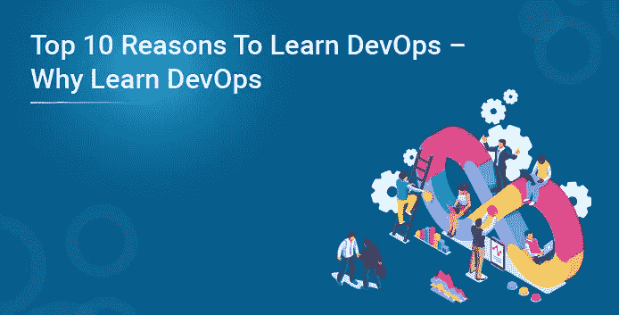
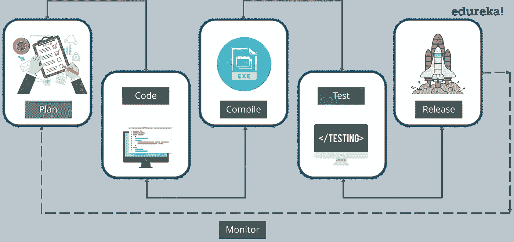
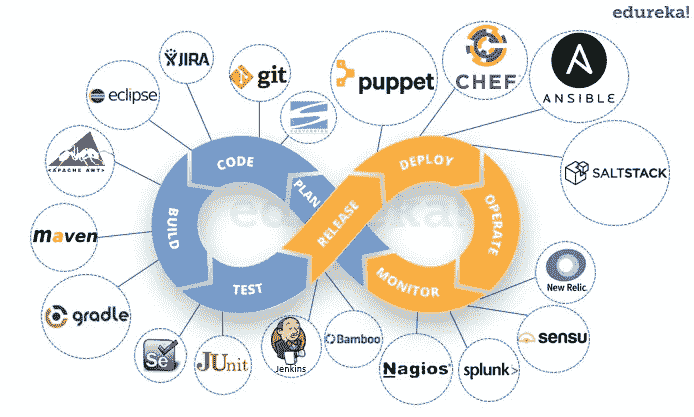
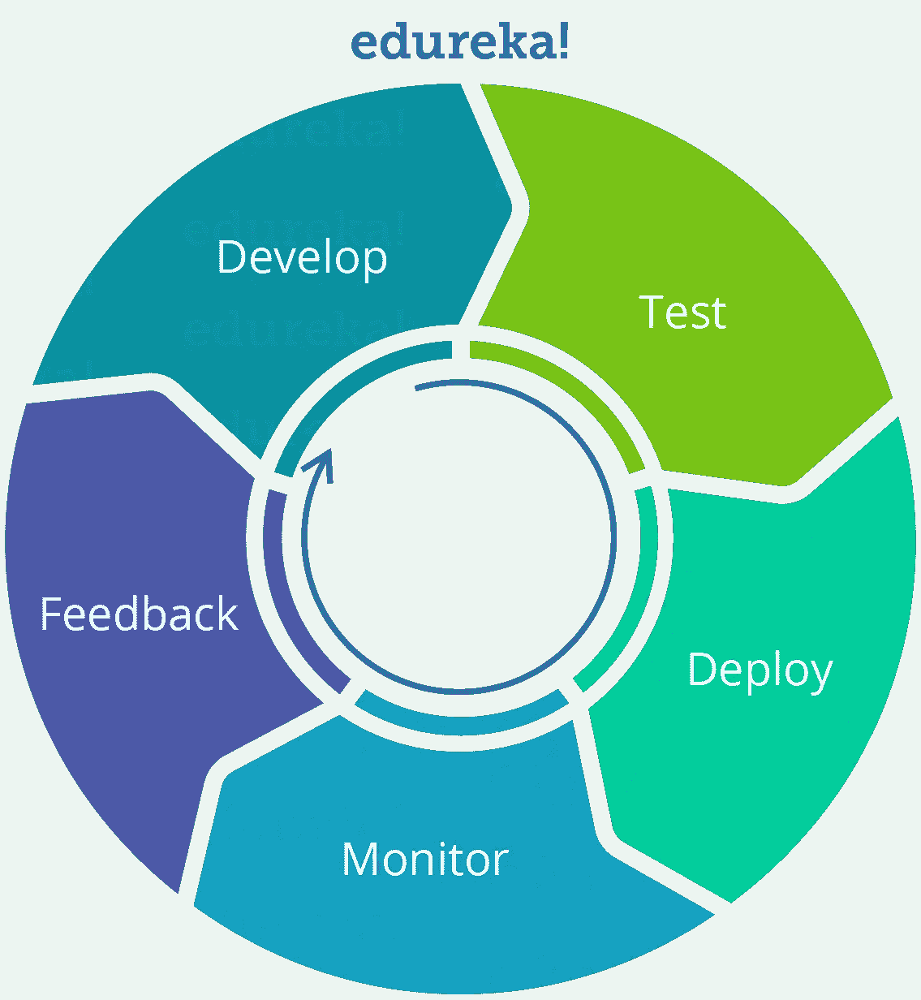
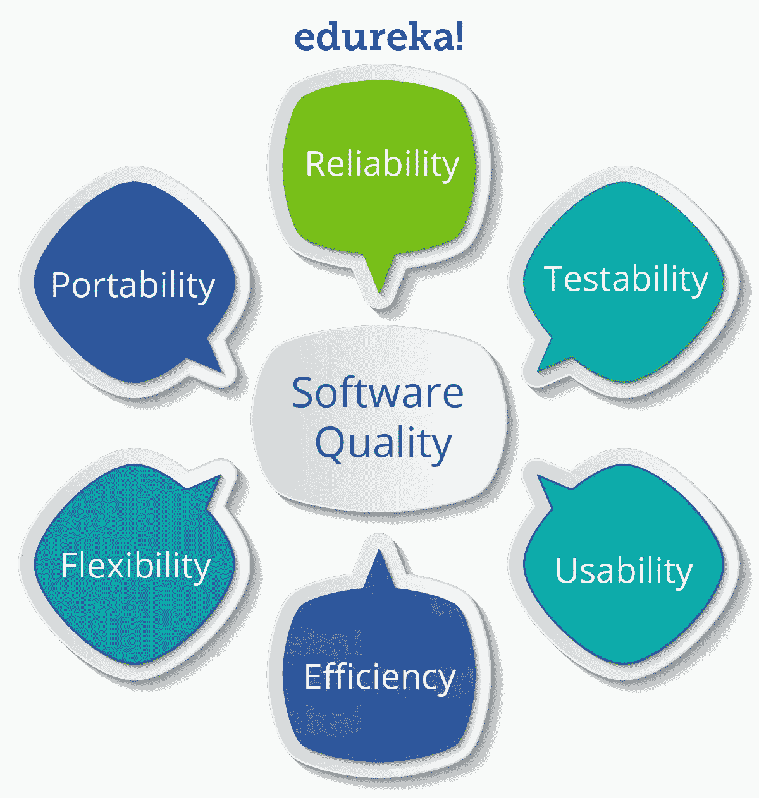
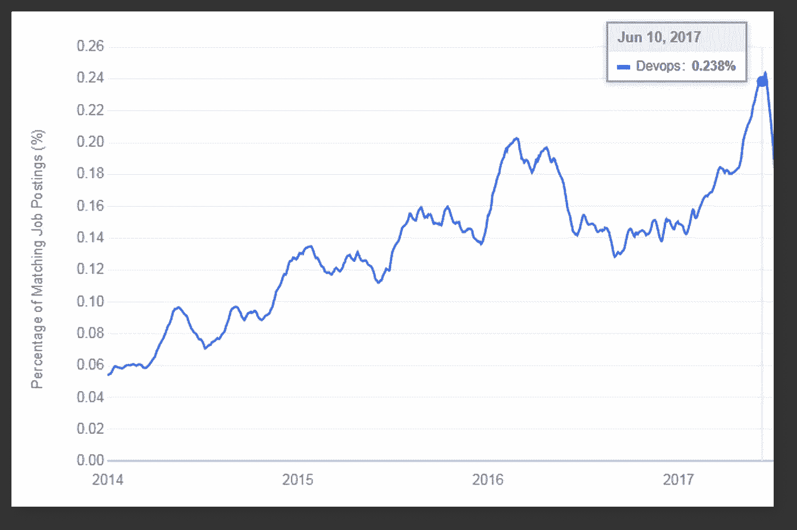
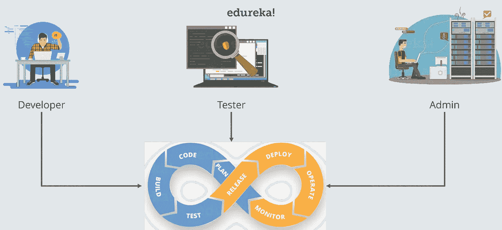

# 学习 DevOps 的十大理由—为什么要学习 DevOps

> 原文：<https://medium.com/edureka/10-reasons-to-learn-devops-679091017b40?source=collection_archive---------8----------------------->

# 学习 DevOps 的 10 大理由:

我经常遇到这个问题，为什么我要学习 DevOps。这篇关于学习 DevOps 的 10 大理由的博客，基本上是告诉你理解 DevOps 的概念是多么重要。

以下是学习 DevOps 的 10 个理由:

1.  任何人都可以学习 DevOps
2.  丰厚的薪水
3.  容易找到工作
4.  快速职业发展
5.  软件故障减少
6.  更快的发布
7.  接触各种趋势工具和技术
8.  把自己从人群中分离出来
9.  变得对公司更有价值
10.  SDLC 的 360 度视图

我们现在从列表开始。

# 10.SDLC 的 360 度视图:

由于 DevOps 涉及多个阶段/阶段:

1.  源代码管理
2.  连续累计
3.  连续测试
4.  结构管理
5.  集装箱化
6.  连续监视

一旦您熟悉了 DevOps 的概念，您就会对整个软件交付生命周期(SDLC)有所了解。作为一名开发人员，您将对测试和生产中发生的事情有所了解，这也适用于其他概要文件。

# 9.变得对公司更有价值:

大多数以成本优化为目的的公司都在寻找具有多种技能的人。

有了 DevOps，你对公司变得更有价值，因为你知道用于开发、测试和部署的各种工具和技术。

# 8.将自己从人群中分离出来:

凭借 DevOps 知识，您可以为任何组织提供独一无二的东西。这让你在面试中比其他人更有优势。

考虑下面的类比:

# 7.接触各种趋势工具和技术:

DevOps 涉及多个阶段，对于每个阶段，都有多种工具可用。

工具，例如:

*   饭桶
*   詹金斯
*   硒
*   码头工人
*   库伯内特斯
*   木偶
*   厨师
*   Ansible
*   纳吉奥斯

# 6.更快的发布:

DevOps 使 SDLC 过程真正敏捷，这确保了及时发布。组织可以非常快速地分析用户行为，并在下一个版本中纳入这些变化。这使组织比竞争对手更有优势，用户得到更好的产品。

发生这种情况是因为 DevOps 中涉及的各个阶段以及可用的多种工具。这允许**连续投放**，有时甚至**连续展开**。

在亚马逊，工程师平均每 11.7 秒部署一次代码。

# 5.更少的软件故障:

在 2014 年的大约 40 分钟里，整个华盛顿州都无法拨打 911 求助电话，这一切都是因为一行错误的代码。

主要的软件故障现在意味着生死存亡。其他例子包括丰田汽车加速错误导致致命事故，因为软件故障和医疗放射疗法杀死病人。这是可怕的东西。

开发人员似乎没有同理心，也没有意识到他们的代码在交付给运营后发生了什么。反之亦然，企业没有将足够多的开发人员包括在更大的画面中，以帮助他们集中精力。这个问题是前段时间发现的。这个问题的解决方案是 DevOps。DevOps 确保开发人员了解所有其他团队，因为 DevOps，反馈很早就给出了，改进代码的机会成倍增长。

# 4.快速职业发展:

提升自己是必要的，尤其是在技术飞速发展的今天。

你必须变得对组织更有价值，这是 DevOps 可以发挥非常重要作用的地方。它可以促进你的职业发展。

你可以成为**发布经理**、**项目经理**、**自动化架构师**甚至 **DevOps 布道者**。

# 3.找工作容易:

对开发运维专业人员的需求很大，但目前没有足够的人员来满足开发运维角色和职责的预期要求。这为任何寻求成名的人留下了巨大的机会，DevOps 对他们来说可能是一个很好的职业机会

DevOps 提供了我们在今天的市场上所需要的好处，一个在这方面做得好的人肯定会非常受欢迎，并且会享受一个富有成效的职业生涯。

根据 CIO insight，通过采用 DevOps 实践，公司可以将部署频率提高 50%,另一方面还可以节省高达 46%的成本。在某些情况下，客户群增长了 22%。

如果你对各种 DevOps 工具和技术有很好的实践知识，这将增加你被轻松聘用的机会。

下图显示了匹配职位发布的百分比

请注意，对 DevOps 专业人员的需求正在增加，并将持续相当长一段时间。

# 2.丰厚的薪水:

开发运维专业人员在所有地区的薪酬都相当高。考虑下图:

# 1.任何人都可以学习 DevOps:

不同背景的人都可以学习 DevOps。即使是一个具有 Linux 基础知识和一门脚本语言的大一新生也可以学习 DevOps。

我相信这些理由足以让你在 DevOps 开始建立自己的事业。如果你希望查看更多关于人工智能、DevOps、道德黑客等市场最热门技术的文章，那么你可以参考 [Edureka 的官方网站。](https://www.edureka.co/blog/10-reasons-to-learn-devops)

请留意本系列中解释 DevOps 各个方面的其他文章。

> *1。* [*DevOps 教程*](/edureka/devops-tutorial-89363dac9d3f)
> 
> *2。* [*饭桶教程*](/edureka/git-tutorial-da652b566ece)
> 
> *3。* [*詹金斯教程*](/edureka/jenkins-tutorial-68110a2b4bb3)
> 
> *4。* [*Docker 教程*](/edureka/docker-tutorial-9a6a6140d917)
> 
> *5。* [*Ansible 教程*](/edureka/ansible-tutorial-9a6794a49b23)
> 
> *6。* [*傀儡教程*](/edureka/puppet-tutorial-848861e45cc2)
> 
> *7。* [*厨师教程*](/edureka/chef-tutorial-8205607f4564)
> 
> *8。* [*Nagios 教程*](/edureka/nagios-tutorial-e63e2a744cc8)
> 
> *9。* [*如何编排 DevOps 工具？*](/edureka/devops-tools-56e7d68994af)
> 
> *10。* [*连续交货*](/edureka/continuous-delivery-5ca2358aedd8)
> 
> *11。* [*持续集成*](/edureka/continuous-integration-615325cfeeac)
> 
> *12。* [*连续部署*](/edureka/continuous-deployment-b03df3e3c44c)
> 
> *13。* [*持续交付 vs 持续部署*](/edureka/continuous-delivery-vs-continuous-deployment-5375642865a)
> 
> *14。* [*CI CD 管道*](/edureka/ci-cd-pipeline-5508227b19ca)
> 
> *15。* [*Docker 作曲*](/edureka/docker-compose-containerizing-mean-stack-application-e4516a3c8c89)
> 
> *16。* [*码头工人群*](/edureka/docker-swarm-cluster-of-docker-engines-for-high-availability-40d9662a8df1)
> 
> *17。* [*Docker 联网*](/edureka/docker-networking-1a7d65e89013)
> 
> *18。* [*天穹*](/edureka/ansible-vault-secure-secrets-f5c322779c77)
> 
> *19。* [*可变角色*](/edureka/ansible-roles-78d48578aca1)
> 
> *20。* [*适用于 AWS*](/edureka/ansible-for-aws-provision-ec2-instance-9308b49daed9)
> 
> *21。* [*詹金斯管道*](/edureka/jenkins-pipeline-tutorial-continuous-delivery-75a86936bc92)
> 
> 22。 [*顶级 Docker 命令*](/edureka/docker-commands-29f7551498a8)
> 
> *23。*[*Git vs GitHub*](/edureka/git-vs-github-67c511d09d3e)
> 
> *24。* [*顶级 Git 命令*](/edureka/git-commands-with-example-7c5a555d14c)
> 
> 25。 [*DevOps 面试问题*](/edureka/devops-interview-questions-e91a4e6ecbf3)
> 
> *二十六。* [*谁是 DevOps 工程师？*](/edureka/devops-engineer-role-481567822e06)
> 
> 27。 [*DevOps 生命周期*](/edureka/devops-lifecycle-8412a213a654)
> 
> *28。*[*Git Reflog*](/edureka/git-reflog-dc05158c1217)
> 
> *29。* [*易变条款*](/edureka/ansible-provisioning-setting-up-lamp-stack-d8549b38dc59)
> 
> 30。 [*组织正在寻找的顶尖 DevOps 技能*](/edureka/devops-skills-f6a7614ac1c7)
> 
> *30。* [*瀑布 vs 敏捷*](/edureka/waterfall-vs-agile-991b14509fe8)
> 
> *31。* [*詹金斯小抄*](/edureka/jenkins-cheat-sheet-e0f7e25558a3)
> 
> *32。* [*Ansible 备忘单*](/edureka/ansible-cheat-sheet-guide-5fe615ad65c0)
> 
> *33。* [*Ansible 面试问答*](/edureka/ansible-interview-questions-adf8750be54)
> 
> *34。* [*50 码头工人面试问题*](/edureka/docker-interview-questions-da0010bedb75)
> 
> *35。* [*敏捷方法论*](/edureka/what-is-agile-methodology-fe8ad9f0da2f)
> 
> *36。* [*詹金斯面试问题*](/edureka/jenkins-interview-questions-7bb54bc8c679)
> 
> *37。* [*Git 面试问题*](/edureka/git-interview-questions-32fb0f618565)
> 
> *38。* [*Docker 架构*](/edureka/docker-architecture-be79628e076e)
> 
> 39。[*devo PS 中使用的 Linux 命令*](/edureka/linux-commands-in-devops-73b5a2bcd007)
> 
> 40。 [*詹金斯 vs 竹子*](/edureka/jenkins-vs-bamboo-782c6b775cd5)
> 
> *41。* [*Nagios 教程*](/edureka/nagios-tutorial-e63e2a744cc8)
> 
> *42。* [*Nagios 面试问题*](/edureka/nagios-interview-questions-f3719926cc67)
> 
> 43。 [*DevOps 实时场景*](/edureka/jenkins-x-d87c0271af57)
> 
> 44。 [*詹金斯和詹金斯 X 的区别*](/edureka/jenkins-vs-bamboo-782c6b775cd5)
> 
> 45。[*Windows Docker*](/edureka/docker-for-windows-ed971362c1ec)
> 
> *46。*[*Git vs Github*](http://git%20vs%20github/)

*原载于 2018 年 2 月 27 日*[*https://www.edureka.co*](https://www.edureka.co/blog/10-reasons-to-learn-devops/)*。*