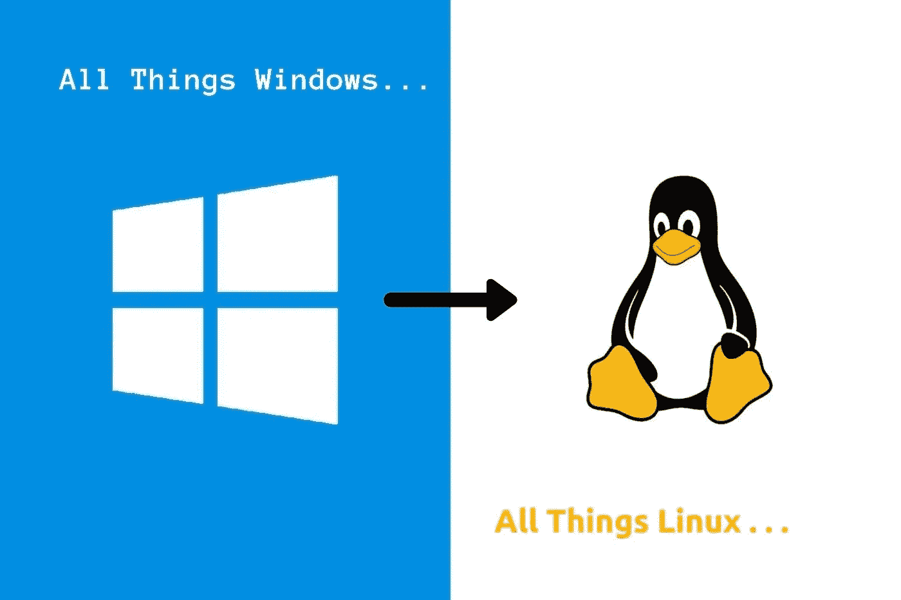

# 您应该切换到 Linux 的 10 个理由

> 原文：<https://medium.com/quick-code/10-reasons-why-every-developer-should-switch-to-linux-e037aa748504?source=collection_archive---------0----------------------->

## Linux 能做而 Windows 不能做的 10 件事

Photo by the Author

这将是一篇相当直截了当的文章。我意识到光是阅读标题就可能会从 Windows 用户那里得到很多负面评论。我相信这些都是大家应该尝试使用 Linux 系统的原因。

## 1.您可以下载 Linux 的源代码

谈到数字世界，我相信透明。你可以去[https://github.com/torvalds/linux](https://github.com/torvalds/linux)下载超过 80 万份 Linux 的提交文件。您将能够看到从 Linux 诞生以来在其上所做的一切。为什么会有人关心源代码呢？好吧，你想要关心的原因是，有人在不断地寻找诸如错误、安全问题和其他各种问题的来源。

你可以看到你正在使用的系统的来龙去脉。在 Windows 中，一切都是完全封闭的，这意味着你百分之百地信任微软开发人员来检查他们自己的东西，并确保它们没有问题。即使你不在乎来源，也要知道有很多人在乎，结果他们会让你的体验更好。除了 Linux 内核是开源的之外，您将为您的系统安装的几乎所有软件都来自官方的存储库，这些存储库也是开源的。

## 2.您可以在不重启机器的情况下安装更新

这是云环境的游戏规则改变者。如果你有 windows 服务器，你必须升级你的软件，然后重新启动系统。这将导致您的用户停机。使用 Linux，您几乎可以在不重启的情况下更新任何东西，对于内核版本 4.0 和更高版本，您甚至可以更新内核本身。是不是很神奇？我从来不喜欢每次安装或更新软件时，Windows 都提示我重启。

## 3.您可以插入设备，而不必担心寻找和下载驱动程序

唯一不对的时候是高度专业化的设备。这怎么可能呢？Linux 内核的全部意义在于连接硬件和软件。在 Linux 内核中，1400 家公司中有超过 16，000 名独特的开发人员在 Linux 上工作，将他们的驱动程序写入 Linux。这样，当人们使用 Linux 时，它就自动出现了。看 windows 的时候，每次把东西钩到电脑里都要下载安装驱动。

## 4.您可以从 pen drive、CD DVD 或任何介质运行 Linux

我不能强调这一点的重要性。我是说，想象一下你的整个系统都在一个 u 盘里。你可以把你的作品带到任何地方，而不会有丢失的风险。当然，如果在安装到驱动器的过程中配置了持久性，效果会更好。对于开发人员来说，这在需要您在现场但无法携带笔记本电脑的情况下非常有用。黑客使用这种技巧来引导 Kali live 或 persistence，因为这是他们一半时间所需要的。这个技巧的另一个优点是，你可以在一个 u 盘上安装多个发行版，这样你就可以在任何时候引导到你想要的任何一个。

## 5.你可以在不重启的情况下长时间运行 Linux

这在不降低性能的情况下是可能的，因为 Linux 非常稳定。它有更少的内存碎片，而且不会随着时间的推移而变慢。您仍然可以在不需要重启的情况下进行动态更改。在任何 Windows 系统上都找不到这样的运行时间。这样做的好处是，您可以长时间运行生产服务器，同时进行任何更改，而无需重新启动系统，因此没有停机时间。

## 6.你可以在几乎任何硬件上运行 Linux

当我说任何硬件时，我指的是不同类型的硬件，以及不同日期范围内的硬件。有些功能齐全的 Linux 安装在某些情况下小于 32MB。这意味着你可以走进那个壁橱，掸掉 1993 年的旧电脑上的灰尘，通过安装一个适合你的空间的 Linux 系统，给它注入新的生命。你不能在 windows 上这样做。随着 Windows 的更新，它变得更加资源密集，最低要求也随之提高。Linux 有很多种发行版，您可以从中选择一个适合您的特定应用程序的发行版。你可以[学习 Linux](https://blog.coursesity.com/best-kali-linux-tutorials/) 以低成本开发你的网站，因为它可以运行几乎任何主要语言。

## 7.您可以使用 live CD DVD 或 pen drive 修复损坏的 Linux 安装

这不仅仅针对 Linux。在某些情况下，你甚至可以用 Linux 修复坏掉的 windows 安装。这是可能的，因为 Linux 内核完全在内存中运行。因此，您可以使用 CD 或 pen driver DVD 将该内核加载到内存中，然后进入损坏的系统上的 chroot 环境，然后您可以像使用正常系统一样使用该损坏的系统。从那里，你可以采取任何你需要的行动让系统再次工作。在 windows 上，您必须完成 windows 系统修复向导。如果不起作用，您将需要重新安装 windows。

## 8.你可以用一个简单的命令更新你所有的软件

在 Debian 系统中，如果你愿意，更新你的软件甚至升级整个系统是如此容易。您只需键入 apt-get 更新或 apt-get 更新和 apt-get 升级。在 windows 上，你要么使用软件的内置更新程序，要么回到网站上下载一个更新的版本，这可能会让你付出代价。作为一名开发人员，我不能强调使用更新软件的重要性。

## 9.您可以将硬盘从一台 Linux 机器移动到另一台

所以，我的笔记本电脑的主板在一周前坏了，我没有足够的钱去买一个新的或全新的笔记本电脑。我不得不把我的硬盘从坏掉的笔记本电脑上拿出来，用在另一台笔记本电脑上。你猜怎么着？它不需要重新安装就能工作。我从未丢失过我的数据，实际上我正在用另一台笔记本电脑写这篇文章。这在很大程度上是因为 Linux 中的所有驱动程序都是内置的。将硬盘从一台机器移动到另一台机器不会影响它。它只是看到你所有的新硬件，并重新适应工作，就像在以前的机器。在 windows 上，不仅可能无法工作，而且 windows 会看到您有不同的硬件，然后，突然之间，您的 Windows 副本就变成了非正版。

## 10.您可以安装软件，而不必担心病毒和恶意软件

现在，这并不是说 Linux 是防病毒和恶意软件的。这只是说病毒和恶意软件很难进入你的系统。这有两个原因。第一，对于一个普通用户来说，提升 Linux 上的权限更难。第二，你为 Linux 下载的大部分软件来自官方软件仓库，这些都是有保证的。此外，Linux 上的软件不会像在 windows 上那样自动运行。这也意味着 Linux 上不需要反病毒软件，当然，这可以为您省钱。

我不是想说服你改变。你不会因为尝试而失去任何东西。每一个理由基本上都是与 Windows 的比较。我以前使用过 windows，当我发现 Linux 的时候，我慢慢地远离了它。我从来不担心没有合法的 Linux 版本，也不担心需要购买 Linux 软件。Linux 的一切都是开源的。不用担心一开始不知道怎么用 Linux。有一个庞大的社区来引导你。如果您想知道 Linux 在现实世界中的应用，可以看看我写的另一篇关于 Linux 应用的文章。

 [## Linux 是用来做什么的？

### Linux 正在取而代之。这只是时间问题

samuel-martins.medium.com](https://samuel-martins.medium.com/what-is-linux-used-for-6714041a9a0b)