# 10+2023 年最佳静态站点发电机

> 原文：<https://medium.com/quick-code/10-the-best-static-site-generators-in-2023-4ba8486a823a?source=collection_archive---------0----------------------->

Credit: [FreePik](https://www.freepik.com/free-photo/professional-programmer-working-late-dark-office_5698342.htm#query=static%20website&position=5&from_view=search&track=sph)

希望为你的下一个项目创建一个**静态站点**，但是你不确定你应该选择哪个**静态站点生成器**？别担心，我们已经收集了一些最好的静态站点生成器，它们可以为您的项目提供最好的**响应静态站点**。

作为一名开发人员，创建一个静态站点会带来很多好处。首先，与动态网站相比，它更便宜、更快、更容易维护。此外，如果你想创建信息网站，展示你的内容、作品集网站、文档、教程等等，静态站点生成器总是能帮上忙。

现在，在过去的几年中，静态站点生成器在开发人员中的受欢迎程度已经大大提高了。静态站点生成器的使用激增有很多原因。

因此，在我们直接跳到静态站点生成器列表之前，让我们了解一下什么是静态站点，使用静态站点生成器有什么好处。

# 什么是静态站点生成器？

简而言之，静态站点生成器是一种工具，它从模板、组件和给定的内容源创建 HTML 页面。这使得开发人员更容易使用那些预先构建的 HTML 页面，而不是为每个单独的页面编码。

因此，这些 HTML 页面的开发速度更快，在用户浏览器中的加载速度也更快。SSG 是内容管理系统(CMS)的替代方案，它管理您的 web 内容、生成网页并实现模板。

静态网站生成器可以帮助你创建快速的、视觉上吸引人的网站，而不会受到过去困扰营销人员和开发者的限制。

**使用静态现场发电机的优点:**

*   更高的性能
*   定制选项
*   打火机后端
*   更少的服务器端依赖
*   版本控制和测试
*   数据保护，以及更多…

# 什么是静态站点？

静态网站是由预先构建的 HTML、JavaScript 或 CSS 代码组成的网站，这些代码包含带有静态内容的页面。这些网页已经预先呈现在服务器端，然后在请求时提供给浏览器。因此，它导致加载页面的速度越来越快。

它提供已经在服务器端预先呈现的内容，并且内容不会随着用户的动作而改变。因此，静态站点不依赖于特定的用户，而动态站点则相反，每次用户请求时都会呈现页面。

静态网站使您的前端界面更加灵活，并优化您的整体网站性能。当站点简单，并且站点内容稳定时，可以考虑使用简单的静态站点。它成本低，重量轻，速度也快。

**拥有静态站点的优势**

*   易于开发
*   小型网站的理想选择
*   托管成本更低
*   成本效率
*   搜索引擎友好
*   快速装载时间
*   安全的
*   易于优化
*   灵活性，等等…

> 我们绝不是说这些是唯一的静态站点生成器，可能还有其他一些我们没有提到的静态站点生成器。如果您有任何其他建议，请在评论中向我们提出，以便我们将它们添加到列表中😇。

# 静态站点生成器

从上面可以清楚地证明使用静态站点生成器的好处。现在，不浪费任何时间，让我们直接进入最佳静态站点生成器列表。

来源: [Gifer](https://i.gifer.com/olN.gif)

# [阿童木打造](https://astro.build/)

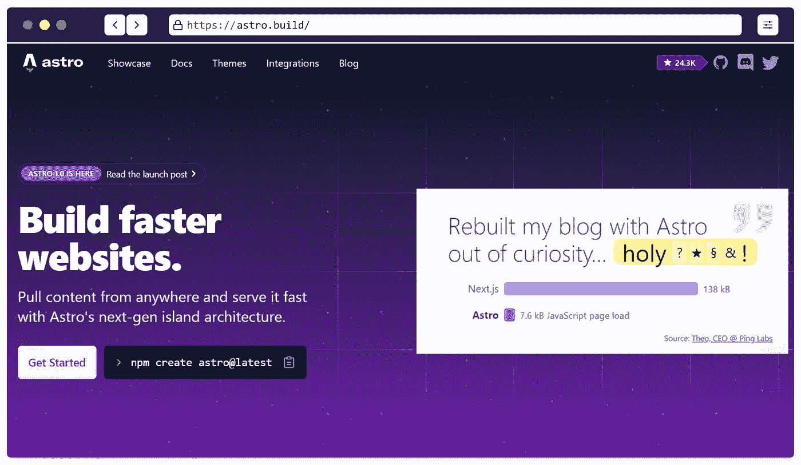

Astro 是一个一体化的 web 框架和一个静态站点生成器，旨在创建快速和以内容为中心的网站。例如，它适用于营销网站、出版网站、文档网站、博客、作品集和一些电子商务网站。

现在，它在高峰期使用服务器端渲染而不是客户端渲染。现在，同样的规则适用于所有传统的服务器端框架——PHP、WordPress、Laravel 等。

除此之外，静态站点生成器非常容易使用，您不需要学习任何其他的服务器端语言。

Astro 在默认情况下速度很快，专门为注重内容的网站提供良好的性能。

**特性**

*   组件岛:
*   服务器优先的 API 设计
*   默认情况下，JS 为零
*   边缘就绪
*   可定制的
*   与用户界面无关
*   Markdown & MDX，以及更多…

# [Next.js](https://nextjs.org/)

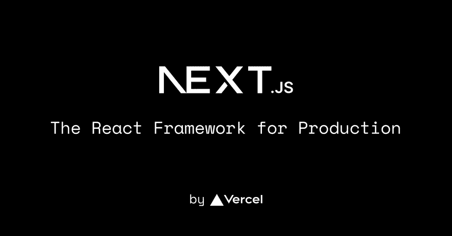

Next.js 已经成为最流行和新兴的 Web 开发框架之一。它是一个开源的静态站点生成器和 React 框架，使您能够使用 web 应用程序的构建块创建快速的 Web 应用程序。

Next.js 提供了开发中最需要的特性，如混合静态和服务器呈现、类型脚本支持、智能绑定、路由预取等等，为您提供了最佳的开发体验。

默认情况下，它支持预渲染。这意味着 Next.js 预先为每个页面生成 HTML，而不是全部由客户端 JavaScript 完成。因此，它可以导致更好的性能和搜索引擎优化。

此外，Next.js 提供了集成的 [**TypeScript**](https://www.typescriptlang.org/) 体验，包括页面、API 等的零配置设置和内置类型。

**功能**

*   图像优化
*   自动选路
*   类型脚本支持
*   更好的数据获取
*   内置 CSS
*   自动字体优化
*   自动静态优化，以及更多…

建议使用 [Next js Dashboard 模板](https://themeselection.com/item/category/next-js-admin-template/)，因为它附带有预制组件，您可以直接使用，无需任何额外的工作。例如，你必须检查[**Sneat MUI React Next js Admin 模板**](https://themeselection.com/item/sneat-mui-react-nextjs-admin-template/) 。它是 TypeScript 和 JavaScript 版本中对开发人员最友好且高度可定制的管理模板。

[**Sneat MUI React Next Js Admin Template**](https://themeselection.com/item/sneat-mui-react-nextjs-admin-template/)

具有 6 种独特布局的 [**React 管理仪表板**](https://themeselection.com/item/category/react-admin-templates/) :默认、边框、半暗&暗😎

# [盖茨比](https://www.gatsbyjs.com/)

Gatsby 是一个开源的 web 开发框架，它结合了 React、GraphQL 和 Webpack 的功能来创建静态网站和 web 应用程序。它使用 React js 来开发网站的 UI，并使用 GarphQL 来支持其数据层。

此外，它结合了静态站点生成、延迟静态生成和智能页面呈现来加载对您的 web 页面唯一重要的内容。这意味着你将得到一个超快的网站，感觉非常快，性能非常好。

在 React js 的帮助下，你可以用一种简单直接的方式完成用户界面，而使用 GraphQL，它可以很容易地将数据从 WordPress、Drupal、简单的 markdown 文件、CSV 或任何其他 CMS 等来源拉入你的网站。

它还能让你使用它的各种插件来扩展它的功能。

**功能**

*   速度和性能
*   数据处理
*   搜索引擎优化和可访问性
*   易于理解的文档
*   免费版本中的不和谐社区支持
*   CMS 集成
*   2500 多个插件，还有更多…

# [VuePress](https://vuepress.vuejs.org/)

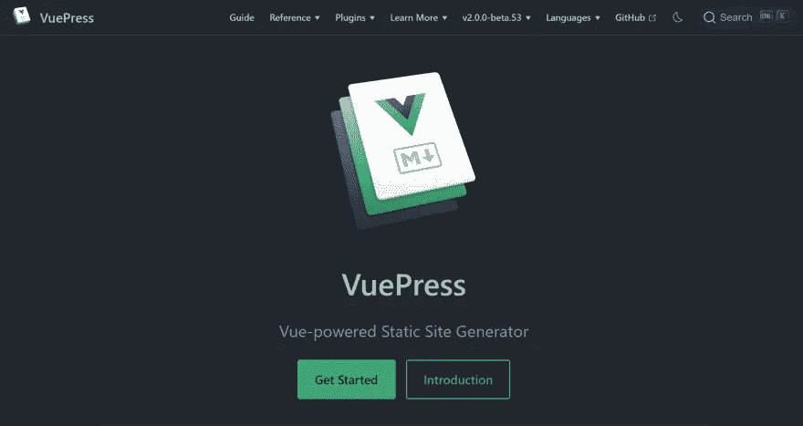

VuePress 是一个极简的基于 Vue 的静态站点生成器，为编写技术文档而优化。此外，开源静态站点生成器旨在创建支持 Vue 自己的子项目的文档需求。

Vue Press 生成的每个页面都有自己的预渲染静态 HTML，提供了出色的加载性能，并且是 SEO 友好的。然而，一旦页面被加载，Vue 就会接管静态内容，并将其转换成一个完整的单页面应用程序(SPA)。

它带有内置的 Markdown 扩展，如目录表、自定义容器、行高亮显示、导入代码片段等等，这些在静态文档中非常有用。

我们在 [**ThemeSelection**](https://themeselection.com/) 一直相信文档在开发者理解代码的过程中扮演着非常关键的角色。因此，我们所有的 [**管理仪表板模板**](https://themeselection.com/item/category/admin-templates/) 中使用的文档都是使用 VuePress 构建的。

**特性**

*   降价扩展
*   主题化选项
*   内置文本搜索功能
*   谷歌分析集成
*   多语言支持
*   自动化服务工作者一代，以及更多…

# [VitePress](https://vitepress.vuejs.org/)

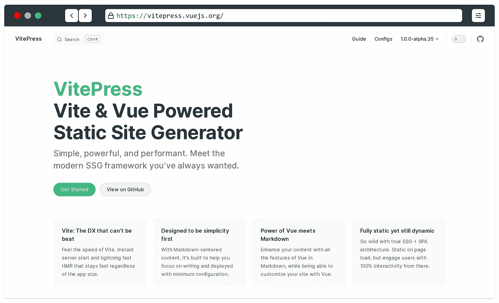

VitePress 基本上是 [VuePress](https://vuepress.vuejs.org/) 的小兄弟，但唯一的区别是它是建立在 [Vite](https://vitejs.dev/) 之上的。虽然，这是一个简单，强大，优秀的静态站点生成器，你可能正在寻找。

它是一个开源的静态站点生成器，使用最新的 Vue 3。此外，它有 Vue 3 的改进模板静态分析，以尽可能多的字符串静态内容。

VitePress 带有内置的 markdown 扩展，在其中你可以处理许多有用的功能。例如，标题锚、链接、GitHub 风格的表格、表情符号、目录、自定义容器等等。

除此之外，它还有一个默认的主题，提供了许多现成的特性，这使得 VitePress 成为最好的静态站点生成器之一。

**特性**

*   资产处理
*   易于理解的文档
*   引擎盖下的维特。
*   较轻的页面重量
*   强大的主题化
*   易于部署，等等…

说到 Vue，建议使用一个 [**Vue js 管理模板**](https://themeselection.com/item/category/vuejs-admin-templates/) 来创建现代的、吸引眼球的、反应灵敏的 web 应用。

[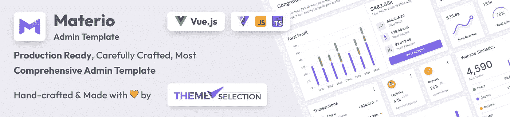](https://themeselection.com/item/materio-vuetify-vuejs-admin-template/)

For instance, you can check our latest [**Materio - Vuetify Vuejs 3 Admin Template**](https://themeselection.com/item/materio-vuetify-vuejs-admin-template/)

# [雨果](https://gohugo.io/)

Hugo 是一个快速的现代开源静态网站生成器，用 go 编写，用于创建快速网站。只有当用户创建或更新内容时，SSG 才会动态构建页面。Hugo 旨在为您网站的最终用户提供最佳的浏览体验，并为网站作者提供理想的写作体验。

使用 Hugo 你可以建立非常快速和安全的网站，你可以在任何地方托管。此外，它也可以很好地与 cdn 一起工作。此外，Hugo 站点的运行不需要数据库，也不依赖昂贵的运行时，如 Ruby、Python 或 PHP。

如果你想建立一个博客，一个公司网站，一个作品集网站，文档，一个登陆页面，或者一个有几千个页面的网站，那么 Hugo 是最好的开源静态网站生成器。

**特性**

*   强大的内容管理
*   极快的构建时间
*   完全跨平台
*   强大的主题化
*   集成的[谷歌分析](https://google-analytics.com/)支持
*   动态菜单创建
*   永久链接模式支持，等等…

# [Nuxt.js](https://nuxtjs.org/)

如果你是 Vue.js 开发者，那么这个静态站点生成器就是为你准备的。Nuxt.js 是一个基于 Vue.js 构建的开源服务器端渲染框架，它结合了 Vue.js 和服务器端渲染的强大功能，使其成为最直观的 Vue 框架。

使用 Nuxt 静态站点生成，您可以在构建阶段呈现您的应用程序，并将其部署到任何静态托管服务，如 Netlify、GitHub pages、Vercel 等。这意味着部署应用程序不需要服务器。

js 不需要服务器，因为它可以预渲染包括 HTML 在内的所有页面，并有助于开发响应性和 SEO 友好的网站。此外，通过使用 Nuxt.js，您不必依赖插件或任何其他 CMS 系统来获得更好的用户体验。Nuxt.js 允许你根据你的需要和你想要的创造力定制你的网络应用。

此外，它还附带了一些重要的组件，这些组件在构建应用程序时非常有用。这些组件是全球可用的，这意味着您不需要为了使用它们而导入它们。

**特性**

*   服务器端渲染
*   零配置
*   文件系统路由
*   数据提取
*   严格的惯例
*   搜索引擎友好
*   组件自动导入
*   模块生态系统，等等…

# [十一](https://www.11ty.dev/)

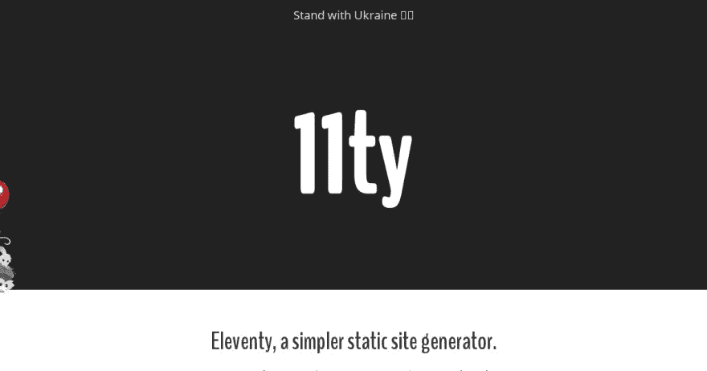

Eleventy 是一个简单的静态站点生成器，完全基于节点编写。它是一个开源框架，将模板(不同类型)转换成 HTML。它的目的是在浏览器中建立快速的网站，以及当你建立它的时候。

它支持多种模板语言，因此，你可以根据自己的需要和要求在一个项目中使用 HTML、Markdown、JavaScript 和 WebC。

不像其他的 SSG，它有一些插件，但是没有必要，因为它没有提供基本的功能。

**特性**

*   过滤器和短代码
*   支持调试模式
*   默认情况下为零
*   预渲染模板
*   渐进增强
*   易于理解的文档和更多…

# [杰基尔](https://jekyllrb.com/)

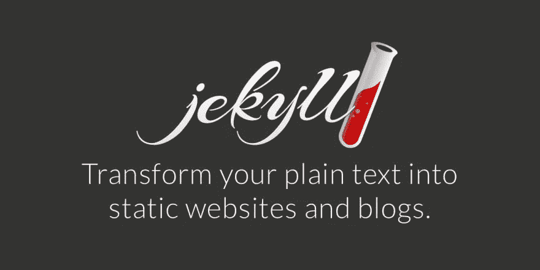

Jekyll 是一个基于 Ruby 的免费开源静态站点生成器。它使你能够建立丰富的、易于导航和使用的网站。Jekyll 可以像 Drupal 和 WordPress 一样一次生成所有内容，这样你就不必等待用户的操作。

它采用你最喜欢的标记语言编写的文本，并使用布局来创建一个静态网站。您可以调整站点的外观、URL、页面上显示的数据等等。Jekyll 需要一些先决条件，即 ruby 2.5+版、RubyGems、GCC 和 Make。

它支持`.md`扩展，你也可以在 Markdown 中编写一个页面，在构建时转换成 HTML。如果您有很多页面，您可以将它们组织到子文件夹中。当您的站点构建时，用于在项目源代码中对页面进行分组的相同子文件夹将存在于`_site`文件夹中。

Jekyll 有一个带挂钩的插件系统，允许你创建特定于你的站点的定制内容。

**特色**

*   分步教程指南
*   定制的灵活性
*   萨斯/SCSS 期权
*   液体模板
*   永久链接
*   广泛的主题系统，等等..

# [Docusaurus](https://docusaurus.io/)

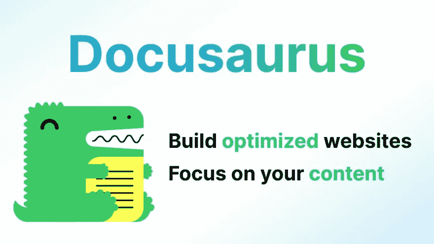

Docusaurus 是另一个静态站点生成器，它有助于立即创建漂亮的文档站点。它对于构建具有快速客户端导航和交互功能的单页面应用程序以及使用 React 框架的强大功能非常有用。

此外，它提供了任何 web 应用程序文档所需的大量文档功能。它还可以用来创建任何类型的网站，如个人网站、产品、博客、营销登录页面等等。

Docusaurus 支持编写和使用 TypeScript 主题组件。如果 init 模板提供了一个 TypeScript 变量，您可以通过使用`--typescript`标志直接初始化一个完全支持 TypeScript 的站点。

如果您正在处理 React 项目，那么我们强烈建议您选择 [React 管理仪表板模板](https://themeselection.com/item/category/react-admin-templates/)来提升您的 React 项目。

**特性**

*   使用 React 构建
*   可插入的
*   基于路由的代码和数据拆分
*   搜索引擎优化友好
*   由 MDX 提供支持
*   文档版本控制
*   国际化(i18n)，以及更多…

# [网格体](https://gridsome.org/)

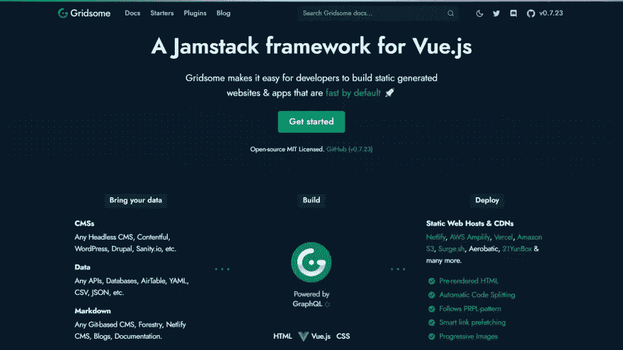

Gridsome 是由 Vue.js 支持的 JamStack 框架，旨在创建静态生成的网站和应用程序。如果你不知道 JamStack，它是一个框架，可以让你通过预先渲染文件和直接从 CDN 提供服务来构建快速和安全的站点。

现在，Girdsome 生成了静态 HTML，一旦被加载到浏览器中，它就会变成一个 T2 Vue SPA。因此，它适用于生成静态和动态站点。它生成静态渐进式 Web 应用程序，其中只有关键的 HTML、CSS 和 JavaScript 会首先加载。

此外，其余的页面会被预取，因此用户可以快速点击而无需重新加载页面，即使在离线时也是如此。Gridsome 使用 [**Vue 单文件组件**](https://vuejs.org/v2/guide/single-file-components.html) 。因此，您可以在同一个文件中添加 HTML、JavaScript 和 CSS，以使您的项目更易于维护和测试，并使您的组件更易于重用。

**特性**

*   容易，局部发展。
*   默认为快速
*   PWA-就绪
*   在 Jamstack 上构建
*   简单、安全的部署
*   搜索引擎优化友好
*   连接现代网络和更多…

# [Harp.js](http://harpjs.com/)

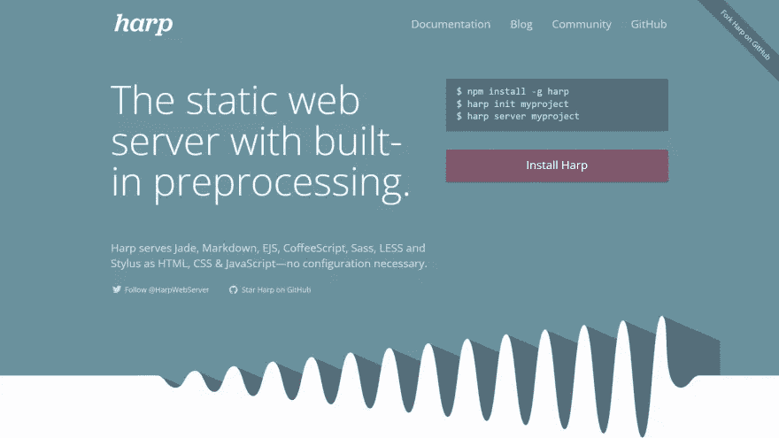

Harp 是一个开放源码的静态 web 服务器，它也可以将 Jade、Markdown、EJS、Less、Stylus、Sass 和 CoffeeScript 作为 HTML、CSS 和 JavaScript 提供服务，无需任何配置。它支持布局/部分范式和灵活的元数据，并可以轻松地将您的自定义数据插入模板。

如果您使用预处理程序来编写 HTML、CSS 或 JavaScript，Harp 将使您的项目变得非常简单。Harp 支持 Markdown、EJS、Jade、LESS、Sass、Stylus 和 CoffeeScript。

**功能**

*   易于安装和使用
*   快速轻便
*   健壮(干净的 URL，智能路径重定向)
*   生产模式下的内置 LRU 缓存
*   可以将资产导出到 HTML/CSS/JS
*   一流的布局和部分支持，等等…

# [反应静态](https://github.com/react-static/react-static)

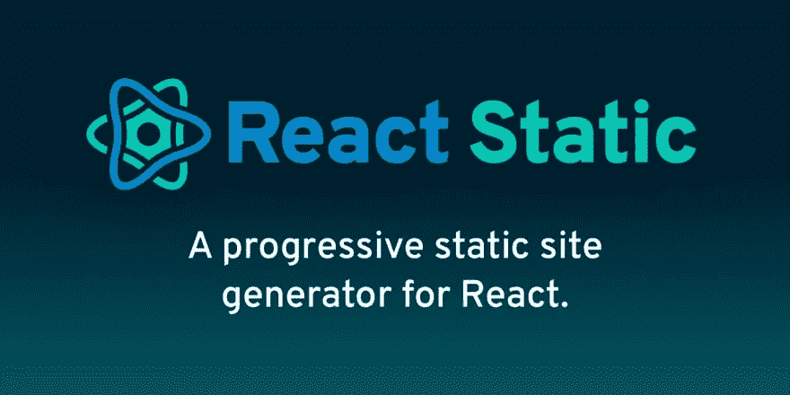

React Static 是一个用于 React 的渐进式静态站点生成器。它是一个基于 React 及其生态系统的快速、轻量级的静态站点生成器。它提供了一个终极的开发人员友好的环境，你在像 Create React App 这样的工具中已经习惯了。

此外，React static 旨在创建基于性能的灵活 web 应用程序，提供开发人员/用户友好的体验。正如我们所说，它支持 100%的 React 生态系统，包括 CSS-in-JS 库、GraphQL 等自定义查询层，甚至 Redux。

它还支持开箱即用的可热重装。实时编辑 React 组件、样式甚至数据。

**特性**

*   自动代码和数据分割！
*   即时导航和页面视图
*   逐步增强并支持移动
*   搜索引擎友好
*   以反应为中心的开发人员体验
*   轻松的项目设置和迁移，等等…

现在，如果你正在做 React 项目，使用一个 [**React 仪表板模板**](https://themeselection.com/item/category/react-admin-templates/) 是非常可取的。因为它带有预制组件，您可以直接使用，无需任何额外的努力。

For instance, you can check our Latest [**Materio MUI React Nextjs Admin Template**](https://themeselection.com/item/materio-mui-react-nextjs-admin-template/)

# [拼图](https://github.com/tighten/jigsaw)

JigSaw 是一个开源的静态站点生成器，使用 Laravel 的 Blade 创建简单的静态站点。它支持 Laravek Mix，所以你可以像在 Laravel 中一样编译你的 CSS 和 Javascript 资源。

它包括 2 个开始模板，即一个博客和另一个开源文档，你可以根据自己的需要定制内容。Jigsaw 提供了处理相关页面或集合的强大功能。

使用 Jigsaw 构建的站点仅仅是静态的 HTML 和 Javascript，而且部署和托管起来足够简单和便宜。你会在他们关于如何在主机上部署你的站点的详细文档中找到完整的指南，比如 GitHub Pages、Netlify、Amazon S3 和 Manually。

**特性**

*   构建和预览
*   支持 Laravel Mix
*   拉勒维尔的刀锋模板语言
*   支持降价和`.md`扩展，
*   自定义 404 页面，以及更多…

# 包裹

所以，这里是我们在这篇文章中提到的最好的 10+静态站点生成器。当然，也可能有其他静态生成器，但根据我们的说法，这些静态站点生成器值得在 2022 年尝试。

毫无疑问，当你在为你的网站寻找速度和可靠性时，静态站点生成器总是能帮上忙。这些静态站点生成器肯定会帮助你毫无问题地创建一个静态站点。现在，这将完全取决于个人对 SSG 的选择。

作为开发人员，记住学习曲线，我们建议选择适合你的核心语言的 SSG。现在，当你选择一个不适合你核心语言的 SSG 时，这将浪费你学习 SSG 的时间。

因此，在挑选最好的静态站点生成器时，总是要根据易用性、速度、文档、项目需求和编程语言来选择。

如果你有任何建议，请在评论区告诉我们，如果你觉得有帮助，请和你的朋友分享这个博客。

编码快乐，干杯！

# 关于我们

我们在 [ThemeSelection](https://themeselection.com/) 提供精选的高质量、现代设计、专业且易于使用的高级免费 [VueJS 管理模板](https://themeselection.com/item/category/vuejs-admin-templates/)、[Asp.NET 管理模板](https://themeselection.com/item/category/asp-net-dashboard/)、 [NextJS 管理模板](https://themeselection.com/item/category/next-js-admin-template/)、 [Laravel 管理模板](https://themeselection.com/item/category/laravel-admin-templates/)、& [免费 UI 套件](https://themeselection.com/products/category/free-ui-kits/)。

*原载于 2022 年 12 月 6 日*[*https://dev . to*](https://dev.to/theme_selection/static-site-generator-1fp4)*。*