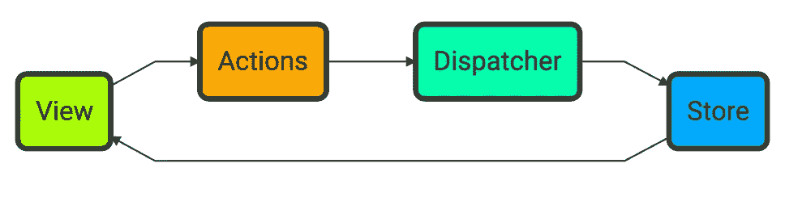
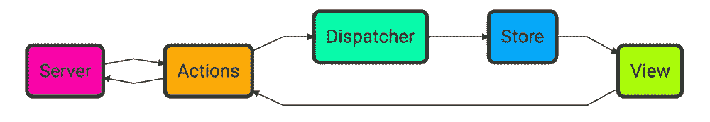
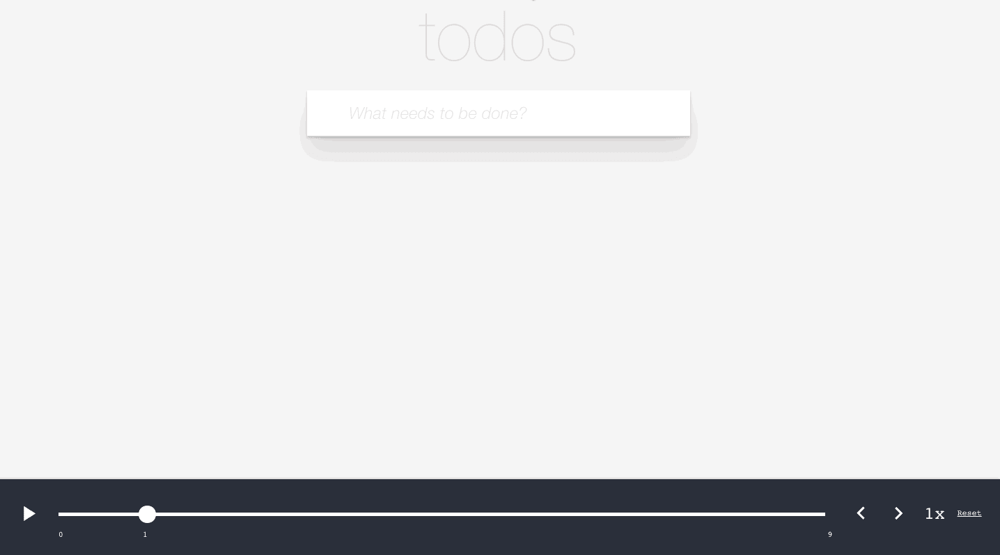

# 改善 Redux 架构的 10 个技巧

> 原文：<https://medium.com/javascript-scene/10-tips-for-better-redux-architecture-69250425af44?source=collection_archive---------0----------------------->


Mandarin Duck — Malcolm Carlaw (CC-BY-2.0)

当我开始使用 React 时，没有 Redux。只有 Flux 架构，以及十几个与之竞争的实现。

现在，React 中的数据管理有两个明显的赢家:Redux 和 MobX，后者甚至不是 Flux 实现。Redux 如此流行，以至于它不再仅仅用于 React。您可以找到其他框架的 Redux 架构实现，包括 Angular 2。例如参见 [ngrx:store](https://github.com/ngrx/store) 。

> 附注:MobX 很酷，对于简单的 ui，我可能会选择它而不是 Redux，因为它不太复杂，也不太冗长。也就是说，Redux 有一些 MobX 没有提供的重要特性，在决定什么适合您的项目之前，了解这些特性是很重要的。
> 
> 侧边注: [Relay](https://facebook.github.io/relay/) 和 [Falcor](https://netflix.github.io/falcor/) 是其他有趣的状态管理解决方案，但与 Redux 和 MobX 不同，它们必须分别由 GraphQL 和 Falcor 服务器支持，所有中继状态都对应一些服务器持久化的数据。AFAIK，两者都没有为仅客户端的瞬态管理提供一个好故事。通过将 Relay 或 Falcor 与 Redux 或 MobX 混合搭配，区分仅客户端状态和服务器持久状态，您可能会享受到两者的好处。一句话:对于今天的客户端状态管理来说，没有一个明确的赢家。为手头的工作使用合适的工具。

Redux 的创始人丹·阿布拉莫夫(Dan Abramov)就这一主题开设了几门很棒的课程:

*   【Redux 入门
*   [用惯用的 Redux 构建应用程序](https://egghead.io/courses/building-react-applications-with-idiomatic-redux)

这两个都是很好的分步教程，解释了 Redux 的基础知识，但是你也需要更高层次的理解才能从 Redux 中获得最大的收益。

以下是帮助你构建更好的 Redux 应用的技巧。

# 1.了解 Redux 的优势

您需要记住 Redux 的几个重要目标:

1.  确定性视图渲染
2.  确定性状态再现

确定性对于应用程序的可测试性以及诊断和修复错误非常重要。如果应用程序的视图和状态是不确定的，就不可能知道视图和状态是否总是有效的。你甚至可以说非确定性本身就是一个缺陷。

但是有些东西天生就是不确定的。比如用户输入和网络 I/O 的时间。那么我们怎么知道我们的代码是否真的工作呢？简单:隔离。

Redux 的主要目的是将状态管理与 I/O 副作用隔离开来，比如渲染视图或处理网络。当副作用被隔离时，代码就变得简单多了。当业务逻辑不与网络请求和 DOM 更新纠缠在一起时，理解和测试业务逻辑会容易得多。

当您的视图渲染与网络 I/O 和状态更新隔离时，您可以实现确定性视图渲染，这意味着:给定相同的状态，视图将总是渲染相同的输出。它消除了一些问题的可能性，比如来自异步的东西随机地清除了你的视图的一些部分，或者当你的视图在渲染的过程中破坏了你的状态的一些部分。

当一个新手考虑创建一个视图时，他们可能会想，“这部分需要用户模型，所以我将启动一个异步请求来获取它，当这个承诺完成时，我将用他们的名字更新用户组件。那边的那部分需要待办事项，所以我们将获取它们，当承诺完成时，我们将循环遍历它们，并将它们绘制到屏幕上。”

这种方法有几个主要问题:

1.  您永远不会拥有在任何给定时刻呈现完整视图所需的所有数据。直到组件开始工作，您才真正开始获取数据。
2.  不同的获取任务可以在不同的时间出现，微妙地改变视图渲染序列中发生的事情的顺序。要真正理解呈现顺序，您必须了解一些您无法预测的事情:每个异步请求的持续时间。突击测验:在上面的场景中，首先呈现的是用户组件还是待办事项？回答:是赛跑！
3.  有时，事件侦听器会改变视图状态，这可能会触发另一次呈现，从而使序列更加复杂。

将数据存储在视图状态中并赋予异步事件侦听器改变视图状态的权限的关键问题是:

> “非确定性=并行处理+共享状态”
> ~马丁·奥德斯基(Scala 设计师)

> 将数据获取、数据操作和视图渲染问题混合在一起，是一个时间旅行意大利面条的配方。

我知道这听起来有点酷，有点像 B 级科幻电影，但是相信我，时间旅行意大利面是最难吃的！

flux 架构所做的是执行严格的分离和排序，每次都遵循这些规则:

1.  首先，我们进入一个已知的、固定的状态…
2.  然后我们渲染视图。没有什么可以再次改变这个渲染循环的状态。
3.  给定相同的状态，视图将总是以相同的方式呈现。
4.  事件侦听器侦听用户输入和网络请求处理程序。当他们得到它们时，动作被分派到商店。
5.  当一个动作被分派时，状态被更新为一个新的已知状态，并且序列重复。只有调度的动作可以触及状态。

简而言之，这就是 Flux:你的 UI 的单向数据流架构:



Flux Architecture

使用 Flux 体系结构，视图监听用户输入，将这些输入转化为 action 对象，这些对象被分派到商店。存储更新应用程序状态，并通知视图再次呈现。当然，视图很少是输入和事件的唯一来源，但这没问题。附加的事件侦听器调度操作对象，就像视图:



重要的是，不断变化的状态更新是事务性的。动作对象被分派到存储区，而不是简单地调用状态的更新方法或直接操作值。动作对象是一个事务记录。你可以把它想象成一笔银行交易——记录要进行的变更。当你向银行存款时，你 5 分钟前的余额不会被抹去。相反，新的余额会附加到交易历史记录中。操作对象将事务历史添加到应用程序状态中。

动作对象看起来像这样:

动作对象给你的是保存所有状态事务的运行日志的能力。该日志可用于以确定的方式再现状态，这意味着:

给定相同的初始状态和相同顺序的相同事务，结果总是得到相同的状态。

这具有重要的意义:

1.  易测试性
2.  轻松撤销/重做
3.  时间旅行调试
4.  持久性——即使状态消失了，如果你有每笔交易的记录，你也可以复制它。

谁不想掌握空间和时间呢？事务状态给你时间旅行的超能力:



Redux dev tools history slider view

# 2.有些应用不需要 Redux

如果你的 UI 工作流很简单，所有这些可能都是多余的。如果你在做一个井字游戏，你真的需要撤销/重做吗？这些游戏很少持续超过一分钟。如果用户搞砸了，你可以重置游戏，让他们重新开始。

如果:

*   用户工作流程很简单
*   用户不合作
*   您不需要管理服务器端事件(SSE)或 websockets
*   您可以从每个视图的单个数据源获取数据

应用程序中的事件序列可能非常简单，以至于事务状态的好处不值得付出额外的努力。

也许你不需要流畅你的应用。对于这样的应用程序，有一个简单得多的解决方案。查看 [MobX](https://github.com/mobxjs/mobx) 。

然而，随着应用程序复杂性的增加，随着视图状态管理复杂性的增加，事务状态的价值也随之增加，而 MobX 并不提供现成的事务状态管理。

如果:

*   用户工作流很复杂
*   您的应用程序有各种各样的用户工作流(考虑普通用户和管理员)
*   用户可以协作
*   您使用的是 web 套接字或 SSE
*   您正在从多个端点加载数据以构建单个视图

您可以从事务状态模型中获得足够多的好处，从而使这项工作物有所值。Redux 可能很适合你。

web sockets 和 SSE 跟这个有什么关系？随着您添加更多的异步 I/O 源，您会越来越难理解具有不确定状态管理的应用程序中发生了什么。确定性状态和状态事务记录从根本上简化了这样的应用程序。

在我看来，大多数大型 SaaS 产品至少包含一些复杂的 UI 工作流，应该使用事务状态管理。大多数小型实用程序&简单的原型不应该这样。使用合适的工具完成工作。

# 3.了解减速器

> Redux = Flux +函数式编程

Flux 规定了动作对象的单向数据流和事务状态，但没有说明如何处理动作对象。这就是 Redux 的用武之地。

Redux 状态管理的主要构件是 reducer 函数。什么是减速器功能？

在函数式编程中，常用实用程序 *`reduce()`* 或 *`fold()`* 用于将 reducer 函数应用于值列表中的每个值，以便累加单个输出值。下面是一个用*` array . prototype . reduce()`:*将求和缩减器应用于 JavaScript 数组的例子

[Interact with this on CodePen](http://codepen.io/ericelliott/pen/bZyqQy?editors=0012)

Redux 不是对数组进行操作，而是对 action 对象流应用 reducers。请记住，动作对象看起来像这样:

让我们把上面的求和缩减器变成 Redux 风格的缩减器:

现在我们可以将它应用于一些测试动作:

# 4.减速器必须是纯函数

为了实现确定性的状态再现，归约器必须是纯函数。没有例外。纯粹的功能:

1.  给定相同的输入，总是返回相同的输出。
2.  没有副作用。

重要的是，在 JavaScript 中，所有非原语对象都作为引用传递给函数。换句话说，如果您传入一个对象，然后直接改变该对象的属性，那么该对象也会在函数之外发生变化。那是副作用。如果不知道传入对象的完整历史，就无法知道调用函数的全部含义。那很糟糕。

Reducers 应该返回一个新的对象。例如，您可以使用 *`Object.assign({}，state，{ thingToChange })`* 来实现这一点。

数组参数也是引用。你不能在一个 reducer 中仅仅把 *`.push()`* 新的条目放到一个数组中，因为 *`.push()`* 是一个变异操作。同样， *`.pop()`* 、 *`.shift()`* 、 *`.unshift()`、` . reverse()`、` . splice()`、*以及其他任何 [mutator 方法](https://developer.mozilla.org/en-US/docs/Web/JavaScript/Reference/Global_Objects/Array#Mutator_methods)也是如此。

如果您希望数组安全，您需要将您对状态执行的操作限制为安全的[访问器方法](https://developer.mozilla.org/en-US/docs/Web/JavaScript/Reference/Global_Objects/Array#Accessor_methods)。不要用 *`.push()`* ，而要用 *`.concat()`。*

看看这个聊天缩减器中的 *`ADD_CHAT`* 案例:

如您所见，用 *`Object.assign()`* 创建了一个新对象，我们用 *`.concat()`* 而不是 *`.push()`* 追加到数组中。

纯函数远不止这些。如果您打算将 Redux 用于生产应用程序，您确实需要很好地掌握什么是纯函数，以及您需要注意的其他事情(例如处理时间、日志和随机数)。更多信息，请参见[“掌握 JavaScript 面试:什么是纯函数？”](/javascript-scene/master-the-javascript-interview-what-is-a-pure-function-d1c076bec976#.26ljw27tp)。

# 5.记住:还原者必须是真理的唯一来源

应用程序中的所有状态都应该有一个真实的来源，这意味着状态存储在一个地方，任何需要该状态的地方都应该通过引用其真实的单一来源来访问该状态。

不同的事情有不同的真相来源是可以的。例如，URL 可以是用户请求路径和 URL 参数的唯一来源。也许你的应用有一个配置服务，它是你的 API URLs 的唯一来源。那很好。然而…

当您在 Redux 存储中存储任何状态时，对该状态的任何访问都应该通过 Redux 进行。不遵守这一原则会导致陈旧的数据或共享状态突变错误，而 Flux 和 Redux 正是为了解决这些问题而发明的。

换句话说，没有真理的单一来源原则，你可能会失去:

*   确定性视图渲染
*   确定性状态再现
*   轻松撤销/重做
*   时间旅行调试
*   易测试性

要么还原，要么不还原你的状态。如果你半途而废，你可能会失去 Redux 的所有好处。

# 6.使操作类型具有描述性

当你查看动作历史时，我喜欢确保动作容易追踪到使用它们的缩减器。如果你所有的动作都有简短的通用名称，比如 *`CHANGE_MESSAGE`,* 就很难理解你的应用程序在做什么。然而，如果动作类型有更具描述性的名称，如 *`CHAT/CHANGE_MESSAGE`* ，显然会更清楚发生了什么。

# 7.使用动作创建器将动作逻辑与调度调用方分离

当我告诉人们他们不能生成 id 或在 reducer 中获取当前时间时，我得到了有趣的表情。如果你现在正怀疑地盯着你的屏幕，请放心:你并不孤单。

那么，哪里是处理这种不纯逻辑的好地方，而不会在需要使用动作的任何地方重复它呢？在一个动作创作者里。

动作创作者还有其他好处:

*   将动作类型常量封装在 reducer 文件中，这样就不必将它们导入到其他地方。
*   在分派操作之前，对输入进行一些计算。
*   减少样板文件

让我们使用一个动作创建器来生成 *`ADD_CHAT`* 动作对象:

正如你在上面看到的，我们使用 [cuid](https://github.com/ericelliott/cuid) 为每条聊天消息生成随机 id，使用 *`Date.now()`* 生成时间戳。这两个都是不纯的操作，在 reducer 中运行是不安全的——但是在 action creators 中运行它们是完全可以的。

## 减少动作创建者的样板文件

有些人认为使用动作创建器会给项目增加样板文件。相反，您将看到我如何使用它们来大大减少我的 reducer 中的样板文件。

> 提示:如果您将常量、缩减器和动作创建器都存储在同一个文件中，那么当您从不同的位置导入它们时，您将减少所需的样板文件。

假设我们想为聊天用户添加自定义用户名和可用性状态的功能。我们可以像这样给 reducer 添加几个动作类型处理程序:

对于较大的缩减器，这可能会变成许多样板文件。我构建的许多 reducers 可能比这复杂得多，有许多冗余代码。如果我们可以一起折叠所有简单的属性更改操作会怎么样？

事实证明，这很简单:

即使有额外的间距和额外的注释，这个版本也更短——这只是两种情况。这些节省真的可以累加起来。

## switch…case 不危险吗？我看到一个失败！

你可能在某处读到过应该避免 *`switch`* 语句，特别是这样我们可以避免意外失败，因为案例列表会变得臃肿。你可能听说过不应该故意使用 fall through，因为很难捕捉到意外的 fall-through 错误。这些都是好建议，但让我们仔细想想我上面提到的危险:

*   减速器是可组合的，所以案例膨胀不是问题。如果你的病例列表变得太大，把它们分成小块，放到不同的减压器里。
*   每一箱尸体都要归还，所以不会发生意外坠落。除了执行捕捉的人之外，任何分组的坠落案例都不应有其他人。

Redux 使用*`开关..案例`*嗯。我正式改变我对这件事的建议。只要你遵循上面的简单规则(保持开关小而集中，并且从每个案例返回它自己的主体)， *`switch`* 语句就可以了。

您可能已经注意到这个版本需要不同的有效载荷。这就是你的动作创作者的用武之地:

如您所见，这些动作创建者正在进行参数和状态形状之间的转换。但这并不是他们所做的全部…

# 8.签名文档使用 ES6 参数默认值

如果你使用的是带有编辑器插件的 Tern.js(可用于 Sublime Text 和 Atom 等流行编辑器)，它将读取那些 ES6 默认分配，并推断出你的动作创建者所需的接口，所以当你调用它们时，你可以获得智能感知和自动完成。这减轻了开发人员的认知负担，因为他们不必记住所需的有效载荷类型，或者在忘记时检查源代码。

如果你没有使用类型推断插件，比如 Tern、TypeScript 或 Flow，你应该使用。

注意:与类型注释相比，我更喜欢依赖函数签名中可见的默认赋值所提供的推断，因为:

1.  您不必使用流或类型脚本来使它工作:而是使用标准的 JavaScript。
2.  如果您使用的是 TypeScript 或 Flow，注释对于默认赋值是多余的，因为 TypeScript 和 Flow 都从默认赋值中推断类型。
3.  我发现当语法干扰少的时候可读性更好。
4.  您获得了默认设置，这意味着，即使您没有停止 CI 构建类型错误(您可能会惊讶，许多项目都没有)，您也永远不会在代码中隐藏意外的 *`undefined`* 参数。

# 9.将选择器用于计算状态和解耦

想象一下，你正在开发聊天应用历史上最复杂的聊天应用。您已经编写了 50 万行代码，然后产品团队向您抛出了一个新的功能需求，这将迫使您更改状态的数据结构。

没必要惊慌。你很聪明，用选择器将应用程序的其余部分从你的状态中分离出来。子弹:躲开了。


对于我编写的几乎每一个 reducer，我都创建了一个选择器，它简单地导出了构建视图所需的所有变量。让我们看看简单的聊天缩减器会是什么样子:

```
export const getViewState = state => state;
```

是啊，我知道。这太简单了，甚至不值一提。你现在可能会认为我疯了，但还记得我们之前躲过的那颗子弹吗？如果我们想添加一些计算过的状态，比如在这个会话中聊天的所有用户的完整列表，会怎么样？姑且称之为*‘最近活跃用户’。*

这些信息已经存储在我们的当前状态中——但不是以一种容易获取的方式。让我们继续在 *`getViewState()`* 中抓取它:

如果您将所有计算状态放入选择器中，您将:

1.  降低您的减速器和部件的复杂性
2.  将应用程序的其余部分从状态形状中分离出来
3.  遵守真理的单一来源原则，即使在你的减速器内

# 10.使用 TDD:首先编写测试

许多 [研究](https://www.computer.org/csdl/mags/so/2007/03/s3024.pdf)将先测试和后测试方法进行了比较，并与根本没有测试进行了比较。结果是清晰而戏剧性的:大多数研究表明，在实现特性之前编写测试会减少 40–80%的发布错误。

> TDD 可以有效地将您的运输 bug 密度减少一半，并且有大量证据支持这种说法。

在编写本文中的例子时，我从单元测试开始所有的例子。

为了避免脆弱的测试，我创建了以下工厂，用于产生期望:

请注意，这两者都提供了默认值，这意味着我可以单独覆盖属性，只为任何特定的测试创建我感兴趣的数据。

我是这样使用它们的:

注意:[我使用磁带](/javascript-scene/why-i-use-tape-instead-of-mocha-so-should-you-6aa105d8eaf4#.711m3iv2m)进行单元测试，因为它很简单。我也有 2-3 年使用 Mocha 和 Jasmine 的经验，以及许多其他框架的各种经验。您应该能够将这些原则应用到您选择的任何框架中。

请注意我开发的描述嵌套测试的风格。可能由于我使用 Jasmine 和 Mocha 的背景，我喜欢从在外部块中描述我正在测试的组件开始，然后在内部块中，描述我传递给组件的内容。在里面，我做了简单的等价断言，你可以用你的测试库的 *`deepEqual()`* 或 *`toEqual()`* 函数来做。

正如你所看到的，我使用隔离的测试状态和工厂函数，而不是像 *`beforeEach()`* 和 *`afterEach()`* 这样的实用程序，我避免使用它们，因为它们会鼓励没有经验的开发人员在测试套件中使用共享状态(这是不好的)。

你可能已经猜到了，我对每个减速器都有三种不同的测试:

1.  直接减压器测试，你刚才已经看到了一个例子。这些本质上是测试缩减器是否产生了预期的默认状态。
2.  动作创建者测试，通过使用一些预先确定的状态作为起点，将缩减器应用于动作来测试每个动作创建者。
3.  选择器测试，它测试选择器以确保所有预期的属性都存在，包括带有预期值的计算属性。

你已经看到了一个减速器测试。让我们看一些其他的例子。

## 动作创建者测试

这个例子之所以有趣有几个原因。*“addchat”()`*动作创建者并不纯粹。这意味着，除非传入值重写，否则无法对生成的所有属性进行特定的预期。为了处理这个问题，我们使用了一个管道，我有时使用它来避免创建我并不真正需要的额外变量。我用它来忽略生成的值。我们仍然确保他们的存在，但我们不关心他们的价值观是什么。请注意，我甚至没有检查类型。我们相信类型推断和默认值可以解决这个问题。

pipe 是一个功能实用工具，它允许您将一些输入值穿梭于一系列函数中，每个函数都获取前一个函数的输出并以某种方式对其进行转换。我使用的 lodash pipe 来自` lodash/fp/pipe '，这是` lodash/flow '的别名。有趣的是，*、【pipe】、*本身也可以创建有减速功能:

在 reducer 文件中，我也经常使用*、【管道】、*来简化状态转换。所有状态转换最终都是从一个数据表示移动到下一个数据表示的数据流。这正是*【pipe】*的特长。

请注意，action creator 还允许我们覆盖所有默认值，因此我们可以通过特定的 id 和时间戳并测试特定的值。

## 选择测试

最后，我们测试状态选择符，并确保计算的值是正确的，以及一切都是应该的:

请注意，在这个测试中，我们使用了*‘array . prototype . reduce】(*)来简化几个示例*‘addchat】(*)动作。Redux 减压器的一大优点是，它们只是常规的减压器功能，这意味着您可以使用它们做任何事情，就像使用任何其他减压器功能一样。

我们的*“期望值”*值检查我们的所有聊天对象是否都在日志中，以及最近活跃的用户是否正确列出。

对此没什么可说的。

# Redux 规则

如果正确使用 Redux，您将获得以下主要好处:

*   消除时间相关性错误
*   启用确定性视图呈现
*   启用确定性状态再现
*   启用轻松撤消/重做功能
*   简化调试
*   成为时间旅行者

但要让这些方法发挥作用，你必须记住一些规则:

*   缩减器必须是纯函数
*   缩减者必须是他们状态的唯一真相来源
*   缩减器状态应该始终是可序列化的
*   缩减器状态不应包含函数

还要记住:

*   有些应用程序不需要 Redux
*   对动作类型使用常数
*   使用动作创建者将动作逻辑与调度调用方分离
*   将 ES6 参数默认值用于自描述签名
*   将选择符用于计算状态和去耦
*   务必使用 TDD！

好好享受！

# 你准备好和 DevAnywhere 提升你的 Redux 技能了吗？

通过一对一的指导学习高级函数式编程、React 和 Redux。终身访问成员，检查了函数式编程和 Redux 课程。当我用 React 和 Redux 构建真正的应用程序时，一定要和我一起观看 Shotgun 系列& ride shotgun。

[](https://devanywhere.io/)

[https://devanywhere.io/](https://devanywhere.io/)

***埃里克·艾略特*** *是一位科技产品和平台顾问，《 [*【作曲软件】*](https://leanpub.com/composingsoftware)*[*【EricElliottJS.com】*](https://ericelliottjs.com)*[*devanywhere . io*](https://devanywhere.io)*的联合创始人，以及 dev 团队导师。他曾为 Adobe Systems、* ***、Zumba Fitness、*** ***【华尔街日报、*******【ESPN、*******【BBC】****等顶级录音艺人和包括* ***Usher、【Metallica】********

*他和世界上最美丽的女人享受着与世隔绝的生活方式。*