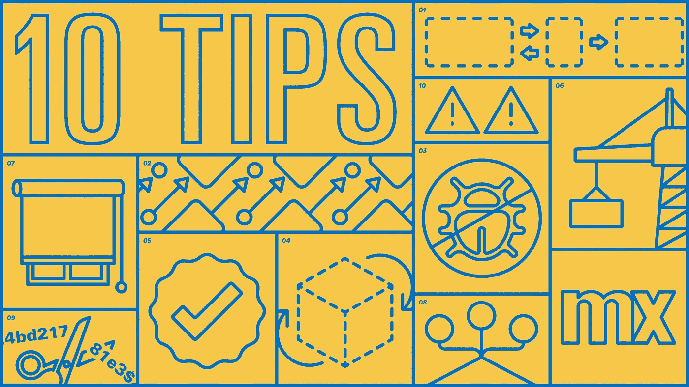
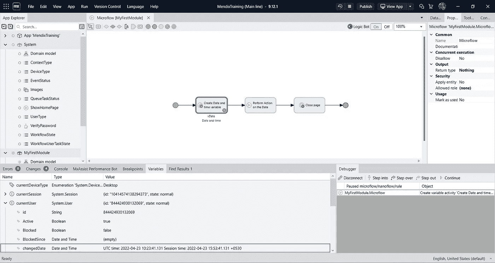
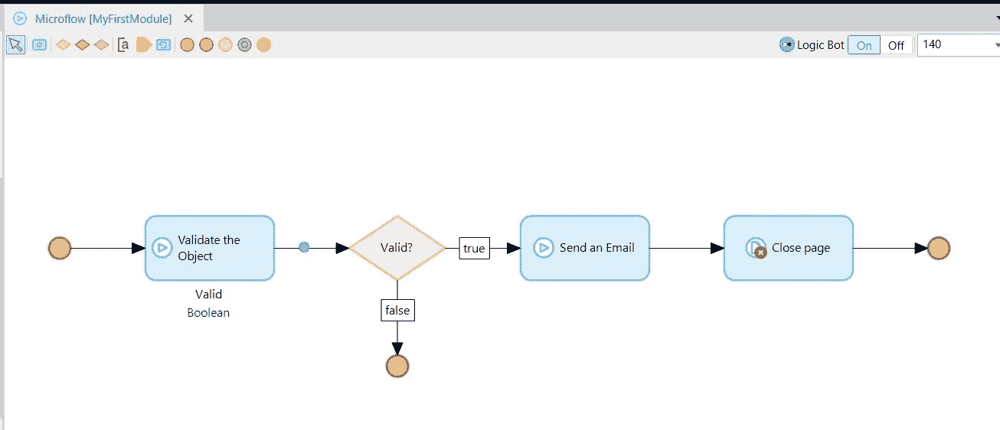
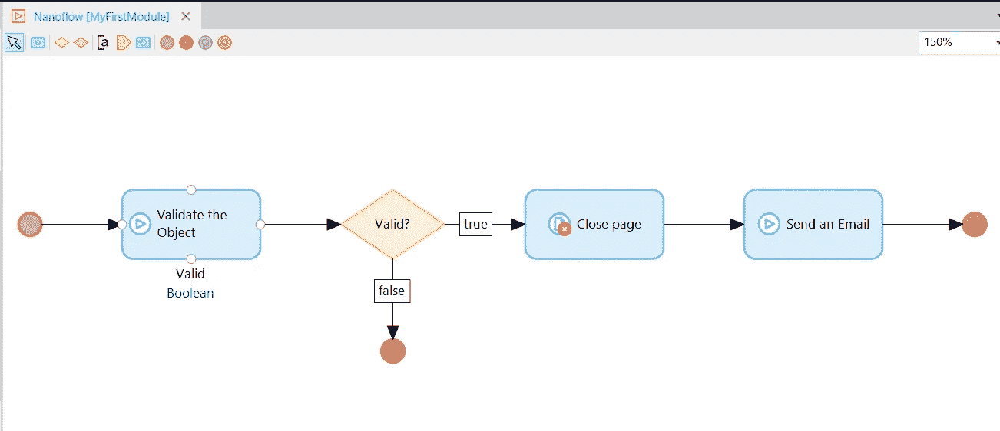
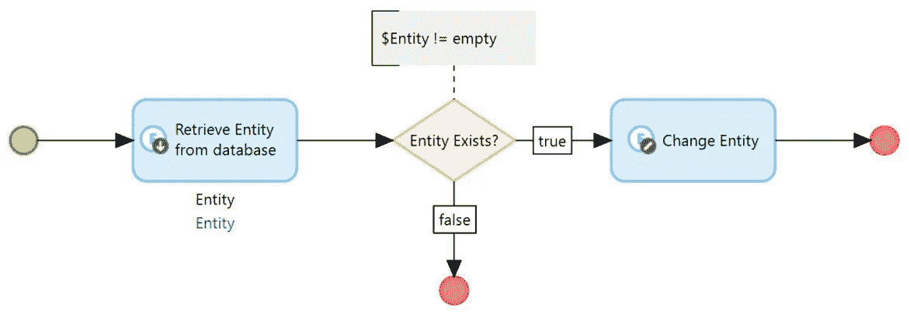
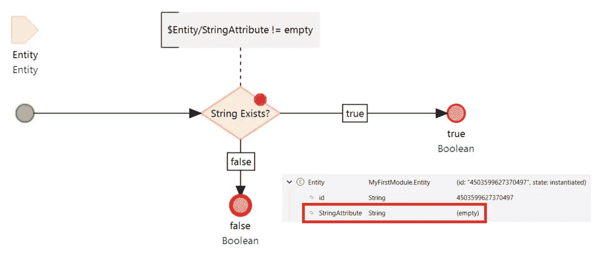
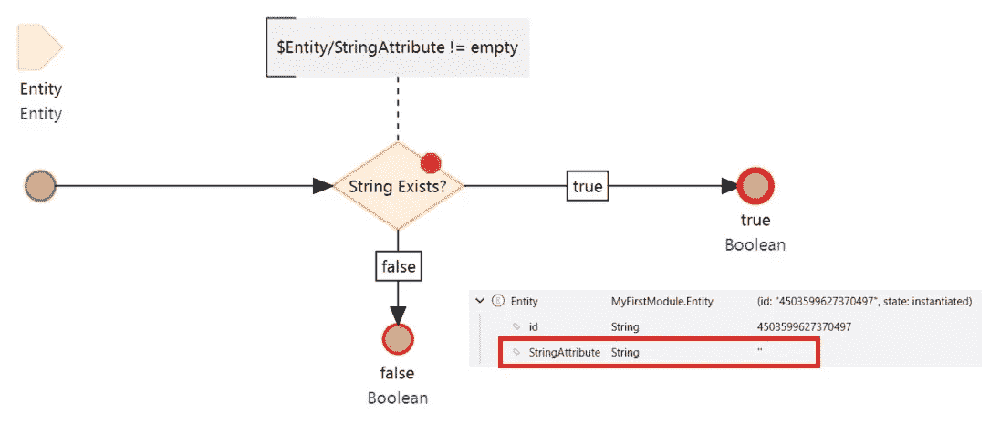
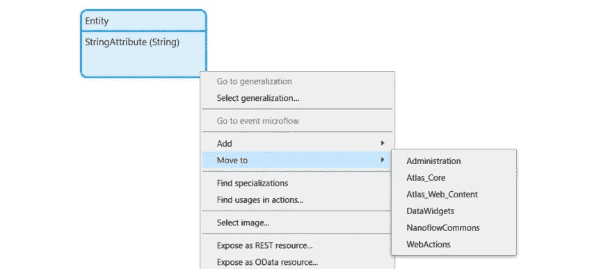
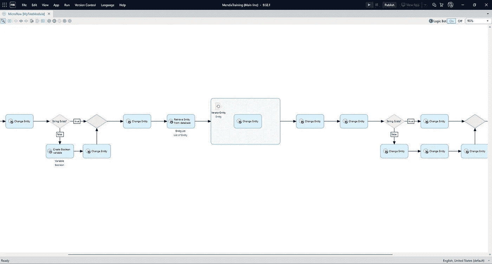
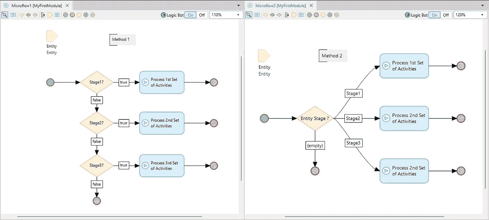

# 日常 Mendix 开发的 10 个技巧

> 原文：<https://medium.com/mendix/10-tips-for-everyday-mendix-development-fb45cb5bb8be?source=collection_archive---------1----------------------->

10 tips for everyday Mendix development

# 过去几年我和门迪克斯的旅程是一个美丽的故事，我可以永远讲下去。虽然 Mendix 学院、论坛、文档和同事在培养我的 Mendix 知识方面发挥了至关重要的作用，但还是有一些大大小小的提示和技巧，对我使用 Mendix 进行日常应用开发有很大帮助。

## **提示 1 — Mendix Studio Pro 布局**

作为一名 Mendix 开发人员，大多数时候我们使用由 Mendix 提供的强大调试工具。你想知道有多少次你不得不在*变量*和*调试器*面板之间切换吗？嗯，不再是了。

您可以按照以下屏幕设置您的 Mendix 布局，这有助于您监视您的*变量*并同时执行*调试*活动，如单步执行、单步执行、单步执行和继续。当你花大部分时间调试微流/纳流时，这是一个很好的技巧。

> 提示:您也可以将**控制台**直接放在变量和调试器窗格之间，这样您就可以在调试时利用日志消息。

## **提示#2 —纳米流拯救世界**

想知道如何减少用户在保存/取消更改和关闭页面时的等待时间吗？

想象一个用户故事，其中用户出现在弹出页面上。以下活动应作为*保存*按钮的一部分来执行

1.  验证更改
2.  如果有效，向用户发送电子邮件
3.  关闭弹出页面，再次显示概览页面

实现这一点的通常方法是通过以下活动在*保存*按钮的点击动作上创建一个微流:

在弹出页面关闭之前，用户需要等待“发送电子邮件”活动完成吗？如果您对此的回答是**否**，那么将这个微流转换为纳米流，并在“发送电子邮件”活动之前引入“关闭页面”活动，有助于减少用户的等待时间。

原因是当一个纳米流遍历它的动作时，**客户端动作被直接执行**。因此，在“发送电子邮件”活动开始之前，弹出页面将被关闭。

## **提示#3 —调试启动后微流**

有没有遇到过你的 Mendix 应用程序无法启动的噩梦？如果是的话，你应该利用调试工具，在启动微流后立即在*中放置一个断点来调试它。*

但是等等，出问题了，不是吗？断点从未被触发！这是因为 Mendix 设计中调试器仅在运行时完全启动时才可用。

如果需要在启动后调试*微流，则从配置中移除启动后微流，并从应用管理员主页上的临时按钮调用它*

## **提示 4——改变一个空的对象**

如果说“每个 Mendix 开发人员，至少有一次，会遇到下面的错误”,这并不奇怪

> com . mendix . modules . microflow engine . microflow exception:更改对象“Some(Entity)”不应为空

有时，即使我们已经评估了检索对象不能为空的所有可能场景，也可能会出现一种极端情况，即*变更对象*活动接收到一个空对象。这将向用户抛出一个错误。

最好在更改对象之前进行空对象检查，以避免错误。

## **提示 5 —空字符串验证检查**

我们在 decision 中编写以下表达式来检查字符串属性是否为空。

> $Entity/StringAttribute！=空

虽然这在大多数情况下是可行的，但是在某些情况下它不会返回适当的响应。考虑以下情况-

A)用户创建一个新对象并点击保存按钮，而没有填充属性值。由于字符串属性的默认值是 *empty，*空检查验证仍然有效。

b)用户编辑现有对象，删除字符串属性的值，并点击保存按钮，而不填充属性值。这次属性值设置为*“*而不是*空*。因此，我们的验证返回不正确的结果。

为了确保验证逻辑始终工作，空字符串检查的最佳实践是将其与 *trim* 函数结合使用

> trim($Entity/StringAttribute)！= ''

## **提示#6 —将实体从一个模块移动到另一个模块**

您的领域模型是否因大量实体而过度拥挤？是时候隔离您的域模型，并将它们移动到一个新创建的模块中，以帮助简化代码的可维护性和模块化。但是我们如何在模块间无缝地移动实体呢？

我们中的许多人倾向于通过简单地剪切(Ctrl + X)模块 1 中的实体并粘贴(Ctrl + V)模块 2 中的实体来实现这一点。这将导致实体表被完全删除并重新创建为一个新表，从而导致所有现有的实体数据从数据库中被清除。想象一下都很可怕，对吧？

Mendix 为此提供了一个简单的解决方案。右键单击域模型中的一个实体，并单击“*移动到*”，然后选择它应该移动到的模块。该表在数据库中被重命名为新的模块名。

## **提示# 7——利用免分心模式**

Studio Pro layout 通过左侧的*应用浏览器*、右侧的*属性*和*工具箱*以及屏幕底部的*控制台*、*更改、*和*调试器*窗格给了我们巨大的力量和功能，剩下的中央区域留给我们设计漂亮的页面、微流程和其他任何东西。

很多时候，会出现这样的情况，您必须调试非常复杂的微流，或者您需要一些额外的区域来正确地查看您的代码片段。这正是我们利用令人敬畏的*无分心模式*来隐藏除主要区域之外的所有其他窗格的时候。

可以通过导航到**视图>无干扰模式**进行切换

> 免分心模式快捷键— **Shift + F11**

## **提示#8 —使用枚举代替直接值比较**

枚举属性类型是处理预定义值列表的好方法。

考虑下面的场景，其中名为*阶段*的枚举属性有 3 个值，即*阶段 1* 、*阶段 2、*和*阶段 3。*基于如下所示的阶段，有两种方法可以形成微流程的决策

与方法 1 相比，方法 2 具有以下优势:

a)执行时间更快，因为决策只被检查一次。

b)当添加一个新的枚举值时(比如阶段 4)，Mendix 会自动提示您转到微流，并更新新值的流。

## **提示 9 —决定字符串属性的长度**

字符串属性通常带有一个额外的配置来定义字符串的长度，该长度可以设置为有限的字符数，也可以设置为无限的字符数。

开发人员倾向于尽可能地限制字符串的长度，因为较小的字符串长度属性有很多优点，例如-

a)并非所有数据库都支持无限长字符串的索引。

b)字符串长度越短，搜索字符串属性的速度越快。

然而，有时预测字段的最大长度并不容易。在这种情况下，如果传入数据(比如来自 Rest 服务导入映射)的字符数超过了 string 属性所能容纳的数量，就会抛出一个错误。

## **提示# 10——清理应用浏览器前要小心**

有一天，我们计划清理我们的应用浏览器，删除那些一年前被排除的项目，重命名一些微流/纳米流/页面，并排除未使用的逻辑。为了确保您的清理活动不会导致额外的错误，您可以参考以下几点-

a)排除文档时，将排除日期附加到文档名称有助于区分最近和旧的排除项目。

b)从 *JavaScript 片段*或*深度链接*调用的微流/纳流不会出现在*查找用法*上。因此，应该提供适当的注释，以防止其他开发人员意外删除或重命名文档。

## **结论**

重大问题的根本原因有时可能是在开发应用程序时对“小事情”的知识差距。虽然 Mendix 技巧的列表并不详尽，但还有许多其他的技巧你可能已经在实施了，而世人并不知道。你还在等什么？继续与世界分享你的技巧和诀窍，并记住“*”。*

## *阅读更多*

 *[## 实施 Mendix 最佳发展实践

### 1 简介本文档可用作采用一致的命名和建模约定的参考，同时…

docs.mendix.com](https://docs.mendix.com/howto/general/dev-best-practices/)*  *[## 实施发展的最佳实践

### 1 简介本文档可用作采用一致的命名和建模约定的指南，同时…

docs.mendix.com](https://docs.mendix.com/howto7/general/dev-best-practices/)*  *[## 在应用程序中找到自己的路

### 1 简介该操作指南解释了如何在桌面建模器的应用程序中找到自己的路。在世界的许多地方…

docs.mendix.com](https://docs.mendix.com/howto7/general/find-your-way/)*  *[## 快速入门

### 了解如何在 Studio Pro 中快速轻松地构建应用程序。

docs.mendix.com](https://docs.mendix.com/refguide/quickstart-guide/)*  *[## 开发者工具推荐

### 描述使用 Mendix 进行开发时可以使用的最佳第三方工具。

docs.mendix.com](https://docs.mendix.com/refguide/developer-tools/)* 

**来自发布者-**

**如果你喜欢这篇文章，你可以在我们的* [*中页*](https://medium.com/mendix) *找到更多喜欢的。对于精彩的视频和直播会话，您可以前往*[*MxLive*](https://www.mendix.com/live/)*或我们的社区*[*Youtube PAG*](https://www.youtube.com/c/MendixCommunity/community)*e .**

**希望入门的创客可以注册一个* [*免费账号*](https://signup.mendix.com/link/signup/?source=direct) *，通过我们的* [*学苑*](https://academy.mendix.com/link/home) *获得即时学习。**

*有兴趣更多地参与我们的社区吗？加入我们的 [*闲散社区频道*](https://join.slack.com/t/mendixcommunity/shared_invite/zt-hwhwkcxu-~59ywyjqHlUHXmrw5heqpQ) *。**