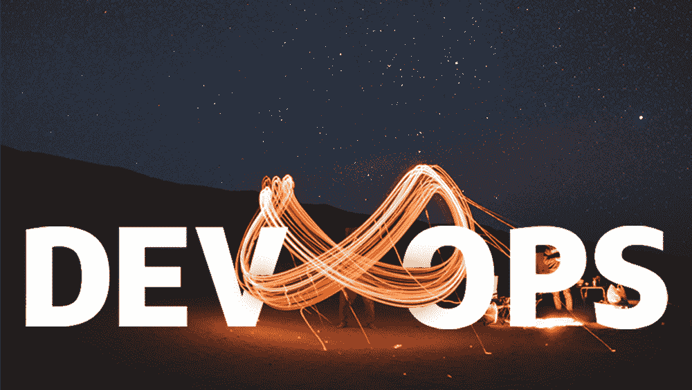

# 现实世界中的 DevOps

> 原文：<https://medium.com/capital-one-tech/10-ways-devops-engineers-can-help-implement-efficient-change-9d04a9cc79ea?source=collection_archive---------4----------------------->

## DevOps 工程师帮助实施高效变革的 10 种方式

作为一名 DevOps 工程师，我在团队和公司中的主要职责之一是帮助挣扎中的团队成为健康的团队，解决他们的痛点，并帮助他们有效地交付软件。我被要求从底层、顶层和边缘团队进行变革。根据我的经验，无论你试图从哪个方向改变，这些原则都是不变的。

## **1。管理层的认同是最重要的事情**

没有认同，你的大部分努力将会浪费或短暂，过程将难以置信地难以改变，帮助实现文化变革几乎是不可能的。

## **2。资历帮助**

无论是作为顾问还是全职员工，处于领导地位和资历都会对变革产生影响。尽管你的资历越高，就越难理解日常的痛点。取得平衡很难。当你没有资历时，你必须向上爬。你必须以不冒犯他人或跨越界限的方式交流。坦诚地交流所面临的问题，以及你认为可以解决这些问题的方法。

## **3。带来问题的解决方案**

批判和发现问题很容易。来自员工的增值是创造、调查和找到问题解决方案的能力。团队和/或公司管理层很可能以前听说过这些问题。他们可能会听你的。但是找到解决方案是困难的部分。你的解决方案可能不起作用，或者无法实施，这通常是因为你无法控制的原因。然而，提出解决方案既有助于传达你在这种情况下的个人投资，也能让你通过影响方向来改变文化。

## **4。演示结果**

使用硬数据来证明改进。无论是团队快乐、成功发布，还是正常运行时间/弹性——找出*为什么*管理层、团队或公司想要改变。询问如何衡量它，然后专注于改进这些指标。

## **5。让改变变得简单**

这在直接与开发团队合作时尤其重要。人们在工作中有很多事情要做。你越容易对工作流、流程或工具做出改变，你就会看到越多的接受和认同。尤其是当您简化这些工作流、流程或工具时。

## **6。专注聆听**

与已经加入团队一段时间的团队成员交谈，发现他们面临的挑战。首先集中精力解决这些问题，但不要试图同时做所有的事情。可能会有很多问题需要解决，尝试一次解决所有问题是很有诱惑力的。什么可能是最大的技术问题，或者最糟糕的实践，可能有一个对团队来说还不痛苦的简单的手工工作；在这种情况下，尤其是在早期，推迟是有意义的。您的团队、企业所有者和管理层的需求应该是确定优先级的一个因素。

## 7 .**。让生活变得更轻松**

先努力提高自己控制的东西。在进行过程中向代码中添加测试。编写一个简单的脚本来自动化一些任务，然后将脚本与应用程序一起提交。通过编写可以运行的脚本来改进构建过程。记住，人的问题很少有技术上的解决方法。

## **8。设计井**

您想要实现的所有更改应该给开发人员和企业更多的自由。确保您的工具和实践有助于创建一个不会出错的环境，让您的开发人员能够在该环境中更好地控制他们的时间和精力。如果您在 AWS 中，有助于实现这一目标的工具的一个例子是 AWS Config 或 Cloud Custodian。具体的工具并不重要；设计原则是。根据我的经验，建立明确的控制界限，然后在这些界限内给予控制，将会解决很多痛点。

## **9 永远精益求精**

不管你目前知道什么，或者你正在做什么，帮助团队的一个关键方面是不断的个人成长。从白皮书、博客、新认证、播客中学习。消耗与你的主要任务相关的材料和那些不相关的，或者只有轻微关联的材料。你会对来自不同领域或不相关想法的结合的创新或应用感到惊讶。

## **10 了解技术债**

技术债不可避免。它通常是过去基于不完整的信息、不断变化的需求或时间限制而做出的完全有效且可接受的选择的结果。没关系。有技术债务没关系。确保你有一个处理它的计划，确保你对产品/流程有足够的了解来处理它，并且在那一刻尽你所能。你总是会回顾过去，看到需要改进的地方。

希望这些能帮助你找到改变你的团队、部门或公司的方法。无论是帮助他们迁移到一个完全自动化的发布过程，自动化一个部分，或者甚至只是改变一些过程，这些沟通和架构的想法应该帮助过程更平滑，更快速，更有效，并有助于一帆风顺。

披露声明:2019 首创一。观点是作者个人的观点。除非本帖中另有说明，否则 Capital One 不隶属于所提及的任何公司，也不被这些公司认可。使用或展示的所有商标和其他知识产权是其各自所有者的财产。