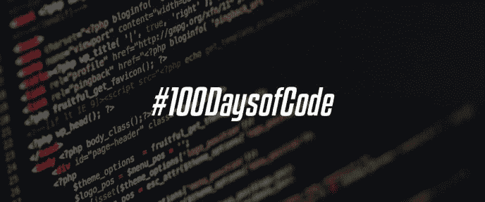

# #100DaysOfCode，第三轮| Python、Flask、Django 等

> 原文：<https://medium.com/quick-code/100daysofcode-3rd-round-python-flask-django-and-more-6bd08ba1b1e6?source=collection_archive---------0----------------------->

在第一次成功的#100DaysOfCode 挑战后，我学会了 Vue.js(还有一次不太成功的挑战，我在[做了 3/4 后第二次](https://letslearnabout.net/blog/how-i-failed-my-100daysofcode-challenge/)失败了)，我准备迎接我的第三次挑战。

如果你想了解 Python、Flask、Django、Django Rest 框架以及 Python 生态系统中的其他一些东西，这篇文章会让你感兴趣。

# 我将从这次挑战中学到什么

我在[的第一次挑战](https://letslearnabout.net/100daysofcode/why-i-am-joining-100daysofcode/)中学到了 Vue(事实上，我现在的工作就是围绕 Vue！)而且我在第二次的时候已经学会了颤振[。我将在第三次挑战中学到什么？](https://letslearnabout.net/100daysofcode/im-joining-100daysofcode-again-flutter-time/)

列表如下:

*免责声明:此处链接的课程、书籍、培训材料等是我将要参加的课程。没有一个链接是附属链接，我没有从他们那里得到任何钱。*

另外，我应该重新考虑我的收入策略。

## 计算机编程语言

[*Python 中的异步技术和示例*](https://training.talkpython.fm/courses/explore_async_python/async-in-python-with-threading-and-multiprocessing) ，视频–Michael Kennedy 的教程(是的，就是《与我谈论 Python》中的那个)。

[Python 线程教程](https://www.youtube.com/watch?v=IEEhzQoKtQU)，科里·斯查费的 YouTube。

[Python 多处理教程](https://www.youtube.com/watch?v=fKl2JW_qrso)，科里·斯查费的 YouTube 教程。

[Python 中的多线程，](https://www.geeksforgeeks.org/multithreading-python-set-1/)GeeksForGeeks 的 YouTube 教程。

## 瓶

[用 Flask 和 SQLAlchemy 构建数据驱动的 web 应用](https://training.talkpython.fm/courses/explore_flask/building-data-driven-web-applications-in-python-with-flask-sqlalchemy-and-bootstrap)，Michael Kennedy 的视频教程(是的，来自 Python Bytes 的那个)。

用 Flask 构建一个 SAAS 应用程序

## 姜戈

Django REST 框架和 Vue JS 的完整指南，Michele Saba 的 Udemy 课程。

[Django Waves](https://courses.djangowaves.com/) ，来自荷兰的 Stan 教授的 Django+VueJs web sockets 课程(我没有关于他的更多信息)。

[实用 Django 2 和频道 2](https://www.amazon.com/Practical-Django-Channels-Applications-Capabilities/dp/1484240987) ，费德里科·马拉尼的电子书。

威廉·文森特的电子书《Django for Professionals》。我在这里回顾了一下[。](https://letslearnabout.net/books/review-rest-apis-with-django/)

## Django Rest 框架

[Django for API:用 Python 和 Django 构建 web API](https://djangoforapis.com/)，电子书，作者 William Vincent。

[改进 Django Rest 框架中的序列化性能](https://hakibenita.com/django-rest-framework-slow)，Haki Benita 的文章。

## 测试

[用 Pytest 进行 Python 测试](https://www.amazon.com/Python-Testing-pytest-Effective-Scalable-ebook-dp-B0773VRHWT/dp/B0773VRHWT/ref=mt_kindle)，Brian Okken 的电子书。

唷，那可真多！

现在，除了担心我的理智，你一定在问…

# 为什么

嗯，我爱 Python 已经不是什么秘密了。我喜欢使用 Python，但是在我现在的工作中，我使用 Vue.js，而不是像以前那样使用 Python 和 Django。

但是当我回家的时候，我学习 Python，因为那是我喜欢做的。

我一直在用[美汤](https://www.youtube.com/watch?v=HIjejEdPr3I)和 [Scrapy](https://www.youtube.com/watch?v=gGnGnIPgR84) 学习网页抓取，学习 [Python 库](https://www.youtube.com/watch?v=tIFEe0W0BEA&list=PLy3juYua7JoWdp0qb7GjeUTUf8phcc8Rg)，学习如何创建 SMTP 服务器等等。

我在专业水平上使用过 Django，也使用过 Django Rest 框架。我能胜任，但我想要更多。我想学习如何写专业的 Django:测试，芹菜，WebSockets，用 Redis 缓存等。

我想写快速、良好、经过测试的 Django 代码。

我还想学 Flask 来取乐。虽然我没有寻找任何烧瓶工作(但他们是受欢迎的！)，了解 Python 和 Django，学习 Flask 应该很容易，它会帮助我更深层次地学习 Django。

# 作为读者，我为什么要关心？

现在你可能会问，“我为什么要关心一个随机的人做了什么？”(顺便说一下，我叫大卫。很高兴见到你)。

好问题。答案如下:

当我读完每一本书、每一课、每一段视频或每一篇文章时，我会写几行我学到的东西和我对资源的想法。这样你就有了一系列关于你想要的主题和你能学到的东西的链接。

也许你想学习 Flask 来创建一个 Saas。也许你想了解如何用 Python 作为你的后端语言来做一个完整的解决方案。

这篇文章也是为了帮助你，所以把它收藏起来，因为我会每周更新一篇关于某个资源的新评论。

顺便说一下，我将在我的 Youtube 频道上用我学到的主题创建视频教程，所以请确保[你在关注我](https://www.youtube.com/channel/UC9OLm6YFRzr4yjlw4xNWYvg?sub_confirmation=1)。

你可以期待每周至少两个视频

# 那太难学了——你疯了吗？

是的，但是我们不要针对个人，好吗？

玩笑归玩笑，这个挑战的目的是把我从初级 python ista/初级 Fullstack 开发人员推向高级开发人员。

我已经知道 Python，我已经知道并在专业水平上使用了 Django，还有 DRF。我不需要学习如何使用那些技术。

这项挑战的目的是学习如何在高级水平上使用这些技术

我有专业经验，但我想写好，快速和安全的代码(是的，甚至测试！).

我不想学习另一个框架或另一种语言，我想在我已经知道的方面变得非常好。我希望我的工作效率飞速提高。

当然，我对学习新东西持开放态度(作为一名优秀的 [T 型开发人员](https://letslearnabout.net/blog/what-it-is-a-t-shaped-developer-and-why-you-should-be-one/)应该如此)，我将在未来的挑战中学习 Flutter、Docker、Kubernetes、Go 等，但生产力是我目前唯一的目标。

# 结论

所以，今天，9 月 23 日，我将开始我的 100 天代码挑战，在那里我将学习 Python 和它的一些框架。

你可以每天在 Twitter ( [DavidMM1707](https://twitter.com/DavidMM1707) )上关注我的进展，并在我的 [Youtube 频道](https://www.youtube.com/channel/UC9OLm6YFRzr4yjlw4xNWYvg?sub_confirmation=1)上与我和我的教程一起学习所学的主题。

最后一个问题是:你还在等着学习什么？

在评论中告诉我们你将要学习什么(或者你目前正在学习什么！)以及为什么在你的 100 天代码里。祝你好运！

[我的 Youtube 教程视频](https://www.youtube.com/channel/UC9OLm6YFRzr4yjlw4xNWYvg?sub_confirmation=1)

[在 Twitter 上联系我](https://twitter.com/DavidMM1707)

*原载于 2019 年 9 月 23 日*[*【letslearnabout.net*](https://letslearnabout.net/100daysofcode/100daysofcode-3rd-round-python-flask-django-and-more/)*。*