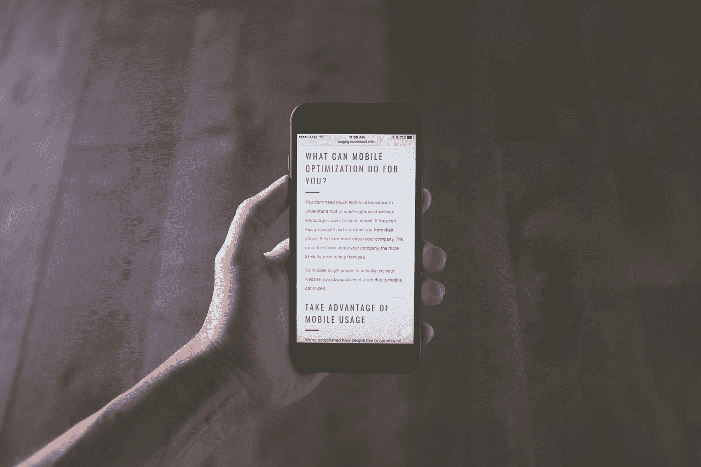

# iOS Safari 的 100vh 问题

> 原文：<https://medium.com/quick-code/100vh-problem-with-ios-safari-92ab23c852a8?source=collection_archive---------0----------------------->



Photo by [NeONBRAND](https://unsplash.com/@neonbrand?utm_source=medium&utm_medium=referral) on [Unsplash](https://unsplash.com?utm_source=medium&utm_medium=referral)

尽管我们使用了 *100vh* (带有 *100vh* 文本的红色不透明框)，但是网页内容在视窗之外。

```
.section {
 height: 100vh; // bad approach 
}
```

增加高度后你收到的问题: *100vh* 到手机分辨率。这是由于 Safari 和 Chrome 使用的计算方法造成的。移动设备 calc 浏览器视口为(**顶栏+文档+底栏** ) = *100vh* 。当页面必须有一个部分充满整个屏幕时，我很难使用 100vh。几个小时后，我找到了我给你展示的解决方案。

它们是两种解决方案，第一种方案需要 JavaScript 和 CSS，第二种方案只需要 CSS。

1.JS 和 CSS 解决方案

让我们首先从 JS 文件开始:

```
const appHeight = () => {
 const doc = document.documentElement
 doc.style.setProperty(‘ — app-height’, `${window.innerHeight}px`)
}
window.addEventListener(‘resize’, appHeight)
appHeight() 
```

**appHeigh** t 函数已经设置了新的样式属性 *var(` — app-height`)* 包括当前窗口高度， *— app-height* 这是后续步骤所必需的。

```
:root {
 — app-height: 100%;
}html,
body {
 padding: 0;
 margin: 0;
 overflow: hidden;
 width: 100vw;
 height: 100vh;
 height: var( — app-height);
}
```

在前面的步骤中，我已经创建了引用 *— app-height* ，包装在 *var()* 中，我已经收到 CSS 变量 *var( — app-height)* 。这个变量可以读取 JS 创建的值。

2.CSS 解决方案(不推荐)
最后一个但并非最不重要的解决方案是“webkit-fill-available ”,这个解决方案只在苹果设备上有效，在安卓设备上解决不了问题。这个方案我不推荐，但是值得展示。

```
height: 100%;
height: -webkit-fill-available;
```

感谢您的关注！我将感谢您的反馈。

如果你喜欢这篇文章，请在 Twitter 上关注我[[@ MaciejDEV](http://twitter.com/MaciejDEV)]([https://twitter.com/MaciejDEV](https://twitter.com/MaciejDEV))