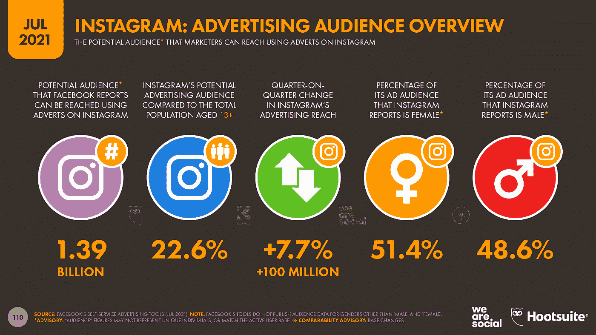
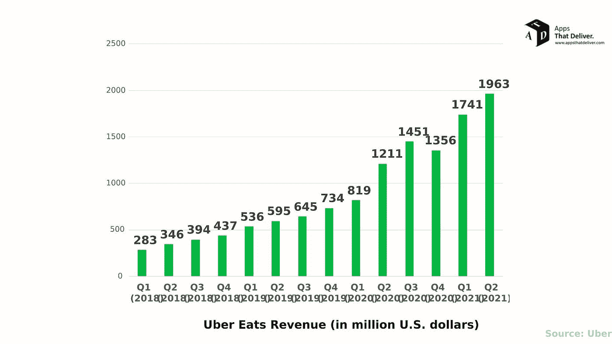
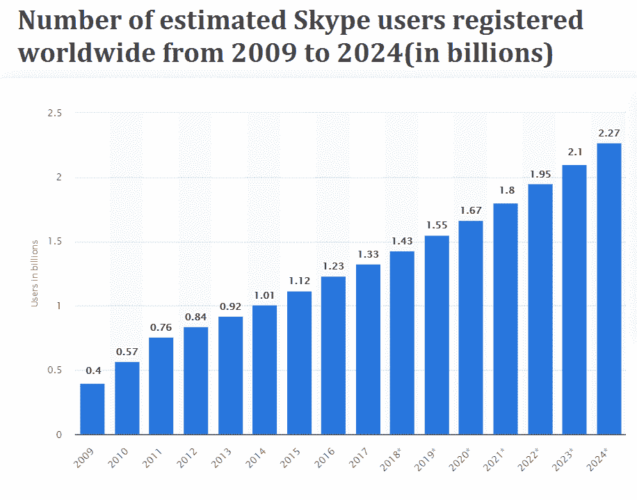
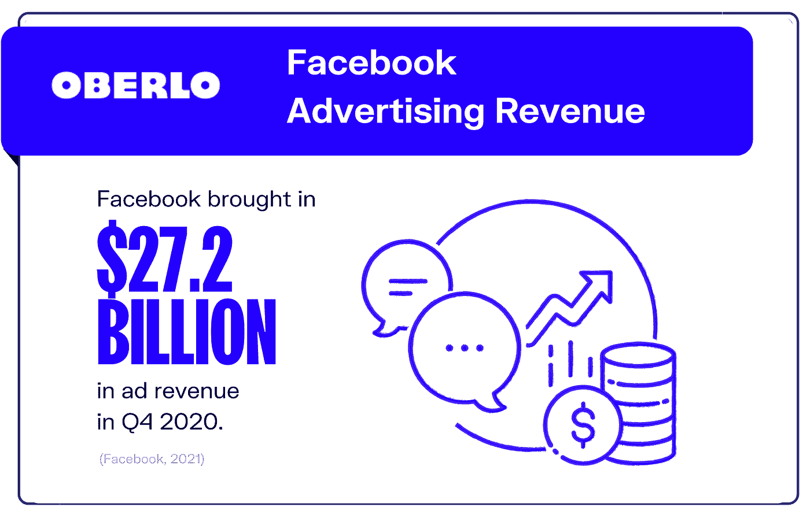
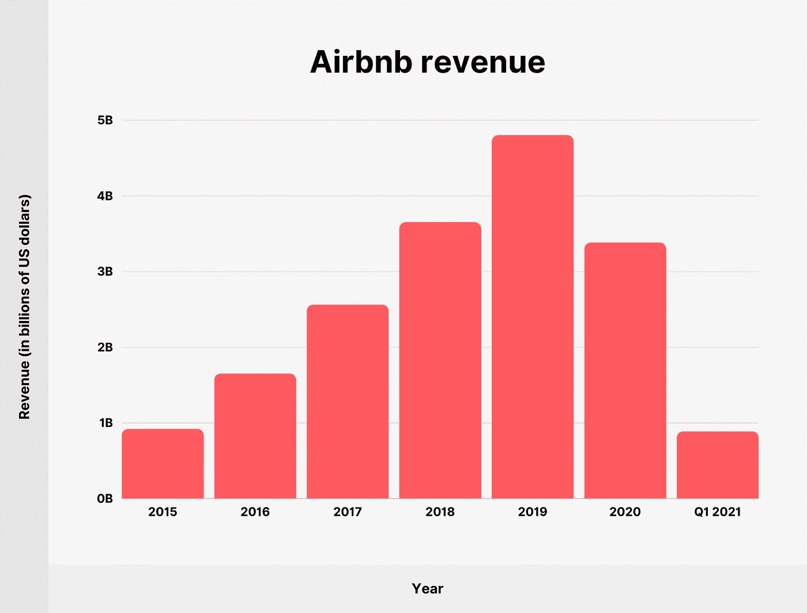
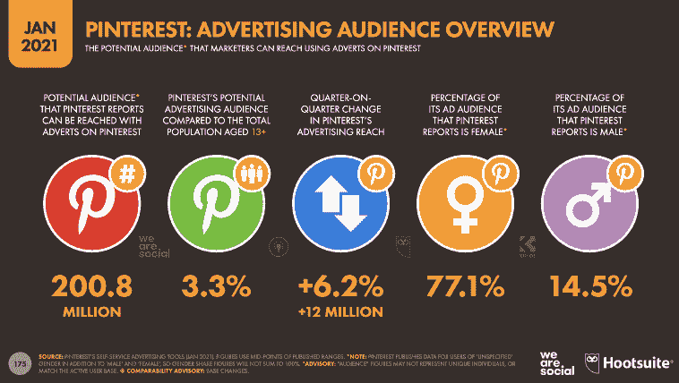

# 市场上 React 原生应用的 11 个典型例子

> 原文：<https://medium.com/quick-code/11-great-examples-of-react-native-apps-in-the-market-55f3705591e8?source=collection_archive---------1----------------------->

## 目前市场上 React 本地应用程序的优秀示例列表

如今，人们痴迷于移动应用。但是，只有使用 React Native，才能开发出如此具有竞争力且性能出众的高级应用程序。

是的，React 原生跨平台框架已经成为当今最好的、蓬勃发展的解决方案。它在全球开发者最常用的框架列表中排名第二。

你知道吗？React Native 在过去五年中一直排名第一，包括 2020 年。尽管今年它获得了第二名，但它仍然在市场上取得了成功。有可能到 2021 年底，又能排第一了。

React Native 自 2015 年推出以来获得了大量关注。它驱动了许多顶级商业巨头的应用程序，如 UberEats、Instagram 等。

你知道吗？在 React Native 之前，移动应用开发有两条主要路径:

1.“一次编写，随处运行”，这意味着为每个平台开发一个单独的代码库，并为所有支持的平台单独部署它，没有重用代码的空间，或者…

2.每当你想瞄准一个新平台时，都要重写整个应用程序——这可能需要几周、几个月甚至几年的时间。

如果你想了解更多关于 react-native 及其开发的应用，请阅读这篇博客。在这里，您将了解 React native 及其最佳应用。那么，我们开始吧。

**现在，知道了市场上最好的 react 原生应用的名字，看看:**

**1。Instagram**

Instagram 是每个人都使用的最受欢迎的摄影应用程序之一，最棒的是，它是用 React Native 开发的。对于本文来说，这是一个完美的例子，因为它非常出名并且是开源的(至少部分是)。

正如其 GitHub 页面上所描述的，Instagram 有三个主要组件:Feed、Explore 和 Profile。供稿多是你帖子的供稿；Explore 包括所有热门帖子，而 Profile 提供关于您和您的个人资料的信息。

25+人在 9 个月内创建了 Instagram 应用程序。然而，其他公司已经使用 React Native 来使他们的应用程序比这更快。

**一些有趣的 Instagram 统计数据:**

*   5 亿每日活跃 Instagram 用户
*   迄今已分享 800 亿张照片
*   Instagram 应用程序上每天有 10 亿次搜索，超过了必应、谷歌和雅虎的总和
*   20 个顶级品牌中有 19 个出现在 Instagram 上，每个品牌平均有 150 个帖子。

Instagram 目前位于最受欢迎的 React 原生应用的榜首，因为它可以轻松添加简单和复杂的功能，并且只需要很少的时间。它们还有其他好处，例如:

*   **很简单—** 只需要一个开发人员来完成整个实现
*   **小团队规模—** 团队不需要一个大的本地开发人员团队，只需要一个懂 React Native 的人。
*   **可扩展—** 添加额外的平台只需几天时间
*   **它与其他应用已经有的后端服务**整合得很好
*   **与移动 SDK 相比，性能反馈是即时的**，在移动 SDK 中，您必须等待应用程序被构建并安装在设备上。

**2。UberEats**

用 React Native 开发的流行应用的第二个例子是 UberEats。总的来说，这是一个应用程序，允许你根据位置从一些餐馆订购食物，然后通过你的手机跟踪订单。你还可以在收到食物后给司机打分，这样可以鼓励司机提供更好的服务。

他们的 GitHub 页面有一个很好的要点，展示了他们如何将项目分成三个部分:“一个 UI 框架，许多平台。”他们使用一个框架来创建用户界面，然后分离模块来适应每个平台(iOS 和 Android)。

**一些有趣的 UberEats 统计:**

*   遍布六个国家 30 个城市的 15，000 多家餐厅
*   订单的 2 倍转换率。
*   自 UberEats 推出以来，全球已有超过 1000 万次旅行使用该服务完成
*   总共 670 万次下载
*   独立研究公司 Aisle50 将 UberEats 应用程序的客户体验评为餐厅外卖应用程序中的第一名。

现在，它正在将其服务扩展到其他国家，如印度、新加坡、新西兰和巴西。根据 TheNextWeb 上的一篇文章，UberEats 还扩大了与印度当地快递公司的合作关系，与印度食品连锁店 Faasos 合作。

**为什么 UberEats 选择 React Native？**

UberEats 意识到他们不需要依赖第三方，这导致了糟糕的用户体验和缓慢的更新。此外，他们看到了 React Native 的潜力，因为添加平台非常容易。最后，他们能够快速发布更新并几乎即时看到结果。

**3。沃尔玛**

沃尔玛是世界上最大的公司之一，在全球拥有超过 11，000 家商店。他们希望用一个单一的代码库面向多个平台(有点像“写一次，到处运行”)。他们的主要目标是通过瞄准不仅仅是 iOS 用户来扩大用户群。他们通过这种方法实现了这一点，并且发布应用程序的速度比他们为每个平台开发一个应用程序要快得多。

**一些有趣的沃尔玛统计数据:**

*   每天有 1800 多万顾客光顾沃尔玛。
*   每月有超过 2.6 亿人在沃尔玛购物。
*   140 亿美元的资产，使其成为世界上最大的公司之一。
*   沃尔玛还在全球拥有 11000 家门店。

**沃尔玛为什么选择 React Native？**

沃尔玛希望让他们的客户能够在家购物，而不需要使用台式机或笔记本电脑，因此他们创建了一个任何人都可以访问的简单应用程序，并允许用户尽快找到他们正在寻找的产品。这要归功于 React Native，这使得他们能够创建比市场上大多数其他应用程序更强大的应用程序。

**4。Skype**

Skype 是使用 React Native 的最大应用之一，下载次数超过 10 亿次。它真正脱颖而出是因为它在许多平台上被多次下载，而不仅仅是 Android 或 iOS。考虑到这一点，Skype 开发了一次应用程序，并在 Android 和 iOS(以及其他移动/桌面操作系统)上运行，取得了巨大的成功。

**一些有趣的 Skype 统计数据:**

*   Skype 用户之间已经进行了 1000 亿分钟的视频和语音通话。
*   每天有 2500 万用户在这个应用上打电话。
*   每秒钟有 300 分钟的视频和语音通话。

**为什么 Skype 选择了 React Native？**

我们都知道为多个平台开发一个应用程序是多么痛苦。有了 React Native，Skype 只需构建一次应用程序，就能轻松管理不同的平台。

**5。特斯拉**

特斯拉一直以其高科技电动汽车而闻名，但在 2016 年，他们大举进军消费科技。他们的汽车信息娱乐系统几乎完全由 React native 构建，允许他们随时轻松更新。此外，每辆特斯拉汽车都有一个信息娱乐系统，这意味着他们的代码可以达到数百万用户！

**一些有趣的特斯拉统计数据:**

*   特斯拉在 2015 年生产了 14.5 万辆汽车，占全球汽车产量的十分之一。
*   一辆特斯拉汽车的生产时间不到两周
*   他们的信息娱乐系统是 React Native 的最大消费者，尽管他们也将其用于 17 英寸触摸屏和汽车的车窗开关。

**特斯拉为什么选择 React Native？**

特斯拉认为“我们的汽车需要更现代的显示和控制系统”，他们正在通过使用 React Native 构建他们的汽车信息娱乐系统来解决这一问题。

**6。脸书广告**

脸书广告公司的 React Native 应用程序方法简单，但效率很高。React 原生脸书广告应用的主要目标是让员工能够轻松访问他们所有的营销工具、报告和日常任务，而不必在各种移动平台上浏览多个应用。

**一些有趣的脸书广告统计:**

*   9 亿人连接到一个商业页面。
*   每天有 1 亿活跃用户更新脸书。
*   脸书每月分享 400 亿条内容。
*   有 180 亿种广告形式可供选择。
*   5.400 万广告客户可以在脸书上向超过 10 亿用户营销。

为什么脸书广告选择了 React Native？

很少有人反对 React Native，主要是当脸书这样的公司成功地将它用于他们的应用程序时。通过 React Native，脸书开发了一款更强大、更易用的应用。

**7。彭博**

React Native 将 iOS 和 Android 版本合并成一个代码库，并迅速跨平台发布。此外，彭博可以同时为所有三个平台提供更新，这意味着他们总是在利用每个平台上的任何新功能。

**一些有趣的彭博数据:**

*   超过 325，000 名专业用户使用它们
*   人们平均每月签到 4600 万次
*   他们每天有 20 多个活跃用户

**为什么彭博选择了 React Native？** 就像沃尔玛一样，他们也需要一款能够跨多个平台运行的应用，并允许他们快速发布更新。彭博之所以能够做到这一点，是因为 React Native 帮助他们扩大了应用的用户群，并让这些用户参与每两周发布一次的新功能。

**8。Wix** Wix 的 React Native 应用程序允许开发人员使用高度通用的编辑器来轻松创建令人惊叹的网站，而几乎没有任何编码经验。他们的网站甚至提供了一步一步的指导，让使用他们的应用程序轻松创建您的个性化网站。他们还举了一个例子，说明用他们的应用程序创建你的定制网站是多么容易。

**一些有趣的 Wix 统计:**

*   2009 年，他们在一年内从 2 名员工增长到 100 名
*   他们已经从红杉资本和特纳亚资本等投资者那里筹集了超过 1.76 亿美元的资金

**Wix 为什么选择 React Native？** Wix 需要一款能让他们创建网站并在必要时快速推送更新的应用。与大多数只能在 iOS 或 Android 商店更新应用程序的移动平台不同，React Native 允许 Wix 每隔几周推送更新，不像其他平台需要几个月的等待。

**9。Airbnb**

Airbnb 使用 React native 使其用户界面更简单、更强大、更美观。这个应用程序允许用户连接主机，这些主机可供旅行者预订房间或只是简单地出租房屋一段时间。

它还允许他们的应用程序在用户预订房间或租赁之前查看房屋的外观，提供更个性化的体验。

**一些有趣的 Airbnb 统计数据:**

*   在 100，000 个城市和 220 个国家/地区拥有超过 560 万个活跃列表
*   超过 1.5 亿人使用过 Airbnb。
*   2021 年，Airbnb 全球约有 290 万主机。

**Airbnb 为什么选择 React Native？**

Airbnb 希望给他们的用户尽可能最好的体验，所以他们决定使用 React Native 来创建一个直观的界面，无论用户在什么设备上使用 Airbnb，他们都会感到熟悉。React Native 实现了这一点，甚至更多，因为他们的应用程序将用户参与度提高了 40%。

10。Pinterest

Pinterest 上榜是因为它提供了最佳的图片浏览体验。这款 React Native 应用程序采用了一个平滑干净的界面，允许用户轻松浏览他们保存的图像。他们在 iOS 上发布之前也在 Android 上发布了它，这告诉你使用这种方法的开发效率有多高。

**一些有趣的 Pinterest 数据:**

*   2.5 亿多月活跃用户。
*   Pinners 在 Pinterest 上平均花费 1 小时 23 分钟
*   有 30 种语言版本
*   Pinterest 的估值为 120 亿美元，在美国顶级上市公司名单中排名第 30 位。
*   大约 82%的人在手机上使用 Pinterest。
*   广告商可以在 Pinterest 上锁定 2 亿多用户。

【Pinterest 为什么选择 React Native？

React Native 开发了一个应用程序，允许用户做任何事情，从寻找家居装饰的灵感，组织食谱，甚至寻找新的方法来发展他们的小企业。所有这一切之所以成为可能，是因为 React Native 提供了灵活性，允许他们创建一个数百万人可以毫无问题地使用的应用程序。

11。声音云

SoundCloud 是最著名的音乐和音频流媒体应用程序。它们的流行是因为用户很容易找到并听到他们喜欢的歌曲和声音。React Native 建立了一种简单而高效的方式来浏览这些歌曲和声音。

**一些有趣的 Soundcloud 统计数据:**

*   超过 2000 万声音创作者(艺术家、播客等)每分钟上传超过 12 小时的新内容
*   活跃在全球 175 多个国家
*   支持 500 多种协议。
*   超过 2000 万首歌曲可供免费播放或下载。

**Soundcloud 为什么选择 React Native？**

通过 React Native，Soundcloud 开发了一个应用程序，允许用户播放和收听音乐，购买即将到来的演出的门票，与朋友分享歌曲，甚至了解更多关于这位艺术家的信息。这是公司如何使用 React Native 创建多功能和可访问的应用程序的又一个优秀例子，即使它们每天都有数百万人使用。

**最终想法**

React Native 是一个使用 JavaScript 构建原生移动应用的框架。该平台背后的想法是开发一个跨平台的应用程序，这意味着开发人员可以使用一个代码库，并使其在 iOS 和 Android 上都能工作。它在这方面取得了成功，有 Instagram、UberEats、沃尔玛、Skype、特斯拉汽车公司(Tesla Motors Inc .)、脸书广告管理器(**面向广告商**)、彭博社(Bloomberg LP)(**金融数据提供商**)、Wix Ltd .、AirBNB Incorporated ( **在线酒店公司**)和 Pinterest。

如果您有兴趣了解更多关于这项强大的新技术的信息，或者需要帮助选择最适合您需求的技术，请在今天的印度 [**雇佣 react 本地开发人员**](https://www.pixelcrayons.com/hire-react-native-developers) 。他们会给你提供更好的指导。

**常见问题:**

**问-什么是 React Native？**

**A-** React Native 允许开发者使用他们大多数人已经熟悉的编程语言( **JavaScript** )来构建跨平台的移动应用。它还提供对原生 UI 组件的访问，因此他们可以创建高质量和响应迅速的应用程序。

React Native 是什么时候开发的？

**脸书于 2015 年开发出 React Native** 。在麻省理工学院的许可下，任何人都可以使用和修改它，所以你不必担心在构建你的应用程序时违反任何规则。

问:使用 React Native 有什么好处？

**答**——使用 React Native 的好处之一是，你可以不用使用两种不同的语言(JavaScript 和 Objective-C/Swift)就能创建高质量的应用。您还可以访问原生 UI 组件，这使您的应用程序具有更流畅的界面。

问:用 React Native 开发的应用程序有哪些例子？
A- 据 React Native 官网显示，使用 React Native 成功搭建的 app 有数百个。他们的一些例子包括沃尔玛、特斯拉、Instagram、Airbnb、彭博和 Wix。

**问——用 React Native 创建的应用有响应能力吗？
A-** 是的。React Native 允许开发者创建针对 iOS 和 Android 优化的高质量应用。

问:React Native 与 web 开发有何不同？
A- React Native 允许开发人员使用他们大多数人已经熟悉的编程语言( **JavaScript** )来构建跨平台的移动应用。它还提供对原生 UI 组件的访问，因此他们可以创建高质量和响应迅速的应用程序。

**问-用 React Native 开发的最好的 app 是什么？
答-** 没有一款应用被认为是“最好的”，因为这取决于你的个人喜好。然而，在我看来，特斯拉的移动应用程序提供了很好的用户体验。他们的网站上有一个很好的例子，说明 React Native 如何用于构建功能性界面。

**问-有可能从这些应用程序中赚钱吗？
答-** 是的。例如，Instagram 被脸书以 10 亿美元收购。如果你有足够的技能，你甚至可以从这些应用程序中赚钱。

**问——用 React Native 创建一个应用需要多长时间？**

这取决于开发者和他们对 React Native 的经验。例如，Airbnb 能够在大约六周内构建其应用程序。

**问-如何开始使用 React Native？
答-** 您需要从官方网站下载 React Native CLI。

**问-使用 React Native 有什么缺点吗？**

**A-** 因为 React Native 是为了帮助节省时间和提高效率而构建的，所以它确实需要大量的
练习和耐心。还需要学习如何在两种编程语言之间导航( **JavaScript 和 Objective-C/Swift** )。

使用 React Native 与 Swift 或 Objective-C 相比有什么优势吗？
A- React Native 提供对苹果和谷歌构建的原生 UI 组件的访问。最棒的是，你可以在不学习 Swift 或 Objective-C 的情况下为 iOS 和 Android 创建高质量的应用