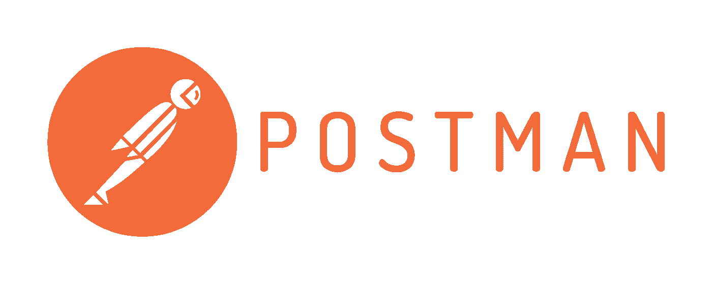
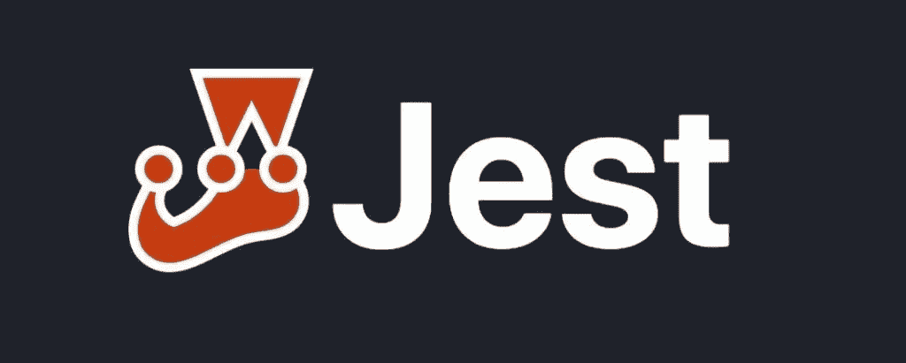
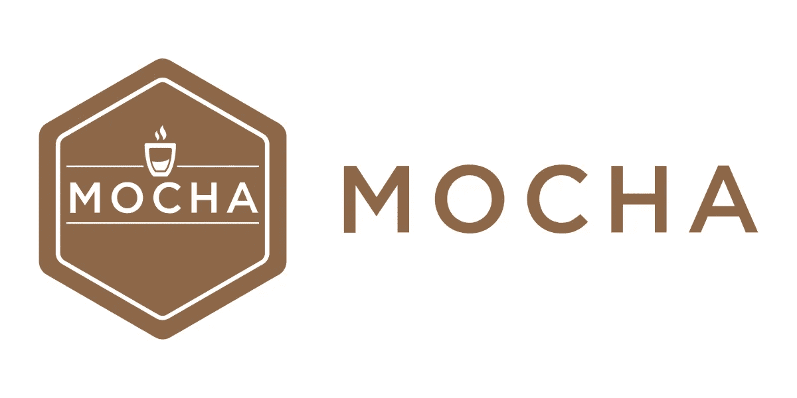
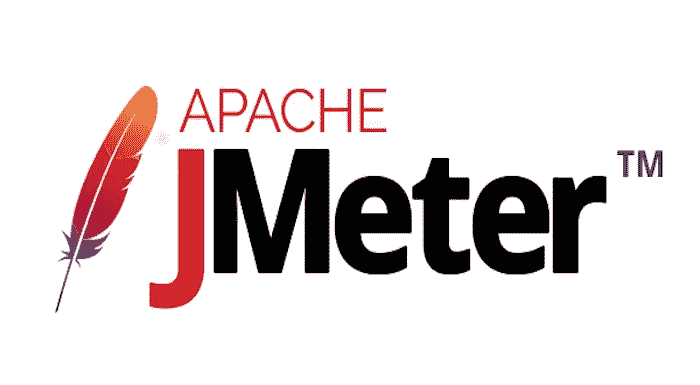
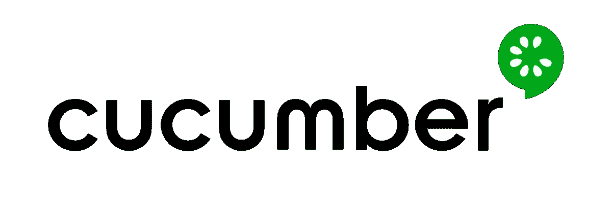
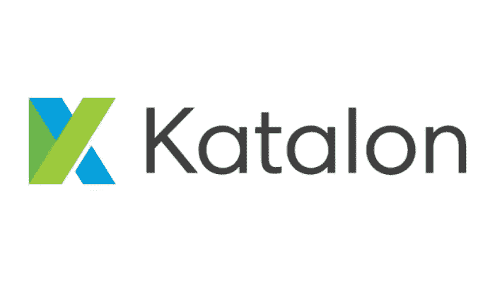
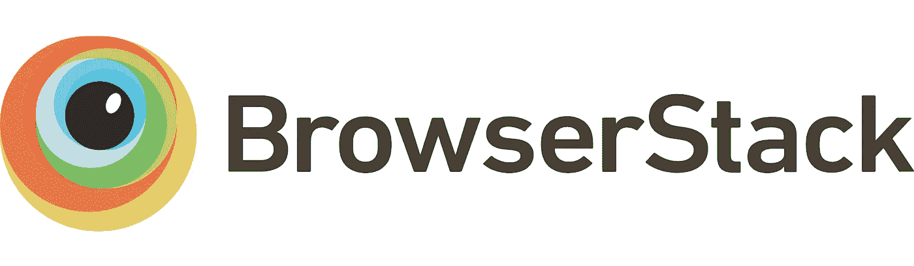
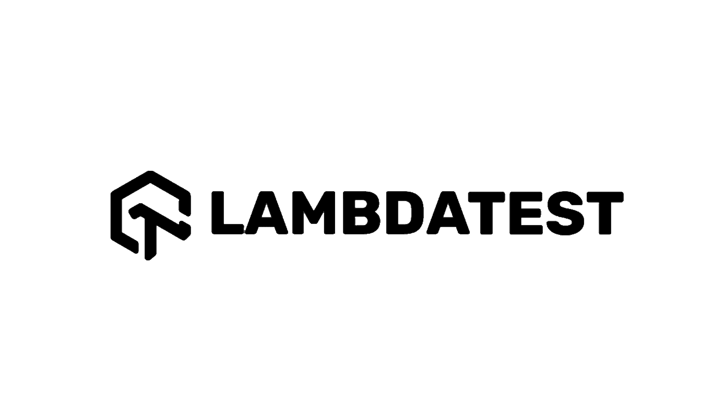

# 自动化测试的 11 个最佳自动化工具

> 原文：<https://medium.com/quick-code/11-must-have-automation-testing-tools-in-2022-5c82b480ca7f?source=collection_archive---------0----------------------->

Photo by [David Travis](https://unsplash.com/@dtravisphd?utm_source=medium&utm_medium=referral) on [Unsplash](https://unsplash.com?utm_source=medium&utm_medium=referral)

毫无疑问，为了在软件测试和开发中取得长期的成功，关注测试自动化的最新趋势是至关重要的。然而，对于测试自动化来说，几乎没有通用的解决方案，因为几乎没有任何工具能够满足所有的需求。

与 web 或移动应用程序相比，为桌面应用程序选择测试工具可能会有所不同。每个测试工具都有独特的优势。大多数 QA 测试人员在选择自动化工具时会考虑安全性、集成能力和可伸缩性。

因此，我创建了这 11 个自动化测试工具的列表，来帮助您克服自动化中的挑战。在本文中，我将提供每个自动化测试工具的演练。如果你想要这篇文章的完整版本或者任何特定的工具，请在评论中告诉我。

## [邮递员](https://www.postman.com/)

[Postman](https://coursesity.com/blog/best-postman-tutorials/) 是一个用于 API 测试的自动化工具。它拥有易于使用和友好的用户界面，具有用于设计、调试、测试、记录和发布 API 的全面功能集。使用 Postman，开发人员可以轻松地测试、共享和记录 API。

许多公司使用 Postman 进行软件开发。在 Postman 中用所需的 HTTP 方法和参数创建请求、提交请求并检查结果需要几秒钟的时间。许多 QA 工程师用它来测试和自动化 RESTful web 服务，开发人员在构建 RESTful web 服务时也依赖它。

## [硒](https://www.selenium.dev/)

在 web 自动化工具中，Selenium 是全球数千家公司的自动化测试工具。随着时间的推移，Selenium 已经变得更加有用和强大，跟上了 web 开发的发展。

除了是一个优秀的开源自动化测试工具，可以在多种浏览器和操作系统上运行之外，它还支持多种编程语言。由测试人员用他们喜欢的编程语言编写测试代码。而且，Selenium 还支持 iOS 和 Android 移动测试。

## [玩笑](https://jestjs.io/)

在 Javascript 测试框架中，Jest 在自动化浏览器测试中非常流行。它带有一个内置的嘲讽库和一个测试运行器。虽然许多人将 Jest 误认为测试运行程序，但它是一个完整的测试框架，将测试提升到了一个新的水平。它功能强大，同时又易于使用。

Jest 由脸书创建，最初由脸书创建，用于测试 React 应用程序。这是测试 React 组件的常用方法。自从问世以来，它已经赢得了广泛的欢迎。Jest 除了测试 JavaScript 前端应用，还用于测试 JavaScript 后端应用。

## [摩卡](https://mochajs.org/)

Mocha 是一个开源测试框架，用于在 Node 中运行自动化测试。它有几个特性，比如描述性的自动化测试，健壮的报告，以及每次文件改变时运行自动化测试的能力。测试在 Mocha 中连续运行，允许灵活和准确的报告，而未捕获的异常被映射到适当的测试用例。

Mocha 有许多特性，包括浏览器支持、异步测试、测试覆盖报告、字符串差异支持、运行测试的 JavaScript API、自动检测和禁用非 tty 的着色、异步测试超时、测试重试支持等等。

## [阿帕奇 Jmeter](https://jmeter.apache.org/)

Apache JMeter 是一个开源测试软件，用于分析和测量不同软件服务和产品的性能。除了负载和性能测试，它还涵盖了各种其他测试类别，如回归测试、负载测试、性能测试、功能测试等。

作为 Java 桌面应用，JMeter 至少需要 JVM 6 或更高版本。您可以下载并安装最新版本的 Java SE 开发工具包。安装最新版本的 Java SE 开发工具包并开始使用。

## [黄瓜](https://cucumber.io/)

Cucumber 是一个开源的行为驱动开发(BDD)工具，旨在提供增强的终端用户体验。在所有测试人员中，只有 20%的测试人员使用[黄瓜](https://coursesity.com/blog/best-cucumber-testing-courses/)，只支持 web 环境。它支持多种语言，被贝宝和佳能等公司使用。

Cucumber 的一些有用特性包括在类似 Selenium 的不同平台上执行代码，支持 Ruby、Java、Scala、Groovy 等编程语言。

## [卡塔隆](https://katalon.com/)

凭借其易用性和低成本，Katalon 是最受欢迎的自动化测试工具之一。你可以使用免费和付费的卡塔龙版本。免费版是基本版，但专业版包括更多功能。它继承了与 Katalon 使用的开源工具 Selenium 相关的一些维护和可靠性问题。

它拥有广泛的集成和双脚本功能，增加了多功能性。您可以使用它进行桌面、web、移动和 API 测试。由于其直观的 GUI 和出色的报告和分析，使用 Katalon 是一件轻而易举的事情。然而，当谈到脚本语言时，它并不通用。

## [柏树](https://www.cypress.io/)

Cypress 擅长端到端测试，尤其是针对 [JavaScript 框架](/quick-code/the-5-best-javascript-frameworks-of-2022-d9bf78a8b575)。它附带了详细的文档和大量的库。您可以使用 DOM 操纵和 shadow DOM 等惊人的特性来实现闪电般快速的测试创建和执行过程。

它在与 Vue、Angular 和 React 等现代框架结合使用时特别有效。此外，它还可以处理服务器端的应用程序。除了并行测试执行，Cypress 还支持网络流量拦截和模拟，这在其他端到端测试解决方案中是不容易实现的。

## [浏览器栈](https://www.browserstack.com/)

BrowserStack 是一个可靠的解决方案，以稳健、经济的方式在各种浏览器上测试网站或应用程序。它是一个基于云的服务，是跨不同浏览器测试的领先工具，不需要在你的机器上安装。

使用 BrowserStack，您可以在真实环境中测试您的 web 应用程序，模拟不同类型的设备和网络。总的来说， [BrowserStack](https://coursesity.com/blog/best-browserstack-courses/) 是一个跨各种浏览器和平台测试 web 应用程序的优秀工具。通过使用一个工具，你可以在不同的操作系统上测试你的站点，节省时间和金钱。

除了在不同的浏览器和设备上测试你的站点，Browserstack 还可以帮助你在不同的操作系统上测试它。使用 BrowserStack，您可以轻松地在各种浏览器和设备上测试您的应用程序。

## [λ测试](https://www.lambdatest.com/intl/en-in)

Lamda Test 是最强大的跨浏览器测试工具之一。使用 LambdaTest，您可以跨 3000 多种浏览器、操作系统和设备测试 web 应用程序。这个可扩展的测试平台帮助您的团队使用云计算资源满足他们的软件评估需求。

## [测试完成](https://smartbear.com/product/testcomplete/)

TestComplete 是一款领先的 GUI 测试自动化工具，可以测试所有桌面、web 和移动应用程序，技术和非技术用户都可以使用。自动化工具支持脚本语言，如 VBScript、Python 和 JavaScript。此外，它支持不同的测试技术，如关键字驱动测试、回归测试、数据驱动测试和分布式测试。

感谢您阅读这篇关于自动化测试工具的文章。如果您觉得这篇文章有用，请随时告诉我。祝你今天开心！玩的开心！

 [## 五大热门 Web3 开发技能

### 遵循这五个技巧来学习如何成为一名 Web3 开发者

medium.com](/geekculture/5-web3-developer-skills-you-should-learn-a210b9f30604)  [## 作为开发人员，您应该熟悉的 7 个 JavaScript 概念

### 截至 2022 年，JavaScript 是世界上最常用的语言。它被 95%的人使用…

medium.com](/quick-code/7-javascript-concepts-you-should-be-familiar-with-as-a-developer-e8d0369cc81b)  [## 2022 年的 5 种基本网络开发工具

### 随着 web 开发每年的发展，它变得越来越有创新性。五年或十年前，似乎不可能…

medium.com](/quick-code/5-essential-web-development-tools-in-2022-7cda5c23dd9e)