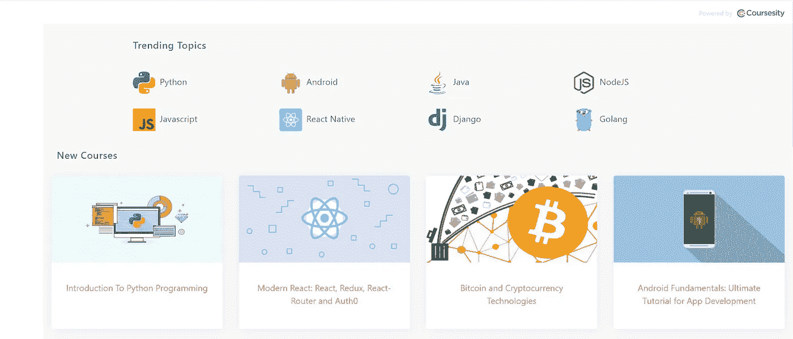
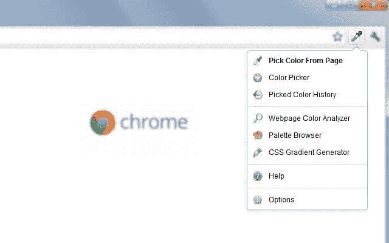
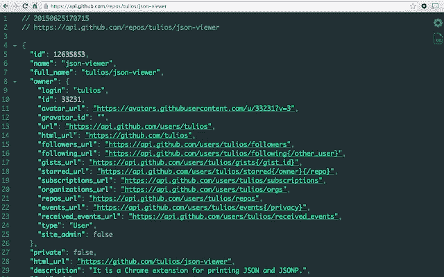
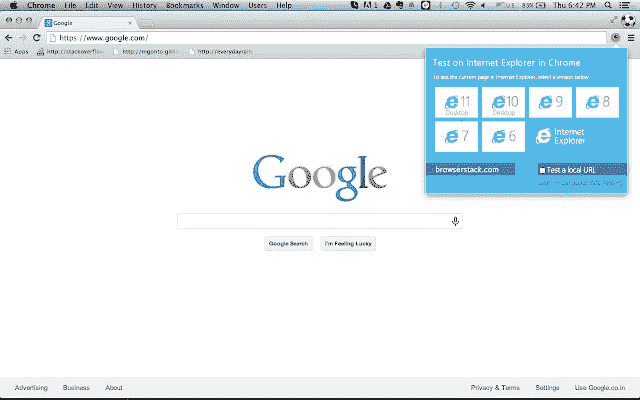
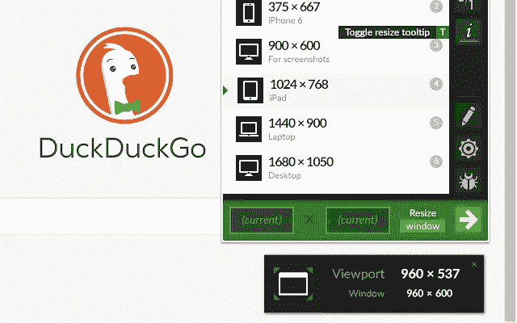
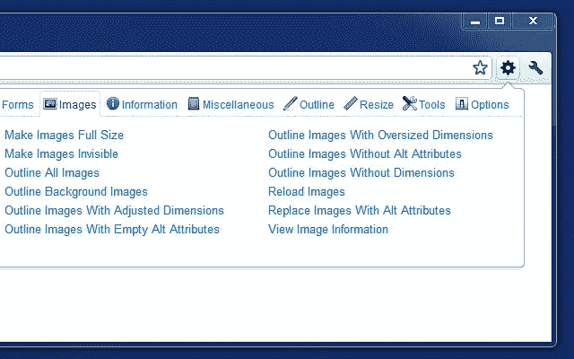
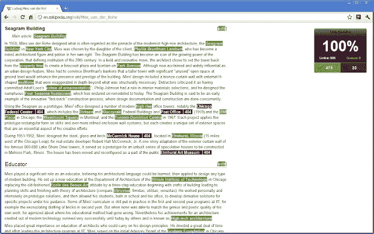

# 开发者必备的 11 个 Chrome 扩展

> 原文：<https://medium.com/quick-code/11-must-have-chrome-extensions-for-developers-c438b0c8ba2d?source=collection_archive---------0----------------------->

## 下面是我为开发者列出的 11 个谷歌 Chrome 扩展，让他们可以轻松工作。

Google Chrome Extensions

据统计，谷歌浏览器是世界上最受欢迎的网络浏览器。然而，你可以用最好的谷歌浏览器扩展来增强体验。它最好的一点是，它为用户提供了几乎无限的方式来改善他们的谷歌 Chrome 体验，但最糟糕的是，如果你不知道它们，你可能不会意识到你错过了多少伟大的扩展。

Chrome 网络商店为开发者提供了成千上万的扩展，所以很难决定哪些是最有用的。为了节省你浏览 chrome 网上商店的时间，这里有 11 个 Chrome 扩展，可以减少你作为开发者的工作量。

## [快速编码](https://chrome.google.com/webstore/detail/quickcode-free-online-pro/nnigpbiaggiephcndokoaongeefpbdcj)

QuickCode

Quickcode 策划免费的在线编程课程，每天提供最好的课程，供初学者和专家学习编程。在一致性方面，这个 chrome 扩展每天都会策划新的免费课程。这是我用来学习新课程的 chrome 扩展之一。使用此扩展，您将:

*   新课程上线时获得通知。
*   浏览互联网上各种 MOOCs 和在线教育提供商的免费课程。
*   在新标签中查看新的免费编程课程。
*   通过不同的编程语言、web 框架和开发工具搜索免费课程。

**链接:** [快码](https://chrome.google.com/webstore/detail/quickcode-free-online-pro/nnigpbiaggiephcndokoaongeefpbdcj)

## [ColorZilla](https://chrome.google.com/webstore/detail/colorzilla/bhlhnicpbhignbdhedgjhgdocnmhomnp)

ColorZilla

Colorzilla 是一个吸管工具，具有高级颜色选择器、网页颜色分析器、CSS 渐变分析器、调色板查看器等。对于网页设计者和开发者来说，这是一个很好的 Chrome 扩展，可以选择颜色并直接在设计中使用。它可以让你从浏览器的任何部分得到一个颜色读数，点击几下修改它，然后粘贴到另一个程序中。

**功能:**

*   滴管—获取页面上任何像素的颜色。
*   高级颜色选择器(类似于 Adobe Photoshop)。
*   终极 CSS 梯度生成器。
*   网页颜色分析器—为任何网站获取调色板。
*   带有 7 个预装调色板的调色板查看器。
*   最近选择的颜色的颜色历史。
*   显示元素信息，如标签名称、类别、id、大小等。
*   自动将选取的颜色复制到剪贴板。
*   键盘快捷键。
*   获取动态悬停元素的颜色。
*   单击开始颜色选择(目前仅在 Windows 上)。
*   从 Flash 对象中选择颜色。
*   选择任意缩放级别的颜色。

**链接:** [ColorZilla](https://chrome.google.com/webstore/detail/colorzilla/bhlhnicpbhignbdhedgjhgdocnmhomnp)

## [JSON 浏览器](https://chrome.google.com/webstore/detail/json-viewer/gbmdgpbipfallnflgajpaliibnhdgobh)

JSON Viewer

JSON Viewer 是 JSON/JSONP 最漂亮、最可定制的荧光笔。对于开发人员来说，处理 JSON 数据有时很有挑战性。JSON viewer 扩展通过美化和系统化结构化数据，使数据处理变得更加容易。使用这个扩展，可以打印 JSON 或 JSONP。

一些关键的**特性**包括:

*   开源
*   语法突出显示
*   27 个内置主题
*   可折叠节点
*   可点击的 URL(可选)
*   在控制台中输入“json ”,检查您的 json。
*   显示行号的选项。
*   选项来定制你的主题。
*   配置最大 JSON 大小以突出显示的选项。
*   选项允许编辑加载的 JSON。
*   按键对 json 排序的选项。
*   C 样式大括号和数组的选项。
*   便条簿

**链接:** [JSON 查看器](https://chrome.google.com/webstore/detail/json-viewer/gbmdgpbipfallnflgajpaliibnhdgobh)

## [Wappalyzer](https://chrome.google.com/webstore/detail/wappalyzer-technology-pro/gppongmhjkpfnbhagpmjfkannfbllamg)

Wappalyzer

Wappalyzer 是一个技术剖析器，让你知道哪些技术被用来建立网站。有了这个 chrome 扩展，你可以了解在给定的网站、任何框架、电子商务平台、JavaScript 库等等上使用的是什么 CMS。

这个 chrome 扩展不仅仅是一个 CMS 和框架检测器。您可以在多个类别中发现一千多种技术，包括编程语言、分析工具、营销工具、支付处理器、CRM、CDN 等等。

**链接:** [Wappalyzer](https://chrome.google.com/webstore/detail/wappalyzer-technology-pro/gppongmhjkpfnbhagpmjfkannfbllamg)

## [测试 IE](https://chrome.google.com/webstore/detail/test-ie/eldlkpeoddgbmpjlnpfblfpgodnojfjl)

Test IE

Test IE 是一个 Browserstack chrome 扩展，允许您预览和测试所有版本的 Edge 和 Internet Explorer(IE6-IE11)的网站。当你点击 Chrome 工具栏中的扩展，选择一个 Internet Explorer 版本，然后点击开始测试时，你可以在 Browser Live 中快速启动一个测试会话。

测试 IE 的一些关键特性包括:

*   本地测试
*   详尽的报道
*   调试工具
*   截屏

请注意，这个 Chrome 扩展需要一个 BrowserStack 帐户。

**链接:** [测试 IE](https://chrome.google.com/webstore/detail/test-ie/eldlkpeoddgbmpjlnpfblfpgodnojfjl)

## [CSS 查看器](https://chrome.google.com/webstore/detail/cssviewer/ggfgijbpiheegefliciemofobhmofgce)

CSSViewer

CSS Viewer 是 Nicolas Huon 在 2006-2008 年开发的 Firefox 插件，是一个简单的 CSS 属性查看器 chrome 扩展。它是开源的，你可以在 GitHub 上找到它的源代码。从使用上来说，还是比较好用的。您只需单击工具栏图标，然后将鼠标悬停在当前页面上您想要检查的任何元素上。

**链接:** [CSS 查看器](https://chrome.google.com/webstore/detail/cssviewer/ggfgijbpiheegefliciemofobhmofgce)

## [开发者的窗口大小调整工具](https://chrome.google.com/webstore/detail/window-resizer/kkelicaakdanhinjdeammmilcgefonfh)

Window Resizer

Window Resizer 是开发者最常用的 chrome 扩展之一。它允许您调整浏览器窗口的大小，以模拟不同的屏幕分辨率。特别是，它帮助网页设计者和开发者在不同的浏览器上以不同的分辨率测试他们的布局。此外，该扩展具有可自定义的全局快捷键，导出您的设置并将其导入到其他电脑，等等。

**链接:**

## [幽灵特工](https://chrome.google.com/webstore/detail/ghostery-%E2%80%93-privacy-ad-blo/mlomiejdfkolichcflejclcbmpeaniij)

Ghostery

面对现实吧，广告很讨厌！Ghostery 能帮上忙。有了这个 chrome 扩展，你就可以屏蔽烦人的广告了。它结合了阻止列表和人工智能反跟踪技术，提供全面的隐私保护。此外，增强型广告拦截网站与增强型反跟踪网站一起工作，以阻止任何可能通过的广告。此外，这个强大的扩展优化了页面性能，提高了页面速度。

**链接:** [幽灵特工](https://chrome.google.com/webstore/detail/ghostery-%E2%80%93-privacy-ad-blo/mlomiejdfkolichcflejclcbmpeaniij)

## [JavaScript 和 CSS 代码美化器](https://chrome.google.com/webstore/detail/javascript-and-css-code-b/iiglodndmmefofehaibmaignglbpdald)

JavaScript and CSS Code Beautifier

当您用。css/。js/。json 扩展，这个 chrome 扩展美化了你的 CSS，JavaScript，和 JSON 代码。简单地说，它只是美化了代码，并以一种易于理解和工作的方式来安排代码。

一些关键特性包括:

*   CSS(LESS/SCSS/萨斯)/JavaScript(JSX/TypeScript/JSON)格式。
*   解压或去除 JavaScript 的泡沫。
*   超过 60 个语法突出主题。

**链接:** [JavaScript 和 CSS 代码美化师](https://chrome.google.com/webstore/detail/javascript-and-css-code-b/iiglodndmmefofehaibmaignglbpdald)

## [网络开发者](https://chrome.google.com/webstore/detail/web-developer/bfbameneiokkgbdmiekhjnmfkcnldhhm?hl=en)

毫无疑问，web 开发人员将从这一扩展中受益。Web Developer 扩展为 Chrome web 浏览器添加了一个工具栏按钮。点击该按钮后，您将看到一系列可以在任何网站上使用的工具。这个 chrome 扩展包含了 CSS、禁用、Cookies、图像、表单、轮廓、信息、杂项和调整大小等各种类别。对于每个类别，有不同的工具来执行不同的任务。

**链接:** [网页开发者](https://chrome.google.com/webstore/detail/web-developer/bfbameneiokkgbdmiekhjnmfkcnldhhm?hl=en)

## [查看我的链接](https://chrome.google.com/webstore/detail/check-my-links/ojkcdipcgfaekbeaelaapakgnjflfglf?hl=en)

Check My Links

这个 chrome 扩展正如其名所示。它抓取你的网站，检查断开的链接和有效的和重定向的链接。它易于使用，并帮助您维护您的网站的搜索引擎优化标准。这个扩展主要是为 web 设计人员、开发人员和内容编辑人员设计的。

**链接:**查看我的链接

感谢您阅读这篇关于对开发者有用的 chrome 扩展的文章！我可能错过了一些你最喜欢的，所以不要担心。欢迎在评论中分享你使用了哪些 chrome 扩展来减轻你的工作量。以下是一些你可能会觉得有用的帖子:

 [## 作为开发人员应该避免的 7 个坏习惯

### 避免这五个坏习惯，成长为一名出色的开发人员。

medium.com](/quick-code/7-bad-habits-you-should-avoid-as-a-developer-2832c5aadbf1)  [## 用这 5 个简单的技巧战胜拖延症

### 简单、强大、有效的完成工作的方法。

medium.com](/the-personal-growth-project/beat-procrastination-with-these-5-simple-tricks-2f9b00578e34)  [## 五大热门 Web3 开发技能

### 遵循这五个技巧来学习如何成为一名 Web3 开发者

medium.com](/geekculture/5-web3-developer-skills-you-should-learn-a210b9f30604)