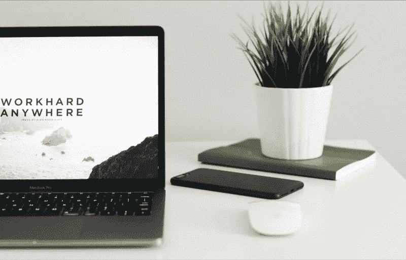

# 你应该知道的 12 个惊人的 CSS 技巧和窍门

> 原文：<https://medium.com/quick-code/12-amazing-css-tips-and-tricks-you-should-know-3955fdacddbb?source=collection_archive---------0----------------------->

[Duomly — programming online courses](https://www.duomly.com)

本文最初发表于:[https://www . blog . duomly . com/12-CSS-tips-and-tricks-which-help-you-to-create-an-amazing-websites/](https://www.blog.duomly.com/12-css-tips-and-tricks-which-help-you-to-create-an-amazing-websites/)

CSS 是级联样式表，用于描述 HTML 元素应该如何显示。这是即将成为前端和 web 开发人员的人最先学习的技术之一，也是绝对必须了解的基础。

虽然看起来 CSS 除了给我们的 HTML 颜色，位置等之外做不了很多。，但它也可以让我们创建动画，并为我们的应用程序和网站带来一些活力。也许现在我们中的许多人都在努力掌握 CSS 并深入学习它，但是知道一些有用的提示和技巧是完全值得的，它们可能会帮助你创建令人惊叹的网站！

从现在开始，你准备好看看 20 个可以改变你的 CSS 用法的技巧和诀窍了吗？
我们开始吧！

# 1.垂直对齐伸缩

自从灵活的盒子布局模型出现以来，它变得非常流行，因为它使定位和对齐元素变得更加容易。使用 flex(灵活的盒子布局模型子属性)使垂直对齐变得快速、漂亮和简单，在很多情况下我们不得不做一些改变。让我们来看看使用 flex 进行垂直定位的代码示例，因为它允许使用对齐进行大量操作。

正如您在上面的代码中看到的，我们使用 display: flex 和 align-items: center，
justify-content: center 来确保我们的子元素正好位于父元素的中心。

很简单，对吧？

# 2.混合模式

我们现在可以用 CSS 做很多很酷的东西，其中之一就是混合模式。混合模式有两个属性:mix-blend-mode，它定义元素及其后面的元素之间的混合；background-blend-mode，它定义元素的背景图像和背景颜色之间的混合。让我们来看看它是如何工作的:

在上面的代码中，我们用文本设置了图像和标题。文本是与图像混合的元素。我们使用了覆盖值，但是还有 15 个其他值可以使用。现在，让我们检查背景混合模式代码示例:

在这种情况下，我们可以看到背景图像是如何与颜色混合的。第一个图像是混合前的，第二个是混合后的。

我们可以用 CSS 做的事情是不是很神奇？

# 3.视差滚动

视差是现代网页设计中非常普遍的趋势。这是关于当我们滚动页面时，背景内容和前景内容的滚动速度不同。让我们看看如何使用 CSS 来实现这种神奇的效果:

在这个例子中，你可以看到我们的文本和背景图像是如何不同地移动的。我们使用 transformZ 来固定一个元素并减慢另一个元素。看起来不错，对吧？

# 4.外部形状

CSS 还有另一个很棒的特性，但并不常见。这是外形之外的属性。它决定内容如何环绕浮动元素。让我们来看看它是如何工作的:

在代码示例中，您可以看到文本溢出了圆圈。我们将 shape-outside 的值设置为圆形 50%，但是也可以设置图像、三角形、正方形等。来看看，玩玩吧！

# 5.截断字符串

我讨厌当我的文本不适合在 div 里面，它出去麻醉。在 Javascript 中，我们有几种方法可以管理它，但是，您知道在 CSS 中也可以剪切文本吗？让我们来看看:

上面，你可以看到 CSS 是如何剪切文本并以…结束的。我使用溢出:隐藏，空白:nowrap，最后得到三个点，我使用文本溢出:省略号。

# 6.剪辑路径

有时候设计师会更有创意一些，现在你必须把图像做成特定的形状，比如三角形或其他形状。为此，您可以使用剪辑路径属性！让我们快速看一下它是如何工作的:

在上面的例子中，我创建了一个圆形、eclipse 和一个自定义多边形。

# 7.全高和全宽

如果我们想设置我们的应用程序或网站调整到视口，vh 和 vw 单位使它更容易。vh 表示 100%的视口高度，vw 表示 100%的视口宽度。让我们看看它在一个真实的例子中是如何工作的:

在上面的例子中，我将蓝框元素设置为 50vw 和 50vh，这意味着它应该有 50%的视口宽度和 50%的视口高度，如果您调整视口的大小，您可能会注意到它是如何调整的。

很酷，对吧？

# 8.图像过滤器

摆弄图像可能会给布局带来许多惊人的效果，并有助于创造惊人的结果。CSS 允许在图像上使用大量滤镜，以帮助开发人员处理图形，而无需在 Photoshop 中进行更改。让我们来看看我们可能使用的过滤器:

在上面的例子中，你可以看到在同一个图像中使用了七种不同的滤镜。

# 9.CSS 动画

动画可以在网站上抓住用户的注意力，这也是为什么它经常被用在网页设计中。在 CSS 中创建它使事情变得容易得多，让我们仔细看看 CSS 中的一个示例动画:

在上面的代码中，我创建了一个小点，它每 25%改变一次位置和不透明度，直到它达到 100%，然后再次开始。还可以改变元素的颜色和其他属性。

# 10.元素旋转

CSS 中可以实现的另一种类型的动画是旋转，它更有活力一点，给加载器元素、徽标或图库中的图像添加一些生命是很棒的。让我们看看我们可以用旋转做些什么:

在示例中，我们可以看到一只猫在动画的一个循环中旋转了四次。

# 11.面具

如果你曾经做过平面设计，你可能知道面具有多有用。也可以在 CSS 中使用图像遮罩。让我们试着为图像制作一个遮罩:

在上面的例子中，我已经创建了一个圆形渐变遮罩，但是你也可以使用一个 SVG 图形作为遮罩，方法是将 URL 添加到文件中。

# 12.悬停时放大

当你创建一个图片库的时候，你可能想经常标记悬停的图片。最好的想法是在悬停时添加缩放功能，以突出悬停的照片。让我们来看看它是如何工作的:

在上面的例子中，我创建了一个小的图库，并在悬停时添加了缩放属性，使悬停的图片比其他图片大。简单对吗？

# 结论

我们希望创建令人惊叹的网站和应用程序，但有时我们认为在图像上创建动画或遮罩需要花费大量的精力和时间。正如我在本文中向您展示的，有时这比在图形程序中更改图像要舒服得多。

我希望您会发现这些提示和技巧对您未来的编码有帮助和有用。如果你知道任何有趣的 CSS 技巧，在评论或社交媒体中与我分享你的最爱，我真的很想知道。

好好编码！

[Duomly — programming online courses](https://www.duomly.com)