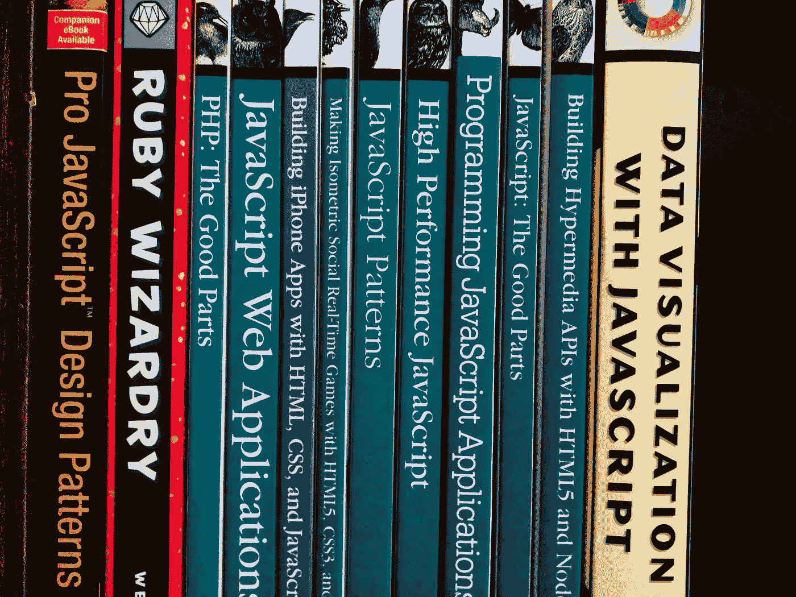

# 每个 JavaScript 开发人员都应该阅读的 12 本书

> 原文：<https://medium.com/javascript-scene/12-books-every-javascript-developer-should-read-9da76157fb3?source=collection_archive---------1----------------------->

Note: Random collection of web dev books pictured.

我是 JavaScript 书籍的忠实粉丝。作为一名长期学习 JavaScript 的人，我有幸阅读了市场上许多流行的 JavaScript 书籍。如今，我倾向于跳过那些针对新手的排名，但我仍然阅读了许多面向有一点经验的 JavaScript 开发人员的书籍。

对于 JavaScript 书籍来说，这是一个奇怪的时代。因为我们刚刚对 ES6 中的 JavaScript 语言进行了重大更新，所以今天的 JavaScript 语法和风格看起来与大多数书中讨论的 ES3-ES5 风格的 JavaScript 非常不同，但是因为 ES6 实际上只是 ES5 的超集，所以大多数旧书仍然适用。

换句话说，旧书并没有过时，它们只是稍微显示了它们的年龄——即使是那些两年前才发行的。这可能看起来像是在和一个仍在使用 60 年代俚语的老年人交谈。如果你是 JavaScript 新手，发现老前辈们过去忍受的所有疯狂的攻击只是为了在参数上使用数组方法可能会很有趣。享受 JS 历史课。

JavaScript 社区中的一些作者写了一些旨在教你 ES6 的书。我建议您在稍微熟悉了基本的 JavaScript 之后阅读它们。如果你还不知道 ES6，读读[《如何学习 ES6》](/javascript-scene/how-to-learn-es6-47d9a1ac2620)。

最终，所有新的 JS 书作者都会认为 ES6 是理所当然的，然后 JS 书世界就会回归正常。我按照学习顺序大致列出我的推荐。

*正如我的其他书籍帖子一样，亚马逊链接是附属链接，你花的一部分钱将用于* [*与 JSHomes*](/end-homelessness/fighting-poverty-with-code-d1ed3ebd982d) *对抗无家可归者。*

说够了。把书拿出来！

# 那些书

1.  [**“儿童 JavaScript:有趣的编程入门”**](https://www.amazon.com/JavaScript-Kids-Playful-Introduction-Programming/dp/1593274084/ref=as_li_ss_tl?_encoding=UTF8&qid=&sr=&linkCode=ll1&tag=eejs-20&linkId=78320bf6b48bd7f6549a22f9abadc66c) 尼克·摩根著

顾名思义，这本书是对非常基础的编程概念的异想天开的探索，但是不要让这种想法欺骗了你。儿童读物不仅仅是给孩子看的。如果你以前从未接触过代码，这是一个很好的起点，即使你已经长大了。在你学会游泳之前在深水区潜水会是一次令人沮丧的经历。最好从一些简单的胜利开始练习。

2. [**《作曲软件》**](https://leanpub.com/composingsoftware) 作者 Eric Elliott(声明:就是我)是对 JavaScript 中函数式编程和对象组合的探索。所有的软件设计都是组合:将复杂的问题分解成更小的问题并组合这些解决方案的行为。大多数开发人员对组合技术的理解有限。现在是改变的时候了。

在“编写软件”中，Eric Elliott 分享了编写的基本原理，包括函数编写和对象编写，并在 JavaScript 的上下文中探讨了它们。这本书涵盖了函数式编程和面向对象编程的基础，以帮助读者更好地理解如何使用简单的构建块来构建复杂的应用程序。

3. [**《雄辩的 JavaScript:现代编程入门》**](https://www.amazon.com/Eloquent-JavaScript-3rd-Introduction-Programming/dp/1593279507/ref=as_li_ss_tl?ie=UTF8&linkCode=ll1&tag=eejs-20&linkId=ae5b8f9de89a5f5b0eab39ba8c32fe12) 作者 Marijn Haverbeke

这本书是一部艺术作品。它用清晰的语言，用清晰的路线图带你了解基本概念。它的构成和编辑非常娴熟，不像大多数编程书籍，它充满了供您练习的练习。如果我在高中或大学教授编程基础，我会把它作为教科书。

4.[**《JavaScript:好的部分》**](https://www.amazon.com/JavaScript-Good-Parts-Douglas-Crockford/dp/0596517742/ref=as_li_ss_tl?ie=UTF8&redirect=true&linkCode=ll1&tag=eejs-20&linkId=afcaa6d74f1fbcc21a0c4d728b83dde1) 道格拉斯·克洛克福特著

现在看来可能很荒谬，但是当这本书被写的时候，JavaScript 仍然是一种年轻的语言，它作为浏览器中的一种微小的脚本语言而诞生。当时，严肃的应用程序开发人员刚刚开始探索浏览器。

在 2004 年之前，很少看到真正的应用程序在浏览器中运行。浏览器几乎没有互动。它需要重新加载页面才能将数据传输到服务器，它本身没有任何值得一提的存储容量。JavaScript 主要用于创建琐碎的用户界面效果，如鼠标悬停状态。

JavaScript 是许多用 C/C++、C#和 Java 等编译语言编写代码的“真正的程序员”开玩笑的目标。如果你想为浏览器进行真正的编程，你可以使用 flash。

在那个时候，嘲笑 JavaScript 很容易，似乎每个人都这么做，但道格拉斯·克洛克福特认识到 Brendan Eich 在语言中隐藏了一些金块，直到现在才开始被编程大众真正欣赏。这本书探索了这些特性的基础，可能会让你对 JavaScript 的特别和酷有一个新的认识。

5.[**《JavaScript 应用编程:使用 Node、HTML5 和 Moderns JS 库的健壮 Web 架构》**](https://ericelliottjs.com/product/programming-javascript-applications-paper-ebook-bundle/) 作者 Eric Elliott(就是我)

当我开始雇用 JavaScript 开发人员来构建应用程序时，我真的震惊了，他们中很少有人知道如何利用 JavaScript 来构建健壮的应用程序架构。考虑到这一点，我决定写一本书，涵盖一些 JavaScript 最佳实践，向人们介绍原型、对象组合，以及至少函数式编程的基本概念(足以理解如何构建和维护典型的 JavaScript 应用程序)，然后将这些概念应用于构建大多数应用程序中出现的一些常见问题，而不考虑应用程序的业务领域。

很多书都回答了这个问题，“我如何使用 JavaScript？”我想回答这个问题，“我如何使用 JavaScript 来构建一个真正的应用程序？”

自我们发布这本书以来的两年里，技术发生了很大的变化，但在我看来(尽管作者很客观)，它仍然是当今市场上对 JavaScript 应用架构的最好概述。除了加深对 JavaScript 的理解，您还将了解节点基础、RESTful APIs、认证和授权、特性切换系统、日志记录等等。

6. [**《有效的 JavaScript:驾驭 JavaScript 力量的 68 种具体方法》**](https://www.amazon.com/Effective-JavaScript-Specific-Software-Development/dp/0321812182/ref=as_li_ss_tl?ie=UTF8&redirect=true&linkCode=ll1&tag=eejs-20&linkId=4c5500843ce7dc958e290bdaeebd739b) 作者大卫·赫尔曼

在您对 JavaScript 有了一些基本的了解之后，“有效的 JavaScript”将带您更深入地了解这种语言，通过示例展示一位经验丰富的编程大师教授的课程。

马上您就会了解到 JavaScript 的一些奇怪之处，从浮点数精度(因为 JavaScript 只有一种数字类型，而且是浮点类型)，到类型强制和分号插入的奇怪之处。本书的其余部分以同样的风格继续，探索使用函数、对象、数组、库和 API 设计以及并发性的最佳实践。不管你的技能水平如何，我保证你会学到新的东西。

7.[**《JavaScript:权威指南》**](https://www.amazon.com/JavaScript-Definitive-Guide-Activate-Guides/dp/0596805527/ref=as_li_ss_tl?ie=UTF8&redirect=true&linkCode=ll1&tag=eejs-20&linkId=11a79cf9e89a54625cb3a8e8ff2dc8d5) 作者大卫·弗拉纳根

权威指南是从对构建 web 应用程序感兴趣的人的角度对 JavaScript 和 web 平台 API 特性的深入探索。这是对许多语言特性的一个相当全面的概述，其中夹杂着对 IE 旧版本的警告，在这一点上你可以放心地忽略它们。这本书已经出了六版，我希望还会有更多的版本。我拥有以前的版本，当一个新版本发布时，我总是能学到一些新的东西。

8. [**《你不知道的 JS》**](https://github.com/getify/You-Dont-Know-JS)作者凯尔·辛普森

这本书实际上是一系列的书——所有的书在风格和范围上都很相似，有些比其他的大，而且都很好。

我用 JavaScript 编程已经很久了。我已经研究了多个版本的 JavaScript 规范，并密切关注规范新版本的开发，但是 Kyle 对探索所有小角落和缝隙的强烈兴趣设法揭示了许多我尚未发现或探索的语言。

如果你认为“权威指南”是一次深潜，拿出你的潜水装备，准备好你的深海潜水海洋探险者。您将看到一些人类从未遇到过的 JavaScript 物种(嗯，至少在撰写本系列之前)。

在本系列中，您不会发现很多关于软件架构、深刻的程序员智慧或大量跨多种不同语言的软件设计原则的讨论。但是它一定会帮助你对 JavaScript 有一个新的认识和更深的理解。Kyle 对深入研究语言特性的独特关注是一笔罕见的财富，我想即使是 TC39 团队也可以从中学习一些东西。

9.[**《JavaScript Allong**](https://leanpub.com/javascriptallongesix)**[**:六版**](https://leanpub.com/javascriptallongesix) 作者雷金纳德·布莱斯维特**

**JavaScript Allongé本质上是一本关于用函数思考的书。从小的、分离的单元构建灵活的软件。**

**也就是说，它尽量不要过于规范或固执己见。借用引言:**

> **“JavaScript Allongé并不试图在更广泛的软件开发环境中解决 JavaScript 最佳实践的问题，因为 JavaScript Allongé不是一本关于实践的书，而是一本关于思考的书。”**

**当你读这本书时，你会意识到作者信守诺言。这绝对不应该是你看的第一本 JavaScript 书。Reginald 介绍了简单的概念，如 *`const`* ,在演示了部分应用程序和 curried 函数表达式后，通过中间函数作用域主题(如 life 和闭包)缓慢构建。**

**大多数介绍 JavaScript 的书籍都明智地从谈论值以及如何使用 *`var`* 、 *`let`* 或 *`const `用绑定来表示这些值开始。雷金纳德翻转节拍是有充分理由的——他会让你的大脑跳舞。这本书试图帮助你以不同的方式深入思考函数，这很有效。***

**当您对 JavaScript 有了一定的熟悉之后，当您准备开始探索如何结合函数式和面向对象编程技术来构建 JavaScript 应用程序时，您应该阅读这本书。**

**10.[**【node . js in Action】**](https://www.amazon.com/Node-js-Action-Mike-Cantelon/dp/1617290572/ref=as_li_ss_tl?ie=UTF8&qid=1466640698&sr=8-1&keywords=node.js+in+action&linkCode=ll1&tag=eejs-20&linkId=57fbe05f198dad9e06df1c1f8fc29a4c)作者:Mike Cantelon、Marc Harter、TJ Holowaychuk 和 Nathan Rajlich**

**“Node.js in Action”是对基本节点应用程序开发的一个很好的介绍，涵盖了 HTTP/HTTPS、Connect/Express 中间件、使用 Socket 的实时消息传递等基本主题。IO，使用数据库等等。如果您是 Node 新手，这是一个很好的起点。**

**11. [**“高性能浏览器联网”**](https://www.amazon.com/High-Performance-Browser-Networking-performance/dp/1449344763/ref=as_li_ss_tl?ie=UTF8&linkCode=ll1&tag=eejs-20&linkId=c73d0d3fc227d36ddc90e2d708f3fb8a) 作者伊利亚·格里戈利克**

**出色的应用程序性能的重要性怎么强调都不为过。将页面加载时间缩短几毫秒并减少 UI jank 所带来的投资回报只有一个伟大的用户界面设计革新才能与之媲美。**

**本书涵盖了高影响性能的考虑事项，如 HTTP2、数据流、WebSockets、WebRTC、DataChannel 等等。**

**换句话说，这本书是通过优化应用程序的性能来构建更成功的应用程序的权威指南。**

**12. [**【网络音频 API】**](https://www.amazon.com/Web-Audio-API-Boris-Smus/dp/1449332684/ref=as_li_ss_tl?ie=UTF8&linkCode=ll1&tag=eejs-20&linkId=cf1c22140cd7016a4d2b3146b02bbaee)Boris Smus**

**每个真正的 JavaScript 摇滚明星都需要这本书。毕竟，你不是一个真正的 JS 摇滚明星，直到你把你的吉他插入你的网络浏览器。我知道我说过这些书是“每个 JavaScript 开发人员都应该读的”，但这本书只适合喜欢玩声音和音乐的 JavaScript 开发人员。大多数 JavaScript 开发人员可以不用学习这个 API，这也不会伤害他们——但是这很无聊。**

**这本书在我的清单上，主要是因为我喜欢音乐和音频工程。web audio API 实际上是一个使用 web 平台标准生成和操作声音的相关 API 系统。您可以在浏览器和节点中使用它。**

**要使用 web audio API，您需要操作图形中的节点。通常，我会给你一个方便的参考，但除非你是一个音频工程师，你可能会觉得有点不知所措。这本书通过各种类型的音频节点来指导您，并教您如何将它们编织在一起，使用定时 API 来精确地安排声音，随时间操纵参数，应用音频效果，甚至创建音频可视化。**

**换句话说，这非常有趣。**

**

[Start your free lesson on EricElliottJS.com](https://ericelliottjs.com/premium-content/lesson-pure-functions)** 

*****埃里克·艾略特*** *是一位科技产品和平台顾问，著有* [*【作曲软件】*](https://leanpub.com/composingsoftware) *，*[*EricElliottJS.com*](https://ericelliottjs.com)*和*[*devanywhere . io*](https://devanywhere.io)*，也是 dev 团队导师。他为 Adobe Systems、* ***、Zumba Fitness、*** ***【华尔街日报】、*******【ESPN】、*******【BBC】、*** *和顶级唱片艺人包括***【Usher、【Metallica】、******

****他和世界上最美丽的女人享受着与世隔绝的生活方式。****