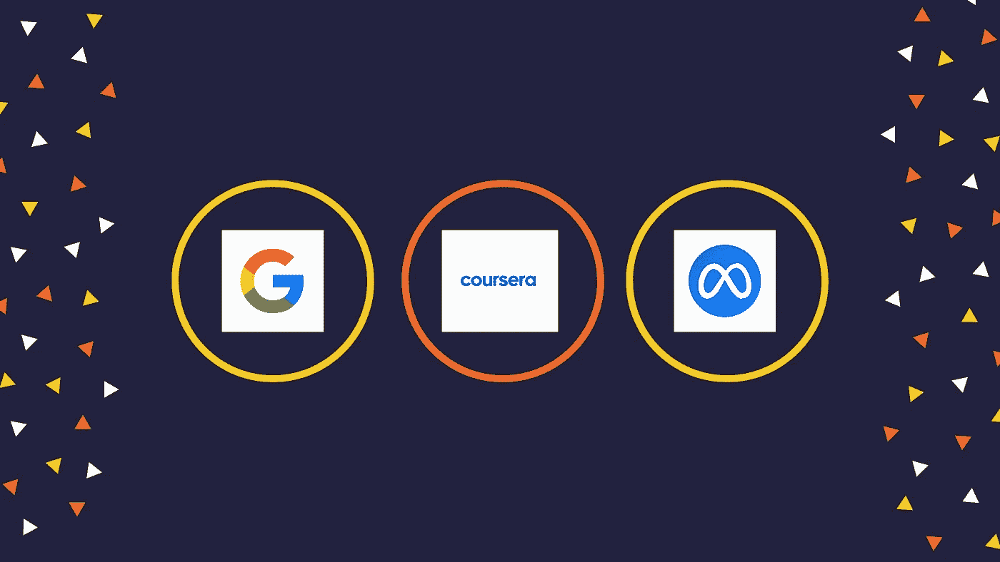
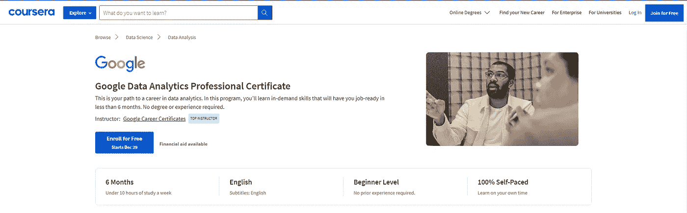
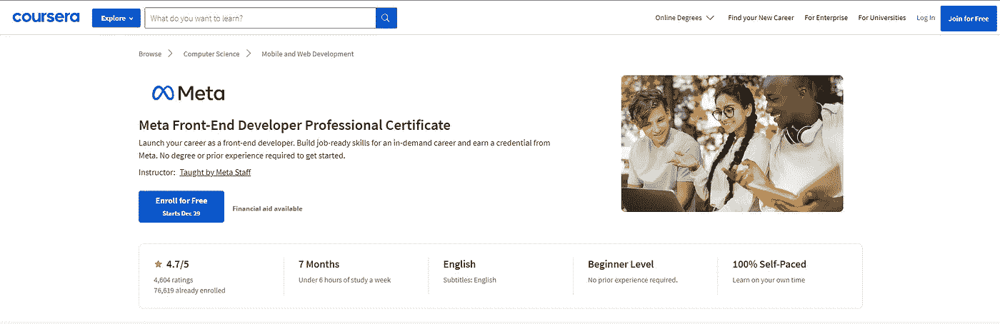
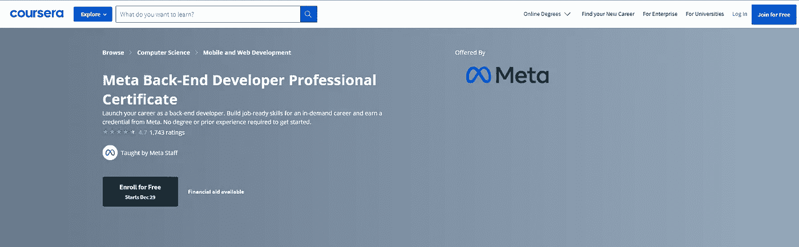
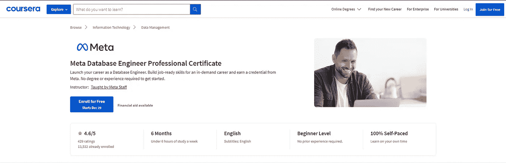
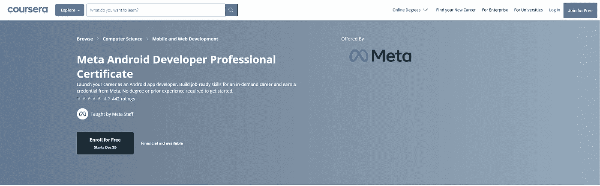
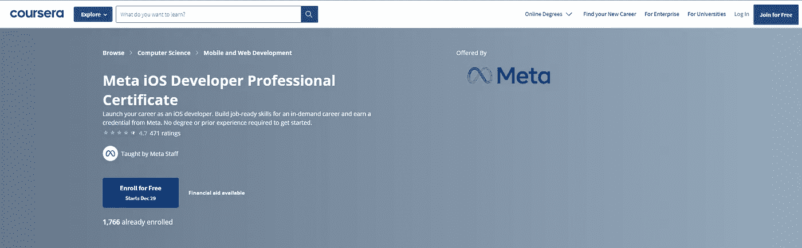
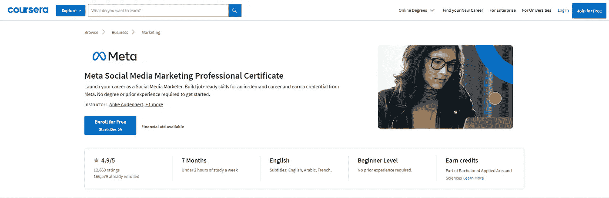

# 12 个必备的谷歌和 Meta Coursera 认证

> 原文：<https://medium.com/quick-code/12-must-have-google-meta-coursera-certifications-6afe403baa5b?source=collection_archive---------0----------------------->

**谷歌**和 **Meta** 认证备受雇主追捧。它们向雇主发出信号，表明一个专业人士拥有有效完成工作所需的技能和知识。谷歌认证可以帮助专业人士跟上最新的行业发展，并建立他们的专业网络。同时，元认证向潜在雇主展示了他们对自己专业的承诺和对自己领域的理解。但是，你在哪里可以找到这些顶级认证呢？

你真幸运！Coursera Plus 提供流行的 Meta 和 Google 专业证书。您将获得基于数据分析、UX 设计、项目管理、数字营销、IT 支持、前端和后端开发、数据库工程师、Android 和 iOS 开发以及社交媒体营销认证等主题的谷歌和 Meta 认证。

新用户(之前没有购买过)可以享受**200 美元**的优惠 [Coursera Plus 年费](https://coursera.pxf.io/c/1137078/1213622/14726?u=https%3A%2F%2Fwww.coursera.org%2Fcourseraplus%2Fspecial%2Fholiday2023&subId1=csMedium)。然而，此优惠仅在有限的时间内有效。所以，在它没了之前抓住它。现在，让我们来谈谈 Coursera 提供的 12 个 Google 和 Meta 认证:

## 1.[谷歌数据分析专业证书](https://coursera.pxf.io/c/1137078/1213622/14726?u=https%3A%2F%2Fwww.coursera.org%2Fprofessional-certificates%2Fgoogle-data-analytics&subId1=csMedium)

Google Data Analytics Certification

这项来自谷歌的数据分析专业认证将帮助你学习所需的技能，在不到六个月的时间里为你提供就业技能。不需要学位或经验。这个认证将教你如何分析数据，使用关键的分析工具，应用 R 编程，并开发可视化，这将有助于通知关键的商业决策。

在此次 Google 认证中，您将了解到:

*   深入了解初级和助理数据分析师日常使用的实践和流程。
*   关键的分析技能(数据清理、分析和可视化)和工具(电子表格、SQL、R 编程、Tableau)。
*   清理和组织用于分析的数据，并使用电子表格、SQL 和 R 编程来执行分析和计算。
*   如何在仪表板、演示文稿和常用的可视化平台中可视化和呈现数据发现。

通过 8 门课程获得所需技能，获得一份入门级工作。作为一名学生，你会听到谷歌员工的声音，他们的数据分析基础是他们职业生涯的跳板。如果你一周工作时间少于 10 小时，你将花费不到 6 个月的时间完成证书。

> 入门级工资中值为 74，000 美元，在美国有 380，000 个数据分析职位。

在该计划中，您将学习超过 180 小时的指导，并完成 100 多项基于实践的评估，为您在工作场所处理真实世界的数据分析场景做好准备。拥有数十年数据分析经验的谷歌员工开发了高度互动的内容。

您将学习如何成为初级或助理数据分析师、数据库管理员或系统分析师。完成证书后，你将能够申请谷歌和美国 150 多家雇主的工作，包括沃尔玛、百思买和阿斯特里亚。

## 2.[谷歌 UX 设计专业证书](https://coursera.pxf.io/c/1137078/1213622/14726?u=https%3A%2F%2Fwww.coursera.org%2Fprofessional-certificates%2Fgoogle-ux-design&subId1=csMedium)

Google UX Design Certification

获得谷歌专业证书，就可以进入按需用户体验(UX)设计领域。您将获得构建线框和原型以及为您的设计进行用户研究的实践经验，包括学习 UX 基础。

进入 UX 设计这一高增长领域不需要任何经验或学位。通过谷歌设计的培训，快速进入有竞争力的有偿工作。

> **UX 设计公司在美国有 99，000 个职位空缺，起薪中位数为 92，000 美元。**

在这项 UX 设计认证中，您将:

*   遵循设计流程:与用户共情，定义痛点，构思解决方案，创建线框和原型，测试和迭代设计。
*   了解 UX 研究的基本知识，如规划研究，进行访谈和可用性研究，以及综合研究结果。
*   应用基本的 UX 概念，如以用户为中心的设计、可访问性和注重公平的设计。
*   创建一个专业的 UX 组合，包括 3 个端到端的项目:一个移动应用程序，一个响应网站，和一个跨平台的体验。

该证书计划将通过创建专业的 UX 作品集为你申请工作做准备，作品集包括三个利用 Figma 和 Adobe XD 等设计工具的端到端项目。完成后，你可以直接申请 150 多家美国公司，包括沃尔玛、百思买和阿斯特里亚。

## 3.[谷歌 IT 支持专业证书](https://coursera.pxf.io/c/1137078/1213622/14726?u=https%3A%2F%2Fwww.coursera.org%2Fprofessional-certificates%2Fgoogle-it-support&subId1=csMedium)

Google IT Support Certification

用教你抢手技能的五门课程，准备好获得一份入门级的工作。完成该计划后，你将直接向谷歌和 150 家美国雇主申请，如沃尔玛、百思买和阿斯特里亚。

在此 IT 支持认证中，您将:

*   获得在入门级 IT 工作中取得成功所需的技能。
*   了解如何执行日常 IT 支持任务，包括计算机组装、无线网络、安装程序和客户服务。
*   了解如何提供端到端客户支持，从确定问题到故障排除和调试。
*   了解如何使用 Linux、域名系统、命令行界面和二进制代码等系统。

在整个计划中，您将有机会模拟真实世界的 IT 支持场景，这对于在工作场所取得成功至关重要。

此外，此计划为您准备 CompTIA A+考试，这是 IT 认证的行业标准。ACE-批准，该计划相当于四个副学士学位课程时，完成，赚取你高达 12 个大学学分。

> 美国有 400，000 个 IT 岗位空缺，IT 支持部门的中位起薪为 52，000 美元。

## 4.[谷歌项目管理:专业证书](https://coursera.pxf.io/c/1137078/1213622/14726?u=https%3A%2F%2Fwww.coursera.org%2Fprofessional-certificates%2Fgoogle-project-management&subId1=csMedium)

Project Management Certification

解决问题是项目经理的天性。除了制定计划和指导团队成员，他们还管理变更、风险和风险承担者。无需任何经验或学位，即可进入快速增长的项目管理领域。借助 Google 设计的专业培训认证，让您的职业发展步入快车道。

在此 Google 项目管理认证中，您将:

*   深入了解成功担任入门级项目管理角色所需的实践和技能。
*   了解如何在项目的各个阶段创建有效的项目文档和工件。
*   了解敏捷项目管理的基础，重点是实现 Scrum 事件、构建 Scrum 工件和理解 Scrum 角色。
*   通过真实场景练习战略沟通、解决问题和利益相关者管理。

[Coursera Plus](http://A Coursera Plus subscription is a great investment for your career, whether you are starting your first job, changing career paths, or moving up the corporate ladder.) 是对你职业生涯的绝佳投资，无论你是开始第一份工作，改变职业道路，还是在公司阶梯上晋升。

此认证包括超过 140 小时的指导和数百次基于实践的评估，这些将允许您模拟真实世界和关键项目管理场景。谷歌员工拥有数十年的计划和项目管理经验，开发了高度互动的内容。

> **美国有 47.9 万个项目管理职位空缺，平均起薪为 7.3 万美元。**

## 5.[谷歌数字营销&电子商务专业证书](https://coursera.pxf.io/c/1137078/1213622/14726?u=https%3A%2F%2Fwww.coursera.org%2Fprofessional-certificates%2Fgoogle-digital-marketing-ecommerce&subId1=csMedium)

Digital Marketing & E-commerce Certification

数字营销计划将使你在不到 6 个月的时间里做好工作准备，为你提供所需的技能。在未来几年，企业将比以往任何时候都需要更多的数字营销和电子商务人才。86%的商业领袖认为数字商务是最重要的增长方式。

在此数字营销和电子商务认证中，您将:

*   学习数字营销和电子商务的基础知识，以获得获得入门级工作所需的技能。
*   通过搜索和电子邮件等数字营销渠道吸引和吸引客户。
*   通过分析衡量营销绩效，并提出见解。
*   建立电子商务商店，分析在线绩效，培养客户忠诚度。

这个项目提供了为入门级工作做准备的抢手技能。您将了解 Canva、Constant Contact、Google Ads、Google Analytics、Hootsuite、HubSpot、Mailchimp、Shopify 和 Twitter。除了向主题专家学习之外，你还可以用客户角色和社交媒体日历等作品来建立自己的作品集，展示给未来的雇主。

> 在这个不断发展的领域，美国有 218，000 个职位空缺，入门级工资的中位数为 51，000 美元。

## 6. [Meta 前端开发者职业证书](https://coursera.pxf.io/c/1137078/1213622/14726?u=https%3A%2F%2Fwww.coursera.org%2Fprofessional-certificates%2Fmeta-front-end-developer&subId1=csMedium)

Front-End Developer Certification

你有兴趣成为一名 web 开发人员并学习如何编码吗？该证书由脸书和 Instagram 的制造商 Meta 设计，将为你的前端开发职业生涯做好准备。

在此前端开发人员认证中，您将:

*   使用 HTML、CSS 和 JavaScript 构建交互式网站，以构建内容和处理视觉样式。
*   学习使用关于 Javascript 库和框架的 React。
*   学习引导 CSS 框架来创建网页并使用 GitHub 库和版本控制。
*   开发可以在工作面试中分享的项目组合，学习解决问题的最佳方法，为编码面试做准备。

通过该认证，您将通过学习前端开发的基础知识和构建前端 web 应用程序来展示您的技能，从而获得按需编程技能。最后，您将使用新获得的技能开发您的前端 web 应用程序。

> 在这个不断发展的领域，美国有 45，902 个职位空缺，入门级工资中位数为 100，200 美元。

完成证书计划后，您将可以访问 Meta 职业计划求职板，这是一个求职平台，将您与 200 多家致力于通过 Meta 证书计划寻找人才的雇主联系起来。

## 7. [Meta 后端开发者专业证书](https://coursera.pxf.io/c/1137078/1213622/14726?u=https%3A%2F%2Fwww.coursera.org%2Fprofessional-certificates%2Fmeta-back-end-developer&subId1=csMedium)

Back-End Developer Certification

想了解 web 开发人员如何创建网站和 web 应用程序吗？它是由脸书和 Instagram 的创始人 Meta 的软件工程师设计的，旨在帮助你为入门级职位的后端开发职业生涯做好准备。

在这个后端程序中，您将学习以下内容:

*   Python 语法——机器学习、数据科学和人工智能最受欢迎的选择。
*   按需编程技巧以及如何自信地使用代码解决问题。
*   实现版本控制的 Linux 命令和 Git 存储库。
*   使用 MySQL 的数据存储和数据库世界，以及如何设计复杂的 SQL 查询。
*   Django web 框架以及前端如何消费来自 REST APIs 的数据。
*   后端开发者角色如何准备技术面试？

在整个项目中，你将获得实践经验，帮助你增长知识。每门课程都以十个微型项目结束，这将为你在工程职业生涯中的下一步做好准备。在顶点项目中，您将结合所有的知识来构建一个 Django web 应用程序。

完成 Meta 职业计划证书课程后，您将可以访问 Meta 职业计划求职板，这是一个求职平台，将您与 200 多家致力于通过 Meta 证书课程和职业支持资源寻找人才的雇主联系起来。

## 8.[元数据库工程师职业证书](https://coursera.pxf.io/c/1137078/1213622/14726?u=https%3A%2F%2Fwww.coursera.org%2Fprofessional-certificates%2Fmeta-database-engineer&subId1=csMedium)

Database Engineer

您有兴趣了解更多关于数据库工程的知识吗？学生们将向 Meta 业内公认的专家学习。该课程将教你如何创建、管理和操作数据库以及行业标准编程语言和软件，如 SQL、Python 和 Django，这些语言和软件被脸书和 Instagram 等热门网站所使用。

在该数据库工程师认证中，您将学到以下内容:

*   展示对 SQL 语法的熟练程度，并解释如何使用它与数据库进行交互。
*   从头开始创建数据库，并学习如何添加、管理和优化您的数据库。
*   用 Python 编写数据库驱动的应用程序，将客户端连接到 MySQL 数据库。
*   发展高级数据建模概念的工作知识。

在本课程中，你将完成一系列的五个项目，展示你对数据库工程不同方面的理解。因此，您将学习如何通过创建关系数据库来定义实体之间的关系和开发关系模式。

> 在这个不断发展的领域，美国有 63，628 个职位空缺，入门级工资中位数为 108，300 美元。

完成证书课程后，您将可以访问 Meta 职业计划就业委员会，这是一个为那些通过 Meta 证书课程寻找工作的人提供的求职平台。您还将获得职业支持工具，以帮助您寻找工作。

## 9. [Meta Android 开发者专业证书](https://coursera.pxf.io/c/1137078/1213622/14726?u=https%3A%2F%2Fwww.coursera.org%2Fprofessional-certificates%2Fmeta-android-developer&subId1=csMedium)

Android Development

该认证面向所有对开发移动应用感兴趣的人。Meta 的 Android 认证将帮助您了解如何开发您的 Android 应用程序以及顶级的 Android 编程语言和框架。

在此 Android 开发人员认证中，您将:

*   获得作为 Android 开发人员的入门级职业所需的技能。
*   了解如何为 Android 创建应用，包括如何使用 Android Studio 构建和管理移动应用的生命周期。
*   学习 Kotlin 中的编码，以及如何创建用户界面(UI)的编程基础，以及设计的最佳实践。
*   使用 React Native 创建跨平台移动应用程序。通过创建一个可以在面试中展示的工作文件夹来展示你的新技能。

通过 Meta 职业计划，您将可以访问 Meta 职业计划就业委员会，这是一个求职平台，将您与 200 多家通过 Meta 的证书计划和职业支持资源寻找人才的雇主联系起来，以帮助您找到工作。

## 10. [Meta iOS 开发者专业证书](https://coursera.pxf.io/c/1137078/1213622/14726?u=https%3A%2F%2Fwww.coursera.org%2Fprofessional-certificates%2Fmeta-ios-developer&subId1=csMedium)

iOS Development

通过获得该专业证书，开始 iOS 开发人员的新职业生涯。完成本课程后，您将创建并运行一个在 iOS 上运行的移动应用程序。

在这项 iOS 开发人员认证中，您将:

*   获得作为 iOS 开发人员的入门级职业所需的技能。
*   了解如何为 iOS 系统创建应用程序并管理移动应用程序的生命周期。
*   学习编程基础、如何创建用户界面(UI)以及设计 UI 的最佳实践。
*   使用 React Native 开发 iOS 应用和跨平台应用的产品组合，展示您发布、部署和维护它们的能力。

此外，您将完成一个顶点项目，该项目要求您利用您的新技能来构建应用程序。你可以把这个项目作为作品集的一部分来展示你的作品。

完成该计划后，您将可以访问 Meta 职业计划就业委员会，该委员会将您与 200 多家致力于通过 Meta 的证书计划寻找人才的雇主联系起来，并提供职业支持资源，帮助您找到工作。

## 11.[元社交媒体营销专业证书](https://coursera.pxf.io/c/1137078/1213622/14726?u=https%3A%2F%2Fwww.coursera.org%2Fprofessional-certificates%2Ffacebook-social-media-marketing&subId1=csMedium)

Social Media Marketing

各种规模的组织都非常需要社交媒体营销技能。无论你是数字营销的初学者，还是已经接触社交媒体平台有一段时间了，这个认证都适合你。

在此社交媒体营销认证中，您将:

*   建立在线形象，发展追随者，管理您的社交媒体帐户。
*   开发有效的社交媒体帖子，创建强大的社交媒体品牌。
*   在元广告管理器中创建推动业务成果的脸书和 Instagram 广告活动。
*   学会评估和解释你的社交帖子和广告活动的结果。

成为拥有元专业证书的社交媒体营销专业人士。本课程教授社交媒体管理、广告、衡量和优化营销活动的基础知识。

> 在这个不断发展的领域，美国有 57，385 个职位空缺，入门级工资中位数为 44，900 美元。

作为这六门课程的一部分，Meta 和 Aptly 专家将向您介绍数字营销和所有主要的社交媒体平台，包括脸书、Instagram、LinkedIn、YouTube、抖音等。此外，它还会教你发展社交社区和在社交媒体上有效做广告所需的技能和工具。

## 12.[元营销分析专业证书](https://coursera.pxf.io/c/1137078/1213622/14726?u=https%3A%2F%2Fwww.coursera.org%2Fprofessional-certificates%2Ffacebook-marketing-analytics&subId1=csMedium)

Marketing Analytics

这个六门课程的课程是为任何有兴趣开始市场分析师职业生涯或提高他们商业分析技能的人设计的。在本课程中，您将学习如何提取和分析数据，进行 A/B 测试，并获得和展示有助于您做出更好商业决策的见解。

在此营销分析认证中，您将:

*   收集、分类、评估和可视化营销数据。
*   使用营销分析方法总结和分析数据。
*   设计实验和测试假设来评估广告效果。
*   使用元广告管理器测试广告效果并评估结果。

在本课程中，您将学习基本的营销原则、数据如何影响营销决策，以及如何使用 OSEMN 数据分析框架处理常见的分析问题。您将熟悉用于收集、连接和评估相关数据的重要工具，如 Python 和 SQL。此外，您将获得标准的统计流程，用于对受众进行分类、判断活动结果、最大化营销组合以及评估销售渠道。

在这个旅程中，您将能够利用 Tableau 查看数据，开始活动，判断结果，并在 Meta Ads Manager 的帮助下进行测试以完善您的活动。你也将有机会通过实践和行业相关的项目来磨练你的新能力。

最后一门课程是为你参加元营销科学认证考试做准备。完成该课程后，你将获得 Coursera 证书和 Meta Marketing Science 认证。

> 在这个不断发展的领域，美国有 56，663 个职位空缺，入门级工资中位数为 62，300 美元。

感谢您阅读本文！目前，在线学习正经历着一个季节性高峰，像这样的优惠在学习者中表现很好，所以不要忘记分享它们！