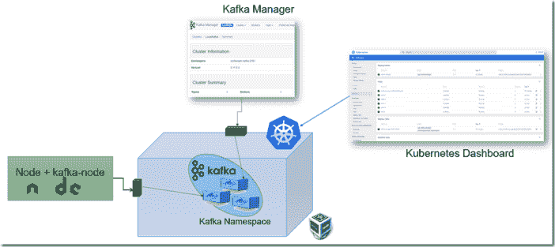
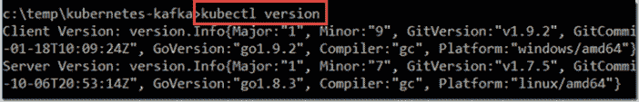
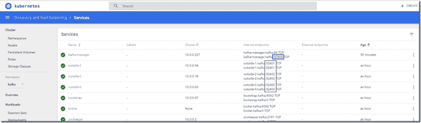
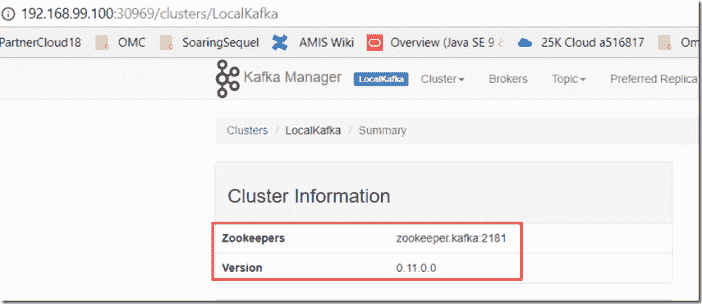
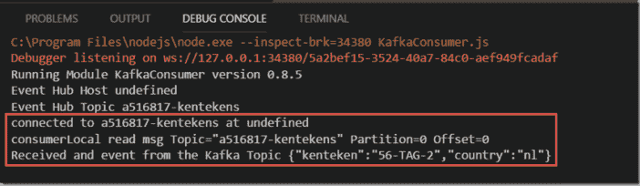

# 在 Kubernetes 上运行 Kafka 集群只需 15 分钟——并开始从节点应用程序进行生产和消费

> 原文：<https://medium.com/oracledevs/15-minutes-to-get-a-kafka-cluster-running-on-kubernetes-and-start-producing-and-consuming-from-a-b0fa7f8bcfeb?source=collection_archive---------0----------------------->



我将在研讨会上介绍微服务和通信模式，我需要与会者拥有自己的本地 Kafka 集群。我已经找到了一种方法，可以让它们在很短的时间内运行起来。得益于以下因素的结合:

*   库伯内特斯
*   迷你库贝
*   Yolean/Kubernetes-kafka GitHub Repo 和 Kubernetes yaml 文件创建了我们需要的所有内容(包括 Kafka 管理器)

先决条件:

*   安装了 Minikube 和 Kubectl
*   minikube 集群正在运行(Minikube 启动)

在我的情况下，版本是:

Minikube: v0.22.3，Kubectl 客户端 1.9 和(Kubernetes)服务器 1.7:



我经历的步骤:

Git 克隆 GitHub 库:[https://github.com/Yolean/kubernetes-kafka](https://github.com/Yolean/kubernetes-kafka)

从克隆的存储库的根目录中，运行以下 kubectl 命令:

(注意:我直到今天才知道 kubectl apply–f 可以与目录引用一起使用，然后将应用该目录中的所有 yaml 文件。这非常有用！)

kube CTL apply-f ./configure/mini kube-storage class-broker . yml
kube CTL apply-f ./configure/mini kube-storage class-zookeeper . yml

(注意:我必须注释掉这两个文件中的回收策略属性——可能是因为我运行的是相当旧版本的 Kubernetes)

kubectl 应用-f/动物园管理员

库贝克特尔应用-f ./卡夫卡

(注意:我不得不将 50pzoo 和 51zoo 以及 50kafka.yaml 中的 API 版本从 apiVersion: apps/v1beta2 更改为 API version:apps/v1 beta 1——详见[https://github.com/kubernetes/kubernetes/issues/55894](https://github.com/kubernetes/kubernetes/issues/55894)；再次，我应该升级我的 Kubernetes 版本)

要使 Kafka 可以从 minikube 主机访问(在 K8S 集群本身之外)

kubectl 应用-f/外部-服务

这将服务公开为 NodePort 类型，而不是 ClusterIP 类型，从而使它们可供能够访问 Kubernetes 主机的客户端应用程序使用。

我还安装了(雅虎)Kafka 管理器:

kubectl apply-f ./Yahoo-Kafka-manager

(我必须将 kafka-manager 中的 API 版本从 apiVersion: apps/v1beta2 更改为 apiVersion: apps/v1beta1)

此时，Kafka 集群正在运行。我可以在 Kubernetes 仪表板中检查 pod 和服务，也可以通过命令行上的 kubectl 来检查。我可以找到能接触到卡夫卡经纪人的港口:



我可以在指定的端口访问 Kafka 管理器。



最初，Kafka 管理器中看不到任何集群。通过提供图中突出显示的 Zookeeper 信息(zookeeper.kafka:2181 ),我可以使集群在这个用户界面工具中可见。

最后是吃布丁:有计划地生产和消费去往和来自集群的消息。使用世界上最简单的节点 Kafka 客户端，很容易看到这些东西正在工作。我印象深刻。

我已经创建了节点应用程序及其 package.json 文件。然后添加了 kafka-node 依赖项(NPM install Kafka-node–save)。接下来，我创建了生产者:

```
// before running, either globally install kafka-node (npm install kafka-node) 
// or add kafka-node to the dependencies of the local application var kafka = require('kafka-node') 
var Producer = kafka.Producer 
KeyedMessage = kafka.KeyedMessage; 
var client; 
KeyedMessage = kafka.KeyedMessage; 
var APP_VERSION = "0.8.5" 
var APP_NAME = "KafkaProducer" 
var topicName = "a516817-kentekens"; 
var KAFKA_BROKER_IP = '192.168.99.100:32400'; var kafkaConnectDescriptor = KAFKA_BROKER_IP; 
console.log("Running Module " + APP_NAME + " version " + APP_VERSION); function initializeKafkaProducer(attempt) { 
  try { console.log(`Try to initialize Kafka Client at ${kafkaConnectDescriptor} and Producer, attempt ${attempt}`); 
  const client = new kafka.KafkaClient({ kafkaHost: kafkaConnectDescriptor }); 
  console.log("created client"); 
  producer = new Producer(client); 
  console.log("submitted async producer creation request");
  producer.on('ready', function () { 
    console.log("Producer is ready in " + APP_NAME); 
  }); 
  producer.on('error', function (err) { 
        console.log("failed to create the client or the producer " + JSON.stringify(err)); 
  ) 
} catch (e) { 
  console.log("Exception in initializeKafkaProducer" + JSON.stringify(e)); 
  console.log("Try again in 5 seconds");
  setTimeout(initializeKafkaProducer, 5000, ++attempt); 
} 
}//initializeKafkaProducer initializeKafkaProducer(1); 
var eventPublisher = module.exports; 
eventPublisher.publishEvent = function (eventKey, event) { 
  km = new KeyedMessage(eventKey, JSON.stringify(event)); 
  payloads = [ { topic: topicName, messages: [km], partition: 0 } ];
  producer.send(payloads, function (err, data) { 
    if (err) { 
      console.error("Failed to publish event with key " + eventKey + " to topic " + topicName + " :" + JSON.stringify(err)); 
    } 
    console.log("Published event with key " + eventKey + " to topic " + topicName + " :" + JSON.stringify(data)); 
  }); 
} //publishEvent//example calls: (after waiting for three seconds to give the producer time to initialize) 
setTimeout(function () { eventPublisher.publishEvent("mykey", { "kenteken": "56-TAG-2", "country": "nl" }) } , 3000)
```

然后跑了制片人:


创造消费者:

```
var kafka = require('kafka-node');var client;
var APP_VERSION = "0.8.5"
var APP_NAME = "KafkaConsumer"
var eventListenerAPI = module.exports;var Consumer = kafka.Consumervar topicName = "a516817-kentekens";console.log("Running Module " + APP_NAME + " version " + APP_VERSION);
console.log("Topic " + topicName);var KAFKA_BROKER_IP = '192.168.99.100:32400';var consumerOptions = {
  kafkaHost: KAFKA_BROKER_IP,
  groupId: 'local-consume-events-from-event-hub-for-kenteken-applicatie',
  sessionTimeout: 15000,
  protocol: ['roundrobin'],
  fromOffset: 'earliest' // equivalent of auto.offset.reset valid values are 'none', 'latest', 'earliest'
};var topics = [topicName];var consumerGroup = new kafka.ConsumerGroup(Object.assign({ id: 'consumerLocal' }, consumerOptions), topics);consumerGroup.on('error', onError);
consumerGroup.on('message', onMessage);
consumerGroup.on('connect', function () {console.log('connected to ' + topicName + " at " + consumerOptions.host);
})function onMessage(message) {
  console.log('%s read msg Topic="%s" Partition=%s Offset=%d'
, this.client.clientId, message.topic, message.partition, message.offset);
}function onError(error) {
  console.error(error);
  console.error(error.stack);
}process.once('SIGINT', function () {
  async.each([consumerGroup], function (consumer, callback) {
    consumer.close(true, callback);
  });
});
```

并运行消费者——它适时地消费由发布者发布的事件。太棒了。



# 资源

主要资源是 GitHub 回购:[https://github.com/Yolean/kubernetes-kafka](https://github.com/Yolean/kubernetes-kafka)。绝对是好东西。

也有用:npm 包卡夫卡-node—【https://www.npmjs.com/package/kafka-node 

关于 Kubernetes 的文档:[https://Kubernetes . io/docs/user-journeys/users/application-developer/fundamental/# section-2](https://kubernetes.io/docs/user-journeys/users/application-developer/foundational/#section-2)——参考了 Kubectl 和 Minikube——以及 https://www.katacoda.com/courses/kubernetes/playground 的卡塔科达游乐场:

[卡夫卡](https://technology.amis.nl/tag/kafka/) [库贝克](https://technology.amis.nl/tag/kubectl/) [库伯内特](https://technology.amis.nl/tag/kubernetes/) [迷你库贝](https://technology.amis.nl/tag/minikube/) [节点](https://technology.amis.nl/tag/node/)

*原载于 2018 年 4 月 19 日*[*technology . amis . nl*](https://technology.amis.nl/2018/04/19/15-minutes-to-get-a-kafka-cluster-running-on-kubernetes-and-start-producing-and-consuming-from-a-node-application/)*。*