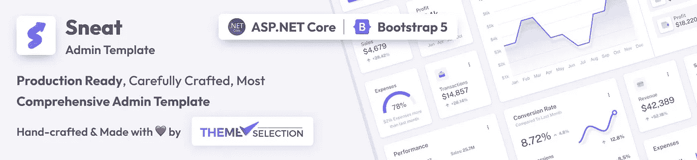
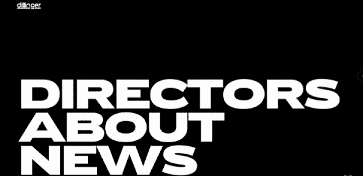
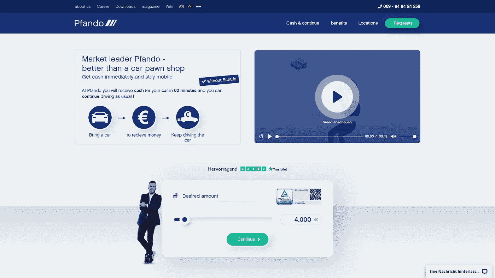
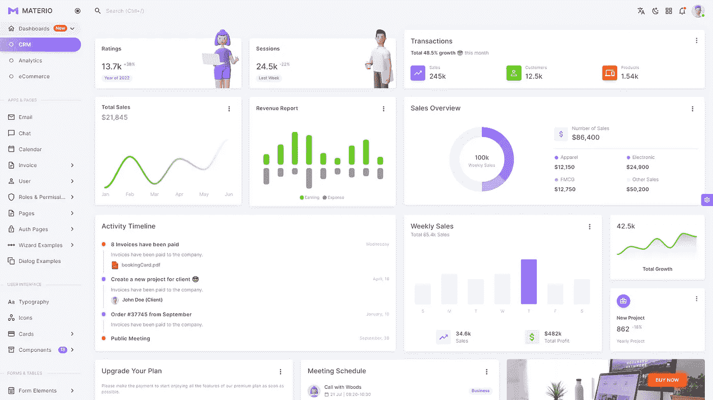
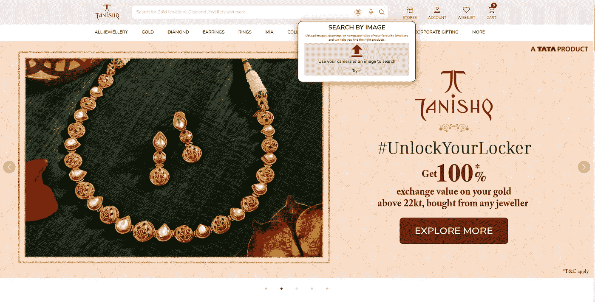

# 20 多个开创性的网页设计趋势 2023，🤩那会让世界震惊的💥[已更新]

> 原文：<https://medium.com/quick-code/15-trailblazing-web-design-trends-2022-thatll-amaze-the-world-2e647bd820a8?source=collection_archive---------0----------------------->

Credit: [Adobe Stock Photos](https://stock.adobe.com/)

# 2023 年网页设计趋势

嗯，网页设计趋势是不断变化的。因此，它是一个不断发展的领域。这是所有关于创造和带来革命，同时展望未来。网页设计领域与技术有着千丝万缕的联系，它可以展示新的想法和创新。你可以通过动画、互动和整体沉浸来发挥你的想象力。

在这篇文章**开拓性网页设计趋势 2023** 中，我们将讨论一些开创性的设计趋势。例如更多的社会证明、可悬浮的图标、剪贴簿美学、重叠文本、排版布局，以及重新改编将在 2023 年主宰网页设计世界的 404。

谈到 2022 年，像行为设计、粘土形态和孟菲斯设计这样的趋势是一些具有重大影响的新鲜和独特的趋势。虽然有一些既定的趋势，如渐变、移动打字和复古外观在 2022 年被大多数设计师考虑，但在 2023 年也不会放缓。

有可能我们会错过一些，因为这是一个广阔的世界..！！因此，如果你觉得我们应该添加一些内容，请在下面的评论区告诉我们。👍

> 另外，在这里查看往年趋势:[**25+最酷网页设计趋势 2022**](/quick-code/coolest-25-web-design-trends-in-2021-thatll-rock-the-world-388eb1144b7e) 。

现在让我们来看看 2023 年即将到来的 20+创新 **网页设计趋势**。

Credit: [Tenor](https://tenor.com/view/despicable-me-minions-lets-get-started-happy-excited-gif-4767352)

# 1.复杂渐变

Credit: [https://monopo.london/](https://monopo.london/)

2023 年网页设计趋势列表中的第一个是复杂渐变。嗯，渐变并不是一个全新的趋势，因为随着时间的推移，它已经走过了很长的路。虽然，随着时间的推移，复杂的渐变正在成为充满活力的网页设计趋势之一，因为它被用于现代网页设计，并经常被用来增加平面图像的深度。

根据网页设计师和专家的说法，它越来越受欢迎。所以这种网页设计趋势不应该被忽视。2018 年渐变卷土重来，Instagram 的渐变 logo。从那以后，它在创造性和互动性方面建立了新的标准。

Credit: [https://juliebonnemoy.com/](https://juliebonnemoy.com/)

这种趋势流行的原因是，它为创造力提供了更多的空间。其次，用户不确定。一方面，他们更喜欢极简主义，另一方面，他们倾向于认为，如果设计师只看到两种颜色，他就没有在设计中投入工作。

在这种情况下，渐变会很有帮助，因为它在保持最小设计的同时创造了一种运动的错觉。这就是这种网页设计趋势流行的原因。换句话说，你可以称之为运动设计的模拟，不使用动画。…!！

所以，使用复杂的渐变是一个非常好的选择，即使你正在设计一个简约的设计。

**使用复杂渐变的网站:**

*   https://www.winamp.com/[😂)](https://www.winamp.com/)
*   【https://sarahguo.com/ 
*   [https://vitaarchitecture.com/](https://vitaarchitecture.com/)
*   [https://www.richardsancho.com/](https://www.richardsancho.com/)

以下是一些有用的渐变源和发生器:

*   [网页渐变](https://webgradients.com/)
*   [Gradienta](https://gradienta.io/)
*   [用户界面渐变](https://uigradients.com/#SweetMorning)
*   [CSS 渐变](https://cssgradient.io/)

> 更多颜色渐变生成器，请查看[**免费调色板生成器和渐变生成器**](https://dev.to/theme_selection/best-free-color-palette-generator-ready-to-use-or-generate-your-own-3hoo)

创建渐变的一些技巧:

1.  不要随意选择颜色。它必须服务于页面或产品的特定元素的情绪。如果你不确定该选什么，使用 [Adobe 色轮](https://color.adobe.com/en/create)。
2.  使用大自然的颜色。绿色、黄色、蓝色等。它吸引任何人的目光。看到产品上这样的颜色，用户一定会印象深刻。
3.  检查梯度发生器

# 2.粘土质

Credit: [https://humans.wannathis.one/](https://humans.wannathis.one/)

粘土形态是一个新鲜和最新的网页设计趋势。友好的，迷人的 3D 手/人/或者你能想到的任何其他插图，你可以使用这种新兴的新鲜的和新的网页设计趋势来给你的网站一个非常互动的外观。它很好地融入了极简设计世界。

泥塑由四种风格混合而成:

*   浅色、柔和、鲜艳的颜色
*   大圆角
*   双重内阴影
*   外部阴影

Credit: [Materio Vuetify VueJS Admin Template](https://themeselection.com/products/materio-vuetify-vuejs-admin-template/)

**查看一些使用 3d 内容的网站:**

*   [https://christmas.wannathis.one/](https://christmas.wannathis.one/)
*   [https://tolia.ge/](https://tolia.ge/)
*   [https://matterapp.com/](https://matterapp.com/)

> **还有，别忘了看阿德里安·特瓦罗格斯的 Youtube 视频:**

# **3。行为设计**

承认在健身应用出现之前你很懒。😉

你开始走路，留意你走路燃烧了多少卡路里，看到这些数字你会感觉很好。它通过给你惊人的徽章和奖励来激励你保持这个习惯。这是行为设计的一个例子。它让用户体验足够有趣，足以触发某种行为。

当你与这样的应用或网站互动时，你会采取某种行动，养成习惯，做一些事情，比如散步、骑自行车、绘画、冥想等等。这就是行为设计的内容。它结合了心理学、设计、技术和创造性方法来找出人们为什么做他们做的事情，并通过实验找出如何激活他们来改变他们的行为。

许多产品都采用了行为设计思维，例如，流行的冥想应用 Headspace。该平台的成功是因为它能够通过鼓励用户每天冥想来保持用户活跃。

2023 年的网页设计趋势，基本上是一个改变行为的想法、技术和原则的过程。这是所有关于使用视觉线索来触发用户行为。你可以查看一些以创造性的方式执行这种惊人的网页设计趋势的网页应用程序。

**网络应用示例:**

*   http://weavesilk.com/
*   【https://impactapp.in/ 
*   [https://www.stepsetgo.com/](https://www.stepsetgo.com/)
*   [https://stickers.evrone.com/](https://stickers.evrone.com/)

# **4。孟菲斯设计**

> “还记得我们是如何笑着消磨时光的吗？想想我们会做些什么了不起的事情
> 
> 那些日子是我的朋友
> 我们认为他们永远不会结束”——玛丽·霍普金

怀旧——我们都经常会有这种感觉，对吗？嗯，即使是网页设计领域也不例外…！！2023 年网页设计趋势名单上的另一个是孟菲斯设计。它更像是 80 年代的东西，但在 2023 年作为网页设计趋势卷土重来。是的，你没听错。80 年代又回来了…！！

它变得比以往任何时候都更受欢迎。虽然，与“千禧粉红”潮流不同，我们在 Pinterest 和 Instagram 上看到的当前版本的孟菲斯自最初的首次亮相以来已经发生了变化。现代网页设计师在相同的核心基础上，赋予他们的设计更现代的感觉。

Credit: [https://www.cartoonnetworkstudios.com/](https://www.cartoonnetworkstudios.com/)

孟菲斯不仅仅是一种设计趋势，它打破了典型的规范，并通过设计鼓励新鲜，创意和独特性。此外，它不仅在设计中，而且在生活中激发了大胆和勇敢，并提醒我们，我们在这个地球上的时间应该是有趣的。因此，它实际上可以帮助你传递最好的印象。

**使用孟菲斯设计的网站示例:**

*   [https://upperquad.com/](https://upperquad.com/)
*   https://shapefarm.net/
*   【https://www.cartoonnetworkstudios.com/ 
*   [https://www.orchestredeparis.com/resonance/](https://www.orchestredeparis.com/resonance/)

[**Materio Figma Dashboard Builder & UI Kit**](https://themeselection.com/item/materio-figma-admin-dashboard-ui-kit/)

# **5。可见边框:**

Credit: [https://www.physioasten.at/](https://www.physioasten.at/)

***“整齐地排列，准确地放在该放的地方。”***

知道了网站实际上是建立在一个严格的网格上，并与代码结合在一起的事实，什么能使它们看起来真实呢？就像，漂浮在一个空间的界限内，用手整齐地排列。嗯，如果使用得当，边框不会只是分开。他们给了网站一个真实的触摸，可以为你的网站创造一个干净的印象。

Credit: [https://gumroad.com/](https://gumroad.com/)

这就是为什么在 2023 年，网页设计师更喜欢这种趋势。他们试图通过使用简单的边框和框架来展示他们的基础，让它更真实一些。一个可见的边界显然有把两个部分分开的好处。这为访问者提供了一个简单的浏览体验，同时你也可以展示更多的内容而不会让它变得拥挤。

Credit: [Sneat Bootstrap 5 HTML Admin Template](https://themeselection.com/item/sneat-bootstrap-html-admin-template/) By [Themeselection](https://themeselection.com/)

这些简单的边框也给了网站一种微妙的感觉，与其他 90 年代的潮流(如孟菲斯)很好地结合在一起。因此，如果你不想失去你的独特性，在设计你的网站时，请记住这个网页设计趋势。

**利用这种网页设计趋势的网站实例:**

*   [https://www.devrandogaroglu.com/](https://www.devrandogaroglu.com/)
*   [https://shopify.supply/](https://shopify.supply/)
*   [https://v-a-c.org/en](https://v-a-c.org/en)

Best [**Asp.net Admin Panel**](https://themeselection.com/item/category/asp-net-dashboard/) based on Sneat Design!

# 6.移动型

漂浮的动画字母…看起来像是哈利波特的东西…！！😀

嗯，这是 2023 年清新的新网页设计趋势之一。将动画和错别字结合起来是让你的网站吸引人和有趣的最好方法。排版不再仅仅是一种传递信息或信息的方式。你可以用它来展示你的创造力，并通过制作动画来使它具有互动性。

Credit: [https://www.papertiger.com/](https://www.papertiger.com/)

动画通常是为插图、UI 元素和页面过渡保留的。此外，动画或让我们说一个移动的文本/错别字可以为游客创造一个新鲜和独特的体验。即使基本的动画如圆形旋转也能在浏览时产生效果。现在，现代设计师已经打破了这种刻板印象，将它与字体混合在一起。

这样的小细节让排版成为焦点，而不会用不必要的动画让读者不知所措。尽管如此，建议不要过分渲染错别字。让他们以一种创造性的方式移动，同时记住一件事:避免过于生动的错别字，因为它们会让访问者不知所措，并可能分散他们对网站主要动机的注意力。

**网站示例:**

*   https://atypikal.co/
*   【https://www.jomor.design/ 
*   [http://www.thegreat.agency/](http://www.thegreat.agency/)
*   [http://zoomanity.land/en/](http://zoomanity.land/en/)

# **7。**超大号排印英雄形象

Credit: [https://aluminium.index.studio/](https://aluminium.index.studio/)

**“第一印象就是最后印象。”**

你的网页如何给你的访问者留下印象是最重要的。

嗯，一个页面的顶部，被称为“英雄部分”，是你的网站的重要组成部分。这是你的访客看到的第一样东西。如果设计得不好，访问者可能会觉得不够有趣而无法继续浏览。去年，它更多的是关于在英雄部分有一个形象，现在在未来的一年，情况已经发生了变化。图像现在正被醒目的超大字体所取代。

Credit: [https://choreograffiti.com/](https://choreograffiti.com/)

大而粗的字体，没有视频和照片，使用单色配色方案，足以迅速吸引用户的注意。作为访问者看到的网站的第一部分，英雄形象必须做出声明。这就是为什么现代设计师正在考虑 2023 年的这种网页设计趋势。

不寻常尺寸的印刷是一种新趋势。因此，选择更大尺寸的文本有助于创造引人注目的第一印象，也有助于将其他设计元素结合在一起。这是一种非常独特的技术，可以有效地用于极简主义或极大主义的设计中，并可以与许多不同的风格融合。

**带有超大字体英雄形象的网站**

*   [https://www.azzerad.com/](https://www.azzerad.com/)
*   [https://perturbator.com/](https://perturbator.com/)
*   [https://kirifuda.co.jp/](https://kirifuda.co.jp/)
*   [https://www.dariaizbash.com/](https://www.dariaizbash.com/)

> 查看收集的 [**开发者和设计师最佳排版资源工具**](https://dev.to/theme_selection/best-typography-resources-tools-for-every-developers-and-designer-49hp) 。

# **8。参与互动**

交互式网页设计不仅仅是一种趋势，而且是一个关键的要求，因为它不仅能吸引访问者，还能增加价值，阐述你的目标。此外，它是每个设计师非常重要的因素。网页设计师的主要工作是提供一个互动的、吸引人的网站，确保访问者不会放弃这个网站。

Credit: [https://www.mobia.io/](https://www.mobia.io/)

当访问者发现你的网站过于直截了当和简单时，他们往往会离开。简单是好的，但是任何东西太多都会使它失去吸引力。因此，使用引人入胜的互动是一个好主意。

交互式网页设计的动机是尽可能地让访问者停留在网站上。你可以通过使用 3D 动画、视频、图片等互动方式来吸引访问者的注意力，从而使你的网站更具吸引力。使用吸引人的交互方式可以激发有意义的页面参与，比如点击、滚动、滑动和拖动。

Credit: [https://matterapp.com/](https://matterapp.com/)

这种网页设计趋势也有助于降低跳出率，因为访问者更有可能停留在你的网站上。这是为访问者提供价值，让他们参与到你的网站中，并更多地了解他们的最好方法之一。

如果你的设计是交互式的，它会自动引起人们对你的公司的好奇和兴趣。所以，在设计你的网站时，请记住这种网页设计趋势。

**网站示例:**

*   [https://www.moooi.com/en/a-life-extraordinary#tokyo-blue](https://www.moooi.com/en/a-life-extraordinary#tokyo-blue)
*   [http://www.thegreat.agency/](http://www.thegreat.agency/)

# 9.交互式字体:

Credit: [https://smartupvisuals.com/](https://smartupvisuals.com/)

在现代，字体不再是“简单的东西”。它们会影响网站的性能。字体给访问者留下印象。因此，有必要选择合适的字体并创造性地使用它们。在当今时代，随着高度先进的技术和资源的可用性，人们可以充分发挥他们的创造力和想象力与字体。

例如，看看网站 Dillinger。它使用一种当光标在文本上移动时会改变其粗细的字体。请注意，这里黑色背景下文本的缩小效果使所选文本更具可读性，这是可用性的一大优势。

Credit: [https://www.dillinger.tv/](https://www.dillinger.tv/)

与以前不同的是，现在使用现代无代码平台可以更容易地创建更复杂的效果。尽管在字体上应用交互性时，记住一件事很重要，但有些人会因为移动字符而分心。所以，不要过度使用它。

**网站示例:**

*   https://www.jomor.design/
*   【https://dearworldleaders.org/ 

除此之外，我们想推荐你检查 [**Materio MUI React Next js 管理模板。**](https://themeselection.com/item/materio-mui-react-nextjs-admin-template/)

[Materio MUI React Next Js Admin Template](https://themeselection.com/item/materio-mui-react-nextjs-admin-template/)

这是对开发人员最友好且高度可定制的 [**Next js Dashboard 模板**](https://themeselection.com/item/category/next-js-admin-template/) 构建于 React 之上，有 TypeScript 和 JavaScript 版本。

# **10。创意滚动体验/** 视差**滚动:**

Credit: [https://drinkcann.com/](https://drinkcann.com/)

曾经有人建议网站应该在文件夹上方包含尽可能多的信息，以避免用户不得不滚动。但在这个现代时代，滚动被认为是一个重要因素，因为访问者希望以一种有品位的方式获取网站信息。

视差滚动引入了一种新的方式，允许设计者通过让滚动本身吸引用户来打破刻板印象。作为用户对页面最常见的参与方式，滚动是一个不断获得动画互动反馈的机会。到 2023 年，通过带领游客进行富有想象力的旅行，滚动体验将变得比以往任何时候都更大、更好。

Credit: [http://okkapi.agency/en/](http://okkapi.agency/en/)

如今，页面正通过酷炫的视差效果转变成活生生的世界。由于滚动动画并不新鲜，这种趋势的主要关键是用一种创造性的和有意义的体验给访问者带来惊喜。

这可能是 2023 年最具开创性的网页设计趋势之一。所以，一定要在设计网站的时候考虑到这一点。请注意，利用这种趋势以一种有意义的方式娱乐你的访客。它应该对访问者和网站都有利。

**网站示例:**

*   [https://admireamaze.debijenkorf.nl/](https://admireamaze.debijenkorf.nl/)
*   [https://waltersophia.com/](https://waltersophia.com/)

# 11。手工图形

Credit: [https://www.oatly.com/](https://www.oatly.com/)

手绘艺术是最独特和不同的网页设计趋势之一。它正在成为流行的风格之一，并被网页设计师很好地采用。使用这些手工设计的元素来吸引游客肯定是一个好主意。

嗯，一个网页设计师的主要动机是以一种有趣和时尚的方式来设计和展示网站，以吸引用户。为此，网页设计师在他们的项目中尝试新鲜和独特的想法。最终，这种与众不同的渴望导致了手绘元素在网站中的使用。

现在，手绘是设计师、图形艺术家和插画师最常用的功能之一。网页设计师正在考虑 2023 年的网页设计趋势，因为它提供了试验设计和展示创造力和灵感的机会。

**网站示例:**

*   https://www.sweetmagnoliagelato.com/
*   【https://waltersophia.com/ 
*   [http://www.danieldiggle.com/](http://www.danieldiggle.com/)
*   [http://themanyfacesof.com/leonardo-dicaprio/](http://themanyfacesof.com/leonardo-dicaprio/)

# **12。更多玻璃态**

Credit: [https://decimalchain.com/](https://decimalchain.com/)

**Glassmorphism** —透明、模糊和半透明磨砂玻璃效果的组合。这给了一个玻璃效果。Glassmorphism 为你的 UI 增加了深度和视觉层次。此外，它可以有效地利用把重点放在你想突出的内容，以一种独特的方式。

这种技术被用于标志、插图，甚至是整篇文章。从网站登录页面、移动应用程序界面和仪表盘，到卡片、入职屏幕和登录屏幕等 UI 组件，设计师们正在以创造性的方式使用玻璃形态效果，为界面增添视觉趣味。

Credit:[https://digital.vtb.ru/digest/2021-jul/](https://digital.vtb.ru/digest/2021-jul/)

**提示**:当玻璃形状的元素层叠在明亮的背景、多彩的形状和图像上时，效果很好。它给人一种非常丰富的感觉。

**使用 Glassmorphism 的网站**

*   [https://weareodyssey.com/](https://weareodyssey.com/)
*   [https://ventus.health/](https://ventus.health/)

# 13。插图

嗯，插图被认为是吸引访问者访问你的网站的最好方式之一。这已经成为网页设计界的既定趋势，在 2023 年也将保持不变。网页设计者正在尝试各种可能的方法来脱颖而出，他们以一种非常独特的风格来做这件事。他们现在推出了两种不同风格的插图:拼贴风格和抽象风格。

## 1.拼贴风格

Credit: [http://titanichistory.tilda.ws/](http://titanichistory.tilda.ws/)

拼贴风格的图形可以给网站插图一种触感，在设计中开辟更多的空白空间，并允许你在不围绕一张照片的情况下整合图像。确保在拼贴画中融合了各种形状、颜色和图案。您可以给照片添加单色效果、色调或滤镜，以帮助它们与整体设计融为一体。

**网站示例:**

*   【https://www.vanta.com/careers 
*   [https://anotherdei.com/](https://anotherdei.com/)
*   [https://paperly.shop/](https://paperly.shop/)

## 2.抽象插图:

Credit: [https://marketwise.io/](https://marketwise.io/)

[‍](https://www.vanta.com/careers) 现在**，抽象**插图越来越受欢迎，因为它们有更有机的纹理和人类手工创作的感觉。虽然干净，罂粟矢量图形和可爱的插图的人和物体已经统治网页设计几年了，也许人们正在寻找一些感觉更自然和复杂的东西。

这种插图可以用墨水和纸张创建，并扫描或在插图软件中创建。关键是融合各种纹理和自然的不规则性，如水彩、墨水、颜料、丝网印刷效果或纸张的纹理。线条也可以更柔和，模仿使用石墨或墨水时线条粗细的变化。

**网站插图:**

*   [https://designmodo.com/](https://designmodo.com/)
*   [https://howmanyplants.com/](https://howmanyplants.com/)
*   [https://chrono.fund/](https://chrono.fund/)

# 14.较少变形

新形态是 2020/2021 年 UI 设计的最大趋势之一，这是有道理的。这是新鲜的，有创意的，有吸引力的。例如，您可以检查[可滴镜头](https://dribbble.com/tags/neumorphism)。由于其柔和的阴影和整体外观，它是现实的、现代的、未来的、视觉上吸引人的，并且极其惊人。

尽管如此，大多数网页设计师现在都放弃了这一点。
**原因**:无障碍问题…！！

Credit: [https://dribbble.com/shots/10494800-Nespresso-Light](https://dribbble.com/shots/10494800-Nespresso-Light)

Neumorphism 看起来不错，因为它不同于大多数网页设计，但这并不意味着你只关注外观，因为网站应该以标准的方式设计，因为它只是工作得更好。人们应该首先记住可访问性，因为它是网页设计的关键部分之一，

> **关于这个话题的更多细节，请查看******。****

**异形在某些时候会造成情境视觉困难，比如干扰屏幕可视性的明亮环境，在那样的环境中很难阅读异形。**

****

**Credit:[https://www.pfando.de/](https://www.pfando.de/)**

**缺乏对比和清晰的区分使得这种风格的网站对于视力不好的人来说很难浏览。除此之外，阴影元素会让用户很难决定按下哪个按钮。**

**当使用任何网页设计趋势时，你应该知道主要的目的不仅仅是吸引访问者，而是提供一个简单而有意义的浏览体验和可访问性。因此，使用神经变形并不是一个坏主意，但是在需要的地方明智地使用它。**

# **16.材料设计**

**嗯，还不算老…！！材料设计仍然在 2023 年**网页设计趋势清单上**。**

**

[Materio React Admin Template](https://themeselection.com/item/materio-mui-react-nextjs-admin-template/) By [Themeselection](https://themeselection.com/)** 

**[**材料设计**](https://material.io/design/) 是谷歌早在 2014 年推出的一种设计语言。大多数时候，传统的网页设计看起来简单而单调。这就是材料设计的用武之地。它允许使用颜色和阴影来产生纹理的效果。**

**这基本上是过去几年设计界最大趋势的延续:扁平化设计。还有，材料可以做平面设计做不到的事情。它可以添加足够的修饰来增强用户体验和可用性。材料设计的目标是可用性，而不是拿走一切去迎合视觉吸引力。**

****

**Credit: [Materialize Admin Template](https://pixinvent.com/materialize-material-design-admin-template/landing/) by [Pixinvent](https://pixinvent.com/)**

# ****17。UI 中的复古设计/复古未来主义****

**“老是金”——的确如此！！**

**复古设计已经成为非常流行的网页设计趋势之一。它们是让你的设计脱颖而出的好方法。复古设计——这是一种带来怀旧感的风格。它是连接网站和用户的最有效的网页设计之一。**

**当未来主义元素与复古设计风格相融合时，参观者肯定会有一种开箱即用的体验。**

****

**Credit: [https://www.exclusiveprs.com/](https://www.exclusiveprs.com/)**

**设计师正在将复古和复古风格元素应用到大大小小的网上商店、作品集、公司设计和博客中。如果实施得好，复古设计可以有创意，有吸引力，使网站脱颖而出，看起来非常独特。**

**无论是电影还是设计，一些老的风格依然常青。在网页设计领域，复古风格经常被用来从常规设计中脱颖而出。无论是电影还是设计，一些老的风格依然常青。在网页设计领域，复古风格经常被用来从常规设计中脱颖而出。**

****网站示例:****

*   **[https://www.dayln.design/](https://www.dayln.design/)**
*   **https://basement.studio/**
*   **【https://www.bulleitgroup.com/ **
*   **[https://harvardfilmarchive.org/](https://harvardfilmarchive.org/)**

# **18.更多的社会证明**

****

**Credit: [**Dribbble**](https://dribbble.com/shots/15509034-Grabstar-A-review-rating-platform-for-the-Freelancer-Clients)**

**无论是在与客户的个人关系还是职业关系中，信任都是建立关系的重要组成部分。因为网站通常是顾客和品牌的第一接触点，信任必须从那里开始。2023 年，网页设计者将使用社交验证和信任标志来实现这一目标。**

**三种类型的内容有助于建立网站访问者之间的信任:**

*   **衡量整体客户满意度的指标**
*   **客户证明**
*   **可以链接到评级平台(如 Google 或 Yelp)的总体客户评级**

****例子:****

*   **[https://themeselection.com/](https://themeselection.com/)**
*   **[https://www.vendasta.com/testimonials/](https://www.vendasta.com/testimonials/)**
*   **[https://www.jivesmedia.com/](https://www.jivesmedia.com/)**

# **19.悬浮图标**

****

**Credit: [Tanishq](https://www.tanishq.co.in/)**

**网页设计的首要任务之一是创建简单易用的界面，任何人都可以使用。然而，网页设计中使用的一些快捷方式，尤其是图标设计，会对一些用户造成障碍，抑制可访问性。例如，网站标题中的图标已经变得如此普遍，以至于大多数(如果不是全部的话)用户都明白他们提供的是什么，以及当他们点击图标时会发生什么。**

**只要不同的网站使用相同的图标，用户就不会怀疑如何使用网站标题的这一部分。为了提高用户在与网站图标互动时的信心，网页设计师将在 2023 年开始在图标上包含悬停触发的帮助文本。**

**当访问者悬停在产品图标上时，文本会出现，但当他们悬停在变体样本上时，文本也会出现。这消除了任何误解的可能性，并确保所有用户在未来都能令人信服地与网站内容进行交流。**

****示例:****

*   **[https://www.tanishq.co.in/](https://www.tanishq.co.in/)**
*   **[https://in.puma.com/in/en](https://in.puma.com/in/en)**

# **20.剪贴簿美学**

****

**Credit: [Dego](https://package.dego.lv/)**

**嗯，伴随着现代主义而来的往往是一种改造自然环境的愿望。这种本能正通过剪贴簿和 DIY 元素在 2023 年的网站上体现出来。这种设计以涂鸦插图、手写字体、贴纸视觉效果和剪切粘贴拼贴画为特色。**

**这些手工元素不仅再现了翻阅老派杂志的触觉体验，还引发了一种亲密感和不完整感，取代了自动化的精确度。手工美学确实抵制了更多高科技趋势的噱头，但它并没有忽视我们的技术现实。由于这个设计包含了这两个部分，物理和数字共存为一体。**

**正如你在上面的例子中看到的:Dego 非常有效地运用了剪贴簿美学。**

****例子:****

*   **【https://package.dego.lv/ 号**
*   **【https://hakaji.io/ **
*   **[https://www.awwwards.com/sites/steph-jeong-scrapbook-20](https://www.awwwards.com/sites/steph-jeong-scrapbook-20)**

# **21.重叠文本**

****

**Credit: [santateresafest](https://www.santateresafest.ca/en/)**

**网页设计长期以来一直受制于网格，网格将布局安排在整洁、均匀的空间中，并确保一切都在适当的位置。网页设计师一直在反抗这种强加的结构，采用了打破规则的技术，如新野蛮主义，去年软化了传统野蛮主义更前卫的方面。这些努力似乎得到了回报，因为在 2023 网站上经常可以找到重叠和拥挤的文本，这是野兽派更常见的特征之一。**

**甚至现在流行的网站也在页面上重叠他们的元素到几乎难以辨认的程度，将排版置于图像之上。通常，网站会保持流畅的整体美感，只有某些标题文本重叠，产生轻微的野兽派效果。这就是这种趋势具有广泛吸引力的原因:它打破了单调，而不会让整个页面陷入实验性的混乱。**

**抽象的标题让人想起杂志封面上的文字，这一趋势引人注目。总的来说，这一趋势表明，违反规则已经变得更加被广泛接受。**

****例子:****

*   **[https://www.santateresafest.ca/en/](https://www.santateresafest.ca/en/)**

# **22.印刷布局**

****

**Credit: [OS Agency](https://os.agency/)**

**数字设计最显著的优势之一是其多媒体功能，它允许文本、图像、视频、动画和交互元素在同一作品中共存。尽管如此，许多 2023 年的网页设计者完全放弃了多媒体，而倾向于以文本为主的布局。**

**无论如何，排版布局提倡高效的极简主义:这样的网站有信息要说，不要浪费访问者的时间去说。他们也给访问者一些概念上的信任，认识到有力的文字和创造性的文本结构可以像引人注目的视觉效果一样引人入胜。**

*   **[https://pp-fragment.com/#from-sans-to-serif](https://pp-fragment.com/#from-sans-to-serif)**
*   **【https://os.agency/ 号**

# **23.重新适应 404**

****

**Credit: [Vos9x](https://vos9x.com/404)**

**404 错误页面是任何网站的可怕目的地，当你找不到你要找的东西时，你会被导向这个地方。虽然网页设计师长期以来一直将 404 页视为一个包含幽默图形或轻松文字的机会，但 2023 年的 404 页将全部用于娱乐。这 404 页通过使用引人入胜的动画和互动小游戏积极鼓励游客留下来。**

**这是在逆境中创造积极的更大动力的一部分。当世界各地每天都有如此多令人沮丧的事件发生时，网页设计师自然希望有所贡献。一个幽默的 404 页设计可能不会改变世界，但它可以是一件小而积极的事情——数字快乐取代了人为错误。**

****例子:****

*   **[https://www.humanastudio.com/12](https://www.humanastudio.com/12)**
*   **[https://gokulkrishnan.com/oh-snap](https://gokulkrishnan.com/oh-snap)**
*   **[https://ashfieldmedcomms.com/404-2/](https://ashfieldmedcomms.com/404-2/)**

# **结论:**

**因此，我们已经提到了 2023 年的一些开创性和开箱即用的**网页设计趋势。****

**今年的设计师们更有可能有一种方法来提供不同的网页设计，同时保持可访问性和无缝导航，以独特而有意义的方式吸引访问者。**

**在 2023 年，我们可以期待看到更多创新和实验性的设计趋势，以提高游客的参与度，并即兴创作他们的用户体验。**

**请告诉我们 2023 年哪些网页设计趋势是你最喜欢的。此外，建议任何你认为我们可以在下面的评论区添加的网页设计趋势。还有，别忘了分享。🎉**

**快乐设计…！！**

# **关于主题选择:**

**我们在 [Themeselection](https://themeselection.com/) ，提供精选的高质量、现代设计、专业且易于使用的免费管理仪表板模板、HTML 主题和 UI 套件，以更快地创建您的应用程序！**

**如果你想尝试一下上面提到的趋势，那么就使用[引导管理模板](https://themeselection.com/item/category/bootstrap-admin-templates/)、 [Asp NET Dashboard](https://themeselection.com/item/category/asp-net-dashboard/) 、 [React 管理模板](https://themeselection.com/item/category/react-admin-templates/)、 [Next JS 管理模板](https://themeselection.com/item/category/next-js-admin-template/)和 [VueJS 管理模板](https://themeselection.com/item/category/vuejs-admin-templates/)。它会帮助你得到一个更好的想法。**

**由 [Abhijeet Dave](https://medium.com/u/f27303619e99?source=post_page-----2e647bd820a8--------------------------------) 为[主题选择](https://medium.com/u/149fb54c8c5a?source=post_page-----2e647bd820a8--------------------------------)撰写。**