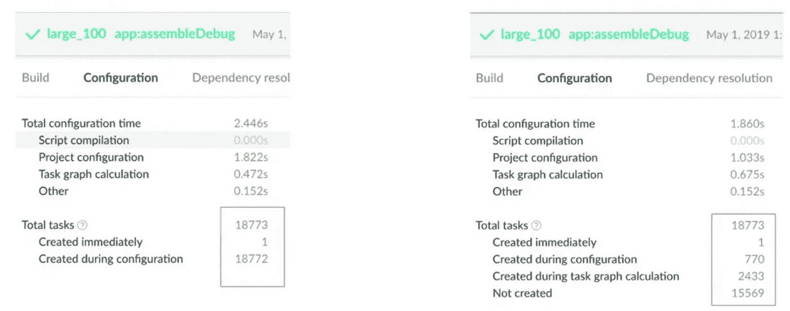

# Android 项目中 Gradle 的 19 个提示— 2019 版

> 原文：<https://medium.com/google-developer-experts/19-tips-for-gradle-in-android-projects-2019-edition-11af704eb06e?source=collection_archive---------1----------------------->


在 Google I/O 2019 上，我们与 Gradle 在 Android 项目上进行了两场精彩的会谈:[“Android Studio 构建系统的新功能”](http://What's New in the Android Studio Build System)和“构建更大、更好:Gradle 用于大型项目”。

本文是上一篇文章的总结，用例子解释了不同的建议。我知道这个标题可能有点吸引人，但是从字面上看，这个演示中有 19 个很棒的技巧。

会议由 Xavier Ducrohet 和 Aurimas Liutikas 主持:

介绍分为三个部分:模块化，配置和调查。强烈推荐你和你的团队一起看。让我们一节一节地看:

# 模块化

如今，模块化在 Android 世界无处不在。如果你还需要更多信息，你有极好的资源[这里](https://jeroenmols.com/blog/2019/04/02/modularizationexample/)和[这里](/androiddevelopers/a-patchwork-plaid-monolith-to-modularized-app-60235d9f212e)。甚至在今年的 I/O 大会上，也有一个关于 Android 模块化良好实践的[演讲。](https://www.youtube.com/watch?v=PZBg5DIzNww)

今天，我们在团队中根据特性或架构的特定部分工作，为什么我们要对项目中我们不接触的部分进行重建呢？除了从架构角度来看的好处(当然还有测试)，模块化与 Gradle Build 系统非常匹配。对于大型整体项目，很难获得缓存或避免编译这样的好处。

**1-创建纯 Java/Kotlin 库**

第一个技巧是尽可能创建纯 Kotlin/Java 模块。自从 Android 世界采用了干净架构的概念后，开发者越来越不依赖于框架。例如，如果您的领域层中有您的业务逻辑，这些模块不需要使用 Android 依赖项。通常，这些模块将是纯 Kotlin/Java 实现，不引用框架。最后，从架构角度讲，Android 将是你的业务逻辑的实现细节。

关于构建系统，拥有一个纯 Java/Kotlin 对构建有影响。这里你可以看到基本`java`插件的`:libjava:assemble`的任务依赖图:


看起来很简单，我们只有 5 个任务，如果我们想显示一个简单的`com.android.library`的`:lib1:assembleDebug`的任务依赖图，这个图是:


很明显哪个任务会更快。这个建议不仅仅适用于领域层。当你不依赖 Android 时，你可以应用于你的特定架构。

2- **仅应用需要的插件**

在我们的项目中使用插件是很正常的，但有时要么因为我们不知道，要么因为我们在复制和粘贴，我们会在配置文件中包含不需要的插件。

```
apply plugin: 'com.android.application'
apply plugin: 'kotlin-android'
apply plugin: 'kotlin-android-extensions'
apply plugin: 'maven-publish'
apply plugin: 'kotlin-kapt'
apply plugin: 'talaiot'
apply plugin: 'com.github.triplet.play'
```

在 Gradle 的配置阶段，为应用到每个模块的每个插件配置任务，在我们的构建中增加了额外的时间和资源开销。

重要的是要仔细检查我们的配置文件中是否需要插件，并确定插件在独立模块中的使用范围。

**3 范围注释处理器**

注释处理在我们的构建中仍然是一项昂贵的任务。从 Gradle 4.7 开始，我们可以使用增量处理。一些最流行的注释处理器库已经更新，以符合增量处理准则。

演示中的建议是将注释处理器的使用隔离在一个独立的模块中。

提醒一下，从 Kotlin 1.3.30 开始，KAPT 现在以实验模式支持增量注释处理器，您可以更新`gradle.properties`中的值:

`kapt.incremental.apt=true`

**4-在最终应用模块上运行 Lint**

lint 工具检查可能影响 Android 应用程序质量和性能的结构代码问题。强烈建议您在发布应用程序之前更正 lint 检测到的任何错误。

在模块化项目中，我们可能会浪费时间在所有模块中运行 lint。这里的建议是通过在最终的 app 模块上运行 lint 来避免重复工作。Lint 将运行最终的模块和二进制依赖项。

**5-使用 api 和实施配置**

Gradle 3.4 引入了新的配置实现/api。实现/api 包括术语“配置避免”，这有助于防止泄漏多模块项目的可传递依赖关系。

出现在`api`配置中的依赖项将被传递给库的消费者。在`implementation`配置中发现的依赖项不会向消费者公开。

在*Android Studio 构建系统的新特性*中，他们详细解释了在 4 个模块的用例中使用 API/实现的影响:


[https://www.youtube.com/watch?v=LFRCzsD7UhY](https://www.youtube.com/watch?v=LFRCzsD7UhY)

在你的依赖模块中使用 api/implementation，不管怎样，如果你使用`compile`，Gradle 会显示一个警告

**6-版本依赖关系的额外配置**

在模块化的世界里，不同的模块使用相同的库是一个典型的例子。例如，在您的特性 ui 模块中，您正在使用相同的 recyclerview 依赖项`androidx.recyclerview:recyclerview:1.0.0`。如果您有 20 个模块，并且您想要更新一个依赖项的版本，您会注意到用新版本更新每个模块并不是非常理想的过程。

您可以通过对所有模块可见的配置文件中的依赖项和版本进行扩展来集中这种版本控制:

```
ext.versions = [
        'compileSdk'         : 28,
        'minSdk'             : 23,
        'targetSdk'          : 28,
        'appcompat'          : '1.1.0-alpha04',
        'androidx'           : '1.0.0',
        'androidxCollection' : '1.0.0'
]
```

自 4-5 年前以来，演示中解释的这个技巧在 Android 世界中广泛使用。我相信你们所有人都曾在某个项目中使用过这种技术。

**7 —为版本依赖关系构建 src**

更好的版本依赖方法是使用`buildSrc`。按照惯例，Gradle 会自动编译和测试`buildSrc`代码，并将其放入构建脚本的类路径中。


您只需要在根文件夹中创建一个名为`buildSrc`的模块。当然，你可以用科特林

对于我们的示例，我们将创建 Dependencies(com . Dependencies . Dependencies . kt)类，并将定义不同模块的依赖项和版本:


一旦编译完成，这个类就包含在我们项目的类路径中，我们可以在我们的`build.grade`配置文件中使用它(是的，带有自动完成功能):

```
implementation(Dependencies.supportAppcompat)
implementation(Dependencies.supportRecycler)
implementation(Dependencies.supportCardView)
implementation(Dependencies.workManager)
```

**8-实现定制插件**

在了解了在类路径中包含依赖项的好处之后，我们可以更进一步。

演示中引用的最酷的想法之一是在`buildSrc`中定义和定制插件，以封装逻辑并减小配置文件的大小。

在这里，我想提一下 [Anton Malinskiy](https://medium.com/u/71457ef24fa1?source=post_page-----11af704eb06e--------------------------------) ，去年我们是 Agoda 实施这种方法的先锋，通过不同的插件降低了构建配置的复杂性。

我们来看一个例子，我们想创建一个插件，在我们的模块中封装 Android 库插件的逻辑(`com.android.library`)。第一件事是创建插件:

该插件将应用 Android 库插件，然后我们在检索库扩展时应用一个配置，`configure`是库扩展的一个扩展函数:

最后，我们需要在`buildSrc`文件夹的`build.gradle.kts`中注册插件:

这使我们有可能为我们的 android 库模块定义配置文件，例如:

漂亮吧？这只是一个基本的例子，但是你可以实现更高级的插件，比如抽象多变量配置或者减少与验证任务相关的配置。

# Confs 做对了

演示的第二部分是关于我们在项目中构建的配置。这里的一般建议是“尽可能少做”，保持简单的配置文件。这绝对有意义，但是当我们试图协调部署、聚合、报告和构建配置时，很容易弄乱，而没有注意到我们可以改进整个过程。

**9-打造相关变型**

本节的第一个建议是“只构建相关的变体”。构建变体是构建类型+风格的组合。在定义多种构建类型和风格的项目中，我们产生了更多的构建变体，增加了我们构建的成本。

建议是分离不同构建类型的职责。调试版本应该是轻量级的，通常由开发人员使用。此外，对于 CI 执行，只构建相关的变体(避免使用 general `assemble`)。

**10-使用惰性任务配置**

Gradle 提供了[惰性配置](https://docs.gradle.org/current/userguide/lazy_configuration.html)，它将属性值的计算延迟到需要的时候。在使用惰性属性的好处中，我们发现:在配置阶段避免资源工作，基于任务的连接自动确定任务的依赖关系，以及将梯度模型连接在一起，而不用担心何时会知道特定属性的值。

在演讲*Android Build Tools Studio 的新特性*中，他们展示了在配置阶段在 100 个模块中使用惰性配置的影响:



Impressive!

Gradle 用两个接口表示惰性属性:

*   Provider:表示只能查询且不能更改的值。
*   Property:表示可以查询和更改的值。

让我们看一个如何在一个任务中应用属性的示例:

任务`AndroidMessage`使用一个`Property<String>`来表示一个值，稍后我们将在控制台中打印该值。`Provider<String>`代表计算的只读消息。惰性属性将被传递，并且只有在需要时才会被查询，通常是在执行阶段。此外，我们将添加一个扩展来设置值。

稍后我们将注册我们的任务:

获得以下输出:

```
> Task :what
 Android Rules!!!BUILD SUCCESSFUL
```

该值仅在任务执行过程中被查询时被检索，而不是在配置阶段。

Lazy API 提供了更多类型，以适应任务定义中的常见用例，如`DirectoryProperty`或`RegularFileProperty`，并且还可以处理集合和地图。

最后，也许你已经注意到我们在任务中使用了`open`标识符。然而，在演示中引起我注意的一件事是，您可以将任务和扩展定义为抽象类。这将有助于我们简化任务的声明，我们将让 Gradle 处理任务的初始化和修饰:

当然，建议在我们的任务和插件中使用惰性配置。

**11-任务接线**

当我们在项目中创建不同的任务时，我们可能会在它们之间创建一些依赖关系。我们想到的第一种方法是使用`Task.dependOn`。这可能导致不希望的依赖性。

在前一点中，我们已经看到了使用惰性属性的一个好处是，它根据任务的连接来确定任务的依赖关系。让我们看看它是如何工作的，下一个例子基于演示中提到的例子:

我们有两个任务，我们希望依赖其中一个任务。请注意，在这两种情况下，我们都使用了前面提到的`abstract`方式和属性类型的用法(DirectoryProperty)。现在我们只需要注册任务:

flatmap 方法从使用给定函数转换的提供者的值中返回一个新的提供者。它以一种懒惰的方式传播值和依赖性，分离 TaskConsumer 上的显式关系。一旦我们用工件提供者设置了 TaskConsumer 的输入，我们就创建了两个任务之间的依赖关系。

TashConsumer 的任务依赖图:


综上所述，不要用`dependsOn`并且牢记懒人配置，都是优点。

**12-使用 Gradle Worker API**

Gradle Worker API 提供了将任务动作的执行分解成工作单元，然后并发和异步执行该工作的能力。Android 团队与 Gradle 密切合作，带来了这一特性，并改进了 AGP 中的多线程。

在*Android Studio 构建系统的新特性中，*这是解释的主要主题之一:


该团队已经将超过 90%的 AGP 任务转换为使用工人。3.5 中默认启用(`android.enableWorkers`)。

如果你正在开发插件或者使用定制任务，推荐使用 Workers。

让我们来看一个简单的[官方文档](https://guides.gradle.org/using-the-worker-api/)的例子，我们需要创建一个定制任务来生成一组可配置文件的 MD5 散列。可运行的是:

我们增加了三秒钟的睡眠时间，以更清楚地展示该特性的优势。任务是:

任务的动作是迭代一个源文件夹，并为每个文件生成 MD5 散列。该动作被安排在任务中定义的`WorkerExecutor`中。最后，我们需要注册我们的任务:

您可以使用`./gradlew md5`执行任务，并尝试在没有工人的情况下创建相同的任务，以了解使用工人的好处。

最后，提到在抽象模式下使用属性 lazy configurations 将帮助您抽象使用 WorkerExecutor 初始化和调度任务的复杂性，这又是一个好处。

**13-梯度任务的自定义类型**

这个建议与用自定义类型声明任务有关。当然，我们可以用简单的方式创建任务，比如:

```
task("customTask"){
  doWhatever()
}
```

然而，这里的问题是在任务的配置阶段`doWhatever`将被执行。如果你正在考虑使用`doLast`也不是一个解决方案。

使用自定义类型，定义输入/输出并使用工人:

```
abstract class TaskProducer : DefaultTask() {
    @get:OutputDirectory
    abstract val output : DirectoryProperty
}
```

**14-不在配置上应用计算**

最后，在本节中，建议不要在配置阶段应用计算，这看起来很普遍，但仍然是项目中速度缓慢的主要原因之一。避免使用昂贵的计算操作，比如在配置节中获取 git 信息，或者使用同样昂贵的操作来定义 BuildConfig 值。

# 调查指南

在回顾了模块化和配置的技巧之后，现在是检查调查技巧的时候了。我们关于构建系统的决策应该由测量、回归和实验来驱动。

**15-构建扫描**

[Build-Scans](https://scans.gradle.com) 是 Gradle Inc .提供的一个很棒的工具。它给你关于构建的有价值的信息，你需要应用插件，当构建完成时，它会将信息上传到 Gradle 服务器。如果您正在享受 Gradle 企业服务，您可以汇总信息。

构建扫描是一个完美的工具，可以找到一些有价值的数据，如找到不懒惰的任务，甚至检查 CG 的时间。

**15.b- Talaiot**

另一个有助于测量的工具是 Talaiot:

[](https://github.com/cdsap/Talaiot) [## cdsap/Talaiot

### 简单和可扩展的插件来跟踪你的 Gradle 项目的任务时间。cdsap/Talaiot

github.com](https://github.com/cdsap/Talaiot) 

Talaiot 非常适合应用回归和实验，结果可以发布到您的时间序列系统中(本文中的一些图表是由该插件生成的)。


**15.c- Gradle 剖面仪**

另一个来自 Gradle 公司的工具是 [Gradle Profiler](https://github.com/gradle/gradle-profiler) 。这是一个为 Gradle 构建自动收集分析和基准信息的工具。一个很好的概念是场景，您可以定义更复杂的场景来进行基准测试或分析。场景文件以类型安全格式描述:

```
assemble {
    tasks = ["clean"]
    }
    clean_build {
    versions = ["5.1","4.10.2"]
    tasks = ["assembleDebug"]
    gradle-args = ["--parallel"]
    cleanup-tasks = ["clean"]
    run-using = cli
    warm-ups = 20
}
```

**16 级内存限制**

在我们的项目中，我们不断地添加更多的特性、依赖、模块和插件。我们错误地认为增加 JVM 的值，比如最大堆内存(-Xmx)，会导致更快的构建。这并不完全正确。在会议上，有人提到添加更多内存并不意味着构建速度更快:


more memory != faster build

当您分析构建时间时，记住花费在 GC 上的时间是很重要的。高 GC 压力是一个问题，根据 Gradle 团队的这个[精彩的网络广播](https://www.youtube.com/watch?v=OV-medORVsU)，建议不要在您的构建中花费超过 1–2%的 GC 时间。

下一个例子表明，为构建增加内存并不意味着构建时间的改进:


**17-工人等级限制**

像前一点一样，使用更多的工人并不意味着更快的构建，默认情况下，Gradle 将使用可用的 CPU 来并行化您的构建，从而增加内存的使用。耗尽内存将强制 GC。

测量并试验在您的项目中更有效的值。为了更新您的构建可用的工人数量，您将使用`gradle.properties`和:

`org.gradle.workers.max`

在我们的实验中，我们为同样的任务申请了不同数量的工人:


在这种情况下，使用两个工人意味着构建时间更短。在下一个实验中，我们想要测量 2 个工作人员对 4 个工作人员执行相同一般任务的使用情况:


no significant improvement using 4 Workers

**18-配置项和本地机器的不同值**

在我们的调查中，我们必须根据不同的环境尝试不同的价值观。我们不应该在本地机器上为 CI 环境和开发应用相同的配置。这意味着我们的回归和实验环境应该适用于不同的上下文报告和独立决策。

**19-示踪剂**

最后但同样重要的是，在两次演讲中，他们宣布了示踪剂:

 [## tracer——平台/工具/基础 Google 的 Git

### Android/platform/tools/base/refs/heads/mirror-goog-studio-master-dev/。/ tracer

android.googlesource.com](https://android.googlesource.com/platform/tools/base/+/refs/heads/mirror-goog-studio-master-dev/tracer/) 

Tracer 允许以非常直观的方式显示构建中每个线程正在调度的所有任务:


这个工具不仅适用于任务，也非常适合分析插件。

您可以使用 Tracer 将它附加到 JVM，或者您可以使用带有 API 的事件将它集成到您的项目中。它将生成一个 JSON 文件，您可以将其导出到 Chrome Trace 工具中。

# 最后的话

感谢您阅读到最后，正如我在开始时提到的，我强烈建议您和您的团队一起观看演示文稿，并开始优化您的构建。

感谢 Android Tools 和 Gradle 团队帮助我们开发新功能和资源，比如这些演示文稿。

您可以在该存储库中找到所有不同的示例:

[](https://github.com/cdsap/LibraryBuildPlugins) [## cdsap/LibraryBuildPlugins

### 使用扩展插件的例子。在…上创建一个帐户，为 cdsap/LibraryBuildPlugins 开发做贡献

github.com](https://github.com/cdsap/LibraryBuildPlugins)