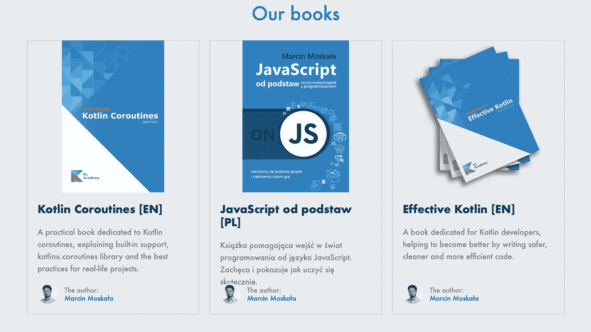

# Kt 的 2 篇文章和礼物推荐。学院🔥

> 原文：<https://blog.kotlin-academy.com/2-articles-gift-recommendation-from-kt-academy-b05923a843a4?source=collection_archive---------3----------------------->

你好！
Kt。这里是学院**👋**

今天的简讯不会很长，因为我们现在主要关注 Kotlin 的问世🔥顺便告诉我们目前进展如何？
你喜欢吗？也可能是太容易了？😏

Kotlin 降临节的下一部分即将到来，现在让我们转移到今天的内容！

👉理解如何在 Android 上编写单元测试变得前所未有的简单——第 1 部分
👉[像专业人士一样写移动 SDK](/write-mobile-sdk-like-a-pro-43b14989508c)

🎁[送给科特林爱人的最佳圣诞礼物](https://kt.academy/book)

*️⃣:我们很想听听你对这份时事通讯的想法和建议。请回复此邮件与我们分享📩

尽情享受吧！⏬

在本文中，begüm yaz UC 将尝试解释什么是单元测试，我们为什么要编写单元测试，以及如何编写单元测试。

**理解如何在 Android 上编写单元测试从未如此简单——第 1 部分**👇

[It has never been easier to understand how to write Unit Tests on Android — Part 1](/it-has-never-been-easier-to-understand-how-to-write-unit-tests-on-android-part-1-5ed1e5d8112b)

开发移动 SDK 的技巧和指南。

**像专业人士一样编写移动 SDK**由 **Asi 达汗**👇

[Write Mobile SDK Like a Pro](/write-mobile-sdk-like-a-pro-43b14989508c)

不知道买什么圣诞礼物？🎄

想给你的 Kotlin 爱人一些有用的东西，而不是另一个会在抽屉里落满灰尘的小饰品吗？

如果是这样，我们有两个提议给你:

**🎁** [有效的科特林—最佳实践](https://kt.academy/book/effectivekotlin)
**🎁** [科特林 coroutes——深潜](https://kt.academy/book/coroutines)

都是马尔钦·莫斯卡拉写的。

你可以在这里找到更多细节[👇](https://kt.academy/book)

今天就到这里吧！

谢谢，再见！

卡帕头。学院团队

www: [kt.academy](https://kt.academy/)
博客:[blog.kotlin-academy.com](http://blog.kotlin-academy.com/)
推特 EN:[@ ktdotsacademy](https://twitter.com/ktdotacademy)
推特 PL:[@ ktdotsacademypl](https://twitter.com/ktdotacademyPL)
FB:[@ ktdotsacademy](https://www.facebook.com/KtDotAcademy)
LinkedIn:[@ Kt。学院](https://www.linkedin.com/company/kt-academy/)

