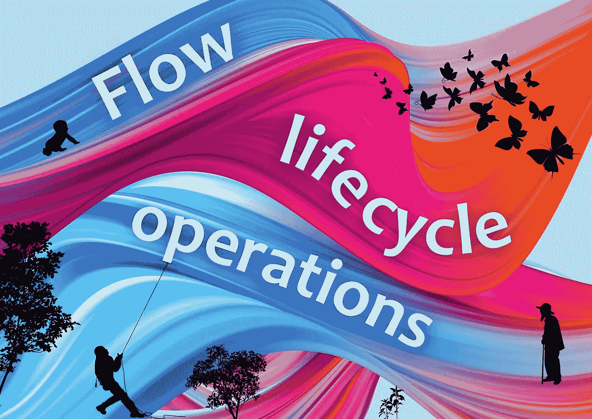
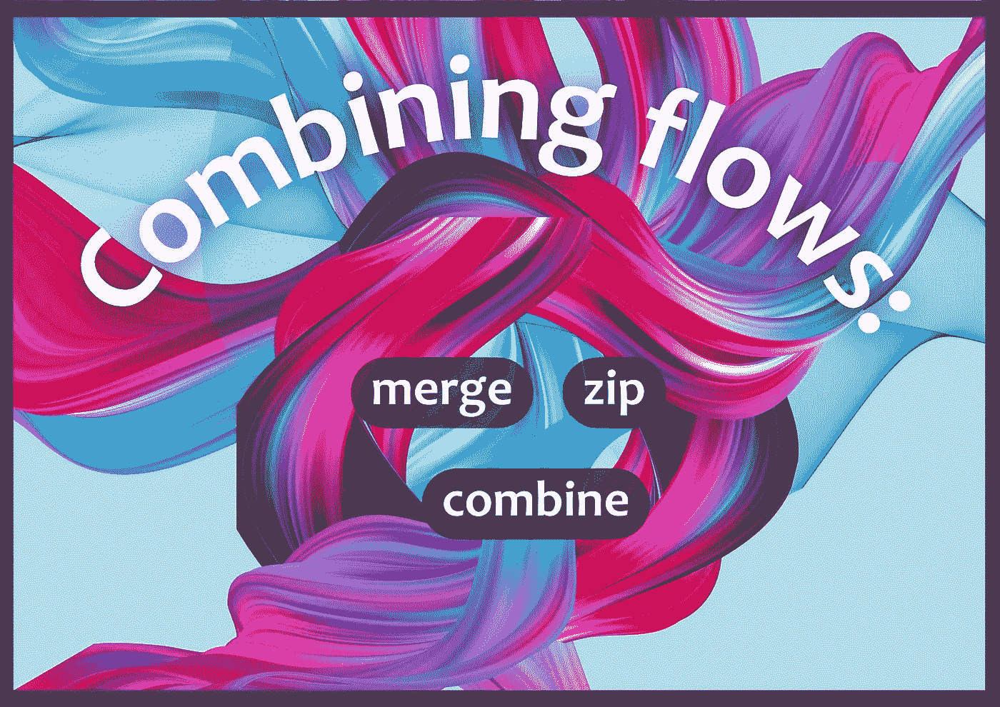
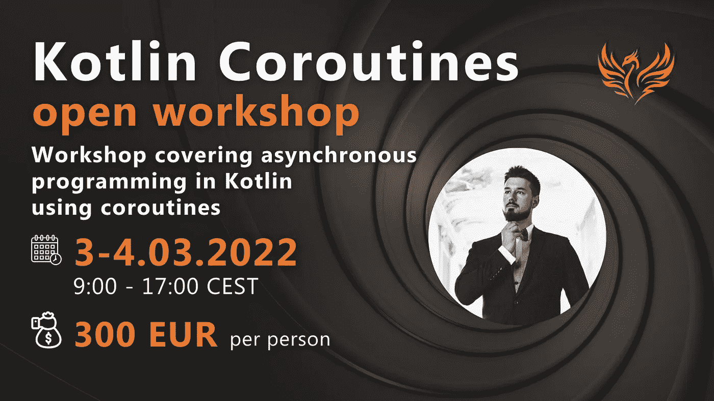

# 2 Kotlin 协同程序流文章& Android 文章&协同程序开放研讨会🏆

> 原文：<https://blog.kotlin-academy.com/2-kotlin-coroutines-flow-articles-android-article-coroutines-open-workshop-c76a4abe1799?source=collection_archive---------0----------------------->

嗨，代码爱好者们🤗

新的一个月意味着新的能量和新的想法。我们带着好消息进入了二月！我们目前正在制作新的工作坊:
**🤖机器学习，神经网络，还有 AI 🧠**
是不是很刺激？**😀**
更多详情，敬请关注📣

前途听起来很有希望！🤩
下面是今天新闻简报内容的简要列表:

**kot Lin Coroutines——流量文章**作者**Marcin moska a**:
👉[流程生命周期操作](https://kt.academy/article/cc-flow-lifecycle)
👉[合并流程:合并、压缩、合并](https://kt.academy/article/cc-flow-combine)

你可以在我们的[网站](https://kt.academy/article)上找到更多的文章。📃

**Android 文章**作者**Mustafa yiòit:**👉打招呼👋与 XML 进行组合和比较

你可以在我们的[媒体](https://blog.kotlin-academy.com/)上找到更多穆斯塔法和其他作者的文章📝

准备好了吗？🏃‍♂️🏃‍♀️

让我们了解生命周期操作、控制上下文以及处理流程中的异常。👇

**流程生命周期操作**

[Flow lifecycle operations](https://kt.academy/article/cc-flow-lifecycle)
🔻 This is a chapter from the [Kotlin Coroutines](https://kt.academy/book/coroutines) book. You can find Early Access on [LeanPub](https://leanpub.com/coroutines/).

让我们学习如何通过 merge、zip 和 combine 将两个流转换成一个流。

👉**合并流:合并、压缩和合并**

[Combining flows: merge, zip, and combine](https://kt.academy/article/cc-flow-combine)
🔻 This is a chapter from the [Kotlin Coroutines](https://kt.academy/book/coroutines) book. You can find Early Access on [LeanPub](https://leanpub.com/coroutines/).

**Mustafa yi it**将尝试解释 Jetpack Compose 的内容，以及 Compose 和基于 XML 的设计之间的区别。让我们深入研究一下没有 XML 的 Android 中的 UI 开发。👇

**问好👋与 XML 进行组合和比较**

[Say Hello 👋 to Jetpack Compose and Compare with XML](/say-hello-to-jetpack-compose-and-compare-with-xml-6bc6053aec13)

还有一个月**由**Marcin moska a 主持的 Kotlin Coroutines 公开研讨会**🤩**

📅:2022 年 3 月 3 日至 4 月 4 日
⏲:欧洲中部时间 9:00–17:00(GMT+1)
💰:300 欧元 pp
🔤:EN

查看详细信息并在此注册👇

[科特林协同程序(kt.academy)](https://kt.academy/workshop/coroutines)

📘📙📘📙📘📙📘📙📘📙📘📙📘📙📘📙📘📙📘📙📘📙📘📙📘📙📘📙

这就是我们今天的全部内容，谢谢🙂

如果你有什么想告诉我们的，请回复这封邮件让我们知道！💌

敬请期待！👌
Kt。学院团队

www: [kt.academy](https://kt.academy/)
博客:[blog.kotlin-academy.com](http://blog.kotlin-academy.com/)
Twitter EN:[@ ktdotsacademy](https://twitter.com/ktdotacademy)
Twitter PL:[@ ktdotsacademypl](https://twitter.com/ktdotacademyPL)
FB:[@ ktdotsacademy](https://www.facebook.com/KtDotAcademy)
LinkedIn:[@ Kt。学院](https://www.linkedin.com/company/kt-academy/)

