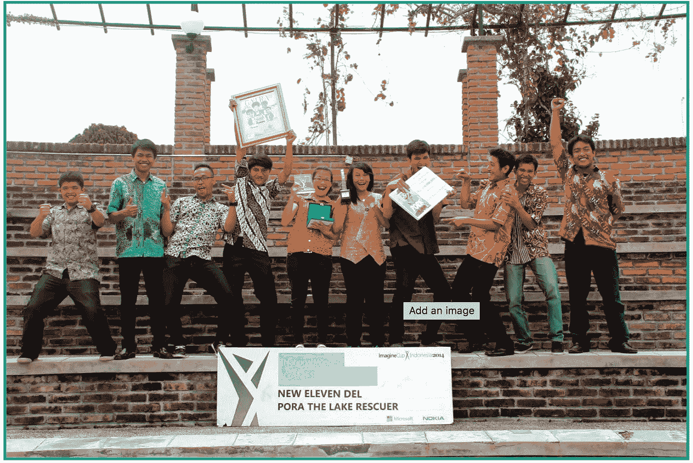

# 2 Years Building Team Startup

> 原文：<https://medium.easyread.co/2-years-building-team-startup-8afd2e8ab68?source=collection_archive---------2----------------------->

Kemarin ada teman-teman dari [Sumut Tekno](https://www.facebook.com/groups/sumuttekno/) meminta sharing tentang pengalaman membentuk tim selama di [NED Studio](http://nedstudio.net/) . Nah sesuai permintaan, aku bakalan sharing tentang membangun tim selama pengalaman.

## **Introduction**

[NED Studio](http://nedstudio.net/) adalah startup game yang dibentuk oleh 10 orang yang telah berjalan selama 2 tahun sampai ini dituliskan. Tim yang dibentuk oleh mahasiswa yang baru tamat yang hanya tahu cara coding. Apakah perjalanan tim ini lancar-lancar saja sehingga saya tuliskan artikel ini? Jawabannya tidak. Sedikit ironis, tetapi ada baiknya agar pengalaman kami jadi pembelajaran buat teman. Kalau tidak bisa, mungkin ada yang salah dari cerita saya 😃

NED Studio Team

## Big Team is not a good idea for starting

Bicara tentang kuantitas tim, mungkin ada yang berpikir bahwa dengan semakin banyaknya anggota tim pekerjaan akan lebih cepat dan mudah. Mungkin itu benar tetapi tidak sepenuhnya benar. Ada beberapa konteks yang harus dipahami untuk menentukan jumlah tim. Pengalaman 2 tahun dengan 10 anggota team membuat kita menyadari 10 orang bukanlah kuantitas yang ideal untuk sebuah tim. Berapa alasannya adalah :

1.  **Financial** , keuangan tim adalah hal yang cukup berat untuk diamankan, yang akhirnya membuat startup fokus pada bertahan hidup daripada memberikan value yang lebih sebagai sebuah startup. Contoh : Jika saja team berjumlah 10 orang, dan harus bergaji Rp. 1.5 juta (aku rasa ini angka yang menyedihkan) yang hanya untuk makan, maka startup butuh biaya Rp 15 juta per bulan dan 180 juta per tahun hanya untuk memberi makan anggota tim, belum termasuk biaya operasional seperti listrik untuk 10 orang dan fasilitas seperti kursi untuk 10 orang 😂.
2.  **Fokus** , kondisi financial mau tak mau berdampak pada fokus startup. Tidak ingin anggota tim tersiksa, maka teman-teman dan startup teman-teman akan terfokus pada pencarian keuntungan netto minimal 180 jt per tahun yang kenyataannya tidak mudah. Dan selama mengumpulkan 180 juta tersebut, teman-teman mungkin akan menghabiskan 1 tahun dan tidak melakukan apa-apa untuk meningkatkan value dari startup teman-teman. Dan mungkin saja, itu akan berulang ke tahun selanjutnya yang saya sebut “lingkaran bertahan hidup” (ini saya buat-buat sendiri ya, kalau di-search di goolge pasti ga ada ☺)
3.  **Waktu** , setiap orang saya yakin memiliki batas waktu baik secara pribadi tentang rencana kedepannya atau pun mental pribadi dan orang tua dalam melakukan uji coba bisnisnya (startup). Permasalahan mengumpulkan dana untuk bertahan hidup yang berulang-ulang dapat mengakibatkan anggota tim sampai pada batas waktunya. Dan di saat itu, mau tak mau, perlahan anggota tim akan berkurang.
4.  **Komunikasi** , mungkin komunikasi terlihat sederhana, tetapi kenyataannya ini adalah masalah besar. Sepuluh orang anggota tim memiliki perspektif masing-masing, baik tentang tujuan startup tersebut atau pun cara hidup dan kehidupan pribadi dalam kehidupan sehari-hari. Mungkin kita akan katakan masalah itu dapat diselesaikan dengan keterbukaan dan diskusi. Ironis-nya semakin sulit untuk saling terbuka dan berdiskusi jika semakin banyak kepala karena semakin banyak perspektif. Hal ini dapat mengakibatkan terbentuk kelompok-kelompok sepaham untuk melawan yang tidak sepaham. Nah ketika hal itu terjadi, apakah kita masih layak menyebutnya sebuah tim?
5.  **Visi dan Misi** , sebuah tim yang sangat baru mungkin tidak akan mengenal visi dan misi atau memandang visi dan misi hanya sebuah formalitas. Tapi kenyataannya, kegagalan berkomunikasi membuat anggota tim memiliki visi dan misi yang berbeda karena mereka belajar ke arah yang berbeda dan tidak mengkomunikasikannya. Akhirnya, pandangan masing-masing berbeda, ada yang fokus pada pencarian uang untuk bertahan hidup, ada yang memandang bertahan hidup adalah kegagalan, ada yang memandang telah gagal, ada yang tidak perduli, ada yang hanya mengikuti pendapat yang lain dan lain-lain. Jika V ***isi dan Misi adalah tentang apa yang dituju dan bagaimana sampai ke tujuan*** , maka visi dan misi menjadi tolok ukur untuk mengevaluasi tim tersebut. Dan apa yang akan terjadi jika anggota tim memiliki tolok ukur yang berbeda?.

## Build team which is needed, not possibility needed

Jika jumlah anggota tim adalah sebuah masalah, maka teman-teman harus perhatikan tentang anggota yang teman-teman butuhkan. Terinspirasi dari “ *Lean Startup”* dengan moto “ *Just In Time* ” maka teman-teman sebaiknya hanya bentuk tim yang “Dibutuhkan Sekarang”, tidak yang “Mungkin Dibutuhkan Kedepan”. Mengapa? Ingat konteks yang saya katakan sebelumnya bahwa teman-teman adalah pemula maka , “Anda mungkin berpikir anda tahu, tapi kenyataannya anda pemula yang tidak tahu dan kehidupan startup dinamis”, jadi jangan bebani di awal-awal dengan masalah yang tidak anda hadapi saat ini. Sebagai contoh : Yang teman-teman butuhkan adalah Application Designer dan Programmer karena saat ini dalam tahap development, tetapi teman-teman sudah menambah anggota seorang marketing. Ya, teman-teman benar **hanya jika** semua berjalan sesuai rencana. Nah, bagaimana jika aplikasi gagal dalam development, sehingga aplikasi tidak selesai. Apa guna anggota marketing? Dan tidak semudah membalikkan tangan untuk melepas anggota tim. Oleh karena itu saya sebut Just In Time.

## No perfect team at first, but you can build it

Ketika teman-teman mulai membentuk tim, teman-teman harus sadari bahwa tidak ada tim yang sempurna pada awalnya. Seperti kumpulan pemain bola terbaik dunia jika disatukan menjadi 1 tim tidak akan langsung bermain sempurna, karena mereka butuh waktu untuk mengenal cara bermain masing-masing dan membentuk pola bermain sebagai sebuah tim. Maka hal itu juga terjadi pada startup yang baru dibentuk. Setiap orang tidak akan langsung menguasai bidang atau posisinya bahkan menemukan posisi yang tepat, tetapi mereka harus mampu **BELAJAR** untuk menguasai bidang dan posisinya untuk disebut sebagai tim dan **BELAJAR** bekerja sebagai tim. Ingat, bekerja sebagai tim berbeda dengan bekerja secara pribadi. Jika tim tidak mampu bekerja sebagai sebuah tim, maka semua anggota tim yang gagal.

## Treat team as a team

Nah, “Treat Team As A Team” terlihat sederhana, dan dipandang tidak masalah atau sering dilupakan, tetapi kenyataannya ini adalah masalah yang paling berat. Banyak tim yang saya temukan gagal memperlakukan tim sebagai seorang tim. Hal ini terlihat dari anggota tim yang mulai saling mengejek, menyalahkan bahkan dendam dan lain-lain yang membuat anggota bukan mencari solusi bagi tim tersebut malah merusak apa yang mereka bangun. Untuk mencegah hal tersebut, perlakukanlah tim sebagai sebuah tim. Ketika anggota tim saling menyalahkan atau menyudutkan atau tidak mengkomunikasikan masalah, apakah itu masih layak disebut tim? Lebih baik bubar. Dan beberapa yang menurut saya penting adalah pandanglah seluruhnya sebagai tim. Sebagai contoh : Jika ada orang “bodoh” (dalam tanda kutip ya) dalam tim, dan jika teman-teman mengevaluasi sebagai pribadi-pribadi maka teman-teman akan selalu menyalahkan orang yang bodoh, namun jika teman-teman mengevaluasi sebagai sebuah tim, maka teman-teman juga layak menyalahkan orang pintar dalam tim tersebut. Hal itu terjadi karena pertanyaan yang menjadi fokus kita adalah “Dimana orang pintar dalam tim ini sehingga tim ini memiliki orang bodoh? Bukankah tugas anggota tim untuk mengisi kekurangan anggota lain?”. Itulah salah satu contoh memperlakukan tim sebagai sebuah tim. Saya rasa teman-teman mengerti maksud saya dan dapat mengembangkan ke contoh lain.

## Closing

Mungkin beberapa teman-teman tidak setuju terhadap hal-hal ini. Tetapi, konteks yang mau saya katakan adalah teman-teman baru memulai dan tidak tahu apa-apa. Jika teman-teman telah berpengalaman, berarti artikel ini tidak cocok. Sebagai penutup , ada sebuah kutipan yang menagatakan:

> Jangan terlalu fokus pada apa yang tim anda dapat lakukan saat ini, tetapi apa yang tim anda dapat pelajari dalam prosesnya.