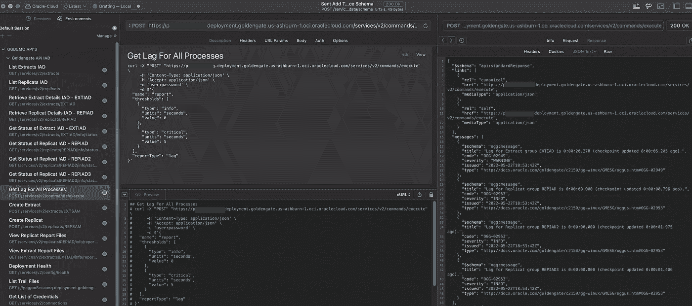

# 管理 Oracle Goldengate 21c 部署的 20 个最有用的 API

> 原文：<https://medium.com/oracledevs/20-most-useful-apis-for-managing-your-oracle-goldengate-21c-deployment-b0992817de7?source=collection_archive---------0----------------------->

Oracle Goldengate 21c 微服务架构支持使用 REST APIs 运行几乎所有的 Goldengate 操作。以下是精选 API 列表，这些 API 可以让您轻松使用 Oracle Goldengate 微服务进行日常工作。

Goldengate Microservices 21c APIs

## 1.创建摘录

## 2.开始提取

## 3.停止提取

## 4.创建副本

## 5.开始复制

## 6.停止复制

## 7.所有摘录的列表

## 8.所有副本的列表

## 9.获取提取的状态

## 10.检索摘录的详细信息

## 11.获取副本的状态

## 12.检索副本的详细信息

## 13.获取所有进程的延迟

## 14.清除超过 7 小时的跟踪文件

## 15.列出轨迹

## 16.查看部署运行状况

## 17.查看提取报告文件

## 18.查看副本报告文件

## 19.获取凭据列表

## 20.将事务数据添加到源模式

# 一些额外有用的 API

## 获取提取流程的延迟

## 获取复制过程的延迟

## 查看提取的丢弃文件

## 查看副本的丢弃文件

## 复制过程中的关键事件

## 创建凭据存储别名

## 服务运行状况摘要

# 参考

**金门休息 API**s—[https://docs . Oracle . com/en/middleware/Golden Gate/core/21.3/oggra/](https://docs.oracle.com/en/middleware/goldengate/core/21.3/oggra/)