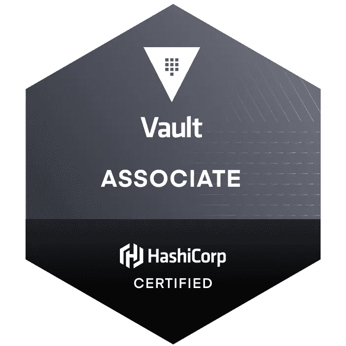

# HashiCorp Vault Associate 认证的 200 道练习题

> 原文：<https://medium.com/bb-tutorials-and-thoughts/200-practice-questions-for-hashicorp-vault-associate-certification-ebd7f7d27bc0?source=collection_archive---------0----------------------->

## 考试前阅读并练习这些问题

**Vault Associate**

Vault Associate 认证面向专门从事安全、开发或运营的云工程师，他们了解与开源 HashiCorp Vault 相关的基本概念、技能和用例。如果考生具备以下条件，他们将为本次考试做好最充分的准备