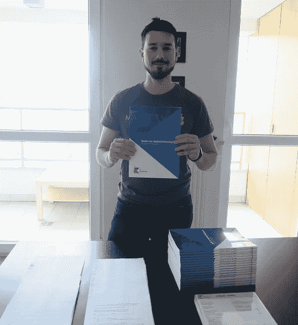

# 2018 年总结

> 原文：<https://blog.kotlin-academy.com/2018-summary-72f17bb3f0f8?source=collection_archive---------4----------------------->

Kotliners，

我们要感谢大家和我们在一起。2018 年对于
Kt 来说是很棒的一年。学院！我们转变为一家在全球范围内举办[研讨会](http://kt.academy)的知名公司。我们在媒体上的[出版物发展到拥有 5000 多名追随者，每月超过 40 000 次浏览。这对我们很重要，因为我们的任务是教科特林。为了与更多的人分享知识，我们今年也一直在编写有效的科特林书。我们准备在 2019 年出版。让我们对这一年做一个小小的回顾。](http://blog.kotlin-academy.com)

今年年初，我们还在发布 [Kotlin 程序员词典](https://blog.kotlin-academy.com/kotlin-programmer-dictionary/home)和关于[多平台开发](https://medium.com/kotlin-academy/multiplatform/home)的文章。我们有一个很棒的系列，[嘲讽不是火箭科学](https://blog.kotlin-academy.com/mocking/home)，作者是 Oleksiy Pylypenko，他是 MockK 的创造者。我们写了一系列关于 Kotlin 这个角色的文章，并且我们发表了一篇很受欢迎的文章，由 Jean-Michel Fayard 写的。他后来发表了《科特林如何让编辑你的 Gradle build 不那么令人沮丧》。我们也开始在 Kt 上分享字谜游戏。学院。

三月份，我们开始出版有效的 Kotlin 系列，每篇文章都非常受欢迎。我们非常乐意进行讨论和评论。我们发表了大卫·布兰克的两篇文章:T21 关于伴星的一些事实，以及后来的λ混淆。

4 月份，我们联系了另一位伟大的作家艾伦·凯恩，他写了《没有空值的生活》、[科特林的《一无所有:它在仿制药中的用处》、](/kotlins-nothing-its-usefulness-in-generics-5076a6a457f7)[和《遗传的危险》](/the-perils-of-inheritance-698b777fa773)。同月，Kotlin 的 Android 开发合著者 Igor Wojda 发表了 [Kotlin:我应该定义函数还是属性？](/kotlin-should-i-define-function-or-property-6786951da909)。我们还有一篇 Jarosł aw Michalik 的文章:【Spek 的参数化测试。就在 4 月份，我们发表了 11 篇文章！

五月最显著的成功是科特林小抄。许多开发者下载了它，我们听到的声音是它在世界范围内被使用。这也有助于[我们研讨会的参与者](http://kt.academy/)。我们还有两篇关于泛型的文章:[了解 Kotlin 对类型参数位置的限制](/understanding-kotlin-limitations-for-type-parameter-positions-15527b916034)和[来自高级 Kotlin 研讨会的泛型练习](/generics-exercise-from-advanced-kotlin-workshop-8c53dc292135)。然后，我们接触了一个有趣的主题:继承、组合、委托和特征，以及你在科特林的第一个 Selenium 数据收集器中的数据废弃。

我们开始做播客了！第一次是与[Andrey Breslav——kot Lin 编程语言](/mm-podcast-with-andrey-breslav-lead-language-designer-of-kotlin-programming-language-b5839290375c)的首席语言设计师，另一次是与[Hadi ha riri——Developer advocation @ JetBrains](/mm-podcast-with-hadi-hariri-vp-of-developer-advocacy-jetbrains-speaker-and-kotlin-evangelist-5ff0f30a11cb)的副总裁。播客做得很好。现在我们已经录制了另一个播客，我们将在下周发布。

我们宣布，我们正在寻找有效的科特林审查人员，我们有超过 300 人提交。然后我们决定对这本书做一些根本性的修改，所以我们还没有开始这个早期访问计划。虽然最后，我们正准备开始这个项目。

Kt 的创始人。奥斯卡奖得主马尔钦·莫斯卡[在科特林康夫](https://www.youtube.com/watch?v=UyTBXEZ983g)上发表了演讲。他还帮助了 [KotlinConf 申请](https://github.com/JetBrains/kotlinconf-app)。他关于科特林的推文受到了热烈欢迎，所以我们也在 medium 上发表了它们:[棒极了和疯狂的科特林例子](/awesome-and-crazy-kotlin-examples-a225dbb004a6)和[科特林在 Twitter 上的乐趣和教育](/kotlin-fun-and-education-on-twitter-5ad5ded8f067)。

我们把名字从科特林学院改成了卡帕头。我们在 [www.kt.academy](http://www.kt.academy) 域名上建立了[我们的网站](http://kt.academy/)。我们为工作室制作了令人惊叹的材料。

Materials for our Android workshop. Marcin Moskała on the photo.

随着 Kotlin 的出现，我们结束了这一年，开发者们接受了在一周内解决困难的 Kotlin 编程问题的挑战。特别祝贺解决了所有挑战的参与者！

我们对这一年的发展非常满意。我们变成了最大的科特林教育家之一。对研讨会的持续需求使我们能够与许多开发人员分享我们的知识和经验，并完善我们的教学技能和研讨会材料。

相信 2019 年对 Kt 来说会更好。学院，因为我们努力分享知识，我们有很多新活动的想法。除了研讨会、关于媒体的文章和会议上的演讲，我们还在为科特林社区策划活动——二月份我们将在华沙组织科特林之夜。到目前为止，我们主要为公司举办研讨会，但你们中的许多人问及一个人的研讨会，所以在 2019 年，我们希望组织一个每个人都可以参加的在线研讨会。其他想法？即将推出！要了解我们在 2019 年的最新活动[请点击 Twitter](https://twitter.com/ktdotacademy) 或[加入我们的简讯](http://eepurl.com/diMmGv)。

谢谢你和我们在一起，支持我们。你让这一切成为可能。

祝来年万事如意，

Marcin Moska 和 Kt。学院团队