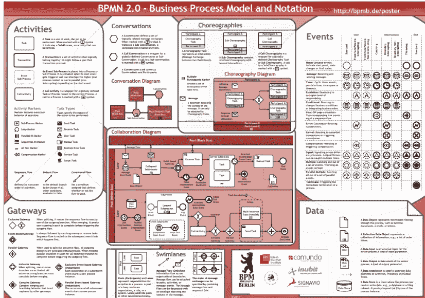

# 2022 开源 BPM 对比

> 原文：<https://medium.com/capital-one-tech/2022-open-source-bpm-comparison-33b7b53e9c98?source=collection_archive---------0----------------------->

## 开源 BPM 产品的比较和对比

早在 2016 年，我就写过一篇[文章](/capital-one-tech/comparing-and-contrasting-open-source-bpm-projects-196833f23391)对比了一些最流行的开源业务流程管理(BPM)产品。我最近就这个话题做了一些研究，很快意识到变化太大了！在真正的开源时尚中，我最近在[开源峰会](https://ossna2022.sched.com/event/11No6/open-source-bpm-comparison-andrew-bonham-capital-one)上提出了这个主题，并希望在本文中分享我的发现。我希望你喜欢！

总的来说，开源在世界范围内的采用继续加速。截至 2022 年 6 月，公共 [Github](https://en.wikipedia.org/wiki/GitHub#:~:text=As%20of%20June%202022%2C%20GitHub,least%2028%20million%20public%20repositories).) 拥有 2 亿个知识库，8300 万开发者，比 2016 年增长了 400%以上。对于开源 BPM 项目，项目增长趋势持续，例如 2017 年 Activiti 的[flow](https://www.flowable.com/)分叉。这一领域的变化持续不断。

本文将概述工作流、BPM 以及 BPM 产品支持的一些行业标准符号。接下来，本文将讨论 BPM 替代方案，以及何时应该使用其中一种，并考虑可伸缩性。最后，深入探讨四个开源 BPM 项目:jBPM、Camunda、Activiti 和 Flowable。这篇文章将比较这四个维度中的每一个与这三个维度:

*   开源模式(即社区对企业)
*   能力集
*   社区活动

# 背景和背景

## 什么是工作流？

工作流通常是一个过载的术语。根据上下文，它至少有三种不同的含义。在基本层面上，工作流是业务流程的离散步骤的结构化流程。工作流的一种形式是人工工作流。例如，一个人正在调查一个案例，或者将一个应用程序发送给另一个组进行审查。工作流的第二种形式是系统编排。可能有一组 API 需要以特定的顺序调用，以完成只涉及系统步骤的业务流程。第三种类型的工作流包括人工和系统编排的混合。通常，系统编排可能会遇到一个错误场景，或者可能需要对某些内容进行审查，以便进一步研究。从这三个例子中，您可以看到理解工作流的上下文是多么重要，因为它可能有不同的含义。

工作流的特征也可以有不同的复杂程度。工作流分为两类:简单和复杂。以下是它们各自的一些特征:

> **简单的工作流程**

*   *任务管理—* 考虑用户的待办事项列表
*   *通知—* 通过电子邮件或短信提醒用户
*   *状态管理—* 项目的状态，例如未开始、进行中或完成
*   单个组中的用户数量少—没有跨团队或部门协调

> **复杂的工作流程**
> 
> (包括所有简单特征以及以下内容)

*   *多个组/用户—* 跨越多个部门或分部
*   *多级工作流—* 各种分支和路径
*   *异常路径、回调* —错误处理和根据条件返回到先前的步骤
*   *案件管理* —不可预测的临时性调查类活动；可能会根据情况使用一个或多个工作流
*   *与规则的集成* — if/then 为业务或策略决策键入逻辑
*   *与系统编排的集成* —人工工作流和系统工作流的结合

理解一个用例的工作流特征是很重要的，因为这将引导你找到合适的解决方案。那么有哪些可能的工作流解决方案呢？什么是 BPM 产品，它解决什么问题？让我们深入研究一下。

## 什么是 BPM 产品？

BPM 产品的核心是为管理业务流程的模型提供可视化建模和执行。它们通常提供与各种适配器的额外集成能力。类似的名称有业务流程管理系统(BPMS)或智能业务流程管理系统(iBPMS)。其他类别的产品可能只提供建模，但是 BPM/BPMS/iBPMS 产品同时提供建模和执行。开源领域可能会令人困惑，因为有 20 多种产品提供不同级别的功能

examples of some open source BPM products available today

## 行业标准符号

开源 BPM 产品支持的一个常见主题是由对象建模组(OMG)实现的一些行业标准符号。有三种行业标准符号:BPMN、CMMN 和 DMN。让我们更详细地看一下每一个。

> BPMN——业务流程建模符号

BPMN 于 2004 年首次发布，为业务流程建模提供了行业标准。这一点非常重要，因为它使得 BPMN 可视化模型具有可移植性，这意味着在一个应用程序中构建的 BPMN 图可以在另一个应用程序中使用(只要工具没有覆盖任何专有项)。它还鼓励商业和技术合作。通常，您可以让熟悉 BPMN 的业务分析师创建一个业务流程，然后将它交给他们的技术合作伙伴，在 BPM 产品中实现。下面是详细规范中一些关键图标的高级视图:

BPMN spec from [http://www.bpmb.de/images/BPMN2_0_Poster_EN.pdf](http://www.bpmb.de/images/BPMN2_0_Poster_EN.pdf)

> DMN —决策建模符号

通常在业务流程中，您需要 if/then 逻辑来做出业务决策。这就是 DMN 派上用场的地方。它于 2015 年首次发布，为业务规则和决策提供了与 BPMN 兼容的行业标准符号。

DMN example from [https://www.omg.org/spec/DMN/1.4/Beta1/PDF](https://www.omg.org/spec/DMN/1.4/Beta1/PDF)

> CMMN——案例管理建模符号

第三种行业标准建模符号是 CMMN，它于 2014 年首次发布。案例管理通常不同于标准工作流，因为它本质上是临时的和调查性的，并且不可预测。

下面的视图总结了三种不同的行业标准符号。通常，开源 BPM 产品会支持这些产品的一些组合——或者是全部三种，或者是 BPMN 和 DMN。在本文的后面，我们将更多地讨论 CMMN 以及 Camunda 在其中的一些发现。

Summary of the three different industry standard notations [https://www.omg.org/intro/TripleCrown.pdf](https://www.omg.org/intro/TripleCrown.pdf)

既然我们已经很好地掌握了 BPM 产品提供的不同类型的行业标准符号，那么让我们来讨论一下替代符号。

## 何时使用 BPM 产品？

虽然 BPM 产品非常擅长以可视化的方式解决多个工作流问题，但您可能并不总是需要如此丰富的功能。在某些情况下，基于配置的轻量级解决方案可能更合适。下面是状态机的几个例子:

*   [AWS 步骤功能(Workflow Studio](https://aws.amazon.com/step-functions/) )。提供了一种在 AWS 中编排 lambda 函数的方法。还提供了一个可视化建模器(不支持 BPMN)
*   [x 状态](https://xstate.js.org/)。基于 JSON 的状态机，可用于实现工作流
*   [指挥(网飞)](https://conductor.netflix.com/#:~:text=Conductor%20is%20a%20platform%20created,deploy%2C%20modify%20and%20contribute%20back.)可用于面向微服务的系统编排

所以现在你可能想知道，我应该什么时候使用 BPM 产品？一般的经验法则是，当工作流在模型中比在代码或配置中更容易可视化地构建时，使用 BPM 产品。一个用例通常落在两个维度上:业务流程的集成程度和复杂性。需要高度集成和/或高度复杂的业务流程通常是 BPM 产品的最佳选择。下面是一个矩阵，它使用了我们之前讨论过的简单和复杂的工作流特征，并将它们与集成和业务流程复杂性维度联系起来。

确保针对您的用例使用正确的解决方案非常重要。如果集成和/或业务流程的复杂性很低，BPM 产品可能是多余的。

## 整体、微服务和可扩展性考虑

使用 BPM 产品时需要注意的一点是，要确保你不是在其中构建一个整体应用程序。做到这一点很容易，因为产品通常提供了许多制作应用程序所需的工具。此外，一些 BPM 产品本身是整体部署。我们稍后会谈到这一点，因为许多开源 BPM 产品正在转向一种更加基于云原生微服务的部署模型。一个关键的考虑是要有意识地了解你在 BPM 产品内部构建了什么，在产品外部保留了什么。我通常建议您只将 BPM 产品用于其擅长的领域——工作流。将其他所有东西都放在产品之外，并使用各种适配器来构建与工作流的集成。

http://martinfowler.com/aricles/microservices.html

当使用 BPM 产品时，要努力实现的一个关键目标是构建微服务。一种方法是将一个流程分解成子流程，并将每个子流程部署为自己的微服务，以使其更具可扩展性。

[http://martinfowler.com/aricles/microservices.html](http://martinfowler.com/aricles/microservices.html)

另一个可伸缩性考虑是评估 BPM 引擎的部署方法。通常有两种方法:进程内/嵌入式模式，或独立模式。这些方法各有利弊。

> 进程内/嵌入式模式

在进程内/嵌入式模式下，BPM 引擎作为应用程序的一部分在同一个 JVM 下运行。这种方法提供了高性能，因为在应用程序和 BPM 引擎之间没有任何网络调用。但是，它在两者之间创建了紧密的耦合。这也会使扩展变得更加困难，因为要扩展 BPM 引擎，您还需要扩展应用程序。

> 独立模式

在独立模式下，BPM 引擎被部署为自己的独立服务，应用程序通过 API 调用与之集成。这将 BPM 引擎从应用程序中分离出来，并允许各自独立扩展。一个缺点是，由于应用程序和 BPM 引擎之间的网络 API 调用，它可能会提供较低的性能。

# 开源 BPM 比较

现在我们已经介绍了很多背景和上下文，让我们开始仔细看看一些开源 BPM 产品。首先，让我们看看开源 BPM 的一些历史里程碑，特别关注那些基于 jBPM 重写(即 Activiti)或 jBPM 派生(即 Camunda，flow)的里程碑

significant milestones of open source BPM

jBPM 于 2003 年发布，是第一个上市的开源 BPM 产品。在 2010 年 Activiti 发布之前的大约七年时间里，它是唯一的开源 BPM 产品。三年后的 2013 年，卡蒙达脱离了 Activiti。然后在 2017 年，通过从 Activiti 中分叉出来，诞生了 Flowable。当这些产品分支时，架构的一些部分被重用，而其他部分被完全重写。

从行业标准符号的角度来看，BPMN 的第一个版本发布于 2004 年，7 年后的 2011 年发布了 2.0 版本。CMMN 于 2014 年发布，一年后，DMN 于 2015 年发布。

在《DMN》出版后的几年里，我们看到许多开源产品构建了对 DMN 和 CMMN 的支持。有趣的是，经过五年的社区反馈，Camunda 决定移除对 CMMN 的支持，因为社区反馈认为它太复杂了。用户发现在 BPMN 比 CMMN 更容易建立案例流。

2020 年，jBPM 启动了一个名为 [Kogito](https://kogito.kie.org/) 的新项目，这是对 [Drools](https://drools.org/) 和 [jBPM](https://jbpm.org/) 架构的重构，以实现云原生和基于微服务。2022 年，Camunda 发布了其产品的 v8，该产品具有高度可扩展性，并专注于流程编排。

## 对开源 BPM 的总体兴趣

这四个 BPM 产品中哪一个最受欢迎？我生成了一个谷歌趋势图，以了解哪些是谷歌搜索中使用最多的。请注意，这不是到实际用户安装的映射。此外，我还必须过滤掉 Activiti 和 Flowable 的一些搜索词，以确保酸奶和混凝土等词不会混在一起。

Google trends graph

结果很有趣。从 2004 年到 2010 年左右，jBPM 是最热门的搜索查询之一，然后对 Activiti 的兴趣飙升，然后在 2016 年超过 jBPM。2016 年晚些时候，Camunda 成为最热门的搜索查询，此后人们对它的兴趣最大，而 Activiti 和 Flowable 几乎持平，jBPM 的搜索查询最少。

现在，让我们深入了解每种产品的细节，仔细看看我们之前提到的三个方面:

*   开源模式(即社区对企业)
*   能力集
*   社区活动

## 开源模式(即社区对企业)

这是需要理解的最重要的方面之一，因为每个开源 BPM 产品都有不同的开源模型。这经常令人困惑，但是您需要清楚社区和企业中有什么可用，这样您就可以确保解决方案解决了问题。

jBPM 有最简单和最开放的模型。社区版的东西都在企业版。企业版基于最新社区版的几个分支，以确保它是一个稳定的版本(对比实验性特性)。企业版的增量是来自 Red Hat 的支持。

Camunda 有一个稍微不同的模型，其中他们的引擎(即 Zeebe)是源代码可用的，他们的建模器是开源的，而他们提供操作功能的其他模块不是开源的，但可以在 QA 中免费使用。“可用源代码”与“开放源代码”的区别非常接近，不同之处在于，您不能用它来托管提供给其他人的商业解决方案(例如，想想 SaaS 提供商)

Activiti 有一个不同于 jBPM 和 Camunda 的开源模型。他们提供了所有功能的基本部分，但是要获得更高级的功能，您必须购买企业版。Flowable 也遵循与 Activiti 类似的开源模型。

## 能力集

现在，我们来看一下四种产品的高级功能集，重点关注以下几个方面:

*   规则引擎
*   建模和执行环境
*   部署模式
*   仪表板
*   案例管理
*   云本机/无服务器/容器
*   云托管服务产品

1.  规则引擎

jBPM 是唯一提供内置业务规则管理系统的开源 BPM 产品，称为 Drools。Camunda、Flowable 和 Activiti 都支持利用决策表的 DMN 符号，然而 Drools 提供了更多的功能，包括使用增强版本的 [Rete 算法的正向和反向链接推理引擎。](https://en.wikipedia.org/wiki/Drools#:~:text=Drools%20is%20a%20business%20rule,implementation%20of%20the%20Rete%20algorithm.)这使得 Drools 能够自动计算出要执行哪些规则以及执行的顺序。

2.建模和执行环境

jBPM 提供了一个基于 web 的建模器，它是被称为 Business Central 的整个 UI 的一部分。在 Business Central 中，您可以部署、管理和跟踪工作流程

Business Central UI

Camunda 提供了一个桌面建模器和一个 web 建模器(仅通过 SaaS 产品提供)。称为任务列表、操作和优化的操作模块仅在企业中提供(但可以在 QA 环境中免费使用)

Camunda modeler

Activiti 提供了一个基于 web 的建模器和一个 eclipse 插件，作为社区版的一部分，而企业版增加了流程分析、定制业务应用程序、移动、DMN 设计器、流程应用程序设计器、管理、分析和集成。

Activiti modeler

Flowable 提供了一个基于 web 的建模器和一个 eclipse 插件，并提供了各种操作模块的各种核心功能，包括社区版本中的任务、管理和身份管理。

3.部署模式

jBPM、Activti 和 Flowable 都支持进程内/嵌入式模式和独立模式。Camunda 仅支持独立模式。这是一个有意的决定，因为他们发现进程内/嵌入式模式为他们的社区带来了可扩展性挑战，因此从 Camunda 的 v8 开始采用了独立模式。

4.仪表板

jBPM 是社区版本中唯一提供仪表板功能的产品。其他三个在其企业版中提供了仪表板，特别是 Camunda Optimize、fluid Work 和 Activiti Process Analytics。

5.案例管理

jBPM 和易流提供了对 CMMN 的支持，而 Camunda 和 Activiti 没有。之前我们讨论了 Camunda 基于社区反馈有意取消对 CMMN 支持的决定。

6.云本机/无服务器/容器

如前所述，jBPM 正在大力投资 Kogito 项目，这是 jBPM 和 Drools 项目的下一代，将迁移到云原生微服务部署。它还支持反应式消息传递(Kafka)和无服务器工作流利用(knative)。计划是继续提供传统的 jBPM 和 Drools 项目以及下一代(Kogito)项目，以允许用户在这些项目之间进行选择。

Camunda 8 被吹捧为一个流程编排器，具有高度可伸缩性。它们提供了对 Kubernetes 和 Helm 图表的支持。

Activiti 以易于与 Spring Boot 集成而闻名，它也支持 Kubernetes。

易流动最近做了几个例子，展示他们的引擎如何在[无服务器方法](https://www.youtube.com/watch?v=9BQiDmvOnZw&t=467s)中运行，例如在 AWS Lambda 中运行引擎。

7.云托管服务产品

自 2016 年以来最大的变化之一是，我们现在看到开源 BPM 产品作为托管服务产品在云中提供。Camunda 提供 SaaS 产品，而 Alfresco Activiti 提供 PaaS 产品，称为 Alfresco Cloud。这两者都是企业选项，让您无需自己管理任何基础架构。

## 社区活动

如果你要使用一个开源产品，你应该使用一个有活跃社区的产品。这使您能够依靠社区来获得支持和改进，而不是完全靠自己。下面是四个开源 BPM 产品的提交图。其中每一个的规模都有一点不同，所以在解释图表时你必须注意细节。我发现 Camunda 和 for 似乎是最活跃的项目，其次是 jBPM(它在过去三年中一直保持着稳定的活动水平)，然后是 Activiti，在过去两年中相对平静，提交量突然激增。Activiti 提交的安静可能是 now fork 的结果(以前的 Activiti 参与者现在专注于提交 flow)

Camunda commits [https://github.com/camunda/camunda-bpm-platform](https://github.com/camunda/camunda-bpm-platform)

Flowable commits [https://github.com/flowable/flowable-engine](https://github.com/flowable/flowable-engine)

jBPM commits [https://github.com/kiegroup/jbpm](https://github.com/kiegroup/jbpm)

Activiti commits [https://github.com/Activiti/Activiti](https://github.com/Activiti/Activiti)

## 比较摘要

下面是一个并列图表，总结了上述四种产品的三个不同方面的比较。我的建议是关注开源 BPM 产品的不同之处，并确定哪些对您的公司和您试图解决的用例至关重要。此外，与社区保持密切联系，以了解路线图，以及随着环境的不断变化，哪些东西会发生变化。

Overall side by side comparison summary

# 结论

在本文中，我们已经触及了几个关键的开源 BPM 主题，并提供了四个常见项目的比较。最终由您来决定哪一个最适合您的需求和用例。这是开源 BPM 的一个激动人心的时代，唯一不变的是事物在不断变化。请继续关注 Capital One 继续创造、分享和贡献世界上的[开源](https://www.capitalone.com/tech/open-source/)解决方案！

*   本文中的分析是在 jBPM 7.7、Camunda 7.17.0、flow 6 . 7 . 2 和 Activiti 7.3.10 上进行的