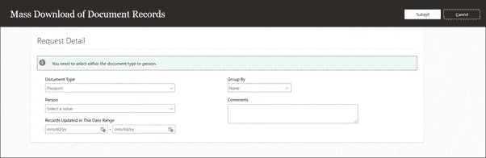

# 21D 甲骨文 HCM 云更新:主要亮点

> 原文：<https://medium.com/version-1/21d-oracle-hcm-cloud-update-key-highlights-c91c5969d3b3?source=collection_archive---------4----------------------->

最新动态 21D Oracle HCM 云的第一次迭代于上周发布，看起来它将包含许多增强功能！有很多变化，特别是在旅程和记录文档方面。

以下是我个人的一些亮点:

**1。批准和通知的增强功能**

您将能够使用新的模拟功能测试对审批规则的更改，而不必创建新的实时事务。根据我的经验，这将节省时间，并降低批准和通知被发送给错误用户的风险。这也将使修改现有规则变得更加容易。

**Enhancements to Approvals and Notifications**

**2。就业开始日期的简化指导流程**

有一个新的指导流程，允许您安全地更新工作关系的雇佣开始日期；挂起的工作线程和终止的工作线程，而没有损坏应用程序中其他地方的数据的风险。考虑到在当前远程工作的环境下，我们的员工需要更加灵活，并且 Covid 和开始日期经常变化，这一点尤其有用。

**Compact Guided Process for Employment Start Dates**

**3。批量下载文档记录和附件**

可以根据文档类型、特定人员或日期范围批量下载记录文档及其附件。例如，如果您的组织需要提供护照或驾驶执照信息，这可能会很有用。您可以按文档类型搜索，现在可以批量下载它们，而不必逐个下载。这将减少时间，并确保所有记录都包括在内。

**Mass Download Document Records and Attachments**

**4。将一次旅行作为一项活动分配给多人**

您将能够在一次交易中轻松地将旅程分配给多人。可以将旅程分配给一个人；分别选择多个人；作为被选中的人的指导或组织的一部分。旅程是 Oracle HCM 云的未来，向人们批量分配旅程的能力将简化流程并最大限度地减少人工干预。

**Assign a Journey to Multiple Persons as a Single Activity**

**5。在活动选项卡**上监控旅程分配结果

当您在单个事务中向多人批量分配旅程时，您将能够在“活动”选项卡上监控已分配旅程的进度和状态。从人力资源或系统管理员的角度来看，这是一个伟大的功能！这在一个易于使用的应用程序中提供了所有已分配旅程状态的清晰视图。

**Monitor Journey Assignment Results on Activity Tab**

这些是 21D 版本中的 5 个关键新特性，我认为它们可能有助于提高贵组织对 Oracle HCM 云的使用。有关 21D 中的所有新功能，请查看[https://www.oracle.com/readiness](https://www.oracle.com/readiness)

# 关于作者:

Kate Mead 是 Oracle 认证的第 1 版 HCM 顾问，拥有 12 年的 Oracle 人力资源和薪资系统经验，其中包括 5 年的 Oracle HCM 云经验。她参与过多个实施项目和托管服务，对英国薪资立法有深入了解，在成为顾问之前，她是一名人力资源经理。

如果您有任何问题，或者想了解第 1 版如何帮助您实现 Oracle HCM 云实例的全部潜力，请通过[kate.mead@version1.com](mailto:kate.mead@version1.com)联系她

*请注意，所有截图都是甲骨文公司的财产，并根据其版权准则使用*