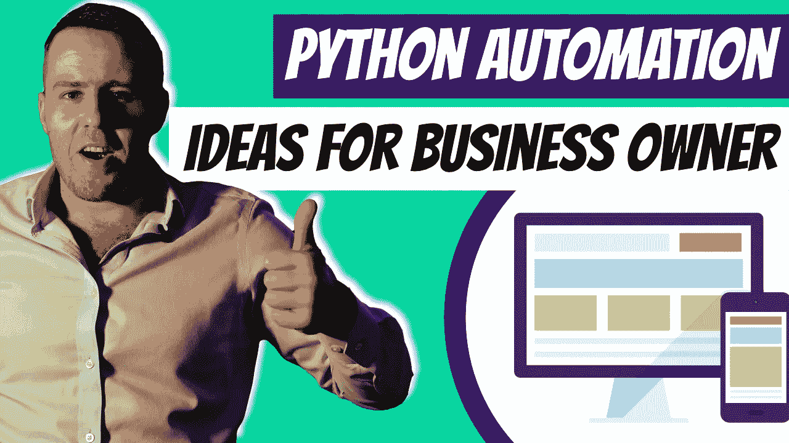

# 面向企业主的 23 个 Python 自动化想法

> 原文：<https://medium.com/duomly-blockchain-online-courses/23-python-automation-ideas-for-business-owners-543d6ee360d3?source=collection_archive---------0----------------------->

[23 Python Automation Ideas for Business Owners](https://www.blog.duomly.com/python-automation-ideas/)

本文最初发表于:[https://www.blog.duomly.com/python-automation-ideas/](https://www.blog.duomly.com/python-automation-ideas/)

**目录:**

*   [1。自动化社交媒体帖子](https://www.blog.duomly.com/python-automation-ideas/#1-automate-social-media-posts)
*   [2。自动化电子邮件营销活动](https://www.blog.duomly.com/python-automation-ideas/#2-automate-email-marketing-campaigns)
*   [3。自动化网站任务](https://www.blog.duomly.com/python-automation-ideas/#3-automate-website-tasks)
*   [4。电子商务网站上的自动化任务](https://www.blog.duomly.com/python-automation-ideas/#4-automate-tasks-on-ecommerce-sites)