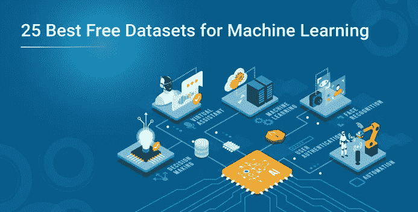
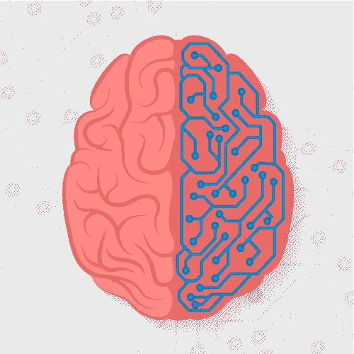
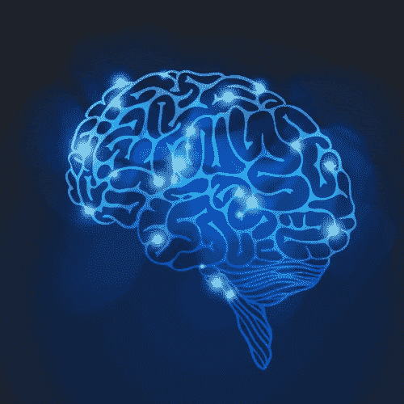

# 机器学习的 25 个最佳免费数据集

> 原文：<https://medium.com/edureka/25-best-free-datasets-for-machine-learning-62ec4276be60?source=collection_archive---------5----------------------->

数据集是机器学习和 NLP(自然语言处理)不可或缺的一部分。如果没有训练数据集，机器学习算法将无法学习文本挖掘、文本分类或如何对产品进行分类。5-10 年前，很难找到用于机器学习、数据科学和项目的数据集。但是现在我们已经被数据集的列表淹没了，现在的问题不是找到一个数据集，而是筛选它们以保留相关的数据集。因此，在这篇文章中，我们为您策划了一个免费的机器学习数据集列表。

通过学习人工智能课程，将自己转变为一名高技能的专业人士，并获得一份高薪工作。

**通用机器学习数据集**

在这种情况下，“常规”指的是回归、分类和对关系数据的聚类。

***酒质***——葡萄牙北部红、白葡萄酒的特性。这里的目标是基于一些物理化学测试来模拟葡萄酒质量。

***信用卡违约*** —预测信用卡违约对于机器学习来说是一个很有价值的用途。该数据集包括支付历史、人口统计、信用和违约数据。

***美国人口普查数据*** —基于人口统计的聚类是一种久经考验的市场研究和细分方法。

**自然语言处理数据集**

NLP 是关于文本数据的。对于像文本这样的数据，数据集有真实的应用程序是很重要的，这样就可以很容易地执行健全性检查。

***安然数据集*** —来自安然公司高级管理层的电子邮件数据，这些数据被组织到文件夹中。

***亚马逊评论***——它包含了亚马逊 18 年来大约 3500 万条评论。数据包括用户信息、产品信息、评分和文本评论。

***新闻组分类*** —大约 20，000 个新闻组文档的集合，平均分布在 20 个新闻组中。这对于练习主题建模和文本分类非常有用。

**金融&机器学习的经济学数据集**

金融量化记录可以保存几十年，因此这个行业非常适合机器学习。

*:经济和金融数据的重要来源，可用于构建预测股票价格或经济指标的模型。*

****世界银行公开数据:*** 涵盖了全球范围内的人口统计数据和大量经济发展指标。*

****IMF 数据:*** 国际货币基金组织(IMF)公布国际金融、外汇储备、债务率、大宗商品价格、投资等数据。*

***计算机视觉的图像数据集***

**

*图像数据集可用于训练各种计算机视觉应用，如医学成像技术、人脸识别和自动驾驶汽车。*

****ImageNet*** :新算法的这个事实上的图像数据集是根据 WordNet 层次结构组织的，其中每个节点都由成百上千个图像描述。*

****谷歌的开放图片*** :知识共享下约 900 万张图片的链接，标注了超过 6000 个类别的标签。*

****室内场景识别*** :包含 67 个室内类别的特定数据集，共 15620 张图像。*

***用于机器学习的情感分析数据集***

**

****多领域情感分析数据集***——以亚马逊的产品评论为特色。*

****IMDB 评论*** —二元情感分类数据集。它有 25，000 条电影评论。*

****sentiment 140***—使用 160，000 条推文，并预先删除表情符号。*

***深度学习数据集***

**

****MNIST*** —包含用于手写数字分类的图像。它被认为是深度学习的一个很好的入口数据集，因为它足够复杂，可以保证神经网络，同时可以在单个 CPU 上管理。*

****CIFAR*** —包含 60，000 张图像，分为 10 个不同的类别。*

****YouTube 8M***——包含数百万个 YouTube 视频 id 和数十亿个由最新深度学习模型预提取的音频和视觉特征。*

***机器学习的公共政府数据集***

*使用公共政府数据训练的机器学习模型有助于决策者识别趋势，并为人口增长、老龄化和移民相关问题做好准备。*

****食品环境图册*** —包含影响美国饮食的当地食品选择的数据。*

****慢性病数据*** —包含全美慢性病指标的数据。*

****美国国家教育统计中心*** —全球教育机构和教育人口统计数据。*

***自动驾驶汽车数据集***

**

*自动驾驶汽车需要用大量高质量的数据集进行训练，以便它们能够准确地感知它们的环境和周围的物体。*

****Berkeley deep drive BDD 100k***—自动驾驶 AI 最大数据集。它包含大约 100，000 个视频，记录了在不同时间和天气条件下超过 1，100 小时的驾驶经历。*

****百度 apoloscapes***—定义了汽车、自行车、行人、建筑等 26 个不同的语义项。*

****牛津的机器人汽车***——一年多来拍摄的 100 多次重复经过英国牛津的同一条路线。该数据集捕捉了交通、天气和行人的不同组合，以及建筑和道路工程等变化。*

****KUL 比利时交通标志数据集*** —包含来自比利时佛兰德斯地区数千个交通标志的 10000 多个交通标志注释。*

*到此，我们结束这篇关于“机器学习的 25 个最佳免费数据集”的文章。如果你需要了解更多关于机器学习的知识，Edureka 的 ***机器学习工程师硕士项目*** 让你精通监督学习、非监督学习和自然语言处理等技术。它包括人工智能&机器学习方面的最新进展和技术方法的培训，如深度学习、图形模型和强化学习。*

*如果你想查看更多关于人工智能、DevOps、道德黑客等市场最热门技术的文章，你可以参考 Edureka 的官方网站。*

*请留意本系列中的其他文章，它们将解释 Python 和数据科学的各个方面。*

> **1。* [*Python 教程*](/edureka/python-tutorial-be1b3d015745)*
> 
> **2。**[*Python 编程语言*](/edureka/python-programming-language-fc1015de7a6f)**
> 
> ***3。* [*Python 函数*](/edureka/python-functions-f0cabca8c4a)**
> 
> ***4。**[*Python 中的文件处理*](/edureka/file-handling-in-python-e0a6ff96ede9)***
> 
> ****5。**[*Python Numpy 教程*](/edureka/python-numpy-tutorial-89fb8b642c7d)****
> 
> ****6。* [*Scikit 学习机*](/edureka/scikit-learn-machine-learning-7a2d92e4dd07)***
> 
> ****7。* [*蟒蛇熊猫教程*](/edureka/python-pandas-tutorial-c5055c61d12e)***
> 
> ***8。 [*Matplotlib 教程*](/edureka/python-matplotlib-tutorial-15d148a7bfee)***
> 
> ***9。 [*Tkinter 教程*](/edureka/tkinter-tutorial-f655d3f4c818)***
> 
> ****10。* [*请求教程*](/edureka/python-requests-tutorial-30edabfa6a1c)***
> 
> ****11。* [*PyGame 教程*](/edureka/pygame-tutorial-9874f7e5c0b4)***
> 
> ****12。* [*OpenCV 教程*](/edureka/python-opencv-tutorial-5549bd4940e3)***
> 
> ****13。* [*网页抓取用 Python*](/edureka/web-scraping-with-python-d9e6506007bf)***
> 
> ****14。* [*PyCharm 教程*](/edureka/pycharm-tutorial-d0ec9ce6fb60)***
> 
> ****15。*[*Python 中从零开始的线性回归算法*](/edureka/linear-regression-in-python-e66f869cb6ce)***
> 
> ****16。* [*用于数据科学的 Python*](/edureka/learn-python-for-data-science-1f9f407943d3)***
> 
> ****17。* [*Python 正则表达式*](/edureka/python-regex-regular-expression-tutorial-f2d17ffcf17e)***
> 
> ****18。*[*Python 中的循环*](/edureka/loops-in-python-fc5b42e2f313)***
> 
> ****19。* [*Python 项目*](/edureka/python-projects-1f401a555ca0)***
> 
> ****20。* [*机器学习项目*](/edureka/machine-learning-projects-cb0130d0606f)***
> 
> ****21。*[*Python 中的数组*](/edureka/arrays-in-python-14aecabec16e)***
> 
> ****22。* [*在 Python 中设置*](/edureka/sets-in-python-a16b410becf4)***
> 
> ****23。*[*Python 中的多线程*](/edureka/what-is-mutithreading-19b6349dde0f)***
> 
> ***24。 [*Python 面试题*](/edureka/python-interview-questions-a22257bc309f)***
> 
> ****25。*[*Java vs Python*](/edureka/java-vs-python-31d7433ed9d)***
> 
> ****26。* [*如何成为一名 Python 开发者？*](/edureka/how-to-become-a-python-developer-462a0093f246)***
> 
> ***27。 [*Python Lambda 函数*](/edureka/python-lambda-b84d68d449a0)***
> 
> ****二十八。* [*网飞如何使用 Python？*](/edureka/how-netflix-uses-python-1e4deb2f8ca5)***
> 
> ****29。*[*Python 中的套接字编程是什么*](/edureka/socket-programming-python-bbac2d423bf9)***
> 
> ****30。* [*Python 数据库连接*](/edureka/python-database-connection-b4f9b301947c)***
> 
> ****31。*[*Golang vs Python*](/edureka/golang-vs-python-5ac32e1ef2)***
> 
> ****32。* [*Python Seaborn 教程*](/edureka/python-seaborn-tutorial-646fdddff322)***
> 
> ****33。* [*Python 职业机会*](/edureka/python-career-opportunities-a2500ce158de)***

****原载于 2021 年 12 月 16 日 https://www.edureka.co**[*。*](https://www.edureka.co/blog/25-best-free-datasets-machine-learning/)****