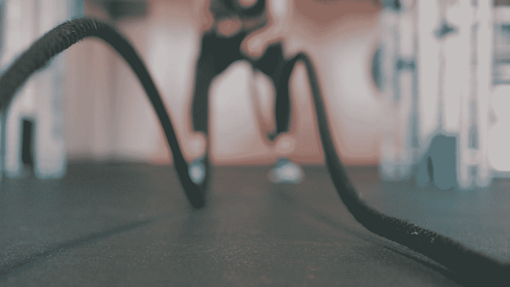

# DCA 考试的 250 道练习题

> 原文：<https://medium.com/bb-tutorials-and-thoughts/250-practice-questions-for-the-dca-exam-84f3b9e8f5ce?source=collection_archive---------1----------------------->

## 示例问题帮助您为 Docker 认证助理考试做好准备

Photo by [Chase Kinney](https://unsplash.com/@chasekinney?utm_source=medium&utm_medium=referral) on [Unsplash](https://unsplash.com?utm_source=medium&utm_medium=referral)

Docker 是当今每个组织的必备工具。每家公司都在实施 DevOps 并将其应用程序容器化，以便更轻松、更快速地进行生产部署。Docker 认证助理考试的目的是验证 Docker 的技能是必要的任何…