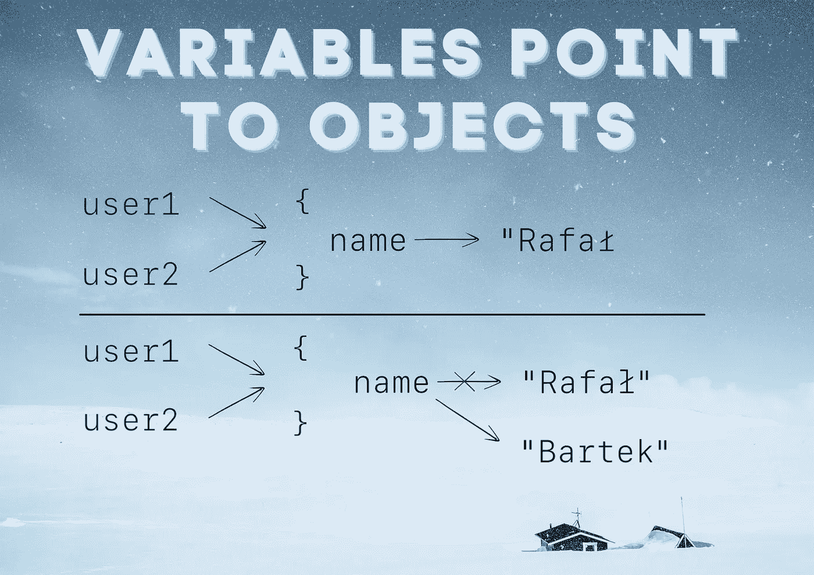

# Kt 推荐的 3 篇文章。学院🔥

> 原文：<https://blog.kotlin-academy.com/3-articles-recommended-by-kt-academy-9162f93ab473?source=collection_archive---------3----------------------->

你好！
Kt。这里是学院**👋**

本周我们推荐 3 篇好文章🔥

👉[冷热数据来源](https://kt.academy/article/cc-hot-cold)
👉[变量指向对象](https://kt.academy/article/variables)
👉[使用运算符增加可读性](https://kt.academy/article/ek-operators)

*️⃣:我们很想听听你对这份时事通讯的想法和建议。请回复此邮件与我们分享📩

尽情享受吧！⏬

热数据源(如列表或频道)和冷数据源(如序列或流)有什么区别？

**冷热数据来源**Marcin Moskala👇

[**Hot and cold data sources**](https://kt.academy/article/cc-hot-cold)
🔻 This is a chapter from the [Kotlin Coroutines](https://kt.academy/book/coroutines) book. You can find Early Access on [LeanPub](https://leanpub.com/coroutines/).

在 Kotlin 中使用特征进行测试时需要一个技巧。

**变量指向对象**Marcin Moskala 著👇

[Variables point to objects](https://kt.academy/article/variables)

Kotlin 中如何使用运算符提高可读性？

**有效的 Kotlin 额外项目:使用运算符增加可读性**作者:Marcin Moskala👇

[Effective Kotlin Extra Item: Use operators to increase readability](https://kt.academy/article/ek-operators)
🔻 This is a chapter from the [Effective Kotlin](https://kt.academy/book/effectivekotlin) book. You can find it on [LeanPub](https://leanpub.com/effectivekotlin) or [Amazon](https://www.amazon.com/Effective-Kotlin-practices-Marcin-Moskala/dp/8395452837/ref=sr_1_1?dchild=1&keywords=effective+kotlin&qid=1615033955&sr=8-1).

今天就到这里吧！

谢谢，再见！

卡帕头。学院团队

www: [kt.academy](https://kt.academy/)
博客:[blog.kotlin-academy.com](http://blog.kotlin-academy.com/)
Twitter EN:[@ ktdotsacademy](https://twitter.com/ktdotacademy)
Twitter PL:[@ ktdotsacademypl](https://twitter.com/ktdotacademyPL)
FB:[@ ktdotsacademy](https://www.facebook.com/KtDotAcademy)
LinkedIn:[@ Kt。学院](https://www.linkedin.com/company/kt-academy/)

