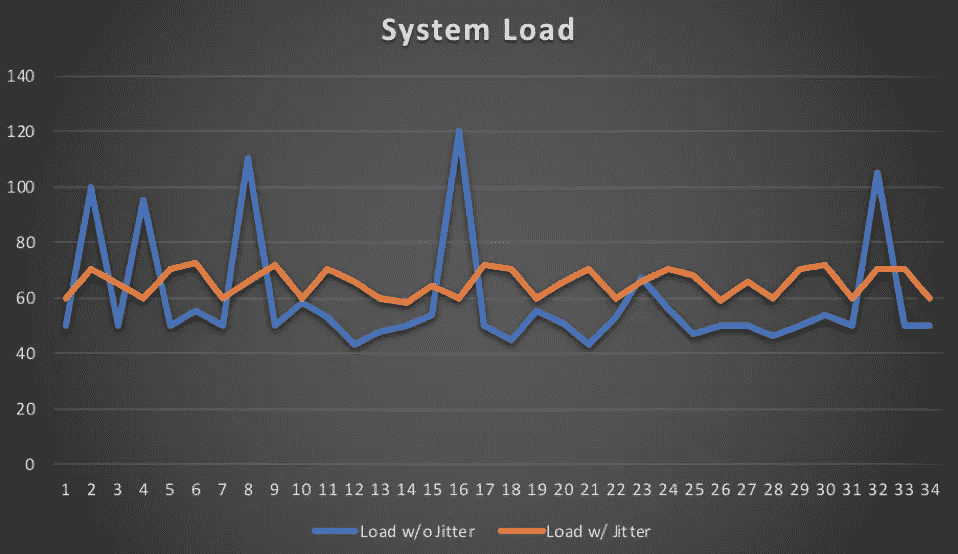

# API 客户端的 3 个最佳实践

> 原文：<https://medium.com/capital-one-tech/3-best-practices-for-api-clients-feef9ec97f1a?source=collection_archive---------0----------------------->


有许多关于设计良好的 REST APIs 的最佳实践的博文/文章。本文试图为 REST APIs 的客户端做同样的事情。

您选择了一个设计良好的 API，它具有弹性、安全性和可伸缩性，能够满足您作为 API 客户端应用程序的需求。应该不会有下降的预期吧？事实是，大量行为不良的客户端(恶意的或编码不良的)甚至可以压倒最好的 API 或 API 网关。如果用 API 构建是 API 客户机和生产者之间的合作关系，那么客户机如何成为这种关系中的好管家呢？本文的重点是帮助 API 客户更好地集成他们的 API，并且基于我作为[Capital One deve exchange](https://developer.capitalone.com/)的工程负责人的经验。

# API 客户端最佳实践

## 知道你的 HTTP 状态码

HTTP 状态码已经存在很长时间了，并且非常[有据可查](https://en.wikipedia.org/wiki/List_of_HTTP_status_codes)。然而，大量糟糕的客户端行为源于对 HTTP 状态代码的不正确处理。以下是 HTTP 状态代码要遵循的两个简单规则:

1. ***HTTP 4XX 状态码:*** 这意味着一件事——服务器(API 或网关)因为出错而指责客户端。如果发生这种情况，不要按原样重试请求，在客户端可以重试请求之前，需要进行一些更改。通常，客户端需要做一些不同的事情，比如提供缺失的请求数据。或者在某些情况下，需要采取带外操作。例如，在客户端可以重试之前，在服务器上进行访问配置以避免 HTTP 401。

**例子**:我最近遇到一个客户端，在收到一个 HTTP 429(由于请求太多，网关限制了速率)后，不但没有减速，反而一直盲目重试。显然，这除了给网关基础设施带来不必要的负担之外，还加剧了他们自己的问题。

2. ***HTTP 5XX 状态码:*** 这意味着一件事——服务器(API 或网关)在说*‘我的错’*所以让他们休息一下吧。客户有权重试，但应谨慎行事。在 HTTP 5XX 上盲目重试可能会进一步破坏 API 的稳定性。那么，客户应该怎么做呢？

*   在用户等待的情况下，客户端需要中止进程，因此用户可以选择是否重试。
*   对于没有用户等待的后台调用或系统到系统的调用，客户端可以使用指数后退策略重试(更多信息见下文)。

## 了解你的 OAuth 令牌

有很多方法可以保护 API，包括基本认证和摘要认证。但是，如果您正在访问的 API 是使用 [OAuth 2.0](https://oauth.net/2/) 保护的，那么作为一个 API 客户端，您将需要处理很多令牌——访问令牌、承载令牌、刷新令牌等。以下是一些关于如何处理这些令牌的提示:

*   ***复用令牌:*** 通常情况下，访问令牌在到期前都是可复用的。重用令牌，不要为每个 API 调用请求新令牌。
*   ***优雅地处理过期令牌:*** 不要硬编码令牌过期时间。一个设计良好的 API 应该返回一个 ***expires_in*** 字段(当请求新令牌时)和/或应该在使用过期令牌时返回 HTTP 401。使用这些作为触发器来请求新的访问令牌(使用先前提供的刷新令牌)。
*   ***不透明地对待记号:*** 不依赖于记号的结构、内容或大小，也不对其做任何假设。它们是服务器端的植入细节，依赖它们可能会在不经意间破坏客户端。

## **指数退避策略**

在收到 HTTP 5XX 状态代码后，客户端可以按原样重试请求，但应该在一段延迟后重试。进行这些重试的最佳方式之一是采用指数补偿算法。

简而言之，这将使客户端能够在重试之间的等待时间逐渐变长后重试。*比如 1 秒后重试，2 秒，4 秒，8 秒，16 秒……等等。*

在 Java 中，这可以这样表达:

```
*Math.pow(2, retryCount)*
```

这种算法还应该实现最大重试间隔和最大重试次数，并使用最佳值。例如，在 *1 秒、2 秒、4 秒、8 秒、16 秒后重试……最多 300 秒或最多 10 次重试。*

最后，如果客户端运行在大量设备上(比如在后台调用 API 的移动客户端)，客户端必须在指数后退算法中使用抖动(随机延迟)。如果不在等待时间中引入这种随机延迟，在错误场景中，数百万个客户端可能会在完全相同的时间(并发地)重试，从而进一步使 API 不堪重负。这是系统负载在有抖动和无抖动情况下的示例图。



有关 [***指数回退和抖动***](https://aws.amazon.com/blogs/architecture/exponential-backoff-and-jitter/) ***的更多信息，请参考这篇 AWS 架构博客。***

## **结论**

虽然恶意 API 客户端确实存在，但大多数 API 和 API 网关都被善意但编码糟糕的 API 客户端所淹没。一个编码糟糕的 API 客户端可以撤销为你的应用选择一个有弹性的、安全的、可伸缩的 API 的所有考虑。通过理解和实施这些简单的最佳实践来帮助防止这种情况。你的用户会感谢你的。

[](https://medium.com/capital-one-tech/api/home)

*声明:这些观点仅代表作者个人观点。除非本帖中另有说明，否则 Capital One 不属于所提及的任何公司，也不被其认可。使用或展示的所有商标和其他知识产权都是其各自所有者的所有权。本文为 Capital One 2018。*