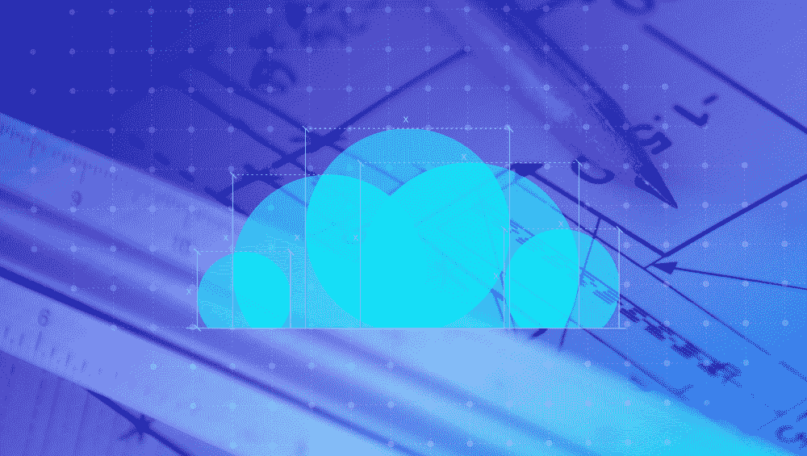
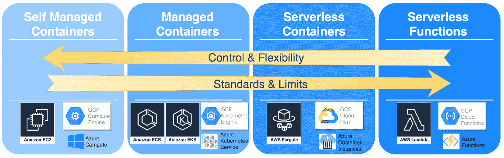
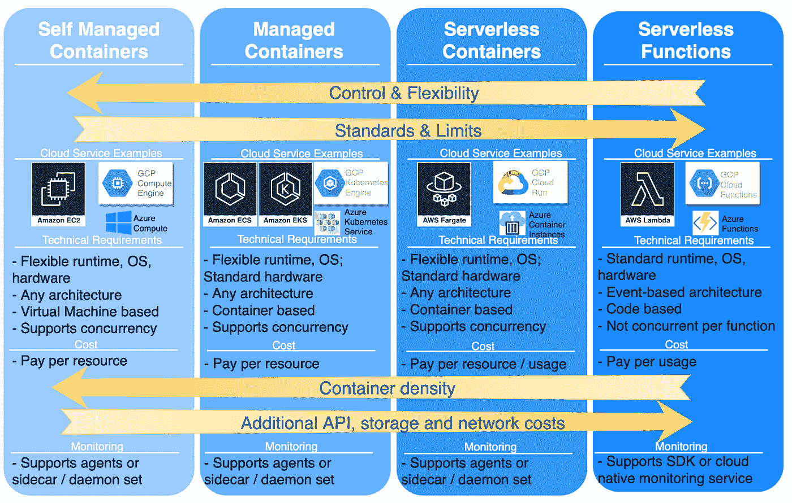

# 容器和无服务器计算选项的 3 个注意事项

> 原文：<https://medium.com/capital-one-tech/3-considerations-for-containers-serverless-compute-options-583d5d6ee93d?source=collection_archive---------3----------------------->

## 在云计算领域选择正确的选项

您是否曾经被可用于支持容器化应用程序的云计算选项的数量所淹没？你是自己运行容器还是在云托管服务上运行？您是否已经完全放弃了容器，转而运行无服务器功能？如果这些想法看起来很熟悉，并且你已经决定容器化或无服务器架构是未来的发展方向，那么这篇博客就是为你准备的！

云计算产品种类繁多。如下图所示，频谱主要沿着两个向量摆动:*您的控制和灵活性与云服务的标准化和限制。AWS、GCP 和微软 Azure 的例子说明了选择的多样性。简而言之，你越需要控制，就越需要自我管理*

在最终决定使用哪个计算选项之前，还有其他标准需要考虑。

# #1 技术要求

第一个附加标准是技术要求。这些技术要求源于云计算服务的标准化水平、您的多云方法、对并发性的业务需求以及您的应用程序架构。

**标准化
这些标准成为您的应用程序的要求。如果您的应用程序不符合支持的标准，并且/或者无法根据提供商的生命周期终止通知进行维护，那么左手边的应用程序将变得更加可行。**

**可移植性/云切换** 另一组技术要求是您的云提供商方法的结果，以及这是否会推动跨多个云提供商运营的要求。无服务器功能是基于代码的，而其他计算选项是基于容器的。虽然代码和容器本身可以在多个云提供商之间移植，但使用底层云服务可能会产生[云转换成本](https://aws.amazon.com/blogs/enterprise-strategy/switching-costs-and-lock-in/)，这在整个范围内是不同的。为了降低云切换成本，面向无服务器功能的与云提供商无关的无服务器框架正在兴起，Kubernetes orchestration 得到了多个云提供商的支持。

**并发** 并发，一次处理多个请求的能力，是另一个需要考虑的重要技术需求。虽然无服务器功能的短暂性允许按使用付费的模式，但它仅限于一次支持一个请求，并且可能遭受冷启动延迟。无服务器容器、托管容器和自管理容器都支持更高的持久性，这更好地支持并发性。这也减少了冷启动的次数并优化了资源消耗(例如，当应用等待网络响应时，CPU 和内存可以用于处理另一个请求)。

**架构
例如，在[多层架构](https://aws.amazon.com/lambda/serverless-architectures-learn-more/)中使用 AWS Lambda 等无服务器功能需要关注业务逻辑的解耦和分布，并可能与 AWS Step Functions 等其他服务一起提供编排工作流和 AWS API 网关。**

# #2 成本

第二个附加标准是成本。一般来说，云服务账单左侧的*是每资源成本*，右侧的*是每使用成本*。然而，简单地使用请求的数量来计算成本并在这两种成本模型之间进行比较是不够的。为了更好地了解成本，请考虑总拥有成本，包括 API 请求、存储和网络的成本。例如，基于事件的架构中的无服务器功能倾向于大量使用 API 调用和网络入口/出口。

另一个成本因素与集装箱密度和支持服务的成本有关。例如，AWS Lambda 原生使用 [AWS CloudWatch](https://docs.aws.amazon.com/lambda/latest/dg/services-cloudwatchlogs.html) 进行日志记录，这会产生成本。每个 Lambda 函数都是一个不同的实例，每个底层计算的相应资源利用率可能不如通过容器化计算管理容器密度和计算容量高效。在容器化计算方法中，日志记录等支持服务的成本可以分摊到共享同一计算的许多容器化工作负载上。

# #3 监控

第三个附加标准是[白盒监控](https://landing.google.com/sre/sre-book/chapters/monitoring-distributed-systems/)，它要求能够访问包括日志在内的系统内部信息，对于调试问题至关重要。需要考虑您启用白盒监控的方法。例如，如果该方法依赖于监控代理或侧柜进行白盒监控，这意味着需要一个容器化的计算选项。然而，如果该方法允许跟踪监控工具通过工具、分布式跟踪和/或从云本地日志记录服务检索日志来支持无服务器功能，则仍然可以实现白盒监控。

# 结论

下图描述了考虑所有这些附加条件时的输出:

每种方法都有其优点和缺点。向计算范围的左侧发展可以实现更好的控制和灵活性。但是，由于需要管理基础架构的更多方面，这增加了运营和维护负担。向计算领域的右侧发展可以实现更高的灵活性，并减少管理许多基础架构方面(如可扩展性)的需求。然而，它会受到标准和限制的约束。

考虑您的技术要求、成本和监控需求将进一步为决策过程提供信息，从而为您的应用找到正确的选择。

*以上观点为作者个人观点。除非本帖中另有说明，否则 Capital One 不隶属于所提及的任何公司，也不被其认可。使用或展示的所有商标和其他知识产权都是其各自所有者的所有权。本文为 2019 首都一。*